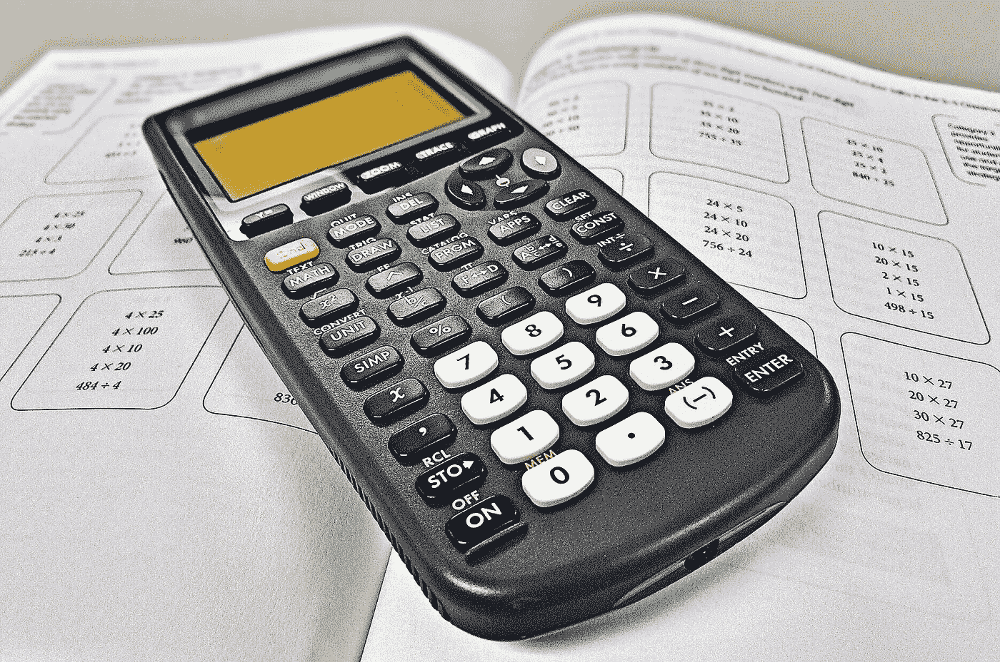
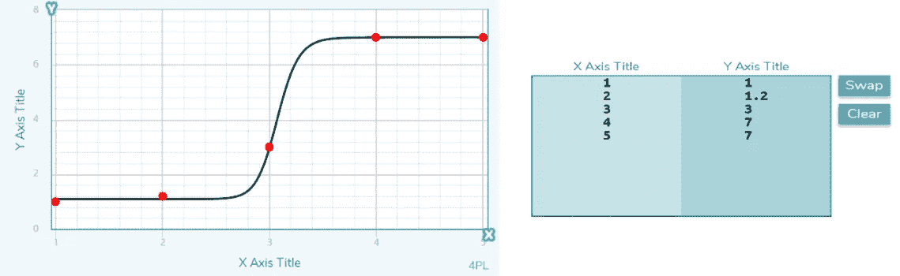
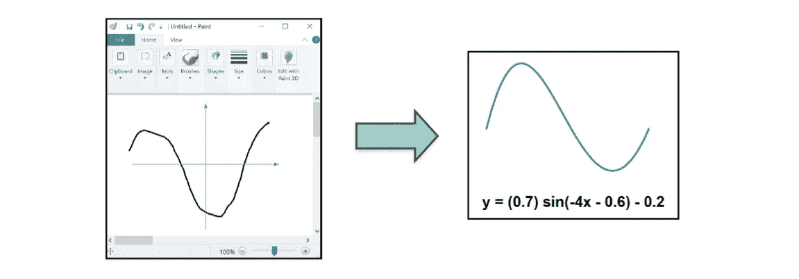
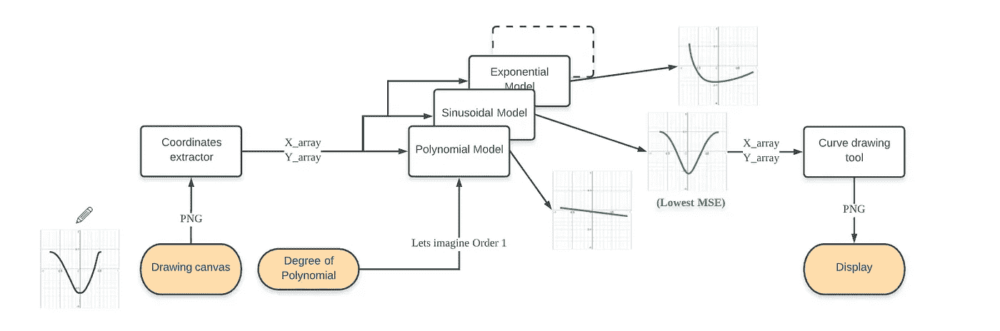
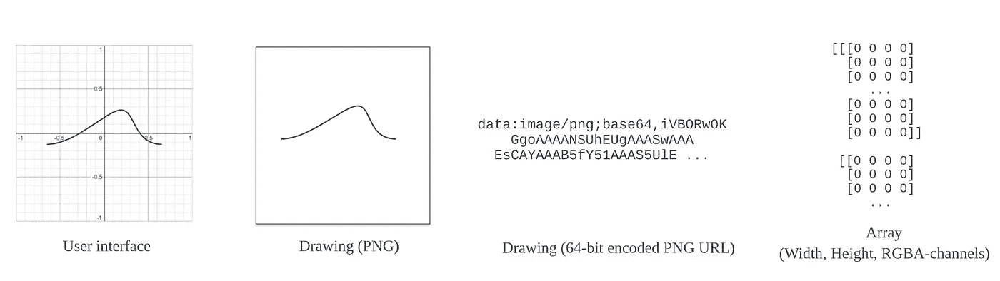
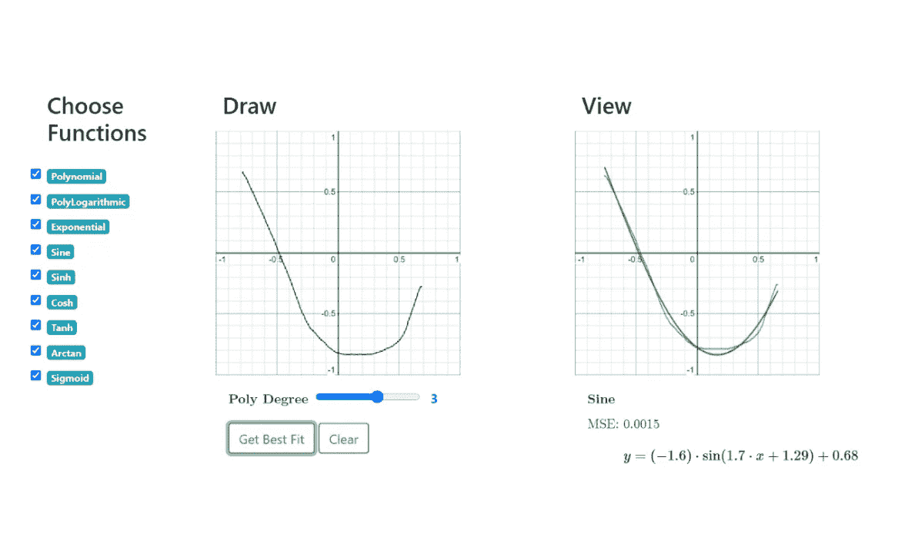
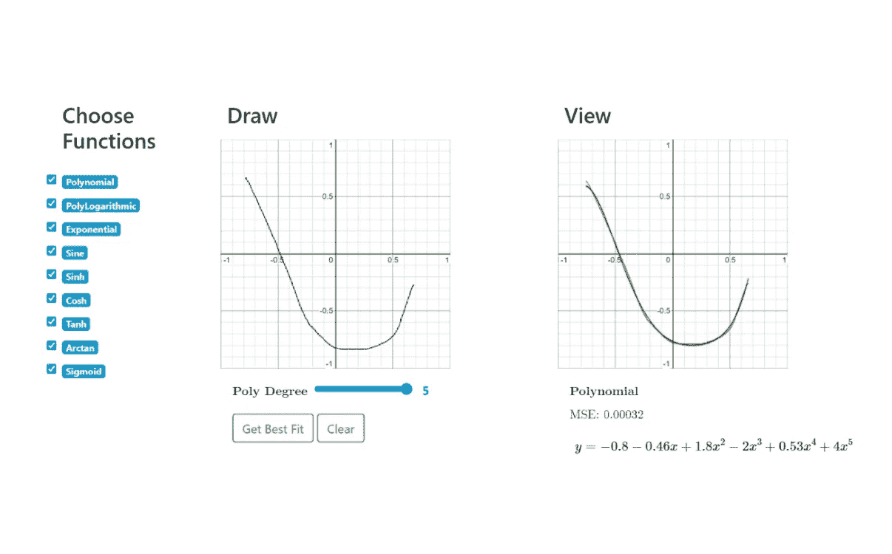
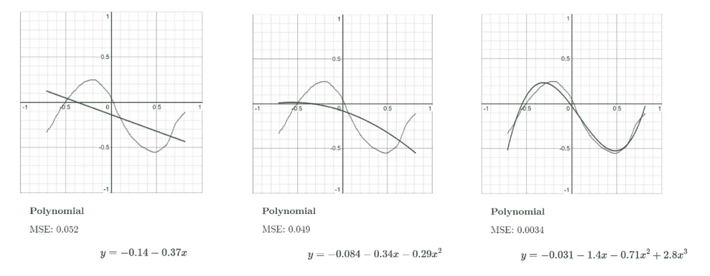

# 轻松绘制的图形功能

> 原文：<https://towardsdatascience.com/graphical-functions-made-from-an-effortless-sketch-266ccf95c46d?source=collection_archive---------48----------------------->

## "返回方程式的 MS Paint "



图片由 [Wokandapix](https://pixabay.com/users/Wokandapix-614097/?utm_source=link-attribution&utm_medium=referral&utm_campaign=image&utm_content=988017) 来自 [Pixabay](https://pixabay.com/?utm_source=link-attribution&utm_medium=referral&utm_campaign=image&utm_content=988017)

大家好！几天前，我在研究一个机器学习模型，我需要输入一个与 X 和 Y 相关的函数。唯一的约束是函数必须连续，X 和 Y 的界限必须是[0，1]。

脑子里有了几十条不同的曲线，我开始在纸上画出它们的草图。重点是之后把它们放在绘图计算器上。这是一项单调乏味的任务，我向姐姐寻求帮助。

“你为什么不为它写个程序呢？”，她回答道。

# 目的



一个已有的应用: [MyCurveFit](https://mycurvefit.com/)

现有的应用程序采用 X 和 Y 坐标来返回精确的方程。然而，曲线越复杂，用户输入的坐标就越多。此外，用户必须手动选择函数来拟合这些点(例如:线性对指数)。



这个计划

我想要一个“返回方程式的 MS Paint”。

虽然手绘意味着坐标不能精确，但当近似方程足够时，它是一个方便的工具，微调可以留待下次进行。通过比较均方误差，程序也自动选择最佳函数。

# 应用程序管道

这是整体架构。



我的应用程序管道

当用户在提供的画布上绘制时，提取曲线上的点的 X 和 Y 坐标。它们被输入到不同的模型中，这些模型符合如上所示的相应方程。最后，显示具有最小均方误差的方程。

由于多项式方程最容易过度拟合，因此用户可以选择限制次数。

## 输入加工



从用户界面到 3D 阵列的绘制

用户界面包含来自 [drawingboard.js](https://github.com/Leimi/drawingboard.js/) 资源库的绘图画布。当用户与它交互时，鼠标的移动会被跟踪并保存为 PNG 格式。然后图像被处理成如上所示的三维阵列。*(宽 x 高 x 通道)*

根据图像的数组表示，计算 X 和 Y 坐标，并分别存储在 X 和 Y 数组中。

## 模型拟合

Scipy 库提供了给定 X 和 Y 数组来拟合方程的方法。我主要使用了其中的两种。


## **Polyfit**

这个方法返回给定次数的多项式的系数。下面是一个例子。

```
**from** numpy.polynomial.polynomial **import** polyfitx_array = [0, 1, 2, 3]
y_array = [1, 3, 4, 6]
coef = polyfit(x_array, y_array, deg=2) # Polynomial of Degree 2**print(**coef**)**
# [ 1\.  2\.  0\. ]
# Function: y = 1 + 2*x + 0*x^2
```

正如我们所见，这可以很容易地扩展到其他功能，如多对数。

```
**from** math **import** ex_array = [e, e**2, e**3]
y_array = [2, 4, 6]
coef = polyfit(np.log(x_array), y_array, deg=2)**print(**coef**)**
# [ 0\.  2\.  0\. ]
# Function: y = 0 + 2*(log x) + 0*(log x)^2
```

## 曲线拟合

这种方法更加灵活，因为它采用了用户定义的函数和要拟合的自定义系数。

正弦函数就是一个例子: *y = a * sin(b * x) + c*

```
**from** scipy.optimize **import** curve_fit
**from** math **import** pix_array = [0, pi/2, pi, 3*pi/2]
y_array = [0, 1, 0]# User-defined function with custom a, b, c, d
sine_function = **lambda** x, a, b, c, d: a * np.sin(b*x + c) + dcoef, cov = curve_fit(sine_function, x_array, y_array)**print(**coef**)**
# [ 1\.  1\.  0\.  0\. ]
# Function: y = 1*sin(1*x + 0) + 0
```

这同样适用于指数函数和双曲正弦函数等其他函数。

然后每个拟合的函数预测 Y 坐标。从输入 Y 中选择具有最小均方误差的一个用于显示。

## 输出

使用 [Matplotlib](https://matplotlib.org/) 库，用不同的颜色绘制预测的 Y 与 X。之后，绘图图形被转换回 PNG 图像用于显示。

# 样本案例

1.三次多项式、三次多元对数函数和其他函数之间的最佳拟合



正弦函数在这里表现最佳

2.5 次多项式、5 次多对数函数和其他函数之间的最佳拟合



5 次多项式性能最佳

3.不同次数多项式函数的比较



从 1 到 3 的多项式次数

结果看起来不错！

## **未来的改进**

首先，可以添加更多的模型。这很容易做到，因为它们已经从应用程序的其余部分中抽象出来了。欢迎建议！

第二，输入的范围可以变得更鲁棒，因为它当前仅接受[-1，1]。绘图画布可以是动态的，以适应其他范围。

感谢您的阅读！

## 密码

[](https://github.com/yarkhinephyo/sketch_a_function) [## yarkhinephyo/sketch_a_function

### 在 GitHub 上创建一个帐户，为 yarkhinephyo/sketch_a_function 开发做贡献。

github.com](https://github.com/yarkhinephyo/sketch_a_function)