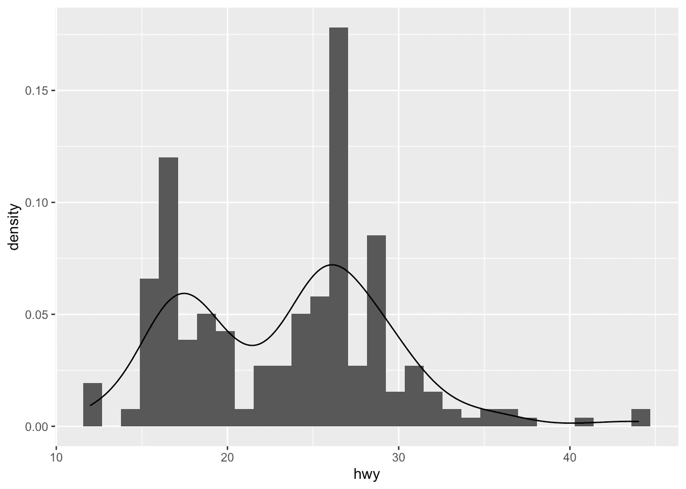
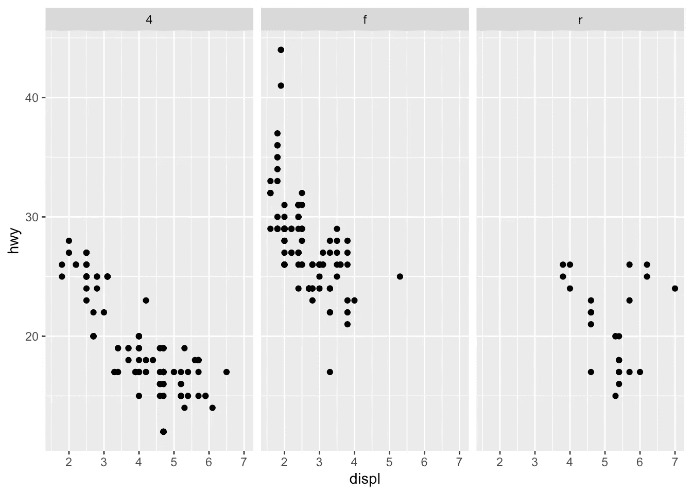
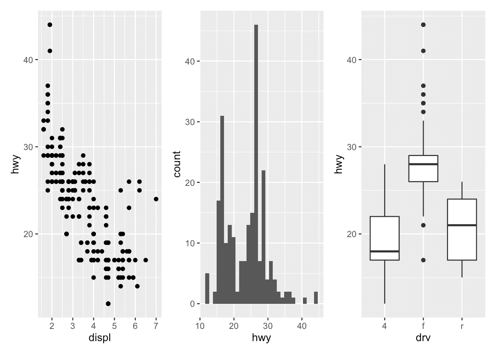

# 带 ggplot2 的 R 中的图形

> 原文：<https://towardsdatascience.com/graphics-in-r-with-ggplot2-9380cbfe116a?source=collection_archive---------25----------------------->

## 了解如何使用 ggplot2 软件包在 R 中创建专业的图形和绘图


照片由[艾萨克·史密斯](https://unsplash.com/@isaacmsmith?utm_source=medium&utm_medium=referral)

# 介绍

众所周知，R 在图形和可视化方面是一种非常强大的编程语言(当然除了[统计学](https://www.statsandr.com/tags/statistics/)和数据科学！).

为了保持简短，R 中的图形可以通过三种方式完成，通过:

1.  `{graphics}`包(R 中的基本图形，默认加载)
2.  `{lattice}`为基础套装增加更多功能的套装
3.  `{ggplot2}`包(需要预先[安装并加载](https://www.statsandr.com/blog/an-efficient-way-to-install-and-load-r-packages/)

`{graphics}`包自带大量剧情选择(如`plot`、`hist`、`barplot`、`boxplot`、`pie`、`mosaicplot`等)。)和附加的相关特征(例如，`abline`、`lines`、`legend`、`mtext`、`rect`等)。).对于大多数 R 用户，尤其是初学者到中级用户，这通常是绘制图形的首选方式。

自从 Hadley Wickham 在 2005 年创建以来，`**{ggplot2}**`已经成为最受欢迎的 R 包之一，也是最受欢迎的图形和数据可视化包。`{ggplot2}`软件包是一种更现代的创建专业质量图形的方法。更多关于这个包的信息可以在 ggplot2.tidyverse.org 找到。

在本文中，我们将看到如何用这个包在 R 中创建常见的图，如散点图、线图、直方图、箱线图、条形图、密度图。如果你不熟悉这些类型的图表，你会找到更多关于每一个的信息(何时使用，它的目的，它显示什么，等等。)在我关于 R 中[描述性统计的文章中。](https://www.statsandr.com/blog/descriptive-statistics-in-r/)

# 数据

为了说明使用`{ggplot2}`包的图，我们将使用包中可用的`mpg`数据集。该数据集包含美国环境保护署从 1999 年到 2008 年收集的 38 种流行车型的燃油经济性观察数据(运行`?mpg`了解更多数据信息):

```
library(ggplot2)
dat <- ggplot2::mpg
```

在继续之前，让我们用`transform()`函数转换[因子](https://www.statsandr.com/blog/data-types-in-r/#factor)中的`cyl`、`drv`、`fl`、`year`和`class`变量:

```
dat <- transform(dat,
  cyl = factor(cyl),
  drv = factor(drv),
  fl = factor(fl),
  year = factor(year),
  class = factor(class)
)
```

对于感兴趣的读者，请参阅 R 中的更多[数据操作技术。](https://statsandr.com/blog/data-manipulation-in-r/)

# `{ggplot2}`的基本原理

`{ggplot2}`包基于“图形语法”的原则(因此`{ggplot2}`的名字是“gg”)，也就是一个描述和构建图形的连贯系统。主要想法是**设计一个图形作为一系列层**。

主要层有:

1.  包含我们想要表示的变量的数据集。这是通过`ggplot()`功能完成的，并且排在第一位。
2.  要在 x 和/或 y 轴上表示的**变量**，以及要表示的对象的美学元素(如颜色、大小、填充、形状和透明度)。这是通过`aes()`功能(美学的缩写)完成的。
3.  **类型的图形表示**(散点图、线图、条形图、直方图、箱线图等)。).这是通过`geom_point()`、`geom_line()`、`geom_bar()`、`geom_histogram()`、`geom_boxplot()`等功能完成的。
4.  如果需要，附加层(如标签、注释、比例、轴刻度、图例、主题、小平面等。)可以加进去个性化剧情。

为了创建一个图，我们首先需要在`ggplot()`函数中指定数据，然后添加所需的层，如变量、美学元素和图的类型:

```
ggplot(data) +
  aes(x = var_x, y = var_y) +
  geom_x()
```

*   `ggplot()`中的`data`是包含变量`var_x`和`var_y`的数据帧的名称。
*   `+`符号用于指示将被添加到绘图的不同层。确保将`+` *符号写在代码行*的末尾，而不是行首，否则 R 抛出错误。
*   层`aes()`表示什么样的变量将被用在剧情中，更一般地说，是剧情的美学元素。
*   最后，`geom_x()`中的`x`代表剧情类型。
*   其他层通常是不需要的，除非我们想进一步个性化情节。

请注意，为提高代码可读性，每层编写一行代码是一个很好的做法。

# 用`{ggplot2}`创建图

在以下章节中，我们将展示如何绘制以下图形:

*   散点图
*   线形图
*   柱状图
*   密度图
*   箱线图
*   条形图

为了将重点放在不同情节的构建和`{ggplot2}`的使用上，我们将限制自己只画基本的(但很漂亮的)情节，不画不必要的图层。为了完整起见，我们将在文章的最后简要讨论和说明不同的层，以进一步个性化一个情节(见本[节](https://www.statsandr.com/blog/graphics-in-r-with-ggplot2/#further-personalization))。

请注意，如果你在阅读完本教程后仍然难以用`{ggplot2}`创建剧情，你可能会发现 [{esquisse}插件](https://www.statsandr.com/blog/rstudio-addins-or-how-to-make-your-coding-life-easier/#esquisse)很有用。这个插件允许你用`{ggplot2}`包**交互**(即通过拖放变量)创建图形。试试看！

# 散点图

我们首先使用`geom_point`创建一个[散点图](https://www.statsandr.com/blog/descriptive-statistics-in-r/#scatterplot)。请记住，散点图用于可视化两个[定量变量](https://www.statsandr.com/blog/variable-types-and-examples/#quantitative)之间的关系。

1.  我们从指定数据开始:

```
ggplot(dat) # data
```


2.然后我们添加用`aes()`函数表示的变量:

```
ggplot(dat) + # data
  aes(x = displ, y = hwy) # variables
```


3.最后，我们指出情节的类型:

```
ggplot(dat) + # data
  aes(x = displ, y = hwy) + # variables
  geom_point() # type of plot
```


除了数据集之外，您有时还会看到`ggplot()`函数中的美学元素(【T2 与变量】):

```
ggplot(mpg, aes(x = displ, y = hwy)) +
  geom_point()
```


第二种方法给出的图与第一种方法完全相同。为了获得更好的可读性，我倾向于选择第一种方法，但这更多的是个人喜好的问题，所以选择由你决定。

# 线形图

[线形图](https://www.statsandr.com/blog/descriptive-statistics-in-r/#line-plot)，在时间序列或金融中特别有用，可以类似地创建，但使用`geom_line()`:

```
ggplot(dat) +
  aes(x = displ, y = hwy) +
  geom_line()
```


# 线和点的结合

`{ggplot2}`的一个优势是能够结合多种类型的情节，并且设计灵活。例如，我们可以通过简单地向初始散点图添加一个层来向散点图添加一条线:

```
ggplot(dat) +
  aes(x = displ, y = hwy) +
  geom_point() +
  geom_line() # add line
```


# 柱状图

可以使用`geom_histogram()`绘制[直方图](https://www.statsandr.com/blog/descriptive-statistics-in-r/#histogram)(用于可视化分布和检测潜在的[异常值](https://www.statsandr.com/blog/outliers-detection-in-r/)):

```
ggplot(dat) +
  aes(x = hwy) +
  geom_histogram()
```


默认情况下，箱的数量等于 30。您可以使用`geom_histogram()`函数中的`bins`参数来更改该值:

```
ggplot(dat) +
  aes(x = hwy) +
  geom_histogram(bins = sqrt(nrow(dat)))
```


这里我指定箱的数量等于观察数量的平方根(遵循斯特奇法则),但是您可以指定任何数值。

# 密度图

[密度图](https://www.statsandr.com/blog/descriptive-statistics-in-r/#density-plot)可以使用`geom_density()`创建:

```
ggplot(dat) +
  aes(x = hwy) +
  geom_density()
```


# 直方图和密度的组合

我们也可以在同一个图上叠加直方图和密度曲线:

```
ggplot(dat) +
  aes(x = hwy, y = ..density..) +
  geom_histogram() +
  geom_density()
```



或者叠加几个密度:

```
ggplot(dat) +
  aes(x = hwy, color = drv, fill = drv) +
  geom_density(alpha = 0.25) # add transparency
```


为了增加透明度，增加了参数`alpha = 0.25`。关于这个论点的更多信息可以在这个[部分](https://www.statsandr.com/blog/graphics-in-r-with-ggplot2/#further-personalization)中找到。

# 箱线图

可以使用`geom_boxplot()`绘制一个[箱线图](https://www.statsandr.com/blog/descriptive-statistics-in-r/#boxplot)(对可视化分布和检测潜在的[异常值](https://www.statsandr.com/blog/outliers-detection-in-r/)也非常有用):

```
# Boxplot for one variable
ggplot(dat) +
  aes(x = "", y = hwy) +
  geom_boxplot()
```


```
# Boxplot by factor
ggplot(dat) +
  aes(x = drv, y = hwy) +
  geom_boxplot()
```


也可以用`geom_jitter()`在箱线图上绘制点，并用`varwidth = TRUE`根据每个级别的大小(即观察次数)改变方框的宽度:

```
ggplot(dat) +
  aes(x = drv, y = hwy) +
  geom_boxplot(varwidth = TRUE) + # vary boxes width according to n obs.
  geom_jitter(alpha = 0.25, width = 0.2) # adds random noise and limit its width
```


`geom_jitter()`层给每个点添加一些随机变化，以防止它们重叠(一个被称为过度绘制的问题)。 [1](https://www.statsandr.com/blog/graphics-in-r-with-ggplot2/#fn1) 此外，`alpha`参数为点增加了一些透明度(详见本[部分](https://www.statsandr.com/blog/graphics-in-r-with-ggplot2/#further-personalization))以保持焦点在框上而不是点上。

最后，也可以根据[定性变量](https://www.statsandr.com/blog/variable-types-and-examples/#qualitative)的水平将箱线图分成几个面板:

```
ggplot(dat) +
  aes(x = drv, y = hwy) +
  geom_boxplot(varwidth = TRUE) + # vary boxes width according to n obs.
  geom_jitter(alpha = 0.25, width = 0.2) + # adds random noise and limit its width
  facet_wrap(~year) # divide into 2 panels
```


为了视觉上更吸引人的绘图，也可以根据 x 变量对框使用一些颜色:

```
ggplot(dat) +
  aes(x = drv, y = hwy, fill = drv) + # add color to boxes with fill
  geom_boxplot(varwidth = TRUE) + # vary boxes width according to n obs.
  geom_jitter(alpha = 0.25, width = 0.2) + # adds random noise and limit its width
  facet_wrap(~year) + # divide into 2 panels
  theme(legend.position = "none") # remove legend
```


在这种情况下，最好删除图例，因为它变得多余。参见[部分](https://www.statsandr.com/blog/graphics-in-r-with-ggplot2/#legend)中关于图例的更多信息。

如果你对`{ggplot2}`中提供的默认颜色不满意，你可以用`scale_fill_manual()`层手动改变它们:

```
ggplot(dat) +
  aes(x = drv, y = hwy, fill = drv) + # add color to boxes with fill
  geom_boxplot(varwidth = TRUE) + # vary boxes width according to n obs.
  geom_jitter(alpha = 0.25, width = 0.2) + # adds random noise and limit its width
  facet_wrap(~year) + # divide into 2 panels
  theme(legend.position = "none") + # remove legend
  scale_fill_manual(values = c("darkred", "darkgreen", "steelblue")) # change fill color manually
```


# 条形图

可以使用`geom_bar()`绘制[柱状图](https://www.statsandr.com/blog/descriptive-statistics-in-r/#barplot)(用于可视化定性变量):

```
ggplot(dat) +
  aes(x = drv) +
  geom_bar()
```


默认情况下，条形的高度对应于感兴趣变量的每个级别的观察频率(在我们的例子中为`drv`)。

同样，为了更吸引人的情节，我们可以用`fill`参数给条形添加一些颜色:

```
ggplot(dat) +
  aes(x = drv, fill = drv) + # add colors to bars
  geom_bar() +
  theme(legend.position = "none") # remove legend
```


我们还可以创建一个包含两个定性变量的柱状图:

```
ggplot(dat) +
  aes(x = drv, fill = year) + # fill by years
  geom_bar()
```


为了比较各组之间的比例，最好使用`position = "fill"`使每个条形的高度相同:

```
ggplot(dat) +
  geom_bar(aes(x = drv, fill = year), position = "fill")
```


要为每组绘制相邻的条形，请使用`position = "dodge"`:

```
ggplot(dat) +
  geom_bar(aes(x = drv, fill = year), position = "dodge")
```


# 进一步个性化

# 标题和轴标签

在一个情节中，首先要个性化的是标签，以使情节对观众更具信息性。我们可以使用`labs()`功能轻松添加标题、副标题、说明和编辑轴标签:

```
p <- ggplot(dat) +
  aes(x = displ, y = hwy) +
  geom_point()p + labs(
  title = "Fuel efficiency for 38 popular models of car",
  subtitle = "Period 1999-2008",
  caption = "Data: ggplot2::mpg. See more at www.statsandr.com",
  x = "Engine displacement (litres)",
  y = "Highway miles per gallon (mpg)"
)
```


正如您在上面的代码中看到的，您可以将一个或多个绘图层保存在一个对象中以供以后使用。这样，您可以保存您的“主”图，并添加更多的个性化层，直到您获得所需的输出。这里，我们将主散点图保存在一个名为`p`的对象中，我们将在后续的个性化设置中引用它。

您还可以通过`theme()`图层和`element_text()`功能编辑标题和副标题的对齐、大小和形状:

```
p + labs(
  title = "Fuel efficiency for 38 popular models of car",
  subtitle = "Period 1999-2008",
  caption = "Data: ggplot2::mpg. See more at www.statsandr.com",
  x = "Engine displacement (litres)",
  y = "Highway miles per gallon (mpg)"
) +
  theme(
    plot.title = element_text(
      hjust = 0.5, # center
      size = 12,
      color = "steelblue",
      face = "bold"
    ),
    plot.subtitle = element_text(
      hjust = 0.5, # center
      size = 10,
      color = "gray",
      face = "italic"
    )
  )
```


如果标题或副标题很长，你想把它分成多行，用`\n`:

```
p + labs(
  title = "Fuel efficiency for 38 popular \n models of car",
  subtitle = "Period 1999-2008",
  caption = "Data: ggplot2::mpg. See more at www.statsandr.com",
  x = "Engine displacement (litres)",
  y = "Highway miles per gallon (mpg)"
) +
  theme(
    plot.title = element_text(
      hjust = 0.5, # center
      size = 12,
      color = "steelblue",
      face = "bold"
    ),
    plot.subtitle = element_text(
      hjust = 0.5, # center
      size = 10,
      color = "gray",
      face = "italic"
    )
  )
```


# 坐标轴刻度

可以分别使用 x 轴和 y 轴的`scale_x_continuous()`和`scale_y_continuous()`调整轴刻度:

```
# Adjust ticks
p + scale_x_continuous(breaks = seq(from = 1, to = 7, by = 0.5)) + # x-axis
  scale_y_continuous(breaks = seq(from = 10, to = 45, by = 5)) # y-axis
```


# 日志转换

在某些情况下，绘制变量的对数变换很有用。这可以通过`scale_x_log10()`和`scale_y_log10()`功能完成:

```
p + scale_x_log10() +
  scale_y_log10()
```


# 限制

除了`limits`参数之外，控制绘图限制的最方便的方法是再次使用`scale_x_continuous()`和`scale_y_continuous()`功能:

```
p + scale_x_continuous(limits = c(3, 6)) +
  scale_y_continuous(limits = c(20, 30))
```


也可以用`subset()`或`filter()`函数简单地获取数据集的一个子集。如果您需要提醒，请参阅如何[子集化数据集](https://statsandr.com/blog/data-manipulation-in-r/#subset-a-data-frame)。

# 缩放以获得更好的轴格式

根据您的数据，可以用`{scales}`包以某种方式格式化轴。我最常用的格式是`comma`和`label_number_si()`，它们以更易读的方式格式化大数字。

在本例中，我们将两个变量都乘以 1000 以得到更大的数字，然后对每个轴应用不同的格式:

```
ggplot(dat) +
  aes(x = displ * 1000, y = hwy * 1000) +
  geom_point() +
  scale_y_continuous(labels = scales::label_number_si()) + # format y-axis
  scale_x_continuous(labels = scales::comma) # format x-axis
```


如您所见，y 轴上的数字自动标有最佳 SI 前缀(“K”表示值≥ 10e3，“M”表示值≥ 10e6，“B”表示值≥ 10e9，“T”表示值≥ 10e12)，x 轴上的数字显示为 2，000、3，000 等。而不是 2000，3000 等等。

这两种格式使得大数字更容易阅读。其他格式也是可能的，例如使用美元符号、百分比符号、日期等。参见[包文档](https://scales.r-lib.org/)中的更多信息。

# 神话；传奇

默认情况下，图例位于图的右侧(当然，当有图例显示时)。为了控制图例的位置，除了使用`legend.position`参数之外，我们还需要使用`theme()`函数:

```
p + aes(color = class) +
  theme(legend.position = "top")
```


用`"left"`或`"bottom"`替换`"top"`以改变其位置，用`"none"`将其移除。

可以用`labs()`层编辑图例的标题:

```
p + aes(color = class) +
  labs(color = "Car's class")
```


请注意，`labs()`中的参数必须与`aes()`层中的参数相匹配(在本例中为:`color`)。

图例的标题也可以在`theme()`层内用`legend.title = element_blank()`移除:

```
p + aes(color = class) +
  theme(
    legend.title = element_blank(),
    legend.position = "bottom"
  )
```


图例现在出现在图的底部，但没有图例标题。

# 形状、颜色、大小和透明度

有大量的选项可以提高绘图质量或添加附加信息。其中包括:

*   形状，
*   尺寸，
*   颜色，以及
*   alpha(透明度)。

例如，我们可以通过添加`shape`到`geom_point()`来改变散点图中所有点的形状，或者根据另一个变量的值改变形状(在这种情况下，`shape`参数必须在`aes()`内): [2](https://www.statsandr.com/blog/graphics-in-r-with-ggplot2/#fn2)

```
# Change shape of all points
ggplot(dat) +
  aes(x = displ, y = hwy) +
  geom_point(shape = 4)
```


```
# Change shape of points based on a categorical variable
ggplot(dat) +
  aes(x = displ, y = hwy, shape = drv) +
  geom_point()
```


遵循同样的原则，我们可以基于[定性](https://www.statsandr.com/blog/variable-types-and-examples/#qualitative)或[定量](https://www.statsandr.com/blog/variable-types-and-examples/#quantitative)变量修改点的颜色、大小和透明度。以下是一些例子:

```
p <- ggplot(dat) +
  aes(x = displ, y = hwy) +
  geom_point()# Change color for all points
p + geom_point(color = "steelblue")
```


```
# Change color based on a qualitative variable
p + aes(color = drv)
```


```
# Change color based on a quantitative variable
p + aes(color = cty)
```


```
# Change color based on a criterion (median of cty variable)
p + aes(color = cty > median(cty))
```


```
# Change size of all points
p + geom_point(size = 4)
```


```
# Change size of points based on a quantitative variable
p + aes(size = cty)
```


```
# Change transparency based on a quantitative variable
p + aes(alpha = cty)
```


我们当然可以混合几种选项(形状、颜色、大小、alpha)来构建更复杂的图形:

```
p + geom_point(size = 0.5) +
  aes(color = drv, shape = year, alpha = cty)
```


如果您对默认颜色不满意，您可以使用`scale_colour_manual()`层(用于定性变量)和`scale_coulour_gradient2()`层(用于定量变量)手动更改它们:

```
# Change color based on a qualitative variable
p + aes(color = drv) +
  scale_colour_manual(values = c("red", "blue", "green"))
```


```
# Change color based on a quantitative variable
p + aes(color = cty) +
  scale_colour_gradient2(
    low = "green",
    mid = "gray",
    high = "red",
    midpoint = median(dat$cty)
  )
```


# 文本和标签

要在一个点上添加标签(例如行号)，我们可以使用`geom_text()`和`aes()`功能:

```
p + geom_text(aes(label = rownames(dat)),
  check_overlap = TRUE,
  size = 2,
  vjust = -1
)
```


要在图上添加文本，我们使用`annotate()`功能:

```
p + annotate("text",
  x = 6,
  y = 40,
  label = "hwy and displ are \n negatively correlated \n (rho = -0.77, p-value < 0.001)",
  size = 3
)
```


阅读 R 中关于[相关系数和相关性测试的文章，看看我是如何计算相关系数(rho)和相关性测试的 *p* 值的。](https://www.statsandr.com/blog/correlation-coefficient-and-correlation-test-in-r/)

# 平滑线和回归线

在散点图中，可以添加拟合数据的平滑线:

```
p + geom_smooth()
```


在简单线性回归的情况下，回归线通常显示在图上。这可以通过在`geom_smooth()`层添加`method = lm` ( `lm`代表线性模型)来实现:

```
p + geom_smooth(method = lm)
```


还可以为分类变量的每个级别绘制一条回归线:

```
p + aes(color = drv, shape = drv) +
  geom_smooth(method = lm, se = FALSE)
```


`se = FALSE`参数删除回归线周围的置信区间。

# 面状

`facet_grid`允许您根据一个或两个定性变量的值将同一个图形分成几个面板:

```
# According to one variable
p + facet_grid(. ~ drv)
```



```
# According to 2 variables
p + facet_grid(drv ~ year)
```


然后可以为每个面添加一条回归线:

```
p + facet_grid(. ~ drv) +
  geom_smooth(method = lm)
```


`facet_wrap()`也可以使用，如本[章节](https://www.statsandr.com/blog/graphics-in-r-with-ggplot2/#boxplot)所示。

# 主题

在`{ggplot2}`包中有几个功能可以改变情节的主题。默认主题(即`theme_gray()`)之后最常见的主题是黑白(`theme_bw()`)、极简(`theme_minimal()`)和经典(`theme_classic()`)主题:

```
# Black and white theme
p + theme_bw()
```


```
# Minimal theme
p + theme_minimal()
```


```
# Classic theme
p + theme_classic()
```


我倾向于在我的大部分降价报告中使用最小化主题，因为它展现了模式和要点，而不是情节的布局，但这也是个人品味的问题。在 ggplot2.tidyverse.org/reference/ggtheme.html和`{ggthemes}`套餐中查看更多主题。

为了避免必须更改您创建的每个图的主题，您可以使用`theme_set()`功能更改当前 R 会话的主题，如下所示:

```
theme_set(theme_minimal())
```

# 与`{plotly}`的互动剧情

您可以轻松地将使用`{ggplot2}`创建的情节与`{plotly}`包进行交互:

```
library(plotly)
ggplotly(p + aes(color = year))
```

23456720304019992008 显示年份

现在，您可以将鼠标悬停在某个点上，以显示关于该点的更多信息。也有可能放大和缩小，下载图，选择一些观察，等等。关于 R 的`{plotly}`的更多信息可以在这里找到[。](https://plotly.com/r/)

# 用`{patchwork}`合并图形

有几种方法可以组合`{ggplot2}`中制作的剧情。在我看来，最方便的方法是在`{patchwork}`包中使用符号，如`+`、`/`和括号。

我们首先需要创建一些情节并保存它们:

```
p_a <- ggplot(dat) +
  aes(x = displ, y = hwy) +
  geom_point()p_b <- ggplot(dat) +
  aes(x = hwy) +
  geom_histogram()p_c <- ggplot(dat) +
  aes(x = drv, y = hwy) +
  geom_boxplot()
```

现在我们的环境中已经保存了 3 个地块，我们可以将它们组合起来。要使图**彼此相邻**，只需使用`+`符号:

```
library(patchwork)
p_a + p_b + p_c
```



要上下显示它们**只需使用`/`符号:**

```
p_a / p_b / p_c
```


最后，将上面的**和下面的**组合在一起，混合`+`、`/`和括号:

```
p_a + p_b / p_c
```


```
(p_a + p_b) / p_c
```


查看更多结合绘图的方式:

*   `grid.arrange()`来自`{gridExtra}`包
*   `plot_grid()`来自`{cowplot}`包

# 翻转坐标

翻转图的坐标对于创建水平盒状图很有用，或者当变量的标签太长以至于在 x 轴上相互重叠时也很有用。请参见下面的带和不带翻转坐标:

```
# without flipping coordinates
p1 <- ggplot(dat) +
  aes(x = class, y = hwy) +
  geom_boxplot()# with flipping coordinates
p2 <- ggplot(dat) +
  aes(x = class, y = hwy) +
  geom_boxplot() +
  coord_flip()library(patchwork)
p1 + p2 # left: without flipping, right: with flipping
```


这可以用许多类型的图来完成，而不仅仅是箱线图。例如，如果分类变量有许多级别或标签很长，通常最好翻转坐标以获得更好的视觉效果:

```
ggplot(dat) +
  aes(x = class) +
  geom_bar() +
  coord_flip()
```


# 保存绘图

除非您指定另一个文件夹的路径，否则`ggsave()`功能会将最近的绘图保存在您当前的[工作目录](https://www.statsandr.com/blog/how-to-import-an-excel-file-in-rstudio/#r-working-directory)中:

```
ggplot(dat) +
  aes(x = displ, y = hwy) +
  geom_point()ggsave("plot1.pdf")
```

您也可以指定宽度、高度和分辨率，如下所示:

```
ggsave("plot1.pdf",
  width = 12,
  height = 12,
  units = "cm",
  dpi = 300
)
```

# 管理日期

如果数据集中的时间变量是日期格式的，`{ggplot2}`包会识别日期格式，并自动使用特定类型的轴刻度。

在我们的数据集中没有日期格式的时间变量，所以让我们借助`as.Date()`函数创建一个这种类型的新变量:

```
dat$date <- as.Date("2020-08-21") - 0:(nrow(dat) - 1)
```

查看此日期变量及其类的前 6 个观察值:

```
head(dat$date)## [1] "2020-08-21" "2020-08-20" "2020-08-19" "2020-08-18" "2020-08-17"
## [6] "2020-08-16"str(dat$date)##  Date[1:234], format: "2020-08-21" "2020-08-20" "2020-08-19" "2020-08-18" "2020-08-17" ...
```

新变量`date`以日期格式正确指定。

大多数情况下，对于时间变量，我们希望创建一个线形图，在 X 轴上显示日期，在 Y 轴上显示另一个连续变量，如下图所示:

```
p <- ggplot(dat) +
  aes(x = date, y = hwy) +
  geom_line()
p
```


一旦时间变量被识别为日期，我们就可以使用`scale_x_date()`层来改变 X 轴上显示的格式。下表显示了最常用的日期格式:


来源:www.statmethods.net

运行`?strptime()`查看 r 中更多可用的日期格式。

对于本例，除了未缩写的月份之外，我们还要加上年份:

```
p + scale_x_date(date_labels = "%B %Y")
```


也可以用`date_breaks`参数控制显示在 X 轴上的断点。在本例中，假设我们希望将日期显示为数字，并将每个 10 天的间隔显示为月份缩写:

```
p + scale_x_date(date_breaks = "10 days", date_labels = "%d %b")
```


如果 X 轴上显示的标签因相互重叠而不可读，您可以使用`theme()`层和`angle`参数旋转它们:

```
p + scale_x_date(date_breaks = "10 days", date_labels = "%d %b") +
  theme(axis.text.x = element_text(angle = 60, hjust = 1))
```


# 小费

我最近学到了一个用`{ggplot2}`绘图时非常有用的技巧。如果像我一样，您经常注释和取消注释您的图中的一些代码行，您知道如果不删除上一行中的`+`符号，您就不能将最后一行转换为注释。

如果您忘记删除代码最后一行中的`+`符号，在图的末尾添加一行`NULL`将会避免错误。请看这个基本的例子:

```
ggplot(dat) +
  aes(x = date, y = hwy) +
  geom_line() + # I do not have to remove the + sign
  # theme_minimal() + # this line is a comment
  NULL # adding this line doesn't change anything to the plot
```


这个技巧节省了我很多时间，因为我不需要担心在注释了我的图中的一些代码行之后，要确保删除最后一个`+`符号。

如果你觉得这个技巧很有用，你可能会喜欢 RStudio 和 R Markdown 中的这些其他[提示和技巧。](https://statsandr.com/blog/tips-and-tricks-in-rstudio-and-r-markdown/)

# 走得更远

到目前为止，你已经看到了`{ggplot2}`是一个非常强大和完整的软件包，可以在 r 中创建情节。本文只展示了冰山一角，你会发现许多关于如何使用`{ggplot2}`在线创建更高级的情节和可视化的教程。如果您想了解比本文所述更多的内容，我强烈建议您从以下内容开始:

*   章节[数据可视化](https://r4ds.had.co.nz/data-visualisation.html)和[用于交流的图形](https://r4ds.had.co.nz/graphics-for-communication.html)来自 Garrett Grolemund 和 Hadley Wickham 的《数据科学的研究》一书 [R](https://r4ds.had.co.nz/)
*   Hadley Wickham 的书 [ggplot2:优雅的数据分析图形](https://ggplot2-book.org/)
*   温斯顿·张的书
*   列出了许多扩展`{ggplot2}`的包的 [ggplot2 扩展指南](https://exts.ggplot2.tidyverse.org/gallery/)
*   `[{ggplot2}](https://www.statsandr.com/blog/files/ggplot2-cheatsheet.pdf)` [小抄](https://www.statsandr.com/blog/files/ggplot2-cheatsheet.pdf)

感谢阅读。我希望这篇文章能帮助你用`{ggplot2}`包创建你的第一个情节。提醒一下，对于简单的图形，有时通过 [{esquisse}插件](https://www.statsandr.com/blog/rstudio-addins-or-how-to-make-your-coding-life-easier/#esquisse)来绘制更容易。过一段时间后，您将很快学会如何自己创建它们，并且很快就能够构建复杂和高级的数据可视化。

和往常一样，如果您有与本文主题相关的问题或建议，请将其添加为评论，以便其他读者可以从讨论中受益。

1.  小心使用`geom_jitter()`图层，因为尽管它在大比例下使绘图更具揭示性，但在小比例下也会使其稍不精确，因为点上增加了一些随机性。 [↩︎](https://www.statsandr.com/blog/graphics-in-r-with-ggplot2/#fnref1)
2.  (在撰写本文时)在`shape`参数中接受了 26 种形状。参见本[文档](https://ggplot2.tidyverse.org/reference/aes_linetype_size_shape.html)了解所有可用的形状。 [↩︎](https://www.statsandr.com/blog/graphics-in-r-with-ggplot2/#fnref2)

# 相关文章

*   [R 中的相关系数和相关检验](https://www.statsandr.com/blog/correlation-coefficient-and-correlation-test-in-r/)
*   比利时的新冠肺炎:结束了吗？
*   [新冠肺炎隔离期间免费下载施普林格书籍的套装](https://www.statsandr.com/blog/a-package-to-download-free-springer-books-during-covid-19-quarantine/)
*   [如何创建针对贵国的简单冠状病毒仪表板](https://www.statsandr.com/blog/how-to-create-a-simple-coronavirus-dashboard-specific-to-your-country-in-r/)
*   [新型新冠肺炎冠状病毒前 100 名资源](https://www.statsandr.com/blog/top-r-resources-on-covid-19-coronavirus/)

*原载于 2020 年 8 月 21 日 https://statsandr.com**T21*[。](https://statsandr.com/blog/graphics-in-r-with-ggplot2/)