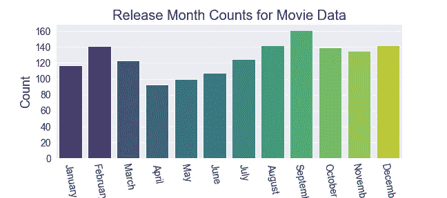
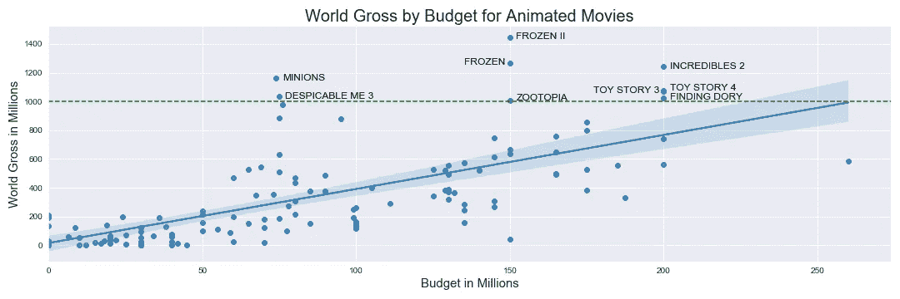
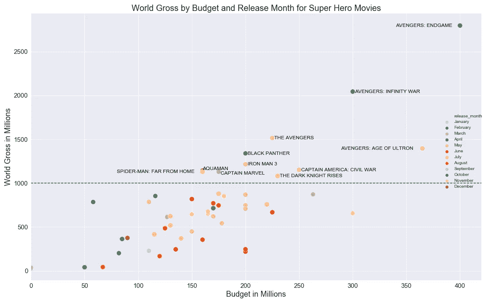
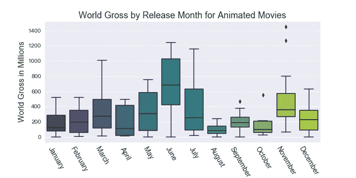
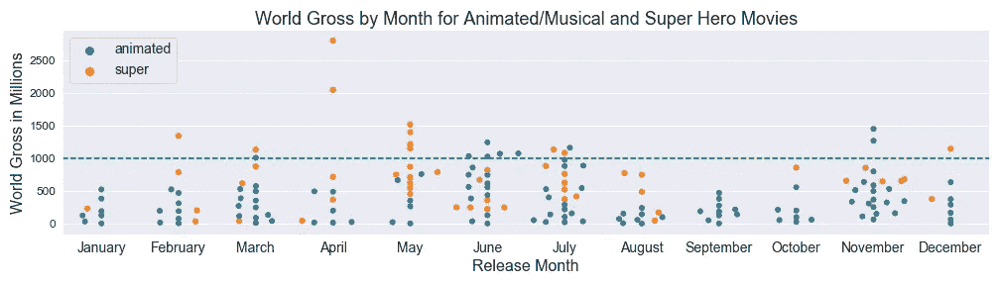
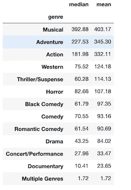

# 图表、渐变和分组依据

> 原文：<https://towardsdatascience.com/graphs-gradients-and-groupby-what-my-first-major-project-has-taught-me-a3c96561700a?source=collection_archive---------49----------------------->



图片作者。

## 我的第一个主要数据科学项目教会了我什么。

当我完成熨斗学校数据科学项目第一阶段的第一个项目时，我对我现在知道如何做的大量事情感到惊讶，这些事情在短短两个月前我甚至不知道存在。退一步说，这个项目的节奏很快。我发现自己不断地在母亲生活的诸多责任中周旋，同时尽可能地挤出时间投入到学习中。从本质上说，这意味着我两岁的孩子经常生我的气……而且我一直没有睡觉。(所以如果有人想给我买十月礼物，我是大号 XXXL 咖啡，谢谢。)

但是，这个项目教会了我很多东西。在我进入代码的本质之前，我需要提到一个事实，这个项目的工作教会了我如何在未来做得更好。我一直纠结的问题是，在学术方面，我天生是个完美主义者。认识我的人听到这个消息有时会感到惊讶，因为我家的标准脏乱程度并不会让你联想到完美。我写这篇文章时，正盯着一间堆满玩具的房间和一张用昨天的工艺用品装饰的桌子。但是当涉及到我正在学习或被评估的任何事情时，我都以很高的标准要求自己。这给我带来了麻烦。

问题？我们有两周的时间作为一个团队来完成一个主要项目。我自己做的，很早就开始了，给自己三周左右的时间完成。但是我做了这个项目的三个不同版本，因为我一直试图转换方向，让它变得更好。我一直告诉自己，我还有时间，所以我会用这些时间去探索其他的道路。我没有保持在正确的轨道上，专注于完成必要的任务，而是不断放弃我的数据，以支持新的东西或看起来比我现有的更好的东西。我导入，我抓取网页，我调用 API，我清理和准备数据——然后我用不同的东西重新开始。最后，尽管我很早就开始了，但我最终还是匆忙完成了这个项目，因为我转换了很多次方向。这给了我，或者说提醒了我一个非常重要的教训，那就是保持在正确的轨道上，不要对自己太苛刻，在开始阶段就把事情做得尽善尽美。我明白了，我已经太老了，不能再熬通宵，在午夜吃麦片，数着离孩子们醒来还有几个小时！

另一个问题是，又是这个完美主义的东西，我不断为我的分析创造越来越多的可视化。我们被要求有 4 个有意义的可视化，在我写这篇文章的时候，我有 27 个。问题？我本可以专注于制作更令人惊奇的更少的可视化效果，而不是大量不同程度的可视化效果。我对这种过度绘图和绘制的唯一解释是，我是在完成一个极其彻底的分析的心态。我一直在想，“现在，如果我把它画成*这个*，那么我的图表就会按照我想要的方式显示数据。”老实说，我喜欢绘图，每次发现显示数据的新方法时都很兴奋。(简短的题外话:我真的对我制作的一个特定的 seaborn 小提琴情节感到兴奋，直到一个匿名的消息来源告诉我，这个特定的情节看起来像彩虹一样的阴道。所以我不得不再次转换方向，只是因为我不能无视它，可悲的是阴道与我的项目无关。)同样，如果你没有严格的时间限制，这不是问题，但不幸的是，这正是我的时间限制。

现在，我已经有了一些时间来反思我的过程，并获得了一些对自己未来非常重要的见解，我可以让自己为自己迄今为止所学到的知识和取得的成就感到自豪:

*   **网络搜集。当我们第一次在课程材料中了解到网络搜集时，我对这个话题并不感兴趣。我不喜欢它的伦理灰色地带；与其他数据采集方法相比，它感觉很不雅。但我想我缺乏最初的兴趣只是因为缺乏必要。一旦我发现自己在做一个需要特定数据的项目，很快我就明白了网络抓取是导入信息的一种快速而有用的方式。能够在网站上生成一份财务报告，然后编写一个快速的 python 函数来获取该报告，并将其导入为熊猫数据框架，这是我直到最近才知道的事情。所以当我意识到它的速度和简单性时，我感觉非常棒。每当我能够像这样成功地执行功能时，我可能会也可能不会从我的桌子上跳起来跳舞。**

```
def number_scraper(year):
    """ 
    Scrapes 100 top-grossing movies from The-Numbers.com. 

    Adds year input to url and scrapes resulting table. 

    Parameters: 
    year (int): user input 4-digit year for movie gross to be scraped.

    Returns: 
    numbers_df (Pandas DataFrame): A dataframe populated with movie gross table values. 

    """
    # url for the full customized report of top 100 movies for release years in range listed
    url = f"[https://www.the-numbers.com/movies/report/All/All/All/All/All/All/All/All/All/None/None/{year}/{year}/None/None/None/None/None/None?show-release-date=On&view-order-by=domestic-box-office&show-release-year=On&view-order-direction=desc&show-production-budget=On&show-domestic-box-office=On&show-international-box-office=On&show-worldwide-box-office=On&show-genre=On&show-production-method=On&show-creative-type=On](https://www.the-numbers.com/movies/report/All/All/All/All/All/All/All/All/All/None/None/{year}/{year}/None/None/None/None/None/None?show-release-date=On&view-order-by=domestic-box-office&show-release-year=On&view-order-direction=desc&show-production-budget=On&show-domestic-box-office=On&show-international-box-office=On&show-worldwide-box-office=On&show-genre=On&show-production-method=On&show-creative-type=On)"
    response = requests.get(url)
    # creating soup
    soup = BeautifulSoup(response.text, 'lxml')
    # finding table
    table = soup.find('table')
    # converting html of table into string 
    table_string = f"""{table}"""
    # reading html string into pandas
    table_read = pd.read_html(table_string)
    # converting into DataFrame
    numbers_df = table_read[0]
    return numbers_df
```

*   **进行 API 调用。**我非常喜欢关于 JSON 和 API 调用的课程材料。所以毫不奇怪，我必须将这一点纳入我的项目。能够编写一个函数来获取一部电影的标题并返回你可能想知道的关于这部电影的任何内容，这是多么令人惊奇啊！当我编写一个函数，将电影的标题作为一个参数，检索它的上映日期、导演和作曲家，然后将它添加到我的 DataFrame 中时，我感到无比自豪。我还喜欢能够将我的 API 密匙保存在一个秘密文件夹中，并将其设置为函数中使用的变量。

```
def get_keys(path):
    """Retrieves API key from files as api_key."""
    with open(path) as f:
        return json.load(f)
keys = get_keys("/Users/dtunnicliffe/.secret/TMDb_api.json")
api_key = keys['api_key']def get_director(title):
    """ 
    Updates director information for movie in dataframe.

    Queries TMDB for a given movie title.
    Retrieves TMDB movie_id for title.
    Retrieves director information based on movie_id.
    Adds director information to a list.
    Converts director information from list to string.
    Adds new director value as string to movie's row in dataframe. 

    Parameters: 
    title (str): user input movie title.

    Returns: 
    Updated cells in Pandas DataFrame. 

    """
    title_r = title.replace(' ', '+')
    url = f"[https://api.themoviedb.org/3/search/movie?api_key={api_key}&query={title_r](https://api.themoviedb.org/3/search/movie?api_key={api_key}&query={title_r)}"
    response = requests.get(url)
    if len(response.json()['results']) > 0:
        movie_id = response.json()['results'][0]['id']
        url2 = f"[https://api.themoviedb.org/3/movie/{movie_id}/credits?api_key={api_key](https://api.themoviedb.org/3/movie/{movie_id}/credits?api_key={api_key)}"
        response2 = requests.get(url2)
        crew = response2.json()['crew']
        directors = []
        for member in crew:
            if member['job'] == 'Director':
                directors.append(member['name'])
                d = str(directors)
                d = d.replace('[', '').replace(']', '').replace("'","")
                merged_df.loc[merged_df['title']==title, 'director'] = d
    else:
        pass
# creating a list of all the super hero movie titles
superhero_titles = [title for title in superhero['title']]
# getting director info for movies in list and updating data accordingly
for title in superhero_titles:
    get_director(title)
```

*   **带兵！**是的，我们已经谈到了我对情节和图表的痴迷。但这真的是一个扩展我绘图知识的绝佳机会。对于这个项目，我利用 matplotlib 和 seaborn 来绘制我的图，我真的很喜欢这样做。作为一名视觉学习者，我可以直接看到这些图如何讲述一个故事，以及它们对于一名数据科学家向另一个人或组织传达他们的发现有多重要。一件既令人难以置信的乏味又令人难以置信的有益的事情是在我的一些地块上标注或标记点。例如，我选择标注代表我的项目所关注的子类别的票房最高的电影的点，超级英雄电影和动画儿童音乐电影。将电影片名放在正确的位置上非常耗时，有时甚至令人沮丧。但是看到最终的结果让我觉得一切都值了。

```
# plotting world gross by budget for animated movies
sns.set_style('darkgrid')
sns.lmplot(x='budget_in_mil', y='world_gross_mil', data=merged_df.loc[merged_df['prod_method']=='Digital Animation'], aspect=3)
plt.title('World Gross by Budget for Animated Movies', fontsize=20)
plt.xlabel('Budget in Millions', fontsize=15)
plt.ylabel('World Gross in Millions', fontsize=15)
plt.xlim(0, None)
plt.axhline(y=1000, ls='--', c='green')
for v, w, x, y, z in zip(merged_df['genre'], merged_df['prod_method'], merged_df['budget_in_mil'], merged_df['world_gross_mil'], merged_df['title']):
    if (z=='Frozen'):
        plt.text(x=x-15, y=y-15, s=z.upper(), fontsize=12, color='black')
    elif  z=='Toy Story 3':
        plt.text(x=x-23, y=y-10, s=z.upper(), fontsize=12, color='black')
    elif  z=='Zootopia':
        plt.text(x=x+2, y=y, s=z.upper(), fontsize=12, color='black')
    elif (z=='Toy Story 4'):
        plt.text(x = x+2, y = y, s = z.upper(), fontsize=12, color='black')
    elif (w=='Digital Animation') and y>1000:
        plt.text(x = x+2, y = y-15, s = z.upper(), fontsize=12, color='black');
#saved in images as fig22
#plt.tight_layout()
#plt.savefig('./images/fig22.png')
```



```
# plotting world gross by budget and release month for super hero movies
sns.set_style('darkgrid')
g = sns.relplot(x='budget_in_mil', y='world_gross_mil', data=merged_df.loc[merged_df['creative_type']=='Super Hero'], hue='release_month', hue_order=['January', 'February', 'March', 'April', 'May', 'June', 'July', 'August', 'September', 'October', 'November', 'December'], s=130, aspect=3, palette='Paired')
plt.title('World Gross by Budget and Release Month for Super Hero Movies', fontsize=20)
plt.xlabel('Budget in Millions', fontsize=18)
plt.ylabel('World Gross in Millions', fontsize=18)
plt.xticks(fontsize=15)
plt.yticks(fontsize=15)
plt.xlim(0, None)
g.fig.set_size_inches(16,10)
for w, x, y, z in zip(merged_df['animated_or_super'], merged_df['budget_in_mil'], merged_df['world_gross_mil'], merged_df['title']):
    if (z=='Avengers: Endgame'):
        plt.text(x=x-60, y=y-15, s=z.upper(), fontsize=12, color='black')
    elif (z=='Avengers: Infinity War'):
        plt.text(x=x+2, y=y-15, s=z.upper(), fontsize=12, color='black')
    elif (z=='Avengers: Age of Ultron'):
        plt.text(x=x-76, y=y-15, s=z.upper(), fontsize=12, color='black')
    elif (z=='The Avengers'):
        plt.text(x=x+2, y=y-15, s=z.upper(), fontsize=12, color='black')
    elif (z=='Spider-Man: Far From Home'):
        plt.text(x=x-80, y=y-15, s=z.upper(), fontsize=12, color='black')
    elif (z=='Aquaman'):
        plt.text(x=x, y=y+10, s=z.upper(), fontsize=12, color='black')
    elif (z=='Captain Marvel'):
        plt.text(x=x+2, y=y-35, s=z.upper(), fontsize=12, color='black')
    elif (w == 'super') & (y>1000):
        plt.text(x = x+2, y = y-15, s = z.upper(), fontsize=12, color='black')
plt.axhline(y=1000, ls='--', c='green');
#saved in images as fig25
#plt.tight_layout()
#plt.savefig('./images/fig25.png')
```



图片作者。

*   **色调和调色板。**这是上一点的翻版，但是在 seaborn 中使用色调和调色板既有用又有趣。我选择将我的大部分绘图设置为相同的配色方案，以便它们与我的演示幻灯片相匹配。但是我喜欢在如此多美观的组合中设置不同的渐变和调色板的能力。我也一直在我的 seaborn 图中使用色调参数来区分不同的值，比如电影上映月份或电影类型。



图片作者。



图片作者。

*   数学/统计技术。当然，任何数据科学项目的主要组成部分都是数学。我很高兴着手这个项目，因为我已经掌握了我需要的大多数统计工具的知识。简单的`.describe`方法在获取重要信息方面走了很长的路，比如我的数值列的平均值、中间值和百分点，比如国内、国际和全球票房总额或制作预算。计算四分位差(IQR)和我碰巧需要的任何其他描述性统计数据也很容易。
*   **Groupby。在这个项目开始之前，我对使用`pandas.groupby`有些不放心。我理解它，但只是抽象地理解。将它与我获得的真实电影数据一起使用后，我现在对如何在未来使用它有了更坚定的把握。在这个项目中，我经常使用它来查找像发行月份或电影类型这样的类别的平均值和中间值。**

```
# getting mean and median world gross amounts by genre
genre_stats = merged_df.groupby('genre')['world_gross_mil'].agg(['median', 'mean'])
genre_stats.sort_values(by='mean', ascending=False)
```



图片作者。

*   **数据清洗。**我把它放在这个列表的底部(尽管从重要性的角度来说它应该在列表的顶部),因为项目的这一部分，对于我开始的项目的所有三个版本来说，是最令人畏惧和最不愉快的。到了我的第三个也是最后一个项目版本，我已经将我所有的清理动作添加到一个单一的函数中，以帮助加速清理并使其更容易。但是，删除重复项，找出用什么替换每个空值(然后实际替换所述空值)，修改列名和实际列，以及找出何时真正需要删除数据……就没那么有趣了。更不用说处理字符串格式而不是整数格式的数据，或者处理浮点数格式而不是日期时间格式的年份了…

```
def clean(df):
    """ 
    Cleans and modifies a given dataframe according to criteria set for this particular project. 

    Drops column called 'Unnamed:0'.
    Converts column names to lowercase.
    Renames certain columns to make them shorter/more comprehensive.
    Removes dollar signs and commas from dollar amounts.
    Converts dollar amounts from strings into integers.

    Parameters: 
    df (Pandas DataFrame): user input dataframe based on previously scraped table values from The-Numbers.com.

    Returns: 
    df (Pandas DataFrame): A dataframe cleaned and adjusted as per criteria listed above. 

    """
    # drop 'Unnamed' column
    df = df.drop(columns='Unnamed: 0')
    # make column names lowercase
    df.columns = [x.lower() for x in df.columns]
    # rename certain columns
    df = df.rename(columns = {'released':'release_date', 'released.1':'release_year', 'productionmethod':'prod_method',
                              'domesticbox office':'dom_gross', 'internationalbox office':'int_gross', 'worldwidebox office':'world_gross',
                              'creativetype':'creative_type', 'productionbudget': 'budget'})
    # removing dollar signs and commas from dollar amounts
    # converting dollar amounts from strings into integers
    df['dom_gross'] = df['dom_gross'].str.replace(',', '').str.replace('$', '').astype(int)
    df['int_gross'] = df['int_gross'].str.replace(',', '').str.replace('$', '').astype(int)
    df['world_gross'] = df['world_gross'].str.replace(',', '').str.replace('$', '').astype(int)
    df['budget'] = df['budget'].str.replace(',', '').str.replace('$', '').astype(int)
    return df
```

*   **日期时间。**我从对日期时间一无所知，到至少知道足够将我的一些列转换成日期时间值，并基于所述值使用特性工程函数(即，列创建)。所以这很酷。关于这个主题，我还有很多要学习的，因此，在多次尝试使用 datetime 按月份顺序显示我的图表后，我不得不手动做一些事情，如按名称设置我的发布月份顺序。但令我高兴的是，我学到了足够多的知识，可以将我的一些数据转换为日期时间值，并根据日期时间值过滤我的数据帧。

```
# converting release_date column to datetime object
merged_df['release_date'] = pd.to_datetime(merged_df['release_date'])
# generating release_month value based on datetime release_date
merged_df['release_month'] = merged_df['release_date'].dt.strftime('%B')
```

*   **名正言顺。**早在我开始数据科学之路之前，这就是我一直在努力解决的问题。当我在高中的时候，“二年级演讲”是我们十年级的一个标志，我仍然记得站在全班近 500 名学生面前发表关于素食主义的演讲时的焦虑，因为我(不幸地)进入了最后一轮。这稍微容易一点，因为我正在通过 Zoom 向一位教师展示我的非技术性发现，但焦虑仍然非常真实。我知道这是一项我需要提高的技能，这样我才能在作为数据科学家的职业生涯中自如地交流我的发现。(对我的同学 Fen 大声喊出来，感谢她抽出时间来帮助我练习这个，让我对演讲这个想法更加适应！像这样的联系让旅程变得更加美好。)

现在我可以松口气了，我们进入了第二阶段，学习概率、统计分布、中心极限定理、假设检验和方差分析。因此，在这一点上，我只是希望统计学知识就像骑自行车一样，我从本科统计学中学到的一切开始在我的大脑中重新展现。如果您已经做到了这一步，请随时联系我们，提供任何反馈！感谢您的阅读。

*对于我的整个一期项目，包括完整的 Jupyter 笔记本和我的幻灯片演示的 pdf，请访问我的项目 1 GitHub Repo* [*这里*](https://github.com/dtunnicliffe/movie-analysis-project) *。*