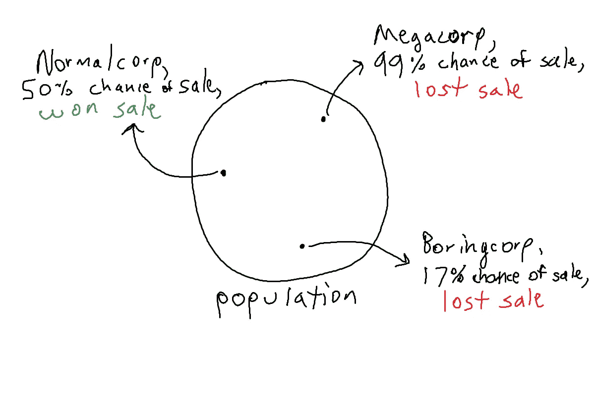
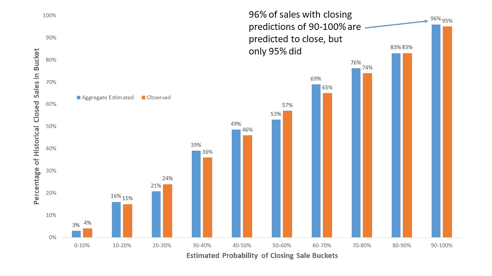
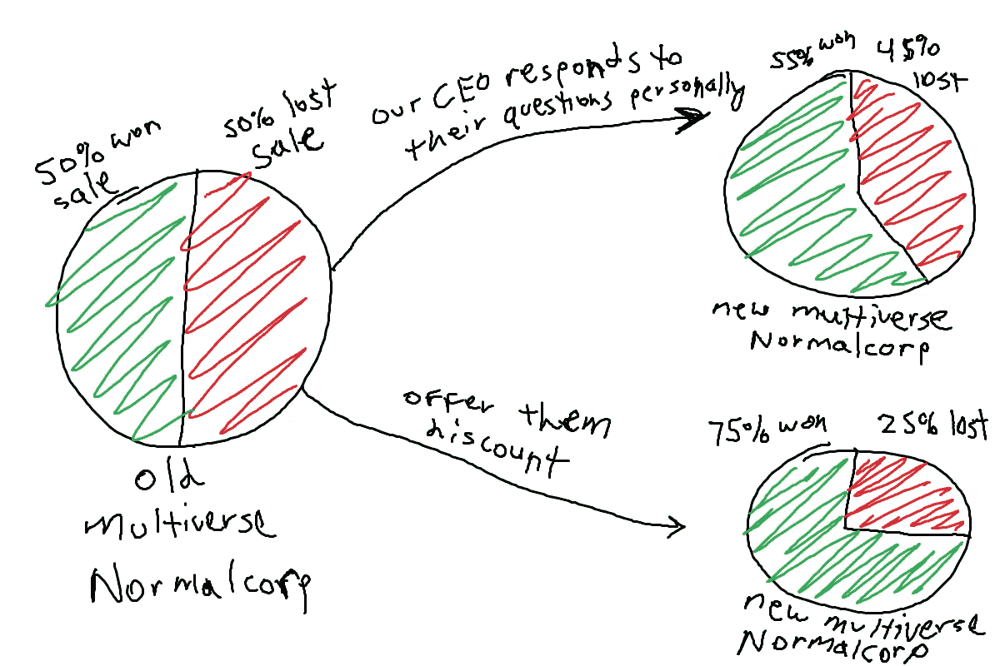

# 用多元宇宙理论解决事件概率

> 原文：<https://towardsdatascience.com/grappling-with-event-probabilities-using-multiverse-theory-26b46067da14?source=collection_archive---------61----------------------->

## 不要射杀建模者——至少在这个世界里

吉列尔莫·费拉在 [Unsplash](https://unsplash.com/s/photos/universe?utm_source=unsplash&utm_medium=referral&utm_content=creditCopyText) 上拍摄的照片

人类有很多认知能力，但我们大多数人都在努力的一个领域是估计、解释和准备不太可能发生的事件。这个主题支撑了[纳西姆·塔勒布](https://medium.com/@nntaleb)的两部主要作品:[被随机性愚弄](https://en.wikipedia.org/wiki/Fooled_by_Randomness)和[黑天鹅:极不可能事件的影响](https://en.wikipedia.org/wiki/The_Black_Swan:_The_Impact_of_the_Highly_Improbable)。在后一部作品中，塔勒布将黑天鹅事件定义为具有三个特征:事件是一个惊喜(对观察者而言)，它有重大影响，以及*人们事后错误地试图合理化*(强调我的)。

Taleb 关注世界舞台上的黑天鹅事件，如互联网的创建、第一次世界大战、苏联解体等。我相信人类的行为是相似的，而且对他们有害，统计模型预测的可能性较小的事件，只要它们是重要的。我们最近在 2016 年总统选举结果中看到了这一点。《赫芬顿邮报》、《纽约时报》和《纽约时报》发布的模型都认为希拉里·克林顿有 71-98%的胜算。在她竞选失败后，一个普遍的反应是[我们是否可以再次信任民意调查[和依赖于他们数据的模型】](https://www.youtube.com/results?search_query=trust+polls&page=&utm_source=opensearch)，我很惊讶地看到，即使是从有统计学头脑的朋友那里。为什么我们的本能反应是仔细检查那个说特朗普有 29%胜算的模型？我们不会质疑一枚硬币出现两次反面(25%的可能性)或掷骰子出现 1(17%的可能性)的公平性；这两个数字都低于特朗普赢得 2016 年大选的赔率。

我假设这种反应是一种事后合理化的形式，是由于缺乏一种心智框架来应对现实世界的事件概率，而没有这种框架会导致非理性的决策。为了说明这一点，让我们从选举建模的世界转移到商业世界中遇到的更常见的情况。

# 最黑暗的时间线

假设你是一名数据科学家，在一家 B2B 科技公司模拟与潜在客户达成销售的概率。你的公司正在争取一个特别大的客户，Megacorp，所以首席执行官每天检查你的模型，以跟踪完成销售的可能性。

**周四** : 98%的成交

难以置信的消息！无论你的队友在做什么，看起来都很有效。

**周五** : 99%的成交

甚至更好！首席执行官开始计划在预期的意外之财后，他需要对你的企业做出的改变。雇佣更多员工？收购竞争对手？买超级碗广告？

**周一**:成交 0%

发生了什么事？！您了解到潜在客户在最后一刻选择了与竞争对手合作。这对每个人的士气都是一个巨大的打击，首席执行官在他认为几乎可以保证的销售后，花在梦想扩张上的时间和精力都浪费了。

对这种惨败的普遍反应是什么？“型号肯定是错的！”首席执行官在事后总结会上宣布，他会打电话给你。“我们应该知道这不像你说的那样可能。在它修好之前，我不想听到你的消息。”

# 制造问题

有可能 CEO 是对的。你的模型可以预测到你的公司最终没有达成交易的可能性较低。不过，也有可能模型没问题。你的公司有很大的机会达成交易，但是不可思议的事情发生了，你没有成功。

你现在处于一个不舒服的位置。“改进”该模型的唯一方法可能是，以精确模拟未来销售为代价，制作一个估计完成 Megacorp 销售的可能性较低的模型*。这叫做[过拟合](https://en.wikipedia.org/wiki/Overfitting)。为了讨首席执行官的欢心而顺从他的要求，扭曲了对未来销售的预测，从而损害了你的模式和公司。*

# 回归基础

在我们开始讨论我提出的可以帮助人们更好地理解复杂的现实世界事件概率的心理框架之前，让我们从一个简单的例子开始。想象你有一个公平的六面骰子。你一遍又一遍地滚动骰子，开始记录结果。在多次掷骰子之后，你会观察到你所期望的:大约相同数量的掷骰子产生了每个数字，从 1 到 6。

在几百次掷骰子之后，你会得到一个不太可能的、不幸的(在大多数游戏中)连胜。一个 1，接着是另一个 1，接着是另一个 1！出现这种情况的几率是 1/216 = ~0.5%。这是一个不太可能发生的事件。你惊讶吗？你怀疑死亡的公平性吗？你有没有告诉骰子，在你再次掷骰子之前，它最好先调整好自己？

大多数人，甚至那些没有受过任何统计训练的人，都会说不。发生的事情不太可能，但骰子的表现却如预期的那样。此外，如果我们认真思考，我们可以解释骰子滚动随机性背后的机制。一旦骰子离开你的手，它就服从物理定律，并且是完全可预测的。掷骰子是随机的原因是释放后速度和方向的微小变化会导致不同的结果。没有人有在掷骰子时作弊所需的精细动作技能，这将允许他们让一些数字比其他数字出现得更频繁。

我们可以使用统计总体的概念，统计总体是“对某个问题或实验感兴趣的一组相似的项目或事件”([维基百科](https://en.wikipedia.org/wiki/Statistical_population))。在这种情况下，感兴趣的项目是骰子点数。由于速度和方向不同，我们得到不同的结果。

当我们掷骰子时，我们所做的是从这个群体中取样。所有可能的投掷(甚至是骰子从你的手中掉落或被扔出敞开的窗户的投掷)的群体包含每种结果的相等份额。如果我们从面积的角度来考虑这个问题，如上图所示，我们可以想象，从 1 到 6，每个结果的人口面积相等。

图片由作者提供

在我们增加一些复杂性之前，我想强调一个观点，即虽然只有六种同样可能的掷骰结果，但速度和方向有无限多种组合，当遵守不变的物理定律时，就会产生这些结果。凭借对掷骰子的深刻理解，我们可以想象做两种不同类型的工作:

1.  我们可以利用我们对同等权重的人口**结果**的理解，在不同的领域，如游戏、赌博和商业中提出最优策略。
2.  我们可以尝试使用我们对驱动等概率的**机制**的理解，即释放后骰子的速度和方向可以完美地预测其结果，以尝试让某些结果更频繁地发生。人类做不到这一点，但也许我们可以创造一个机器人，它可以扔出每次都是 6 的骰子。

# 增加复杂性

在我们的销售示例中，统计总体是什么？大多数人会回答说，这都是可能的销售客户。我总是发现这个定义有一些令人沮丧的地方:我们不能用它来解释为什么我们的模型有 99%的机会获得我们没有获得的销售，除非承认它一定是模型错误。如果是这样的话，我们的首席执行官——他不是概率和统计方面的专家——觉得他的要求是合理的。

图表由作者提供

解决这一问题的一种方法是将预测按准确度分组(例如 0–10%、10–20%、…90–100%)，并共同绘制准确度图表。一个表现良好的模型将会显示这些预测围绕着观察到的总体情况进行。

这仍然不能满足我理解预测的 99%的需要。想象一下，总的来说，我们预测在 90–100%的预测时段中，96%的销售将被关闭，但只有 95%被关闭。人们仍然可以争辩说，通过修正模型，并降低我们预测的 99%，我们仍然可以提高总的准确性。

图片由作者提供

与掷骰子的例子不同，我们不能轻易地从总体中重新取样。我们无法重温历史，以 100 种略有不同的方式向 Megacorp 推销 100 次，100 次中有 99 次都能卖出。但是我们可以用多元宇宙理论想象这样做！在[多元宇宙理论](https://en.wikipedia.org/wiki/Multiverse)中，特别是[第三层:多世界解释](https://en.wikipedia.org/wiki/Many-worlds_interpretation)，概率事件的所有可能结果都发生在某个宇宙中，并且与它们的概率成比例。我想将**多元宇宙人口**定义为所有可能宇宙中的统计人口(在本例中:所有潜在客户)*。*扩展上面的统计人口示例，我们可以将代表每个潜在客户的每个点变成一个圆圈，代表该潜在客户在所有领域的结果。赢得该客户业务的可能性越高，赢得其业务的宇宙的比例就越大，因此客户圈的面积就越大。请注意，如果我在整个多元宇宙群体中添加阴影，它将类似于我之前分享的掷骰子图。

图表由作者提供

# 拥有多元宇宙精神框架的好处

敏锐的读者已经注意到，我们不能用这种多元宇宙的概率方法来证明我们的模型是正确的。我们不能从一个领域跳到另一个领域，列出我们赢得 Megacorp 销售的比例，向我们的首席执行官展示我们的模式正在按预期运行。事实上，任何模型都不可能完美地解释这个世界。我们能做的最好的事情就是知道一个模型合理地预测了我们感兴趣的人群中的样本，通常是通过与其他不太准确的模型进行对比。即便如此，我们仍然依赖于假设来这样做，其中最重要的一点是，系统不会经历意料之外的结构变化。如果发生这样的变化，我们所有的预测都将落空。在我们的例子中，一个强有力的竞争者进入或离开市场将代表这种变化。

根据我的经验，许多数据科学家忽视甚至摒弃非经验主义的想法，比如这种用多元宇宙理论来解决概率问题的方法，但他们这样做是在自担风险。使用该理论的第一个好处是，这是一种向那些没有很强背景的人解释概率的简单方法，比如我们例子中的 CEO。用多元宇宙理论解释你的模型输出有可能帮助你的模型消费者更容易理解如何解释它们。它可以单独完成，或者添加到关于过度拟合的简短解释中，以说服我们假设的首席执行官放弃他(潜在的)非理性需求来调整你的模型，直到它降低了 Megacorp 的销售概率。

第二个好处是，多元宇宙理论解释概率的方法为我们提供了一个有用的假设分析结构。还记得我们掷骰子例子中的随机机制吗？我分享了一个公平的骰子以相同的比例出现每个结果的原因，因为小的变化——比我们用精细的运动技能所能控制的更小——会导致不同的结果。我们可以证明，用多一点的力或者不同的方向，会把一个会导致 1 的投掷变成一个会导致 2 的投掷。不幸的是，像经典力学那样一致的系统无法完美地预测业务成果。然而，我们可以试着想象我们可以做些什么来增加我们完成 Megacorp 销售的机会，并利用它来帮助未来的销售。当人们做假设分析时，他们总是这样做:可以想象首席执行官在想“如果我亲自回答了 Megacorp 关于我们服务的问题”或“我想知道如果我们给他们折扣会发生什么，因为他们会是一个令人印象深刻的客户。”我们需要明白，这些行为都不能保证销售，但它们可以增加销售的几率，应用多元宇宙理论，我们可以想象将销售失败的宇宙翻转到销售成功的宇宙。在下图中，我展示了 Normalcorp 客户的情况，该客户最初有 50%的销售机会，因为从 50%开始增加更容易看到。

图表由作者提供

我希望使用多元宇宙理论查看事件概率有助于缩小理解统计课程中常用的简单概率(例如，掷硬币、掷骰子或从一副牌中抽出卡片)和现实世界中复杂概率(例如，完成销售的概率、将用户转化为付费订阅计划的可能性)之间的差距。对于通过多元宇宙思考概率的一些有趣探索，我会推荐社区的[补救混沌理论集(以及后续引用它的集)，其中一个骰子滚动创建了多个时间线，以及所有的](https://en.wikipedia.org/wiki/Remedial_Chaos_Theory)[瑞克和莫蒂](https://en.wikipedia.org/wiki/Rick_and_Morty)。自己尝试一下，与他人分享和讨论这个想法——包括我，我会尽最大努力回应这里或[推特](https://twitter.com/jarussingh)上的评论，看看它是否有助于理解复杂的现实世界现象，并使决策更加理性。