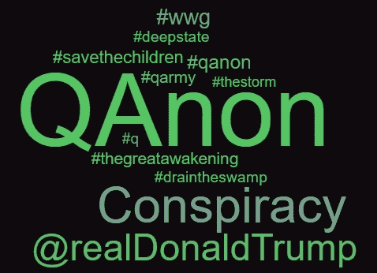
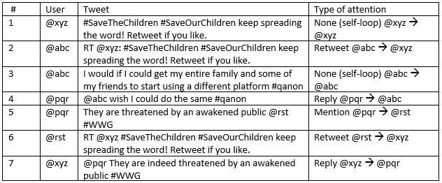
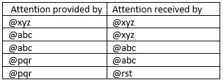
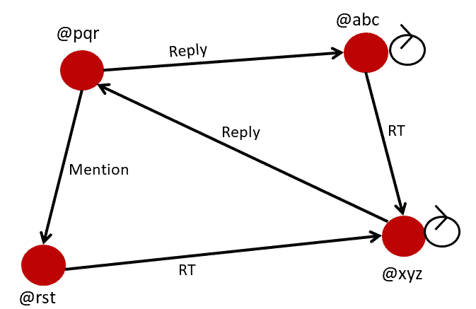
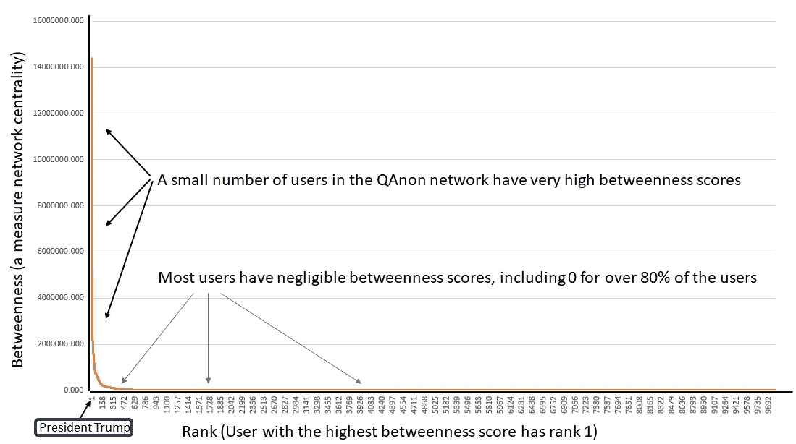
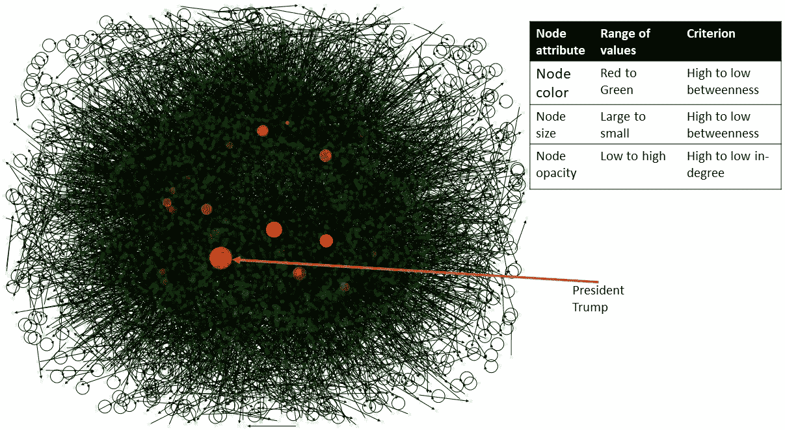
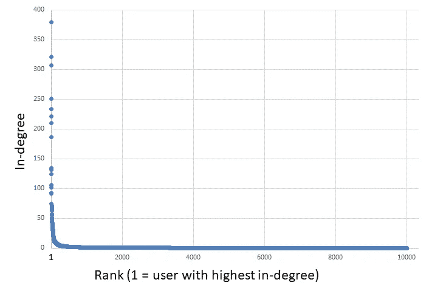
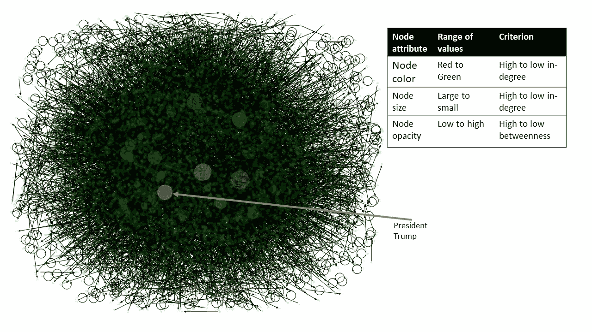
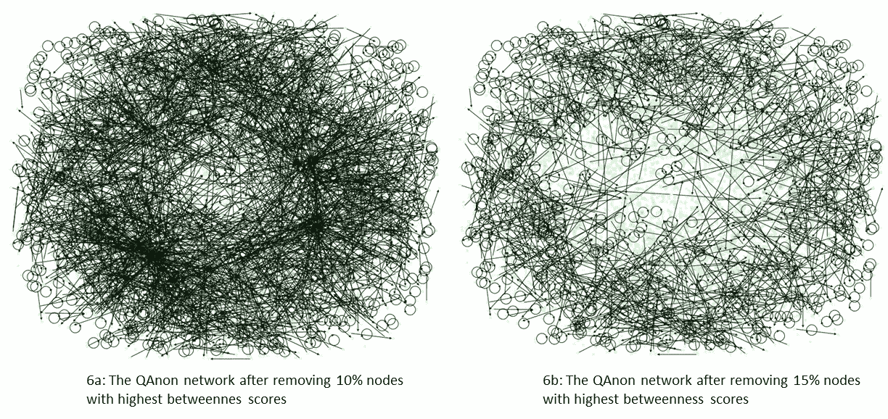

# 从社交媒体分析角度看 QAnon 阴谋论

> 原文：<https://towardsdatascience.com/grassroots-or-influencer-driven-a-social-network-analysis-of-the-qanon-conspiracy-theory-f99617f8454d?source=collection_archive---------33----------------------->

由德克萨斯州奥斯汀西湖高中的阿迪特·巴鲁阿 & [约什·巴鲁阿](https://medium.com/u/d86df2a42e5a?source=post_page-----f99617f8454d--------------------------------)撰写。

**卡农是一种草根现象，还是主要由少数有影响力的人推动？**要被认为是一个有影响力的人，用户必须从网络中的其他人那里获得大量关注，这可以在 Twitterverse 中以用户收到的转发、回复和提及的份额来衡量。通过来自 1 万名 QAnon 支持者的推文，我们使用社交网络分析来表明 QAnon 在很大程度上是基于影响者的；相对来说，一小部分用户吸引了大部分注意力，大多数 QAnon 支持者重复影响者所说的话。尽管特朗普总统不使用受欢迎的 QAnon 标签发推文，但@realDonaldTrump 的提及率在 QAnon 网络中名列前五。因此，他可以被描述为一个被动的影响者。在 QAnon 网络中，被不同标签提及的用户中，@realDonaldTrump 遥遥领先排名第一。当我们结合这两种方法来衡量关注度时，特朗普总统仍然是 QAnon 网络中的头号(被动)影响者。

一个现象是由草根还是由有影响力的人驱动有关系吗？草根运动是指大多数参与者的重要性虽小，但几乎同等重要的运动。相比之下，在影响者驱动的运动中，少数参与者非常重要，他们推动了大部分行动，而其他人基本上无足轻重。由于不依赖于少数主要参与者，草根运动通常比基于影响者的运动更有弹性或持久力。相比之下，如果高层影响者因为这样或那样的原因离开，基于影响者的现象可能会失败。当然，运动的性质会随着时间而改变。例如，有人认为#MeToo 最初是由影响者驱动的，但随着时间的推移变得更加草根。相比之下，我们对 BLM 数据的初步分析(未在此展示)表明，这更像是一场草根推动的运动。现在判断 QAnon 是否会最终成为一种草根现象还为时过早。

## **卡农阴谋论**

如果你正在阅读我们的文章，你可能已经知道 QAnon 是什么了。以防你太忙而无法关注这一相对较新的发展，这是维基百科对这一现象的定义:

QAnon 是一个极右翼的阴谋论，声称一个所谓的“深层国家”针对唐纳德·特朗普总统及其支持者的秘密阴谋。….这个理论始于 2017 年 10 月“Q”在匿名 imageboard 4chan 上的一篇帖子，他可能是一个美国人，但很可能成为一群人。q 声称能够接触到涉及特朗普政府及其在美国的对手的机密信息。”

《纽约时报》报道称，QAnon 最近变得更加主流，出现在许多社交网络的显著位置，发布了关于疫情、BLM 和疫苗的帖子。多家媒体和事实核查人员报告称，QAnon 散布了关于这些和其他话题的错误信息。一些共和党国会候选人在推特上支持卡农，特朗普总统也转发了这些推特。

## **通过社交网络分析了解卡侬**

为了使用社会网络分析来检查 QAnon，我们使用以下步骤:

1.收集带有 QAnon 标签的推文。

2.执行情绪分析，丢弃对 QAnon 有负面情绪的推文(因为我们想要分析 QAnon 支持者的样本网络)。

3.从推文中创建 QAnon 支持者的定向关注网络。

4.计算节点(用户)的网络中心性指标。

5.可视化网络并显示突出的节点。

6.删除 10%和 15%的顶级节点，并检查没有它们时网络的表现。

我们在我们的一个 GitHub 存储库中提供了用于创建注意力网络、中心性度量计算以及可视化的 python 脚本:[**https://GitHub . com/adib 2002/Social-Network-Analysis-Python-Scripts**](https://github.com/AdiB2002/Social-Network-Analysis-Python-Scripts)

我们不提供通过 Twitter API 访问 tweets 的脚本。已经有多篇文章在 Medium 上发表了关于这个主题的代码，这里有一篇很优秀的发表在 TDS 上:[https://towardsdatascience . com/Twitter-data-collection-tutorial-using-python-3267d 7 CFA 93 e](/twitter-data-collection-tutorial-using-python-3267d7cfa93e)

我们收集了使用一个或多个热门 QAnon 标签的推文:#qanon、#q、#savethechildren、#thegreatawakening、#wwg、#qarmy 等。通过反复使用 Twitter API，我们获得了超过 1 万名使用这些 QAnon 标签的 Twitter 用户的推文。为了确保我们分析来自 QAnon 支持者的推文，我们对每条推文进行了 VADER 情绪分析，并丢弃了对 QAnon 有负面情绪的推文。

接下来，我们通过以下方式创建了 QAnon 支持者的定向网络。如果一个用户@abc 转发、回复或提及另一个用户@xyz，那么这两个用户由一个从@abc 到@xyz 的箭头连接。箭头表示@xyz 正受到@abc 的关注。用户的原始推文被表示为自循环，由带箭头的圆圈示出。这是一些来自我们数据的真实推文。出于隐私原因，发送推文的人和转发、提及或回复推文的人的用户 id 已被替换为虚构的 id。

表 1:推文、转发、提及和回复

从 tweets 中，我们得到了两列，如表 2 所示。

表 2:创建注意力网络的数据

根据表 2 中的数据，我们创建了如图 1 所示的网络。

图 1:注意力网络

虽然有人建议用关注者的数量来衡量影响力，但拥有大量关注者并不能保证你的推文获得大量转发，或者你会在其他人的推文中获得大量提及。事实上，在我们的数据中，关注者数量和提及次数之间的相关性是 0.51，关注者数量和转发次数之间的相关性是 0.52，这当然不是很高。通过使用转发、提及和回复，我们捕捉到了每个节点从其他节点获得的真正关注。

虽然我们已经在[**https://github . com/adib 2002/Social-Network-Analysis-Python-Scripts**](https://github.com/AdiB2002/Social-Network-Analysis-Python-Scripts)分享了我们用于此分析的 Python 脚本，但我们发现，对于可视化部分，像 node XL(Excel 中的模板)和 Gephi 这样的免费网络分析工具比 Python 中的 networkx 提供了更多的灵活性和更好的性能。所以我们最终使用 NodeXL 来实现下面的可视化。如果您想尝试我们的分析，我们建议您使用我们的 Python 代码来生成网络并计算中心性度量，然后使用 NodeXL 或 Gephi 进行可视化。

## **谁是关系网中的重要人物？**

在网络中，并非每个人都生来平等！为了理解一个节点有多重要，我们可以使用多种测量方法，这些方法被称为网络中心性度量。在我们的分析中，我们使用其中的两个，入度和中间性，尽管还有其他的，如出度、接近度和特征向量中心性。由于我们正在分析一个注意力网络，我们的重点是找到那些获得大部分注意力的个体。

节点(我们上下文中的用户)的入度(In-degree)是进入节点的箭头数量，其中箭头可以表示转发、回复或提及。具有高入度的节点意味着它正得到网络中其他节点的大量关注。在图 1 中，@xyz 在四个用户中得到最高的关注。可以区分转发、回复和提及，因为转发可以被认为是三种类型中最重要的。然而，为了简单起见，我们认为它们同等重要。

**节点的介数**是一个分数，用来衡量它在连接网络最远部分时的重要性。考虑节点介数的另一种方式是，如果没有这个节点，整个网络中的节点相互连接的难度有多大。在我们的注意力网络中，一个具有高介数分数的用户意味着该用户不仅得到了大量的关注，而且这种关注来自于整个网络。

入度和介数衡量的是同一个东西吗？不完全是。高的入度分数可能是由于来自网络的一部分的关注，而中间性考虑了整个网络。因此，这两个指标并不完全相关，我们将在下面的分析中看到这一点。

## **QA non 网络中的影响者**

关于 QAnon 受影响者驱动的第一个线索来自用户的介数分数的分布，如图 2 所示。

图 QAnon 网络中介数分数的分布

图 2 中的图表告诉我们的是，QAnon 网络中的一小部分节点得到了整个网络的大部分关注，而绝大多数节点几乎没有得到任何关注。特朗普总统的中间性得分最高，比第二高的得分大 2 倍以上；尽管我们的数据中没有他自己的推文，但@realDonaldTrump 正被整个网络的 QAnon 支持者用各种各样的标签提到。从图 3 中 QAnon 网络的可视化可以得出相同的结论。

图 3: QAnon 网络(10k 用户),更重要的节点以红色和更大的尺寸显示

在图 3 中，根据介数中心性，节点颜色从红色变为绿色。我们不得不使用介数分数的对数来将节点颜色从红色逐渐变为绿色；介数分数下降如此之快，以至于使用原始分数会显示特朗普总统是网络中唯一的红色节点！实心黑色背景代表用户之间的定向链接或箭头。节点的大小随介数中心性而变化。我们还使用了一个名为节点不透明度的特性，它使一些节点比其他节点更明显。我们选择入度作为标准，入度越高的节点显示得越明显。

虽然图 3 讲述了与图 2 相同的故事，但是如果我们使用入度而不是介数，我们的结论会改变吗？在 QAnon 网络中，入度和介数之间存在 0.69 的相关性。高，但不是超高！让我们看看图 4 中的 in-degree 分数分布。

图 QAnon 网络中的学位分数分布

入度分布与介数分布几乎相同，这也反映在下面图 5 的网络图中；只有少数节点的入度得分高于 0。特朗普总统的学位分数将他排在第五位，这解释了为什么他在图 5 中显示为橙色，而不是红色。

图 5: QAnon 网络突出显示了具有最高学位分数的用户

## 如果我们去掉最受关注的人，会发生什么？

我们很好奇，如果我们移除 10%或 15%具有最高介数分数的用户，QAnon 网络会发生什么变化。

图 6:删除了 10%和 15%顶部节点的示例 QAnon 网络

当我们将图 6 所示的网络与图 3 所示的完整网络进行比较时，我们会发现一些主要差异。图 6 中的红色节点(吸引注意力的节点)不见了，图 3 中黑色背景代表的箭头也不见了。虽然图 3 中 90%和 85%的用户仍然分别在图 6a 和 6b 的两个网络中，但是如果没有前 10–15%的高介数用户，网络上几乎没有任何活动。**基本上，卡侬的注意力网络已经崩溃了！**

## **如果我们使用不同的注意力测量方法呢？**

即使我们结合入度和介数来衡量注意力，我们也会得到相同的结果。首先，我们为这些度量创建了标准化分数，其中节点的标准化分数是网络中的入度或介数分数/最高入度或介数分数。接下来，我们尝试了一个注意力测量=标准化的程度内得分+标准化的中间得分。结果是一样的，因为这种综合的注意力测量与入度有 95%的相关性，与中间值有 88%的相关性。特朗普总统仍然是最重要的关注焦点，网络中前 25 名甚至 50 名用户的名单几乎没有变化。

## **外卖**

一小部分人在 QAnon 网络中获得了最大的关注，这表明大多数 QAnon 支持者只是重复这些顶级用户在推特上发布的内容，同时用各种标签吸引特朗普总统的注意。随着时间的推移，这种现象是否会演变成一场更加草根化的运动，还有待观察。我们进行的分析可以在不同的时间点重复进行，以了解 QAnon 网络的演变。