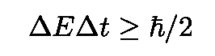
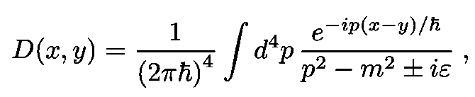
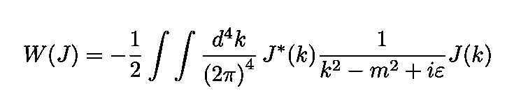
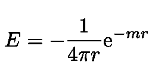

# 重力和电荷:吸引和排斥

> 原文：<https://towardsdatascience.com/gravity-and-electric-charges-attraction-and-repulsion-b2b5f8f91caa?source=collection_archive---------22----------------------->

## 为什么引力总是相互吸引，而电荷却相互排斥

图片由[皮克斯巴伊](https://pixabay.com/fr/?utm_source=link-attribution&utm_medium=referral&utm_campaign=image&utm_content=1280080)的[加里克·巴尔塞吉安](https://pixabay.com/fr/users/insspirito-1851261/?utm_source=link-attribution&utm_medium=referral&utm_campaign=image&utm_content=1280080)拍摄

许多读过《[时间简史](https://books.google.com.br/books?id=oZhagX6UWOMC&printsec=frontcover&dq=a+brief+history+of+time&hl=en&sa=X&ved=0ahUKEwj88tWmlrboAhWBEbkGHZ-eCMIQ6AEINzAC#v=onepage&q=a%20brief%20history%20of%20time&f=false)》一书的人可能记得有一章叫做“基本粒子和自然力”，霍金在其中写道，“在量子力学中，相互作用力都被认为是由粒子携带的……”。

在这篇文章中，我将试图解释他这句话大概是什么意思。我将描述相互作用与粒子交换关联背后的推理，粒子交换是量子场论(QFT)的一个普遍特征。例如，粒子间的电磁力在 QFT 被解释为所谓的“虚光子”交换的结果

图 1:该图显示了电子之间通过虚拟光子的相互作用。波浪线代表虚拟光子的传播([源](https://en.wikipedia.org/wiki/Quantum_field_theory))。

# 什么是量子场论？

[量子场论](https://en.wikipedia.org/wiki/Quantum_field_theory) (QFT)是结合经典场论(包括[电磁学](https://en.wikipedia.org/wiki/Electromagnetism)和[引力](https://en.wikipedia.org/wiki/Gravitation)等领域)、狭义相对论、量子力学的框架。QFT 主要用于粒子物理学，但物理学的许多其他分支使用基于它的技术。在 QFT，粒子是它们相应的[量子场](https://en.wikipedia.org/wiki/Quantum_field_theory)的激发或[量子](https://en.wikipedia.org/wiki/Quantum)。

图 2:迈克尔·法拉第([来源](https://en.wikipedia.org/wiki/Michael_Faraday))和他的一个演示感应的实验([来源](https://en.wikipedia.org/wiki/Michael_Faraday#Electricity_and_magnetism))。

大概第一次认真考虑磁场是在英国科学家 T4 用电和磁做了几个实验的时候。由于法拉第的直觉，即电和磁的定律可以用贯穿空间和时间的场来表述，场的概念从那时起统治了物理学，并取代了基于力的牛顿程序。

图 3:正负电荷周围电场示意图([来源](https://en.wikipedia.org/wiki/Field_(physics)#Classical_fields))。

大概我们可以考虑的最简单的场是[经典实标量场](https://en.wikipedia.org/wiki/Scalar_field_theory)，由函数 *φ* ( **x** ， *t* 描述，其中 **x** 是空间坐标， *t* 是时间。该场满足所谓的[克莱因-戈登方程](https://en.wikipedia.org/wiki/Klein%E2%80%93Gordon_equation) (KG):

方程 1:大质量标量场φ( **x** ，t)的 Klein-Gordon 方程。

KG 方程解是唯一确定的，只要

等式 2:标量场φ( **x** ，t)的 Klein-Gordon 等式的初始条件。

初始(或边界)条件是已知的。

图 4:标量场 *φ* ( **x** ， *t* )追踪一个时空曲面([源](https://books.google.com.br/books?id=nnuW_kVJ500C&printsec=frontcover&dq=ryder+quantum+field+theory&hl=en&sa=X&ved=0ahUKEwi87ozLqbHoAhUFH7kGHbh0BKEQ6AEIKDAA#v=onepage&q=ryder%20quantum%20field%20theory&f=false))。

在没有外力的情况下，量子场论中的基本对象是下面的[路径积分](https://en.wikipedia.org/wiki/Path_integral_formulation)称为真空到真空跃迁振幅

等式 3:QFT 中的泛函积分或真空到真空的转换振幅。

从 *Z* 的被积函数的指数中的[拉格朗日密度](https://en.wikipedia.org/wiki/Lagrangian_(field_theory))使用

等式 4:使用 V(φ)和δS/δφ=0 的选择，得到 KG 等式。

图 5:展示最速下降法的动画([来源](https://blog.paperspace.com/intro-to-optimization-in-deep-learning-gradient-descent/))。

并应用[动作](https://en.wikipedia.org/wiki/Action_(physics))原理，在这种情况下变成:

方程式 5:作用原理适用于自由重公斤场的情况。

给出等式 1 中给出的 KG 方程。标量粒子的一个例子是[希格斯玻色子](https://en.wikipedia.org/wiki/Higgs_boson)。

图 6:模拟粒子碰撞产生希格斯玻色子，希格斯玻色子是 QFT 著名的预言([来源](https://phys.org/news/2013-07-higgs-boson-year.html))。

我们注意到 QFT 的真空远非平静，而是充满了量子涨落(见图 5)。能量-时间不确定性原理[指出](https://phys.libretexts.org/Bookshelves/University_Physics/Book%3A_University_Physics_(OpenStax)/Map%3A_University_Physics_III_-_Optics_and_Modern_Physics_(OpenStax)/07%3A_Quantum_Mechanics/7.03%3A_The_Heisenberg_Uncertainty_Principle)人们无法确定只存在短暂时间的量子态的能量。在数学上，这可以表示为

事实上，真空能量剧烈波动，允许产生成对的(粒子-反粒子)虚粒子。

图 7:真空波动是一个空间区域中能量数量的短暂而强烈的变化。它们允许创建粒子-反粒子虚拟对粒子([来源](https://en.wikipedia.org/wiki/Quantum_fluctuation))。

## 来源

使用来源语言的 QFT 公式是由美国理论物理学家和诺贝尔奖获得者 T2·朱利安·施温格发明的。

图 8:美国理论物理学家、诺奖得主朱利安·施温格，**20 世纪最伟大的物理学家之一，以量子电动力学方面的工作而闻名([来源](https://en.wikipedia.org/wiki/Julian_Schwinger))。**

**考虑一个粒子，例如，在碰撞后产生，然后被探测器摧毁或湮灭。人们可以把创造和毁灭描述为[源和汇](https://books.google.com.br/books?id=nnuW_kVJ500C&printsec=frontcover&dq=ryder+quantum+field+theory&hl=en&sa=X&ved=0ahUKEwi87ozLqbHoAhUFH7kGHbh0BKEQ6AEIKDAA#v=onepage&q=ryder%20quantum%20field%20theory&f=false)。源出现在乘以理论的量子场的行动中。他们描述了真空是如何被扰乱的。由于我们目前正在研究量子标量场，所以动作中出现了术语*J*(*x*)*φ*(*x*)。存在辐射源时，真空到真空的转换 *Z* ( *J* )振幅由下式给出:**

****

**等式 6:在存在源 J(φ(x))的情况下，QFT 中的泛函积分(或真空-真空跃迁振幅)。**

****

**图 9:存在源时真空-真空转换振幅 Z(J)的表示(基于来自[源](https://books.google.com.br/books?id=nnuW_kVJ500C&printsec=frontcover&dq=ryder+quantum+field+theory&hl=en&sa=X&ved=0ahUKEwi87ozLqbHoAhUFH7kGHbh0BKEQ6AEIKDAA#v=onepage&q=ryder%20quantum%20field%20theory&f=false)的图表)。**

**顺着[莱德](https://books.google.com.br/books?id=nnuW_kVJ500C&printsec=frontcover&dq=ryder+quantum+field+theory&hl=en&sa=X&ved=0ahUKEwi87ozLqbHoAhUFH7kGHbh0BKEQ6AEIKDAA#v=onepage&q=ryder%20quantum%20field%20theory&f=false)、[齐](https://books.google.com.br/books?id=n8Mmbjtco78C&printsec=frontcover&dq=zee+quantum+nutshell&hl=en&sa=X&ved=0ahUKEwikjdbno6zoAhWjILkGHX6DDZYQ6AEIKDAA#v=onepage&q=zee%20quantum%20nutshell&f=false)、[这个环节](https://en.wikipedia.org/wiki/Static_forces_and_virtual-particle_exchange)，让我们设置两个源，一个用于创建粒子(源)，一个用于湮灭粒子(汇)。方程式中的积分。3 和情商。因为它们是高斯型的。它们只是简单的高斯积分的复杂版本:**

********

**图 10:高斯分布图及其下方的区域([来源](https://en.wikipedia.org/wiki/Gaussian_integral))。**

**结果可以写成:**

****

**方程式 7:方程式的积分。1.**

**对于自由标量理论，**

****

**等式 8:等式 8 给出的泛函 Z(J)中的指数 W(J)。2.**

**其中指数中的 *D* ( *x* ，*y*)=*D*(*x-y*)函数为:**

****

**方程 9:自由传播子写成动量空间传播子的傅立叶变换。**

**传播子 *D* ( *x，y* )等于场中一个扰动从 *y* 传播到 *x* 的振幅。将两个源场写成傅立叶变换，并代入等式。8 给出(详见 [Zee](https://books.google.com.br/books?id=n8Mmbjtco78C&printsec=frontcover&dq=zee+quantum+nutshell&hl=en&sa=X&ved=0ahUKEwikjdbno6zoAhWjILkGHX6DDZYQ6AEIKDAA#v=onepage&q=zee%20quantum%20nutshell&f=false) 或[此链接](https://en.wikipedia.org/wiki/Static_forces_and_virtual-particle_exchange)):**

****

**等式 10:根据 J(x)的傅立叶变换写出的指数 W(J)。**

**在 [Zee](https://books.google.com.br/books?id=n8Mmbjtco78C&printsec=frontcover&dq=zee+quantum+nutshell&hl=en&sa=X&ved=0ahUKEwikjdbno6zoAhWjILkGHX6DDZYQ6AEIKDAA#v=onepage&q=zee%20quantum%20nutshell&f=false) 或[这个环节](https://en.wikipedia.org/wiki/Static_forces_and_virtual-particle_exchange)之后，我们可以为我们现在的目的选择一个方便的 *J* ( *x* )。在这种情况下，设 *J* ( *x* )为和:**

****

**等式 11:选择 J(x)作为源和汇的和。**

**集中在两个时空区域 1 和 2，如图 7 所示。傅里叶变换两者并代入等式。我们将得到四个术语。由于我们对相互作用的研究感兴趣，我们将忽略自我相互作用的术语，如**

****

**等式 12:这些项将被忽略，因为它们代表自相互作用。**

**并保留其中两项，即:**

****

**等式 13:等式中的项。10 涉及不同来源之间的相互作用。**

**现在，如果我们研究 Eq。11 我们看到， *W* ( *J* )变大的唯一方式是两件事同时发生:**

*   **等式中的两个术语。11 强重叠:如果其中一个为零，而另一个很大，则 *JJ-* 贡献很小。**
*   **来自 Eq。11、有重叠处的 *k* 的值必须接近 *m* (回想一下ε → 0)。等价地，重叠一定发生在 *k* - *m* 几乎消失的时候。导致尖峰。具体来说，在 *k* = *m* ，这意味着粒子的能量动量得到满足，即所谓的“质量壳层”条件，我们有一个大尖峰，我们的理论中有一个大质量粒子。积分涵盖了动量 *k，*的所有可能值，而不仅仅是质量壳动量。这些其他的*k*s*就是[虚粒子](https://en.wikipedia.org/wiki/Virtual_particle)。***

**让我们再一次遵循 Zee T1 的理论，将我们目前的理论解释如下:区域 1 扰乱了磁场，将这个扰动(比方说，一个质量为 T2 m T3 的粒子)送到时空中的区域 2。为了便于计算，需要源有明确的数学形式。更简单的可能性是选择三个空间维度中的 *J* s 为[狄拉克δ函数](https://en.wikipedia.org/wiki/Dirac_delta_function):**

****

**等式 14:源被选择为狄拉克δ函数。Js 需要一个明确定义的数学形式来执行计算。**

****

**图 Dirac delta 函数作为零中心正态分布序列的极限([来源](https://en.wikipedia.org/wiki/Dirac_delta_function))。**

**这些源与时间无关，但它们会重叠。代入等式。12 进 *W* ( *J* )我们得到([经过一些简单的代数步骤](https://books.google.com.br/books?id=n8Mmbjtco78C&printsec=frontcover&dq=zee+quantum+nutshell&hl=en&sa=X&ved=0ahUKEwikjdbno6zoAhWjILkGHX6DDZYQ6AEIKDAA#v=onepage&q=zee%20quantum%20nutshell&f=false)):**

****

**方程式 15:使用方程式的结果。并执行一些例行的积分。时间 T 是相互作用的时间。相互作用的能量由 e 给出。**

**这里 *T* 是源相互作用的间隔， *E* 是相互作用的源之间的相互作用能量。注意能量是负的。这是极其重要的，因为它暗示着源由于耦合到场 *φ而相互吸引。*用复分析求解积分我们发现**

****

**等式 16:在 k 上积分后，源相互作用的相互作用能量。**

****

**图 13:耦合费米子场和介子场的汤川相互作用。**

**我们看到，在距离 1/ *m* 处，源之间的吸引力以指数速度衰减到零。这是一个基本的结果，因为它意味着力的范围取决于由场φ描述的粒子的质量。**

> ****我们刚刚发现了一个深刻的基本结果:力的范围取决于交换粒子的质量**。**

**还要注意，质量越接近，能量越低。于是*德* / *博士*0。这种势能是由日本理论物理学家和诺贝尔奖获得者[汤川秀树](https://en.wikipedia.org/wiki/Hideki_Yukawa)在 1934 年提出的，用来解释原子核中核子之间由于耦合到类似 *φ的磁场而产生的吸引力。*后者现在被称为π介子或[π介子](https://en.wikipedia.org/wiki/Pion)，于 1947 年通过实验发现。**

**

图 14:几个 *m 值的汤川电位比较(* [*来源*](https://en.wikipedia.org/wiki/Yukawa_potential) *)。*** 

**这个结果(以及后面的结果)的重要性怎么强调都不为过。引用 [Zee](https://www.youtube.com/watch?v=aypGTsLN0ck&t=2424s) :**

> **"粒子的交换可以产生一种力，这是物理学中最深刻的概念性进展之一。"—阿·齐**

## **为什么库仑力对同性电荷是排斥的？**

**QFT 的另一个深刻的结果是力是吸引的还是排斥的，与在相应的相互作用中交换的粒子的自旋之间的关系。如果一个场的自旋为 1，它会在旋转组下转换为一个向量。在这种情况下，该字段最简单的可能性是一个四向量(上一节中的标量字段将“获得一个索引”):**

****

**等式 17:新的场**一个自旋为 1 的**调解电磁力。**

**然而，由于自旋为 1 的粒子只有三个自由度，对应于其静止坐标系中的三个偏振方向**

****

**方程 18:静止坐标系中自旋为 1 的大质量粒子的极化矢量。**

****

**图 15:大质量自旋 1 光子的三个偏振向量。**

**必须存在一个条件来限制*的独立组件的数量。一个简单的条件是[洛伦兹协变](https://en.wikipedia.org/wiki/Lorentz_covariance)是:***

******

***等式 19:四向量 **A** 上的条件将 **A** 的独立分量的数量从四个限制为三个。***

***出于超出本文范围的原因(参见[此链接](http://www.scholarpedia.org/article/Gauge_invariance)、[齐](https://www.youtube.com/watch?v=aypGTsLN0ck&t=2424s)或[科尔曼](https://arxiv.org/abs/1110.5013)了解更多细节)，光子将被赋予一个小质量 *m、*，在计算结束时可以被取为零。***

***同样，因为静止坐标系中的动量向量***

******

***方程 20:静止坐标系中的动量矢量。***

***将遵守以下条件:***

******

***等式 21:由 **k** 矢量和极化矢量 **ε** 满足的条件。***

***根据洛伦兹协变性，这个条件在所有的框架中都必须成立(换句话说，它对移动的大质量光子也必须成立)。***

***现在，在标量场的情况下，要在对应于*J*(*x*)*φ*(*x*)的 *A* 的拉格朗日函数中包含源项，源也必须是一个四维向量***

******

***等式 22:为了在拉格朗日中包括源项，源也必须是四个向量。***

******

***图 16:虚质量光子的源(产生虚光子的地方)和汇(吸收虚光子的地方)(基于来自[源](https://books.google.com.br/books?id=nnuW_kVJ500C&printsec=frontcover&dq=ryder+quantum+field+theory&hl=en&sa=X&ved=0ahUKEwi87ozLqbHoAhUFH7kGHbh0BKEQ6AEIKDAA#v=onepage&q=ryder%20quantum%20field%20theory&f=false)的图表)。***

***拉格朗日中的项是:***

******

***方程 23:大规模电磁场的拉格朗日中的源项。***

***在这种情况下，源称为[电流](https://en.wikipedia.org/wiki/Four-current)(或四电流)。***

***动量为*k*且极化为*a*的粒子被产生(在源处)并被吸收(在汇处)的概率正比于:***

******

***等式 24:动量为 k 且极化为 a 的粒子在源和汇被产生和吸收的概率。***

***对( *a* )指数求和(对三个偏振)，我们获得从源到接收器的传播的总概率。从标量情况下的等式。对于大质量自旋为 0 的场，我们首先[注意到](https://books.google.com.br/books?id=n8Mmbjtco78C&printsec=frontcover&dq=zee+quantum+nutshell&hl=en&sa=X&ved=0ahUKEwikjdbno6zoAhWjILkGHX6DDZYQ6AEIKDAA#v=onepage&q=zee%20quantum%20nutshell&f=false)极点的剩余是粒子的一种属性。新的传播子现在将有两个洛伦兹指数 *μ* 和 *ν* ，它将变成:***

******

***方程 25:大质量光子的传播子。与标量场情况相比，新的传播子获得了两个指数μ和ν。***

***下一步是将偏振乘积的和作为具有两个指数的对象写入，这两个指数将由(减) ***G*** 表示。如 [Zee](https://www.youtube.com/watch?v=aypGTsLN0ck&t=2424s) 所述，洛伦兹协方差将*限制为以下项的组合(根据 [Zee](https://www.youtube.com/watch?v=aypGTsLN0ck&t=2424s) 的讲座):****

********

****等式 26:出现在传播算子中的张量****

****现在，把两边的动量相乘，我们得到:****

********

****而是来自 Eqs。在图 20 和 25 中，左手边是零，这意味着:****

********

****转到休息帧，设置 *μ* = *ν* =1 我们发现整体符号是-1。人们于是有了:****

********

****等式 27:电磁情况下的 W(J)。****

****如果我们记得电流是守恒的，我们必须:****

********

****方程式 28:电磁学中的电流守恒。****

****如果看情商。26，分子中有以下第一项:****

********

****等式 29:电流守恒消除了分子中的一项。结果是 W(J ),其符号取决于电荷的符号。****

****你可以看到，与汤川势相反，两个符号相等的电荷 *J* ⁰( *x* )会相互排斥(因为光子没有质量，所以质量下降了)。****

> ****我们刚刚发现了一个深刻的结果:两个符号相等的电荷会互相排斥。****

****

图 17:称为太阳等离子体磁重联的电磁现象的一个例子。这种现象导致了太阳耀斑([来源](https://en.wikipedia.org/wiki/Electromagnetism))。**** 

## ****大众为什么吸引？****

****重力由一个巨大的自旋为 2 的粒子调节，5 度的偏振由无迹张量表示:****

********

****方程 30:大质量自旋 2 粒子的极化。****

****遵循赋予我们情商的逻辑。26 对于大质量自旋为 2 的粒子，我们得到以下传播子:****

********

****方程式 31:引力场的传播子。****

****这给出了:****

********

****等式 32:重力的 W(J)。****

****将 T 的指数设置为 00，我们获得能量密度。相应的 *W* ( *T* )则为:****

********

****等式 33:W(T)的负号表示引力吸引。****

****请注意，现在总的迹象是**负**。这意味着质量**相互吸引**，这与我们在上一节看到的同性电荷相反。****

****我们在这个分析中看到的确实很吸引人。根据在相互作用中交换的粒子的自旋，人们可以确定力是排斥的还是吸引的。这些结果有许多含义，例如在(来自 [Zee](https://books.google.com.br/books?id=n8Mmbjtco78C&printsec=frontcover&dq=zee+quantum+nutshell&hl=en&sa=X&ved=0ahUKEwikjdbno6zoAhWjILkGHX6DDZYQ6AEIKDAA#v=onepage&q=zee%20quantum%20nutshell&f=false) 的例子):****

*   ****宇宙中结构的形成:没有等式中的负号。33、宇宙中的结构不会形成！****
*   ****相互吸引的核力点燃了恒星，当它们支配质子间的排斥电力(由虚光子介导)时，它们形成了我们在自然界中看到的各种原子核****
*   ****同性相斥的电荷允许原子的形成。****

****我的 [Github](https://github.com/marcotav) 和个人网站 [www.marcotavora.me](https://marcotavora.me/) 有一些其他有趣的材料，既有关于物理的，也有关于数学、数据科学和金融等其他主题的。看看他们！****