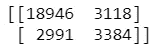
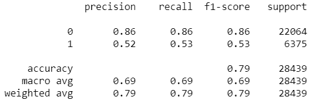

# 更高的准确性并不意味着更好的机器学习模型性能

> 原文：<https://towardsdatascience.com/greater-accuracy-does-not-mean-greater-machine-learning-model-performance-771222345e61?source=collection_archive---------40----------------------->

[马太·亨利](https://unsplash.com/@matthewhenry?utm_source=unsplash&utm_medium=referral&utm_content=creditCopyText)在 [Unsplash](https://unsplash.com/s/photos/shadow?utm_source=unsplash&utm_medium=referral&utm_content=creditCopyText) 上拍照

## 我们可以定量衡量机器学习模型的性能，但不仅仅是准确性，还有很多。

# 介绍

如果我们想要基于数据预测一些结果，我们将使用机器学习模型从数据中进行监督学习。如果我们想确保模型正确工作，我们必须定量地知道模型的性能如何。对于那些刚接触机器学习的人来说，他们只是依赖准确性。

准确性是指模型正确预测所有标签的程度。他们认为更高的精度意味着更好的性能。嗯，确实是这样，但是如果只是用准确性的话，就要小心了。精确度计算所有真实的预测值，但不针对每个存在的标注。

如果你的目标想要正确地预测一个特定的标签，例如一个正标签，这是一个严重的问题。更高的准确性并不意味着我们在预测特定标签上有很好的表现。为了解决这个问题，有许多度量标准，在分类问题中，有精确度、召回率、F1 值等。

让我来解释一下这些指标:

## 精确

> 精度描述了模型正确预测标签的程度。

## 回忆

> Recall 描述了模型如何正确检索所有标签。

## F1 分数

F1 分数是精度和召回率的乘积除以精度和召回率的和，然后加权 2 的比例。该指标结合了精确度和召回率。如果值变大，则模型越好。

> 建议使用此指标，因为它们仅指定了标签的一个值。

# 例子

基于这些指标，我们如何衡量它？好吧，我们可以先根据真实和预测标签做一个混淆矩阵。我使用 sklearn.metrics 库中的混淆矩阵函数创建了混淆矩阵，这是我预测明天是否下雨的项目。

如果你对我的项目感兴趣，你可以查看下面我的 GitHub，

 [## khalidmeister/我的项目

### permalink dissolve GitHub 是超过 5000 万开发人员的家园，他们一起工作来托管和审查代码，管理…

github.com](https://github.com/khalidmeister/my-projects/blob/master/DS1_Rain%20In%20Australia/code.ipynb) 

矩阵是这样显示的，

注意:左上是真正的否定，右下是真正的肯定。

在左上方，它代表真阴性的计数，在右上方代表假阳性(简单地说是错误阳性，实际上是阴性)，左下方代表假阴性(错误阴性，实际上是阳性)，最后，右下方代表真阴性的计数。有了这些值，我们就可以计算每个指标。在这种情况下，我们计算正面标签或明天下雨的度量。通过使用 sklearn.metrics 库中的 classification_report 函数，我们可以从这样的计算中获得概述。

可以看到，模型的准确率是 79%。如果观察真正值，模型的准确率为 52%，召回率为 53%。这不是一个好结果，因为模型不能正确预测“1”标签，而目标是预测该标签。

> 如果我们只使用准确性来衡量模型的性能，那么我们将无法实现预测标签的目标。这就是为什么我们应该使用另一个指标来支持准确性结果。

# 结论

总之，在我们制作模型时，我们应该检查现有的度量标准，而不仅仅是依赖于准确性。如果你只关注准确性，我们不确定该模型是否能很好地预测现有的某种标签。如果我们已经知道度量值是多少，我们就可以通过进行超参数调整、特征选择、特征工程，甚至对数据进行采样来制作一个平衡级数据集，从而改进模型。

## 感谢您阅读我的文章，您也可以在下面查看我以前的文章:

 [## 用 R 整理数据

### 为什么你应该在它上面投资更多，为什么这使你的分析变得容易得多

towardsdatascience.com](/tidy-data-with-r-f3d078853fc6)  [## 如果我有自己的时间，我会这样学习数据科学

### 感觉不知所措和筋疲力尽让我在释放数据科学技能方面表现不佳。这个…

towardsdatascience.com](/this-is-how-i-will-learn-data-science-if-i-got-back-my-own-time-e9148c909ce9)