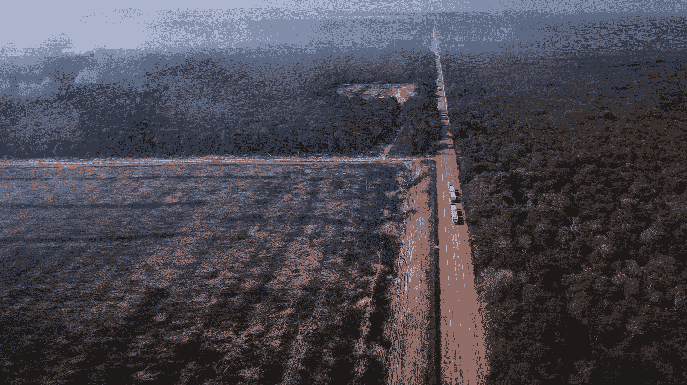
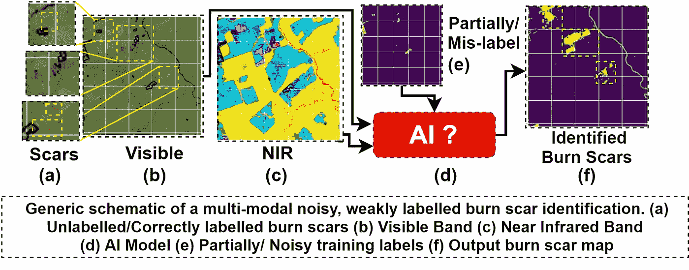
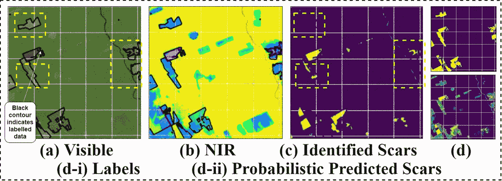
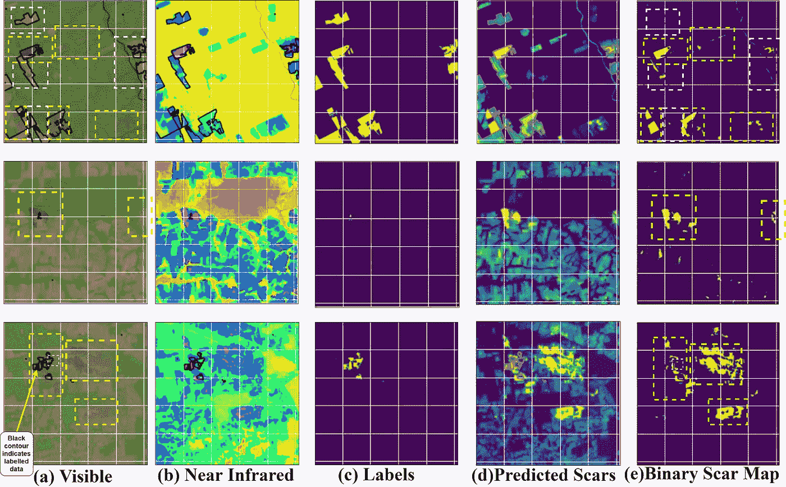
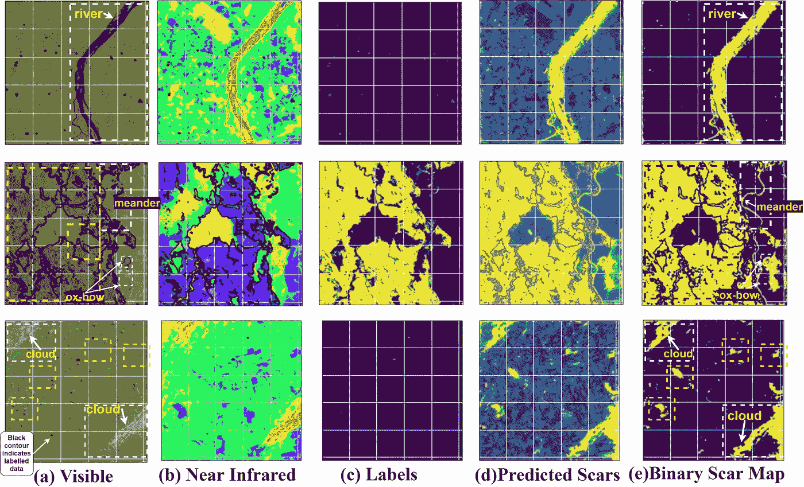

# 绿色是新的黑色:用人工智能拯救亚马逊雨林！

> 原文：<https://towardsdatascience.com/green-is-the-new-black-saving-amazon-rainforests-using-ai-ec0676564e9a?source=collection_archive---------43----------------------->

## [*新成果*](https://crcs.seas.harvard.edu/files/crcs/files/ai4sg_2020_paper_11.pdf) */拯救环境利用 AI /哈佛* [*AI 为社会造福*](https://crcs.seas.harvard.edu/event/ai-social-good-workshop?delta=0) */在 IEEE*[*SMC 2020*](http://smc2020.org/)

## *基于多模态噪声分割的亚马逊雨林碎片烧伤疤痕识别*

*亚马逊地区巴西北部帕拉 BR-163 高速公路附近的焚烧概述。经古斯塔沃·巴索许可使用，2019*

> *(已收)* ***萨蒂扬·莫赫拉*** *、西德哈斯·莫赫拉、阿努帕姆·古哈、比普拉·班纳吉；IEEE 国际系统会议，Man，&控制论(IEEE SMC’20)*
> 
> 对于各种灾害管理和生态学研究来说，探测由难以接近的雨林中的野火引起的烧伤痕迹是重要的。耕地景观的碎片化和不同的种植模式经常阻碍烧伤疤痕的精确测绘。遥感方面的最新进展和多式数据的提供为这一制图问题提供了一个可行的解决办法。然而，分割烧伤痕迹的任务是困难的，因为它与相似外观的土地模式难以区分，烧伤痕迹的严重碎片性质和部分标记的噪声数据集。在这项工作中，我们提出了 AmazonNET 一个基于卷积的网络，允许从多模态遥感图像中提取燃烧模式。该网络包括 UNet-一种众所周知的具有跳跃连接的编码器解码器类型的架构。提出的框架利用堆叠的 RGB-NIR 通道，通过对来自亚马逊的新的弱标记噪声数据集进行训练，来分割来自牧场的烧伤疤痕。我们的模型通过正确识别部分标记的烧伤疤痕并拒绝错误标记的样本，展示了优异的性能，证明了我们的方法是第一个在多模式烧伤疤痕识别中有效利用基于深度学习的分割模型的方法。

在亚马逊河流域，火与几种土地耕作方式联系在一起。刀耕火种是巴西农业中最常用的做法之一(作为称为“queimada”的季节循环的一部分)。无论是对于开辟和清理农业区，还是更新牧场，其在农业链条中的重要性是不可否认的。不幸的是，这通常是森林野火的原因。

亚马逊雨林是植物和数十亿吨碳的主要储存库，碳的释放会导致气温大幅上升。因此，最近亚马逊森林大火的消息引起了轩然大波和关注。

无法控制的火灾，尤其是在旱季，会对当地和区域产生重大影响，导致自然生物群落的破坏、动植物物种的灭绝、污染、侵蚀和碳循环的失衡。这种干扰也影响到农业生产。因此，许多环境研究和资源管理活动需要准确识别燃烧区域，以便在空间和时间上监测受影响区域(所谓的燃烧疤痕)，从而了解和评估这些区域的脆弱性，并促进可持续发展。

由于在区域和全球范围内火灾的地理范围很大，而且受火灾影响的地区的可及性有限，在过去几年里，遥感方法已成为具有成本效益的替代方法，能够以足够的空间和时间分辨率收集燃烧地区的信息。遥感技术可以为火灾管理、估计和探测、燃料测绘、野火后监测，包括燃烧面积和严重程度估计，提供有用的数据。

# **问题陈述**

当前的非深度学习方法严重依赖领域知识和用户的手动输入，并且不能从数据中提取抽象表示。深度学习试图解决这些问题，然而，由于普遍缺乏任何标记数据，它们在烧伤疤痕预测中仍然被忽视。

***在这项工作中，我们利用传感领域的最新进展，在遥感领域实现了无处不在的多模态数据和计算机视觉，利用有噪声的弱标记数据，通过 UNet 识别碎片化的烧伤疤痕，使我们的方法成为首批在多模态烧伤疤痕识别中利用基于深度学习的分割模型的方法之一。***

结果(更多信息见下文)

# 相关著作

## 语义分割

语义分割是计算机视觉中的一个重要问题。如果不同的像素属于同一个对象类，它就将这些像素聚集在一起。由于它们能够捕捉精确定位的语义上下文，它们已被用于自动驾驶、人机交互、诊断、遥感等各种应用中。

在 DNNs 出现之前，各种各样的特征被用于语义分割，如 K-means、梯度方向直方图、尺度不变特征变换等。今天，已经提出了许多编码器-解码器网络及其变体，如 SegNet。专业应用带来了新的改进，如用于医学图像分割的 UNet，用于精细分割的基于 CRFs 的网络。

## 遥感中的多模态数据

遥感中的多模态分割涉及利用各种策略来有效地组合包含在多模态中的信息，以生成有利于精确土地利用分类的单一、丰富、融合的表示。常用方法包括在输入阶段连接通道，连接从类似 CNN 的单峰网络提取的特征，以生成土地制图分割。最近的工作涉及更复杂的想法，如“交叉注意”,以融合多种形式，产生专注的光谱和空间表示。

## 烧伤疤痕鉴定

多模式数据的同时获得导致了最近在定位火灾和量化燃烧面积方面的进步。每种模式都提供了关于同一地理区域的辨别信息，有助于在不利条件下绘制地图，如光谱混淆(如由于云遮蔽)和烧伤疤痕的可变性，使区分植被变得困难。在这个领域中所做的大部分工作涉及诸如自相关、自组织映射、线性光谱混合模型、SVM、随机森林等方法。然而，最近的作品似乎都没有利用当前的深度学习方法，如 CNN 或 SegNet 或 UNet 等编码器-解码器模型，这可能是因为缺乏标记数据。

# 提议的方法

这项工作的目的是执行语义分割和识别烧伤疤痕利用空间光谱信息构成的可见光和近红外。

## 体系结构

在遥感中，由于缺乏良好的标记数据集，基于计算机视觉的方法很难应用，因为所需的数据处理和标记只能由现场专家完成，这使得标记数据很少或不可用。类似的问题也出现在医学图像分割中，因此遥感中的常用方法有时是从医学分割领域中得到启发的。对于烧伤疤痕分割任务，我们将我们的网络基于 UNet 架构，其中来自编码器的特征激活被存储并被传输到相应的解码器层用于连接。

**编码器:**编码器网络由 3×3 卷积层以及批量标准化层、ReLU 非线性激活层和 2×2 最大池层组成。
**解码器:**解码器网络由名为 UpPool 块的上采样层组成，它执行 3x3 Conv2DTranspose、3×3 卷积以及批归一化层和 Dropout2D 层，Dropout 2d 层的 drop out 值为 0.1。对输出结果进行阈值处理，以获得表示烧伤疤痕的二进制输出图。

## 数据集

该数据集由亚马逊雨林的 LANDSAT8 的可见光和近红外卫星图像组成。数据集是 2017 年和 2018 年从超过 4 个州(即托坎廷斯州、马兰豪州、马托格罗索州、帕拉州)获取的，覆盖了超过 4 个陆地巴西生物群落，即塞拉多、亚马逊、卡廷加和潘塔纳尔。它由 299 个样本 VISNIR 图像对组成，大小为 1024x1024，具有地面实况，是二进制图像，其中 1 表示森林中的烧伤疤痕，0 表示未受火灾影响的区域。从图中可以看出，地面真实是有噪声的，也是部分标记的，有时是错误标记的。该数据集由国家空间研究所(INPE)管理，是 Quiemadas 项目的一部分。

# 结果

结果:该网络正确地分割烧伤疤痕，拒绝错误标记的斑点，并正确地识别部分标记或未标记的样本。(a)可见通道(b)近红外通道(假彩色 hsv) (c)可用标签(包括部分/不正确的标签)(d)预测的烧伤疤痕(e)二元烧伤疤痕。(a)和(b)中黑色轮廓表示标记数据(c)的轮廓，以便于观察。黄色方框表示正确标记或未标记的烧伤疤痕。白色方框表示贴错标签/识别错误的烧伤疤痕

该模型的训练准确率为 69.51%，验证准确率为 63.33%。结果验证了利用基于 U-net 的分割在烧伤疤痕识别中的有效性。

可以看出，网络正确地识别未标记的碎片烧伤疤痕(表示为黄色虚线框)，并取消选择输出二进制图中错误标记的区域(表示为白色虚线框)(正确标记的输出突出显示为黄色，取消选择的标记为白色)。

分割烧伤疤痕中的小缺陷:网络错误地将河流、曲流、牛轭湖和云分割为烧伤疤痕。(a)和(b)中黑色轮廓表示标记数据(c)的轮廓，以便于观察。黄色方框表示正确标记或未标记的烧伤疤痕。白色方框表示贴错标签/识别错误的烧伤疤痕。缺陷归因于没有可用的分割标签和数据集中这些特征的可忽略的实例。

然而，我们的网络无法将河流和云的图案与烧伤疤痕区分开来，如下图所示。当我们的网络段(a)河流(b)蜿蜒曲折，牛轭湖和云作为烧伤疤痕模式时，缺陷出现。有趣的是，在图中的样本 2 和 3 中，网络如何准确地分割小的碎片状烧伤疤痕，但绝对不能拒绝这些疤痕。这可主要归因于(I)缺乏任何标记样本，以及(ii)数据集中包含上述地理特征的样本可忽略不计。

# 结论和未来工作

我们利用代表亚马逊雨林烧伤模式的部分/错误标记数据集，提出了基于 U-net 的分割网络，以正确识别烧伤疤痕并拒绝不正确的标签，证明了人工智能在碎片烧伤疤痕识别中的有效性。我们提出了不足之处，并考虑在未来的工作中解决这些问题。

> ***基于多模态噪声分割的亚马逊雨林碎片烧伤疤痕识别***
> 
> (已接受) ***萨蒂扬·莫赫拉*** 、西德哈特·莫赫拉、阿努帕姆·古哈、比普拉·班纳吉；IEEE 国际系统会议，Man，&控制论(IEEE SMC 2020)
> 
> (赠送) ***萨蒂扬·莫赫拉*** 、西德哈斯·莫赫拉、阿努帕姆·古哈；
> 哈佛 CRCS 人工智能公益工作坊 2020