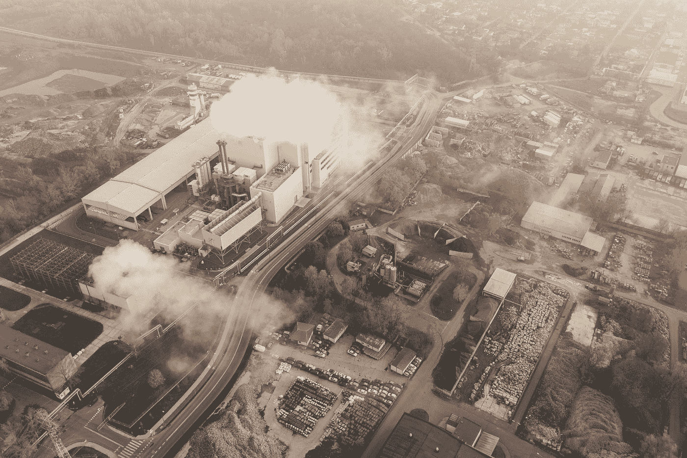

# 温室气体(CO2)排放和炼油

> 原文：<https://towardsdatascience.com/greenhouse-gas-co2-emissions-and-oil-refining-b13082469a0c?source=collection_archive---------37----------------------->

## 炼油厂在排放二氧化碳中扮演了多大的角色，哪些州是主要排放者？



[Marcin Jozwiak](https://unsplash.com/@marcinjozwiak?utm_source=medium&utm_medium=referral) 在 [Unsplash](https://unsplash.com?utm_source=medium&utm_medium=referral) 上拍摄的照片

我之前的[帖子](https://medium.com/@rangys3)已经使用 Python 可视化来探索美国各地的炼油能力。此外，我们分析了多年来原油和燃料价格的行为。

在这篇文章中，我将探讨一些其他的东西:炼油过程中的二氧化碳(CO2)排放。以下所有工作的来源数据来自美国环保署的温室气体报告项目，其数据在此公开[。](https://www.epa.gov/ghgreporting/ghg-reporting-program-data-sets)该数据由 2011 年至 2018 年 1210 个行业的 5441 家公司以公吨为单位的自我报告的二氧化碳当量排放量组成。

教育要点:二氧化碳当量是一种测量任何污染物排放量的方法。例如，1 吨二氧化碳当量意味着实际释放的气体量将使地球变暖，与释放 1 吨二氧化碳的量相同。

**TL/DR:发电产生的二氧化碳占排放到大气中的二氧化碳总量的 62%多一点，炼油和化学制品占第二位，为 9.6%。德克萨斯州、路易斯安那州和加利福尼亚州是主要的排放源，伊利诺伊州也是某些行业的主要排放源。**

炼油给人的印象是喷出烟雾和蒸汽的巨大结构。**但是**——与美国其他主要行业相比，炼油厂到底排放了多少二氧化碳？这些数字在各州之间是如何变化的？**就当前排放量而言，哪个行业提供的减排目标最大？**

首先，我要说明一个众所周知的观点，即理解二氧化碳排放非常重要，因为大气中的二氧化碳吸收辐射，并将热量截留在地球大气中。二氧化碳含量越高，储存在大气中的热量就越多，气温和一般天气干扰的增加就越大——也被称为全球变暖或气候变化。

首先，让我们使用下面的代码来生成一个条形图，以显示二氧化碳当量最高的行业。

```
fig = px.bar(ByIndustry, x='Latest Reported Industry Type (sectors)', y='%')
fig.update_xaxes(tickangle=45, tickfont=dict(family='Rockwell', size=14))
fig.update_layout(width=1000, height=500, title='% of emissions from various Industries')fig.add_annotation(x=31, y=62.38, font=dict(family="Courier New, monospace", size=18, color="black",),
            text="62.38% of emissions from Power Plants")fig.show()
```


图 1:趋势显示 2011-2018 年总排放量的 62%来自发电厂。炼油厂和化工厂远远低于

有趣的是，从 2011 年到 2018 年，电厂的排放量占总排放量的 62%多一点。相比之下，炼油和化学制品共占 9.1%的排放量，比这少了 85%。


图 2:显示最高排放行业的代码和表格

观察不同行业在排放二氧化碳当量中扮演的角色是很有趣的。这在各州之间有何不同？请看下面的动态图表，该图表分析了 2018 年各州对以上列表中指定行业的排放贡献:


图 3:显示美国各行业 2018 年排放数据的动态曲线图

## 美国 2018 年排放数据的关键要点:

*   得克萨斯州 T2 发电厂 T3 排放的二氧化碳当量达到峰值，为 1 . 85 亿吨。佛罗里达州和印第安纳州分别以 8400 万吨和 8100 万吨位居第二。
*   **炼油厂和化工**怎么样？德克萨斯州以 3800 万吨二氧化碳当量再次领先，路易斯安那州以 2800 万吨二氧化碳当量排名第二，这与 choropleth 在我的炼油厂产能[文章](https://medium.com/@rangys3/u-s-refinery-processing-over-the-years-ee97179dc938)中显示的 2019 年 1 月炼油厂产能的信息相符。
*   工业气体**和矿物**行业提供了思考的食粮。就背景而言，矿物是采矿业务的一部分，而工业气体则包括为其他业务制造常用气体，如氮气、二氧化碳、氩气、氢气和氦气。****

肯塔基州每年排放大约 100 万吨工业气体，而路易斯安那州和印第安纳州紧随其后，每年排放略多于 70 万吨。与此同时，德克萨斯州、密苏里州和伊利诺伊州是采矿业的主要排放者

这里的底线是，许多国家和许多行业在向大气排放二氧化碳方面发挥了作用，而发电是减排潜力最大的行业。

这一结论在美国环保署收集温室气体数据的 2011-2018 年间保持稳定。如下图 4 所示，这一时间范围内没有任何特定年份改变上述叙述。事实上，在这 7 年里，任何行业的排放情况都没有显著变化。


图 4:从 2011 年到 2018 年，发电厂提供了二氧化碳当量排放量的最大份额。这在 2011 年和 2018 年之间不会改变。

让我们开始改变思路，考虑炼油过程中的减排。

我之前讨论过将原油转化为汽油、喷气燃料、柴油等的炼油经济。炼油厂是如何做到这一点的？它通过使用各种**精炼工艺单元**来实现，其中主要有:加氢裂化器、流化催化裂化器(FCCs)、重整器和延迟焦化器。

这是许多新术语，我们将在接下来的几篇文章中深入探讨机器学习算法如何帮助优化这些不同单位的盈利能力和排放之间的平衡。

一如既往，我欢迎对这篇文章或其他文章的任何反馈或问题。支持本文分析的回购是[此处](https://github.com/Ranga2904/Refining-GHGEmissions)。