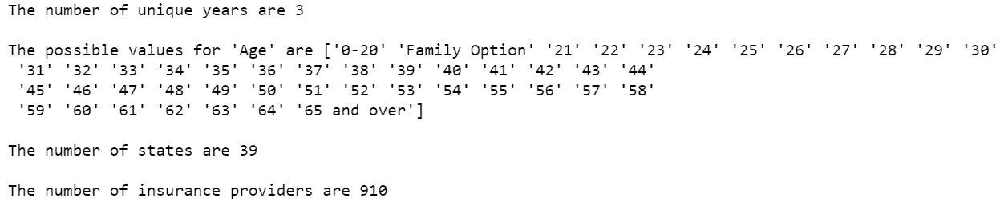
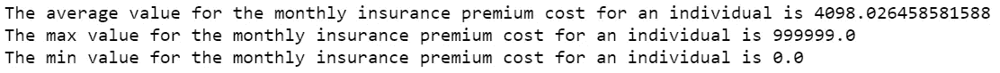
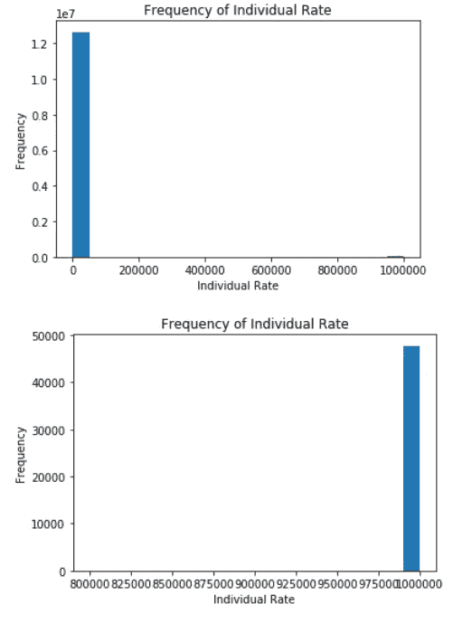
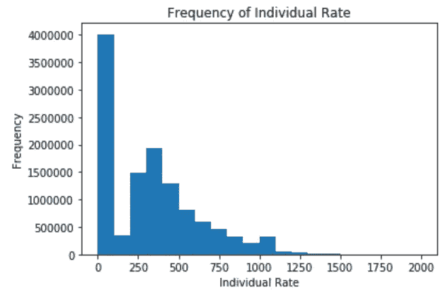
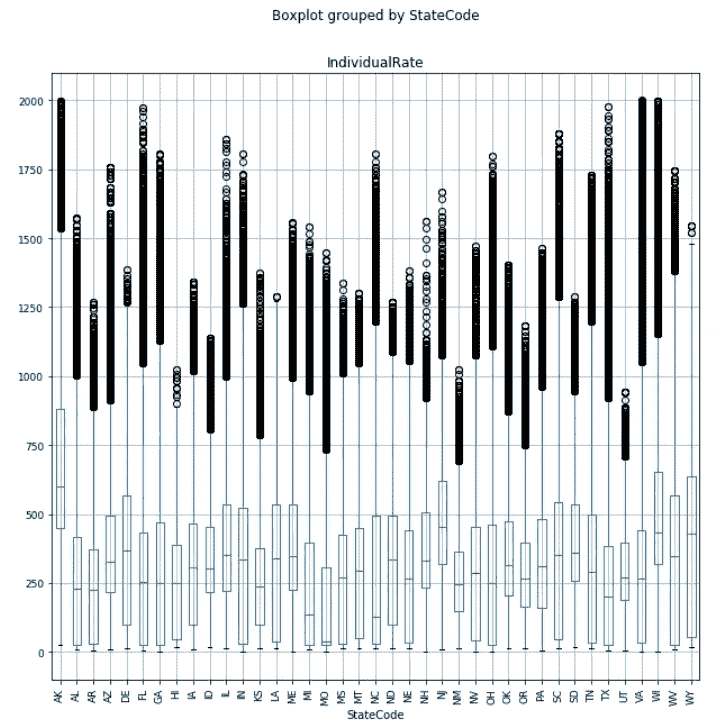
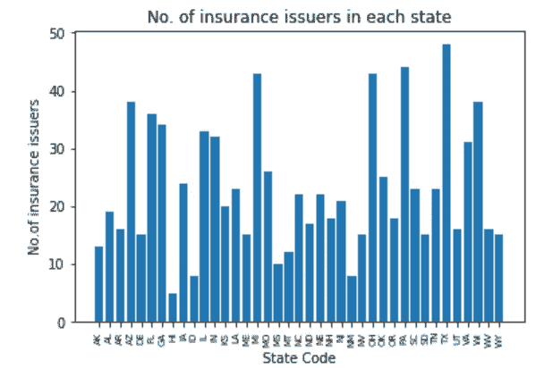
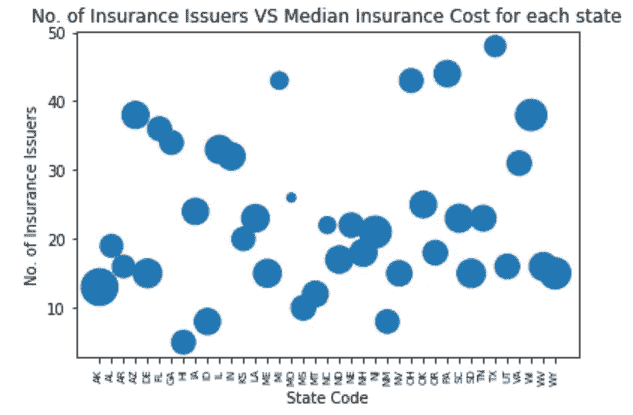
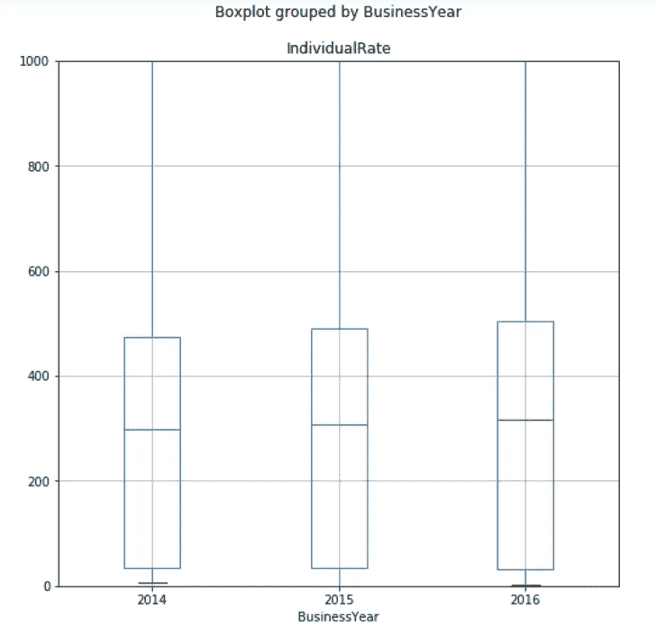
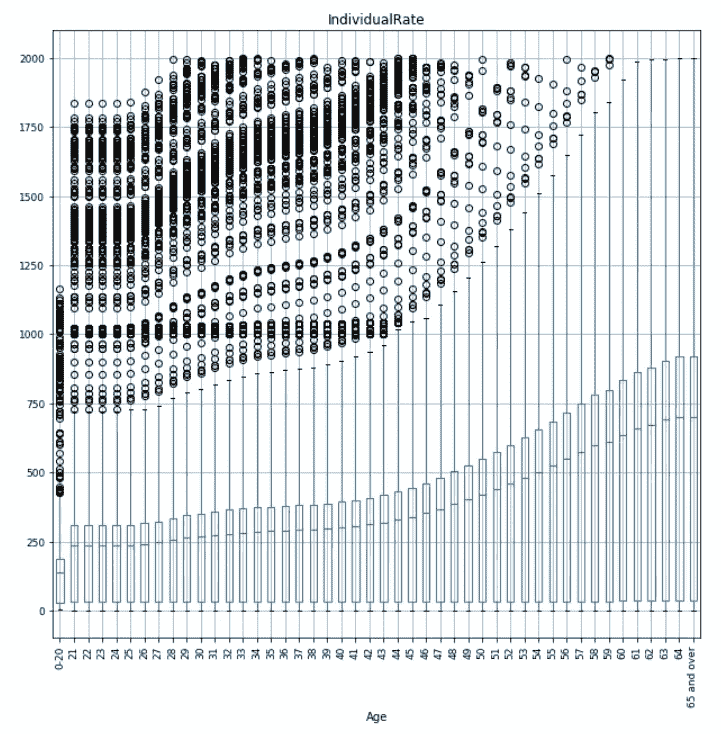

# Python 中大数据探索性数据分析

> 原文：<https://towardsdatascience.com/grexploratory-data-analysis-on-big-data-in-python-5ab0f99818d8?source=collection_archive---------30----------------------->

## [理解大数据](https://towardsdatascience.com/tagged/making-sense-of-big-data)

## 探索和收集 1200 万份美国健康保险市场数据的见解


由[路易斯·梅伦德斯](https://unsplash.com/@lcma1028?utm_source=medium&utm_medium=referral)在 [Unsplash](https://unsplash.com?utm_source=medium&utm_medium=referral) 上拍摄

在我之前的[文章](/graphical-approach-to-exploratory-data-analysis-in-python-be4fa005a57f)中，我们探索了 Python 中执行探索性数据分析(EDA)的图形化方法。会上讨论了折线图、回归线和奇特的运动图，讨论了如何利用它们来收集关于教育数据中的人口、收入和性别平等的见解。然而，数据相对较小，大约 200 行。在本帖中，我们将探索大约 1200 万条记录的更大数据，并研究在 Python 中执行 EDA 的其他方法。

# 资料组

我们将使用的数据集包含通过美国健康保险市场向个人和小型企业提供的健康和牙科计划的数据。它最初是由[医疗保险中心&医疗补助服务(CMS)](https://www.cms.gov/cciio/resources/data-resources/marketplace-puf) 准备和发布的，随后发表在 Kaggle 上。我们被告知数据包含 7 列:

1.  **商业年度** —计划为注册人提供保险的年份
2.  **州代码** —两个字符的州缩写，表示提供计划的州
3.  **IssuerId** —在健康保险监督系统(HIOS)中标识发行机构的五位数字代码
4.  **计划 id**—14 个字符的字母数字代码，用于标识 HIOS 境内的保险计划
5.  **年龄** —订户年龄是否用于确定保险计划费率资格的分类指标
6.  **个别费率** —适用于某一费率区内保险计划的非烟草用户，或无烟草偏好的普通订户的每月保险费成本的美元值
7.  **individual tobacco correct**——适用于烟草用户在评级区域的保险计划的每月保险费成本的美元值

让我们将数据加载到 Python 中，并进行一些简单的初步探索。

```
import pandas as pd
insurance= pd.read_csv('./InsuranceRates.csv')# How many rows and columns are there?
print("The number of rows and columns are " + str(insurance.shape))
```


作者提供的图片— Jupyter 笔记本输出的数据形状

正如前面提到的，这个数据集非常大，它包含 12694445 行和前面讨论的 7 列。让我们看看一些数据列的唯一值。

```
# How many years does the data cover?
print("The number of unique years are " + str(insurance.BusinessYear.nunique()) + '\n')# What are the possible values for 'Age'?
print("The possible values for 'Age' are " + str(insurance.Age.unique()) + '\n')# How many states are there?
print("The number of states are " + str(insurance.StateCode.nunique()) + '\n')# How many insurance providers are there?
print("The number of insurance providers are " + str(insurance.IssuerId.nunique()) + '\n')
```



按作者分类的图像— Jupyter 笔记本在数据列上的输出

我们知道这些数据涵盖了 3 年的数据，美国 39 个州和总共 910 家保险提供商。年龄组从 21 岁到 64 岁不等，另外三个类别为“0-20 岁”、“家庭选项”和“65 岁及以上”。让我们看看个人每月支付的保险费的平均金额，以及最高和最低值。

```
# What are the average, maximum and minimum values for the monthly insurance premium cost for an individual? 

print("The average value for the monthly insurance premium cost for an individual is " + str(insurance.IndividualRate.mean()))
print("The max value for the monthly insurance premium cost for an individual is " + str(insurance.IndividualRate.max()))
print("The min value for the monthly insurance premium cost for an individual is " + str(insurance.IndividualRate.min()))
```



作者提供的图片— Jupyter 笔记本输出的保险费平均值/最大值/最小值

个人每月保险费成本的平均值为 4098.03 美元，最大值为 999999 美元，最小值为 0 美元。这些值似乎不合理，因为最大值太高，接近每月一百万美元，而最小值不可能是 0 美元。显然，这似乎表明该数据集中可能存在一些数据错误。

# 调查个人保险成本

由于我们发现个人保险费成本似乎不合理，让我们通过首先绘制一个直方图(使用 Python `matplotlib`)来显示分布来更详细地探究它。

```
# plotting the histogram over the whole range
plt.hist(insurance.IndividualRate,bins=20)
plt.xlabel('Individual Rate')
plt.ylabel('Frequency')
plt.title('Frequency of Individual Rate')
plt.show()# plotting the histogram from 800000 to 1000000
plt.hist(insurance.IndividualRate,bins=20,range=(800000,1000000))
plt.xlabel('Individual Rate')
plt.ylabel('Frequency')
plt.title('Frequency of Individual Rate')
plt.show()
```



按作者分类的图像—保险费直方图上的 Jupyter 笔记本输出

如前一节所述，我们发现大约有 48000 人每月支付接近 100 万澳元的保险费。

由于 1200 万中的 48000 只占数据的 0.4%，所以我们把它们去掉，专注于剩下的数据(即保险费少于 2000 美元)。

```
# filter data to those premium below $2000
insurance=insurance[(insurance.IndividualRate>0) & (insurance.IndividualRate<=2000)]# Generate a new histogram with a larger number of bins (say 200).
plt.hist(insurance.IndividualRate,bins=20)
plt.xlabel('Individual Rate')
plt.ylabel('Frequency')
plt.title('Frequency of Individual Rate')
plt.show()
```



按作者分类的图片— Jupyter 笔记本在保险费直方图上的输出(≤2000 美元)

我们看到直方图现在显示了更清晰的分布，有 15 个不同的组，即 0–100、100–200、200–300、300–400、400–500、500–600、600–700、700–800、800–900、900–1000、1000–1100、1100–1200、1200 接近 4000000 英镑的大多数人支付 0-100 英镑，少数人支付 1300-1500 英镑。

# 各州保险费的差异

将我们的数据过滤到更准确、更合理的保险费范围后，现在让我们使用箱线图来探索美国 39 个不同州的保险费成本是如何变化的。

```
# rotate the axis and set a bigger figsize to ease reading
insurance.boxplot(column = 'IndividualRate', by = 'StateCode',rot=90,fontsize=9,figsize=(10,10))
```



作者图片 Jupyter 笔记本输出的各州保险费箱线图

从箱线图中，我们知道 MO 的保险费率中值最低，而 AK 的保险费率最高。

让我们看看各州的保险公司数量是否也有所不同。请注意，我们需要进行一些数据聚合(即分组)，然后才能在条形图中绘制数据。

```
# aggregate the data to find the number of insurance companies by state
groupbystate = insurance.groupby('StateCode').agg({'IssuerId':{'companies_count':'nunique'}})
groupbystate=groupbystate.reset_index()
groupbystate.columns=groupbystate.columns.droplevel(0) 
groupbystate.rename(columns = {'':'StateCode'},inplace = True)plt.bar(groupbystate.StateCode,groupbystate.companies_count)
plt.title('No. of insurance issuers in each state')
plt.xlabel('State Code')
plt.ylabel('No.of insurance issuers')
plt.xticks(rotation=90,fontsize=7)
plt.show()
```



按作者分类的图片— Jupyter 笔记本输出在各州保险发行商的条形图上

从柱状图中，我们知道各州的保险发行人数量差异很大。HI 最低为 4，TX 最高为 48。

从这两个图表中，一个合乎逻辑的问题是，竞争会影响每个州的保险费吗？拥有更多的保险提供商可能会导致较低的保险费率，而在该州拥有较少的保险提供商可能会导致较高的保险费率。让我们使用散点图来探索这种可能的关系。我们首先需要汇总数据(即使用 groupby)以获得每个州的保险费成本中值。

```
# Use a scatterplot to plot the number of insurance issuers against the median insurance cost for each state.
# Aggregate the data to find number of insurance issuers and median cost for each state
groupbystate2 = insurance.groupby('StateCode').agg({'IssuerId':{'companies_count':'nunique'},'IndividualRate':{'median_cost':'median'}})
groupbystate2=groupbystate2.reset_index()
groupbystate2.columns=groupbystate2.columns.droplevel(0) 
groupbystate2.rename(columns = {'':'StateCode'},inplace = True)plt.scatter(groupbystate2.StateCode,groupbystate2.companies_count,s=groupbystate2.median_cost)
plt.title('No. of Insurance Issuers VS Median Insurance Cost for each state')
plt.xlabel('State Code')
plt.ylabel('No. of Insurance Issuers')
plt.xticks(rotation=90,fontsize=7)
plt.show()
```



按作者分类的图片 Jupyter 笔记本输出各州保费中位数散点图

从散点图来看，保险中值成本和保险公司数量之间通常没有明确的关系。保险发行人数量较少的州仍会导致较低的中值利率(用圆圈大小表示)。同样，拥有大量保险发行人的州仍然会导致中值利率较高。

# 保险费随时间的变化

请记住，我们的数据包含三年的数据，让我们使用箱线图来探索保险费是否会随着时间的推移而变得更贵。

```
insurance.boxplot(column='IndividualRate',by='BusinessYear')
plt.ylim(0, 1000)
```



按作者分类的图片— Jupyter 笔记本电脑在一段时间内的保费箱线图输出

如箱线图所示，中位数(用绿线表示)在这些年中略有增加，这意味着这些年来保险单变得稍微贵了一些。

# 保险费随年龄的变化

在现实世界中，我们知道一个人年龄越大，他/她就越容易发生事故或健康疾病，这意味着保险公司需要收取更高的保险费率。最后，让我们用箱线图来研究保险人的年龄是否对保险费成本有影响。请注意，我们必须过滤掉“家庭选项”,因为它无法根据年龄进行衡量。

```
# Filter out 'Family Option' in order to plot boxplot
temp_insurance=insurance[(insurance.Age!='Family Option')]
temp_insurance.boxplot(column='IndividualRate',by='Age',rot=90,fontsize=9,figsize=(10,10))
```



按作者分类的图片— Jupyter 笔记本输出的各年龄段保费箱线图

箱线图与我们之前在现实世界中讨论的一致。很明显，保险费成本随着被保险人的年龄而增加，因为我们可以看到中间值在整个时间段内不断增加。因此，将老年人(65 岁及以上)与年轻人(0-20 岁)进行比较，老年人支付的保险费用中位数比年轻人高，老年人每月的差额约为 700-150 = 550 英镑。

# 摘要

继上一篇[文章](/graphical-approach-to-exploratory-data-analysis-in-python-be4fa005a57f)之后，这篇文章进一步讨论了如何使用箱线图、散点图和条形图从我们的数据中发现洞见。还要注意，这个数据比前一个大得多，但是肯定的是，这不会影响在 Python 上构建这些可视化的处理时间。希望你们已经用这种新的图形化方法在 Python 中做探索性数据分析时找到了一些替代方法。感谢阅读！

[](https://www.buymeacoffee.com/tankahwang)