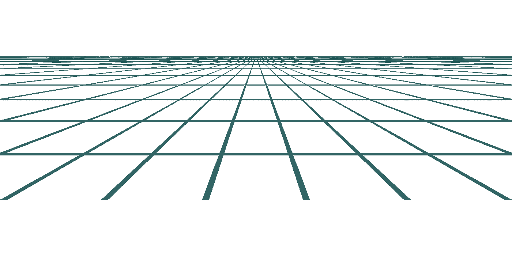
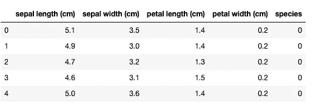
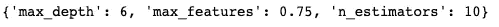
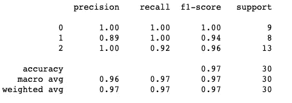
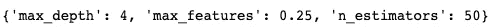
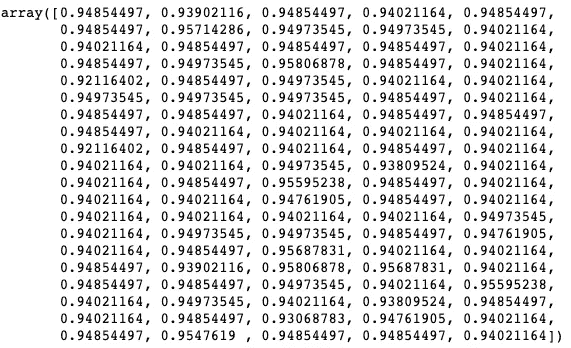

# 参数调整的网格搜索

> 原文：<https://towardsdatascience.com/grid-search-for-parameter-tunning-3c6ff94e7a25?source=collection_archive---------39----------------------->

## 学习这个简单易行的技术来调整你的机器学习模型


图片由 [PollyDot](https://pixabay.com/users/pollydot-160618/?utm_source=link-attribution&utm_medium=referral&utm_campaign=image&utm_content=337695) 来自 [Pixabay](https://pixabay.com/?utm_source=link-attribution&utm_medium=referral&utm_campaign=image&utm_content=337695)

**简介**

一旦你建立了一个机器学习模型，你会想要调整它的参数以获得最佳性能。每个数据集的最佳参数是不同的，因此它们需要调整，以便算法可以获得其最大潜力。

我见过很多初学数据的科学家用手做参数调优。这意味着运行模型，然后在笔记本中更改一个或多个参数，等待模型运行，收集结果，然后一次又一次地重复这个过程。通常，人们会在途中忘记哪些参数是最好的，他们需要重新做一次。

一般来说，上述策略并不是最高效的。幸运的是，由于 sci-kit learn library 的作者添加了 GridSeachCV，这个过程可以很容易地自动化。

**什么是 GridSearchCV？**



图片来自 [Pixabay](https://pixabay.com/?utm_source=link-attribution&utm_medium=referral&utm_campaign=image&utm_content=1548260) 的 [Nicolás Damián Visceglio](https://pixabay.com/users/ndv-2997446/?utm_source=link-attribution&utm_medium=referral&utm_campaign=image&utm_content=1548260)

GridSearchCV 是我上面描述的简单方法的替代方法。不用手动调整参数并多次重新运行算法，您可以列出您希望算法尝试的所有参数值，并将其传递给 GridSeachCV。

GridSearchCV 将尝试这些参数的所有组合，使用交叉验证和您提供的评分标准来评估结果。最终它会吐槽出最适合你数据集的参数。

GridSearchCV 可以与 sci-kit learn 库中的任何监督学习机器学习算法一起使用。如果你提供一个合适的度量标准，它将同时适用于回归和分类。

让我们用一个真实的例子来看看它是如何工作的。

**GridSearchCV 代码示例**

为了说明，让我们加载虹膜数据集。这个数据集有三种不同鸢尾物种的 150 个例子。数据集没有缺失值，因此不需要清理数据。

```
from sklearn.datasets import load_iris
import pandas as pd
%matplotlib inlinedata = load_iris()
df = pd.DataFrame(data['data'], columns=data['feature_names'])
df['species'] = data['target']
df.head()
```



现在让我们将数据集划分为训练和测试。

```
from sklearn.model_selection import train_test_split
x_train, x_test, y_train, y_test = train_test_split(df.drop('species', axis=1), df.species ,test_size = 0.2, random_state=13)
```

一旦我们划分了数据集，我们就可以用我们选择的算法建立网格搜索。在我们的例子中，我们将使用它来调整随机森林分类器。

```
from sklearn.model_selection import GridSearchCV
from sklearn.ensemble import RandomForestClassifierrfc = RandomForestClassifier()grid_values = {'n_estimators': [10, 30, 50, 100],
               'max_features': ['sqrt', 0.25, 0.5, 0.75, 1.0],
               'max_depth' : [4,5,6,7,8],
              }grid_search_rfc = GridSearchCV(rfc, param_grid = grid_values, scoring = 'accuracy')
grid_search_rfc.fit(x_train, y_train)
```

在上面的代码中，我们首先通过使用不带参数的构造函数来设置随机森林分类器。然后，我们定义参数以及 grid_values 变量中每个参数的值。“grid_values”变量随后被传递给 GridSearchCV，同时传递的还有随机森林对象(我们之前已经创建过)和评分函数的名称(在我们的例子中是“accuracy”)。最后，我们通过调用网格搜索对象上的 fit 函数来拟合它。

现在为了找到最佳参数，可以使用 best_params_ attribute:

```
grid_search_rfc.best_params_
```



使用 max_features 参数的 75 %的特征并使用 10 个估计器，我们得到了具有六层深度的树的最高准确度。

这比手动尝试所有参数要容易得多。

现在，您可以使用网格搜索对象，使用最佳参数进行新的预测。

```
grid_search_rfc = grid_clf_acc.predict(x_test)
```

并在测试集上运行分类报告，以查看模型在新数据上的表现。

```
from sklearn.metrics import classification_report
print(classification_report(y_test, predictions))
```



您可以看到所有类别的准确度、召回率、精确度和 f 分数的详细结果。

请注意，我们使用精确度来调整模型。这可能不是最好的选择。我们实际上可以使用其他指标，如精确度、召回率和 f 值。让我们开始吧。

```
from sklearn.metrics import make_scorer, accuracy_score, precision_score, recall_score, f1_scorescoring = {'accuracy': make_scorer(accuracy_score),
           'precision': make_scorer(precision_score, average = 'macro'),
           'recall': make_scorer(recall_score, average = 'macro'),
           'f1': make_scorer(f1_score, average = 'macro')}grid_search_rfc = GridSearchCV(rfc, param_grid = grid_values, scoring = scoring, refit='f1')
grid_search_rfc.fit(x_train, y_train)
```

在上面的代码中，我们设置了四个评分标准:准确度、精确度、召回率和 f-score，我们将它们存储在列表中，稍后作为评分参数传递给 grid search。我们还将 refit 参数设置为等于评分函数之一。这是 f-score 是我们的情况。

一旦我们运行它，我们可以获得 f-score 的最佳参数:

```
grid_search_rfc.best_params_
```



此外，我们可以使用 cv_results_ attribute 来了解有关 grid_search 设置的更多信息。

```
grid_search_rfc.cv_results_
```

如果您想查看其他指标的结果，可以使用 cv _ results[' mean _ test _【T0]']。因此，为了获得我们之前设置为评分函数之一的召回结果，您可以使用:

```
grid_search_rfc.cv_results_['mean_test_recall']
```



上面我们可以看到网格搜索参数组合的所有召回值。

**GridSearchCV 缺点**

你有没有注意到所有召回结果的清单很长？它实际上有 100 个元素。这意味着 grid 已经尝试了 100 种不同的参数组合。这非常多，而且非常耗时，尤其是在大型数据集上。

在我们的例子中，grid search 对 100 个不同的随机森林设置进行了五重交叉验证。想象一下，如果我们有更多的参数要调整！

GridSearchCV 有一个替代方案叫做 RandomizedSearchCV。它不是尝试所有参数，而是只从给定分布中采样参数的子集，因此可能更快更有效。

**总结**

在本文中，您了解了如何使用网格搜索来优化参数调整。是时候在不同的数据集上使用不同的模型而不是随机森林来尝试您新获得的技能了。编码快乐！

*最初发布于 aboutdatablog.com:* [学习如何使用网格搜索进行参数整定](https://www.aboutdatablog.com/post/learn-how-to-use-grid-search-for-parameter-tunning)，*2020 年 10 月 8 日。*

*PS:我正在 Medium 和*[***aboutdatablog.com***](https://www.aboutdatablog.com/)*上撰写以简单易懂的方式解释基本数据科学概念的文章。你可以订阅我的* [***邮件列表***](https://medium.com/subscribe/@konkiewicz.m) *在我每次写新文章的时候得到通知。如果你还不是中等会员，你可以在这里加入*[](https://medium.com/@konkiewicz.m/membership)**。**

*下面还有一些你可能喜欢的帖子*

*[](/9-things-you-did-not-know-about-jupyter-notebook-d0d995a8efb3) [## 关于 jupyter 笔记本你不知道的 9 件事

### 用这些建议提高你的工作效率

towardsdatascience.com](/9-things-you-did-not-know-about-jupyter-notebook-d0d995a8efb3) [](/best-data-science-books-be1ab472876d) [## 最佳数据科学书籍

### 帮助您学习数据科学的前三本书

towardsdatascience.com](/best-data-science-books-be1ab472876d) [](/medium-writers-you-should-follow-as-an-aspiring-data-scientist-13d5a7e6c5dc) [## 作为一名有抱负的数据科学家，你应该关注的中型作家

### 我最喜欢的 10 个数据科学博主，让你的学习之旅更轻松。

towardsdatascience.com](/medium-writers-you-should-follow-as-an-aspiring-data-scientist-13d5a7e6c5dc)*