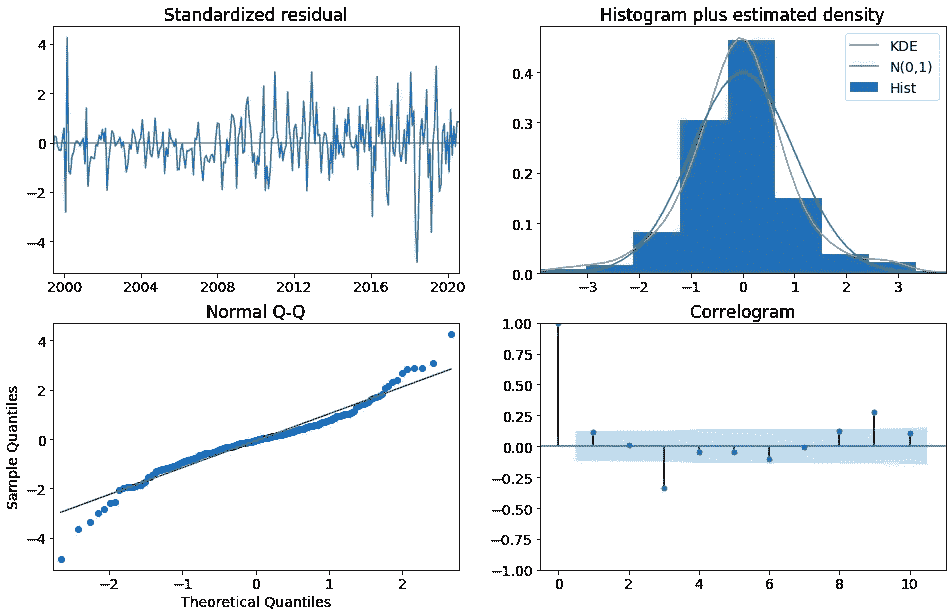
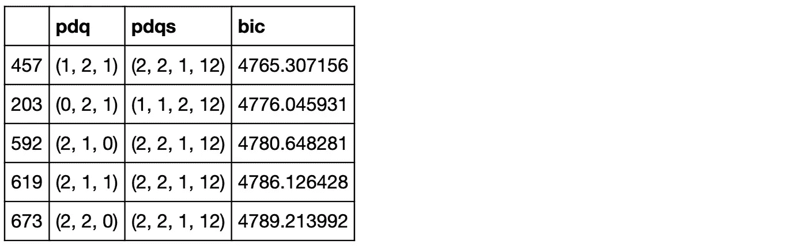
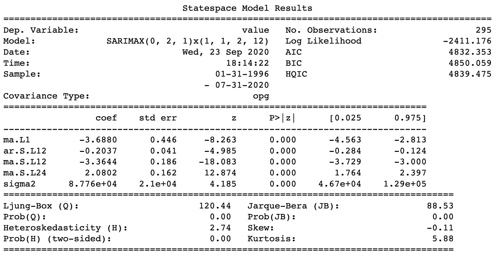

# SARIMAX 参数的网格搜索

> 原文：<https://towardsdatascience.com/grid-search-for-sarimax-parameters-adbd5104cb8b?source=collection_archive---------9----------------------->

## [实践教程](https://towardsdatascience.com/tagged/hands-on-tutorials)

## 为 statsmodels SARIMAX 模型找到最佳参数的简单方法

作者图片

如果您已经在这里登陆，那么您很可能正在实现一个 statsmodels SARIMAX 时间序列模型，并且您正在寻找一种简单的方法来识别所有最佳参数。我有一些好消息要告诉你…你来对地方了！

> 在本教程中，您将学习如何运行简单的网格搜索来为 statsmodel SARIMAX 时间序列模型查找最佳参数。或者您可以直接复制并粘贴代码——甚至更简单！

对于我们的 SARIMAX 模型，总共有七个子参数，单独计算它们并不容易。然而，通过几行简单的代码，我们可以创建一个定制的网格搜索，给出一个最优参数列表，按照用户选择的选择标准(AIC 或 BIC)排序。

## 选择标准

让我们从选择标准开始。这里的两个选择是 AIC 和 BIC。它们分别代表阿凯克信息准则和贝叶斯信息准则。他们选择用最少的独立变量解释最大变化的模型。[1]他们计算的方法是使用最大似然估计(MLE ),他们都惩罚一个增加变量数量以防止过度拟合的模型。

围绕哪一个最好用，有很多讨论。BIC 会因为一个模型有越来越多的变量而加大对它的惩罚力度。如果在未来的数据集或模型将应用的多个数据集中有更多的变化，那么我推荐使用 BIC。就像我在这里一样。然而，并没有很大的区别，AIC 也很普通，所以真正的选择权在你。

## SARIMAX 参数

SARIMAX 是时间序列模型中的佼佼者。在进行时间序列建模时，它基本上考虑了所有可以考虑的因素。

> 我们将在这里对参数进行简单直观的解释。

**S——代表季节性。**这意味着数据表现出季节性。这样的例子可能是一年中的季节，因此给定位置的温度波动将根据季节而变化，通常夏天更暖和，冬天更凉爽。如果我们有月平均值的数据，那么“S”就是 12。*在我们的模型中用“s”来表示。*

**AR —代表自回归**。这是数据在任何给定的时间间隔或之前的时期与之前的数据的相似程度。简单来说，它代表数据中的重复模式。自回归是指数据在之前数据的某个滞后期内回归，并找到回归最强的地方，代表数据中的模式。*在我们的模型中表示为“p”。*

**I—代表集成的**。“I”表示数据值已被替换为其值与先前值之间的差值。[2] *在我们的模型中用“d”来表示。*

**MA——代表移动平均线。**此术语计算给定周期数的移动平均值。它用于减少模型中的噪波或使其平滑。移动平均周期越长，噪声就越平滑。*在我们的模型中表示为“q”。*

**X —代表外源性。**这考虑了一个已知的外部因素。在我们的模型中，这是一个可选的参数，而不是一个参数。是我们可以添加到模型中的一系列外生回归变量。这部分是可选的，在计算我们的最佳模型参数时不是必需的。

在我们的模型中，我们的参数如下所示:

**SARIMAX (p，D，q) x (P，D，Q，s)**

statsmodel SARIMAX 模型考虑了常规 ARIMA 模型(P，D，Q)以及季节性 ARIMA 模型(P，D，Q，s)的参数。这几组参数是我们的模型中的参数，分别称为订单和季节订单。

> 现在是有趣的部分——让我们编码吧！

以下是运行网格搜索以找到 statsmodel SARIMAX 模型的最佳参数所需的所有代码。

这是输出的样子！

作者图片

对于我的模型，当我将预测值与已知值进行比较时，二阶组合的 BIC 略高，但 RMSE(均方根误差)较低。为此，我选择用列出的二阶组合来构建我的模型。

下面是我们如何从上面的参数网格搜索中获取结果，并构建我们的模型！在此代码中，我们将:

*   建立我们的模型
*   打印摘要
*   绘制诊断图

这是我们的汇总输出的样子！

作者图片

我们可以看到这个模型的所有参数都很重要。情况并非总是如此，这些数据没有太多的可变性。

这是我们的输出图诊断的样子！

作者图片

我们找到了。

我希望这个教程对你有用。一如既往，欢迎在评论中问我任何问题。

## 参考

*   [1][https://www . scribbr . com/statistics/a kaike-information-criterion/](https://www.scribbr.com/statistics/akaike-information-criterion/)
*   [2][https://en . Wikipedia . org/wiki/auto regressive _ integrated _ moving _ average](https://en.wikipedia.org/wiki/Autoregressive_integrated_moving_average)
*   [3][https://www . stats models . org/dev/generated/stats models . TSA . statespace . sarimax . sarimax . html](https://www.statsmodels.org/dev/generated/statsmodels.tsa.statespace.sarimax.SARIMAX.html)

## 使用的软件

*   计算机编程语言
*   Jupyter 笔记本