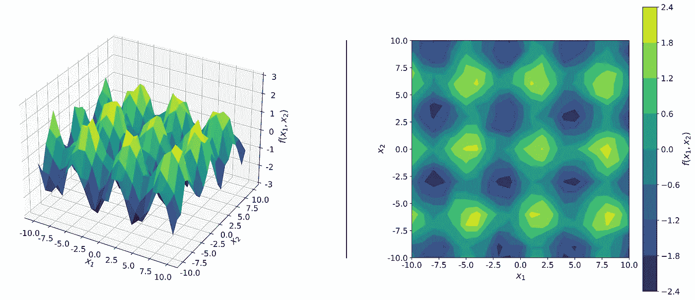
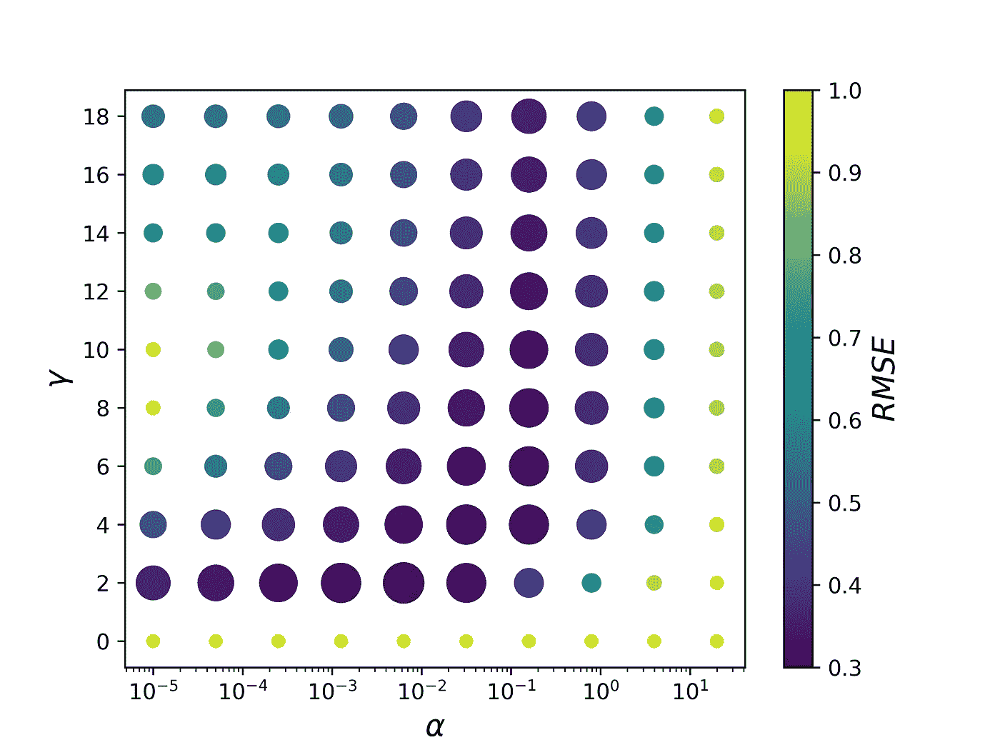

# Python 中的网格搜索—超参数调整

> 原文：<https://towardsdatascience.com/grid-search-in-python-from-scratch-hyperparameter-tuning-3cca8443727b?source=collection_archive---------7----------------------->

图片由 [JPuckett Design](https://linktr.ee/jpuckett_design) 在 [Instagram](https://www.instagram.com/jpuckett_design/) 上提供。

超参数调整对于机器学习(ML)模型的正确运行至关重要。网格搜索法是超参数优化的基本工具。

网格搜索方法考虑几个超参数组合，并选择返回较低错误分数的一个。当只有几个超参数需要优化时，这种方法特别有用，尽管当 ML 模型变得复杂时，这种方法优于其他加权随机搜索方法。

本文介绍了用**网格搜索**进行**超参数调整**的思想。您将学习网格搜索如何工作，以及如何实现它来优化您的机器学习方法的性能。

提供代码片段有助于理解实现。完整的代码可以在这个 [GitHub 库](https://github.com/marcosdelcueto/Tutorial_Grid_Search)中找到。

> 网格搜索提供了一种调整 ML 模型超参数的直观方法，对于低维空间非常有效。

# 网格搜索概述

1-准备数据库。

2-确定要优化的模型超参数，然后选择要测试的超参数值。

3-评估超参数网格中每个组合的误差分数。

4-选择具有最佳误差度量的超参数组合。

# 生成数据

一个数据库由一系列特征***x***:{***x*******x****₂,…，****x****ₙ*}和一个或多个目标属性**y**:{*f₁(* ****f₂(***x****₁、****x****₂,…、****x****ₙ)、…、fₙ(****x****₁、******

**在我们的例子中，我们将使用一个简单的数据库，有两个描述符***x***:{***x****₁，****x****₂*}和一个目标属性**y**:{*f(****x****₁，* ***x*****

**作为一个例子，我们将使用遵循二维函数*f(****x****₁、****x****₂)=sin(****x****₁)+cos(****x****₂】*的数据，加上区间(-0)中的小的随机变化因此，我们的数据将遵循以下表达式:**

***f(****x****₁，****x****₂)= sin(****x****₁)+cos(****x****₂)+rnn***

**我们在区间***x****₁*:10，10 和***x****₂*:10，10 中生成一个 21×21 的网格。下图显示了数据库中 441 个点的可视化表示。**

****

**作者图片**

**用来生成这个的函数( ***x*** *₁、****x****₂、*、*f(****x****₁、****x****【₂))***

# **机器学习模型**

**在这种情况下，我们将使用一个[核岭回归](https://scikit-learn.org/stable/modules/generated/sklearn.kernel_ridge.KernelRidge.html) (KRR)模型，带有一个[径向基函数](https://scikit-learn.org/stable/modules/generated/sklearn.gaussian_process.kernels.RBF.html)核。通过调整两个超参数来评估模型的准确性:正则化常数(α)和核方差(γ)。如果你想知道更多关于 KRR 如何运作的细节，我建议看看我最近写的关于这个话题的文章。**

**在上一节中，我们已经看到了如何生成一个( ***x*** *₁，* ***x*** *₂* ，*f(****x****【₁】，****x****₂))*数据集。为简单起见，我们将其转换为一个*(****x****，****y****)*数据集，其中 ***X*** 是一个 2D NumPy 数组，包含(***x****【₁】，* ***x*****

**最后，我们可以构建一个函数*KRR _ 函数*。该函数读取*(****X****，* **， *y*** *)* ，并使用 10 重交叉验证来计算模型的准确性。作为误差度量，我们在这里使用均方根误差(RMSE)，它测量实际的*f(****x****₁、****x****【₂】*值和预测值之间的平均误差。如果你不熟悉交叉验证，我最近写了一篇[文章](https://www.mdelcueto.com/blog/a-brief-guide-to-cross-validation/)，你可能会感兴趣。**

# **探索超参数空间**

**我们需要决定一组我们想要研究的超参数值，然后我们使用我们的 ML 模型来计算相应的 RMSE。最后，我们可以选择最优(α，γ)组合作为最小化 RMSE 的组合。**

**下图显示了相应的 RMSE 值。我们使用了可变的标记大小来更清楚地说明具有最佳 RMSE 的值。**

****

**作者图片**

**使用下面的代码，我们探索这个可能的超参数值的 10×10 网格，并且我们获得最小值*RMSE = 0.3014*at(*α=10⁻·*， *γ=2.0* )。**

**因此，使用这些函数并获得最佳超参数的最终代码应该是:**

# **结论**

**在这个简短的教程中，我们看到了如何实现和使用网格搜索来调整 ML 模型的超参数。我们已经生成了一个简单的 2D 数据集，并看到了如何优化具有两个超参数的 ML 模型的误差度量。**

**当我们有大量超参数时，网格搜索对于调整 ML 模型并不有效，然后应该转向其他方法。举个例子，我最近写了一篇关于如何使用[遗传算法](/genetic-algorithm-to-optimize-machine-learning-hyperparameters-72bd6e2596fc)调优 ML 模型的文章。**

**我希望这篇教程是有用的，并且记住你可以在[这个资源库](https://github.com/marcosdelcueto/Tutorial_Grid_Search)中访问这篇教程中使用的完整代码和图形。**