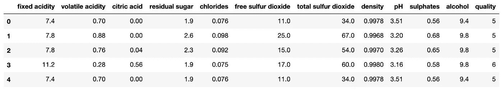
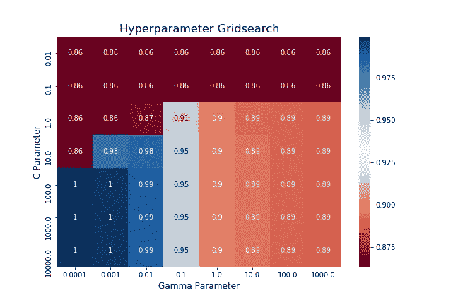

# 寻找好酒的格子

> 原文：<https://towardsdatascience.com/grid-searching-for-good-wine-43cdfeadee6c?source=collection_archive---------44----------------------->

在大多数 ML 项目中，微调一个人的模型是至关重要的一步。即使有很好的数据清理和特征工程，选择不当的超参数也会阻止用户从其模型中获得最佳性能。在过去的项目中，我发现自己循环通过参数并打印出训练错误来挑选最好的，但我最近读了安德烈亚斯·c·müller&萨拉·圭多的*用 Python* 介绍机器学习。在本书中，作者解释并演示了 sklearn 自动搜索 ML 模型的给定超参数列表，然后挑选最佳组合的能力。我发现这个功能非常有用，所以我写了这篇文章，作为传递 Müller 和圭多的教导的一个快速演示。

我将使用来自 Kaggle 的[红酒质量数据集](https://www.kaggle.com/uciml/red-wine-quality-cortez-et-al-2009)，它的可用性得分为 8.8 分，不算太大(1599 行)。观察最上面的几行可以看出，这个数据集包含了红酒的各个方面，如 pH 值、残糖克数、酒精含量等...以及从 1 到 10 的葡萄酒总体质量分数。

由于我肯定不是品酒师，可能无法区分 7 分的葡萄酒和 8 分的葡萄酒，我将训练一个支持向量机来确定葡萄酒是否好喝。对我来说，“好”是指质量得分为 7 或更高的任何东西，所以我必须在数据中添加该特性。添加之后，我可以将数据拆分为独立变量和因变量，并创建我的培训/测试拆分。

既然数据的形式正确，我们就转向网格搜索。我做的第一件事是创建一个超参数列表，供网格搜索迭代。因为我使用的是支持向量分类器，所以我测试了 C 和 gamma 的不同值，它们分别是正则化参数和核系数。我输入模型、我的参数网格和交叉验证折叠 5 来创建 GridSearchCV()对象，然后像 sklearn 中的任何其他模型一样用。fit()方法。

现在模型已经拟合好了，是时候查看结果了。我可以使用。网格搜索对象的 cv_results_ attribute，然后将结果透视到热图中。这清楚地表明，该数据的最佳组合是归一化参数的高值和核系数的低值。

网格搜索对象还将最佳拟合参数存储在。最佳参数属性。顺便提一下，Müller 和圭多解释说，sklearn 总是将来自训练数据的项目存储在以下划线结尾的属性中(例如:“。best_params_ "，"cv_results_ ")。我们可以使用 kwargs 将这些参数直接插入到我们希望拟合测试数据的模型中，如下文使用***SVC(* * grid _ search . best _ params _)***所演示的。使用网格搜索中找到的最佳参数，该模型在测试集上获得 100%的分类准确率。

希望这是 sklearn 网格搜索能力的一个有用的演示。要了解更多关于这方面的信息和大量其他的 ML 主题，我推荐阅读*Python 机器学习入门。*感谢阅读，完整的脚本/数据可在[这里](https://github.com/eonofrey/wine_grid_search)找到。要获得所有中型文章的完整访问权限，请点击[此处](https://eonofrey.medium.com/membership)！