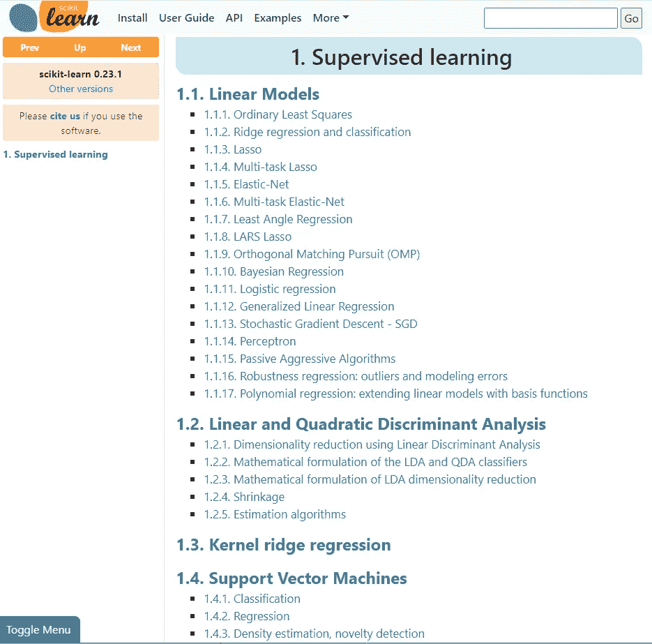
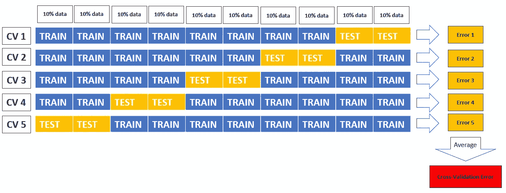

# GridSearch:终极机器学习工具

> 原文：<https://towardsdatascience.com/gridsearch-the-ultimate-machine-learning-tool-6cd5fb93d07?source=collection_archive---------22----------------------->

## 什么是 GridSearch，为什么它如此重要？

GridSearch:终极机器学习工具。克里斯·利维拉尼在 [Unsplash](https://unsplash.com/s/photos/data-science?utm_source=unsplash&utm_medium=referral&utm_content=creditCopyText) 上的照片

# 简而言之，机器学习

[监督机器学习](/what-is-machine-learning-and-how-can-a-machine-learn-something-4f66fa05714b)的目标是基于历史数据建立预测功能。该数据有独立(解释)变量和目标变量(您要预测的变量)。

一旦建立了预测模型，我们就在单独的测试数据集上测量它的误差。我们使用 KPI 来量化模型的误差，例如，回归环境中的均方误差(定量目标变量)或分类环境中的准确性(分类目标变量)。

误差最小的模型通常被选为最佳模型。然后，我们使用该模型通过输入解释变量来预测目标变量的值。

在本文中，我将深入研究 GridSearch。

# 机器学习的两种优化

GridSearch 是一个用于**超参数调整**的工具。如前所述，机器学习在实践中归结为将不同的模型相互比较，并试图找到最佳的工作模型。

除了选择正确的数据集，优化预测模型通常有两个方面:

1.  优化最佳模型的选择
2.  使用超参数调整优化模型拟合

现在让我们来研究一下这些，以解释网格搜索的必要性。

## 第一部分。优化最佳模型的选择

在一些数据集中，可能存在简单的线性关系，可以从解释变量预测目标变量。在其他数据集中，这些关系可能更复杂或高度非线性。

与此同时，许多模型存在。这包括从线性回归这样的简单模型，到深度神经网络这样非常复杂的模型。

关键是使用适合我们数据的模型。

例如，如果我们在一个非常复杂的任务上使用线性回归，那么这个模型将是无效的。但是如果我们在一个非常简单的任务上使用深度神经网络，这也将是不可执行的！

为了找到合适的机器学习模型，解决方案是将数据分成训练和测试数据，然后在训练数据上拟合许多模型，并在测试数据上测试每个模型。测试数据误差最小的模型将被保留。

来自 Scikit Learn 的[监督模型列表](https://scikit-learn.org/stable/supervised_learning.html)的截图显示，有大量模型可供试用！

## 第二部分。使用超参数调整优化模型拟合

在选择了一个(或几个)性能良好的模型之后，第二个要优化的是模型的超参数。超参数就像模型训练阶段的配置。它们影响模型能学什么或不能学什么。

因此，调整超参数可以进一步降低测试数据集的误差。

每个模型的估计方法都不同，因此每个模型都有自己的超参数需要优化。

Scikit Learn 的 [RandomForestClassifier](https://scikit-learn.org/stable/modules/generated/sklearn.ensemble.RandomForestClassifier.html#sklearn.ensemble.RandomForestClassifier) 的文档摘录显示了许多参数，这些参数都会影响模型的最终精度。

彻底搜索最佳超参数的一种方法是使用名为 GridSearch 的工具。

# 什么是 GridSearch？

GridSearch 是我们在优化超参数时使用的一个优化工具。我们定义想要搜索的参数网格，并为我们的数据选择最佳的参数组合。

## 网格搜索中的“搜索”

假设存在不同超参数值的特定组合，这将最小化我们的预测模型的误差。我们使用 GridSearch 的目标是找到这种特定的参数组合。

## **Grid search 中的“网格”**

GridSearch 寻找最佳参数组合的想法很简单:只需测试每个可能的参数组合并选择最佳的一个！

虽然不是每个组合都是可能的，因为对于一个连续的规模来说，会有无限多的组合要测试。解决方案是定义一个网格。该网格为每个超参数定义了应该测试的值。

两个超参数α和β的 GridSearch 示意图(图片由作者提供)

在一个例子中，调整了两个超参数α和β:我们可以给它们两个值[0.1，0.01，0.001，0.0001]，得到下面的“网格”值。在每个交叉点，我们的 GridSearch 将拟合模型，以查看该点的误差。

在检查了所有的网格点后，我们知道哪个参数组合最适合我们的预测。

## 网格搜索中的“交叉验证”

此时，只剩下一件事需要添加:交叉验证错误。

当使用每个超参数组合测试模型的性能时，可能存在过度拟合的风险。这意味着仅仅出于偶然，只有训练数据集很好地符合这个特定的超参数组合！在新的真实数据上的表现可能更差！

为了更可靠地估计超参数组合的性能，我们采用交叉验证误差。

交叉验证的示意图(作者提供的图片)

在交叉验证中，数据被分成多个部分。例如 5 份。然后模型被拟合 5 次，同时遗漏五分之一的数据。这五分之一被遗漏的数据用于测量性能。

对于超参数值的一个组合，5 个误差的平均值构成交叉验证误差。这使得最终组合的选择更加可靠。

# 是什么让 GridSearch 如此重要？

GridSearch 允许我们非常容易地找到给定数据集的最佳模型。通过自动搜索，它实际上使机器学习成为数据科学家角色的一部分变得更加容易。

在机器学习方面，仍然需要做的一些事情是决定测量误差的正确方法，决定尝试哪些模型和测试哪些超参数。最重要的部分，数据准备工作，也留给了数据科学家。

由于网格搜索方法，数据科学家可以专注于数据争论工作，同时自动化模型比较的重复任务。这使得工作更有趣，并允许数据科学家在最需要的地方增加价值:处理数据。

GridSearch 有许多替代方法，包括随机搜索、贝叶斯优化、遗传算法等等。我很快会写一篇关于这些的文章，所以不要犹豫，敬请期待。感谢阅读！