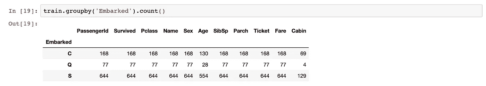
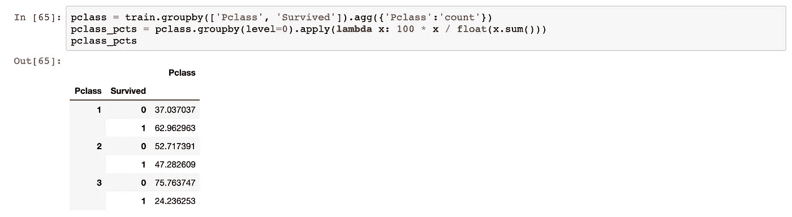

# Pandas 和 SQL 中的分组依据

> 原文：<https://towardsdatascience.com/group-by-in-pandas-and-sql-94777ce48658?source=collection_archive---------24----------------------->

## 聚合函数的比较


法国艺术家 Paulo Grangeon 的 1600 只熊猫+世界巡演。保罗·格兰金的作品|由 ARR 策划。参考资料中的艺术品网站链接

数据分析的一个重要组成部分是通过计算总和、最大值、最小值、平均值、中值等聚合来生成摘要。这样，我们可以对数据的总体情况有所了解。这对于大型数据集尤其重要，因为查看原始数据可能不会产生任何有意义的见解。

在这篇博文中，我将首先描述一下`Group By`的下划线机制，然后比较一下`Group By`概念在 Python 的`pandas`库和 SQL 中的实现。

# 什么是分组依据？

正如`pandas`开发团队在他们的[文档中对 GroupBy object](https://pandas.pydata.org/pandas-docs/stable/user_guide/groupby.html) ，`Group By`包含三个步骤:

*   步骤 1: **根据一些标准将数据分成组**
*   步骤 2: **独立地对每个组应用**一个函数
*   步骤 3: **将结果组合成一个数据结构**

在分析数据框的上下文中，步骤 1 相当于找到一列，并使用该列的唯一值将数据框分成多个组。第 2 步是选择一个函数，如聚合、转换或过滤。所选功能将在每个单独的组上运行。步骤 2 的结果将被合并，并在步骤 3 中显示为新的数据结构。

以上所有听起来可能仍然相当抽象；让我们使用来自[泰坦尼克号追逐赛](https://www.kaggle.com/c/titanic/data)的真实数据集来尝试一下。(注意，有三个数据集可用，我将在这篇博文中使用“train.csv”。)

# 在熊猫中分组

Python `pandas`库有一个名为`groupby`的高效操作来执行 Group By 任务。

在泰坦尼克号的数据集中，有一个名为“登船”的列，为每个乘客提供登船港口的信息。有三个不同的值:C、Q 和 S (C =瑟堡，Q =皇后镇，S =南安普顿)。如果我们想检查每个港口的乘客数量，我们可以使用以下命令:

```
train.groupby('Embarked')['Embarked'].count()
```

它给出以下输出:


让我们使用**分割-应用-合并**步骤对此进行一些分解。

**第 1 步**选择列“apollowed ”,使用它的唯一值——即 C、Q、S——将数据集分成三类。

请注意，在此阶段，没有对组执行任何操作。命令`train.groupby('Embarked')`仅仅输出一个`GroupBy`对象:


**步骤 2** 是选择`count()`方法作为我们的函数，它产生每个类别的总数。

**第三步**是组合并显示结果。`pandas` GroupBy 对象支持列索引，我们可以指定希望在聚合结果中看到哪些列。在我们的例子中，我们只关心“已装船”这一列。如果没有此规范，`pandas`将返回所有数字列的汇总结果，如下所示:



# SQL 中的分组依据

Group By 概念是 SQL 语法的重要组成部分。尽管存在一些语法差异，SQL 的`GOURP BY`语句的工作方式与`pandas`相似。

上述`pandas`操作可以用 SQL 实现如下:

```
SELECT Embarked, COUNT(Embarked) 
FROM titanic.train 
GROUP BY Embarked;
```


在`GROUP BY`语句中，选择列“apollowed”来分割数据集。在`SELECT`语句的第二部分，选择`COUNT()`作为聚合函数。`SELECT`语句还包含我们希望在输出中显示哪些列的信息。第一次出现“已装船”相当于`pandas`列索引`[Embarked]`。另一个微小的区别是，SQL 使用`FROM`语句来指定我们正在处理的数据集，即来自“titanic”模式的“train”表；而在`pandas`中，我们将数据帧的名称放在`groupby`命令的开头。

同样值得注意的是，SQL 在使用`GROUP BY`时会显示缺失值。从 SQL 输出中，我们可以看到两个乘客错过了登机港口。

# 高级示例

## 示例 1

如果我们想查看幸存与死亡乘客的平均票价，我们可以在`pandas`中使用以下命令:

```
train.groupby('Survived')['Fare'].mean()
```

它给出了以下输出:


类似地，我们可以在 SQL 中通过以下方式实现这一点:

```
SELECT Survived, AVG(Fare) 
FROM titanic.train 
GROUP BY Survived;
```


正如我们所看到的，幸存的人比死去的人平均支付了更高的费用。

## 示例 2

泰坦尼克号上有三种乘客等级，1 级、2 级和 3 级。假设我们想要检查每一个职业的幸存人数与死亡人数的百分比，我们可以结合使用下面的`groupby`命令和`pandas`中的`.apply()`方法:

```
pclass = train.groupby(['Pclass','Survived']).agg({'Pclass':'count'}) pclass_pcts = pclass.groupby(level=0).apply(
lambda x: 100 * x / float(x.sum()))
```

注意，在`.apply()`方法中，我们可以传递一个`lambda`函数来计算百分比。



这也可以在 SQL 中使用[窗口函数](https://www.postgresql.org/docs/current/tutorial-window.html)来实现:

```
WITH t1 AS 
   (SELECT Pclass, Survived, Count(*) AS n 
    FROM titanic.train 
    GROUP BY Pclass, Survived) 
SELECT Pclass, 
       Survived, 
       100 * n / (SUM(n) OVER (PARTITION BY Pclass)) AS percent
FROM t1;
```


我们可以得出结论，存活率随着乘客等级的降低而降低。

我的博文到此结束。Group By 在`pandas`和 SQL 中的实现非常通用，可以和很多其他函数结合使用，值得进一步探索。

感谢您的阅读。一如既往，如果您有任何意见或反馈，我很乐意收到您的来信。

# 参考

*   杰克·范德普拉斯的《Python 数据科学手册》
*   [SQL 窗口函数](https://www.postgresql.org/docs/current/tutorial-window.html)
*   [按对象分组的熊猫文档](https://pandas.pydata.org/pandas-docs/stable/user_guide/groupby.html)
*   保罗·格兰金的 1600 只熊猫+世界巡演

*原载于*[](https://github.com/FredaXin/blog_posts/blob/master/group_by/group_by.md)**。**