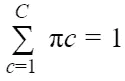
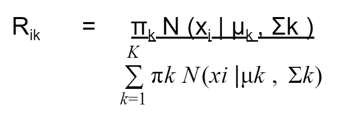

# 使用高斯混合模型(EM 算法)对相似图像进行分组

> 原文：<https://towardsdatascience.com/group-similar-image-by-using-the-gaussian-mixture-model-em-algorithm-438e9744660c?source=collection_archive---------7----------------------->

## 为图像聚类问题从头实现 GMM


[图片由什洛莫·沙莱夫拍摄](https://unsplash.com/photos/L68SOwRShLU)

**聚类**最流行的无监督机器学习问题之一。我们已经熟悉了 k-means 聚类算法，但是这里有一个问题:

1.  **高度依赖于质心的初始值**:如果我们改变它的初始化，然后改变集群的位置，那么最终的集群很可能会改变它的位置。
2.  **聚类具有不同的大小和密度**:具有不同形状(分布的数据点)和大小(数据点的数量)的聚类不能通过这种简单的技术来处理。
3.  **离群点**:可能出现一个数据点离任何一个聚类都很远，它可以作为一个单独的聚类。为了避免这样的问题，我们通常会删除这些点。

如果你不想理解这个令人讨厌的数学，那么请向下滚动到 GMM 的**实现**部分，在那里我将讨论 python 中的实现。

# 为了理解高斯混合模型，你需要理解一些术语

1.  密度估计:概率密度估计是基于不可观察的潜在概率密度函数的观察数据的近似构造。这一步包括选择概率分布函数和描述观测数据的最佳联合概率分布的函数参数。
2.  最大似然估计(MLE):是一种通过最大化对数似然函数来估计概率分布参数的方法。
3.  潜在变量:与观察变量相反，即不是直接观察到的，而是从数学模型中推断出来的。我们以后再谈。

现在最大似然估计在潜在变量存在的情况下不太适用。期望最大化算法是一种在潜在变量存在的情况下可以找到合适的模型参数的方法。

EM 是一种寻找参数的最大似然或最大后验估计的迭代方法，其中模型依赖于未观察到的潜在变量。

让我们稍微简化一下。

给定 N 个观察值


和概率模型 p(X |θ)

我们的目标是找到使 p(X |θ)最大化的θ值，这被称为最大似然估计。

如果模型是简单的高斯分布，那么参数就像


在哪里


如果是这种情况，在 ML 中解决这个问题的最常见方法是梯度下降，通过最小化作为损失函数的对数似然函数-log(p(X |θ))(记住我们实际上最大化参数的概率函数


是数值稳定性的一种简单方法，因为它将乘积变为和，并且该函数的负值的最小化与该函数的最大化是相同的)。

但是梯度下降是一种解决非线性问题的方法，典型的是针对一些多维分布的最小值。计算高斯混合的均值(或其他矩)不是非线性问题，因此不需要为非线性问题设计的方法。那么有没有更好的方法来解决这个问题。

EM 算法来了。让我们看看 EM 算法是如何在高斯混合模型中使用的。

通过引入潜在变量，极大似然估计可以得到简化。潜在变量模型假设观测 xi 是由一些潜在的潜在变量引起的。嗯……还是不清楚，好吧，考虑一下这张图片


[图像来源](https://fallfordata.com/soft-clustering-with-gaussian-mixture-models-gmm/)

这种类型的概率模型被称为高斯混合模型(GMM)，在本例中 C 个高斯分量的加权和为 C = 3


πc 和σc 分别是混合分量 Cc 的权重、均值向量和协方差矩阵。权重是非负的，总和为 1，即



参数向量


表示所有模型参数的集合。如果我们引入一个离散的潜在变量‘t ’,它决定了对混合物成分的观察值的分配，我们可以用条件分布 p(x| t，θ)和先验分布 p( t | θ)来定义观察变量和潜在变量 p(x，t| θ)的联合分布


在哪里


t 的值是一位热编码的。例如，t2=1 指的是第二个混合成分，这意味着如果总共有 C=3 个成分，则 t = (0，1，0)。边际分布 p (x | θ)是通过对 t 的所有可能状态求和得到的。


对于每个观察 xi，我们有一个潜在变量 ti，也称为责任。

考虑到 X 是所有观测值的集合，所有潜在变量 T 的集合，那么我们可以很容易地最大化完全数据的对数似然 p(X，T | θ)。因为找到对数似然后，我们就知道点的聚类分配，这就是为什么我们会找到边际对数似然或不完全数据对数似然 p (X | θ)。所以从数学上来说，


# GMM 的实施

让我们一步一步地看看如何使用高斯混合模型来聚类我们的图像。我在这里使用 python 来实现 GMM 模型:

需要外部 Python 库:

1.  imageio:用于从图像中获取 RGB 特征
2.  熊猫:用于处理数据集
3.  numpy:用于数学运算

第一步:

让我们从我们的数据集开始，我们已经给出了所有图像驻留的文件夹路径。我们将创建一个方法，从中我们可以提取每个图像的 R，G，B 向量的平均值。对于单个图像，函数应该是:

```
######## loading external package dependency ####################Import pandas as pdImport numpy as npfrom scipy.stats import multivariate_normalImport imageioFrom functools import reducedef get_image_feature(path): Im = imageio.imread(os.path.join(path), pilmode=’RGB’) temp = Im/255\. # divide by 255 to get in fraction mn = temp.sum(axis=0).sum(axis=0)/(temp.shape[0]*temp.shape[1]) return mn/np.linalg.norm(mn, ord=None) # taking 2nd norm to scale vector
```

假设提供的图像路径是'(some_path)/Image_SunSet.jpg '这个函数返回[红、绿、蓝]图像像素的强度像[0.9144867979，0.3184891297，0.2495567485]我们可以清楚地看到红色具有更大的强度。


类似地，我们可以对所有图像执行此操作，并创建一个包含图像细节的熊猫数据帧:

*   文件名:文件的名称
*   路径:文件的路径
*   扩展:图像扩展。jpg，。巴布亚新几内亚经济贸易委员会
*   ImageBase64:图像的 Base64 编码
*   红色:红色平均强度
*   绿色:绿色平均强度
*   蓝色:蓝色平均强度

现在，我们的数据集包含特征(即数据集的[红、绿、蓝]列，而不是仅用于查看的所有其余数据)。如果你想得到更高 k 值(聚类数)，你可以从图像中提取自己的特征，但要代表更广泛的颜色代码，不仅仅是 r、g 和 b。

第二步:

模型生成(实现高斯混合模型的 EM 算法):

因为在 GMM，我们假设所有的数据点都来自 k 高斯分布，其中 k 只不过是一些集群。嗯……有点棘手，让我们简化一下。


[图像来源](http://ethen8181.github.io/machine-learning/clustering/GMM/GMM.html)

考虑这个 1D 概率分布。如果我们假设所有数据点都来自 2 高斯分布，这意味着我们假设 k=2(聚类数)，那么如果我们想知道哪些数据来自哪个高斯分布，我们需要做的就是计算两个高斯分布的均值和方差。但是等等，我们还不知道。但有一秒钟，如果我们假设我们知道这些参数(即 k 高斯分布的均值和方差)，那么我们就可以知道每个数据点来自哪个高斯的可能性(这个可能性指的是责任)。哇，但是我们也不知道这个。所以我们的结论是

如果我们知道参数(即高斯的均值和方差)，我们可以计算责任，如果我们知道责任，那么我们可以计算参数。

这就是 EM 算法的由来，它首先将“k”个高斯随机放入图像中(为高斯生成随机平均值和方差),然后在 E 和 M 步之间迭代，直到收敛，其中:

**紧急步骤:根据当前参数分配集群责任**

**M 步:更新参数，给定当前集群职责**

下面更详细的说一下它的实现。

让我们记住为什么 GMM 被用来。与 k- mean 不同的是，它不会对聚类进行硬分配，例如图像


如果我们使用 k=4，即 4 个集群模型，即日落、森林、云和天空，那么在 k 均值算法中，这张图片只属于云，这称为硬分配，但在 GMM，它属于 97%的云和 3%的森林，这称为软分配。

**E 步骤:**

在这一步中，我们计算集群责任。让 rik 代表聚类 k 对于数据点 I 的责任。您可以将责任假定为数据点‘I’属于‘k’聚类的概率。因为这种可能性意味着


为了知道一个聚类对一个给定的数据点有多大影响，我们计算该数据点在特定的聚类分配下的可能性，乘以该聚类的权重。对于数据点 I 和聚类 k，数学上:


其中 N (xi | μk，σk)是聚类 k 的高斯分布(具有均值μk 和协方差σk)。

我们用∝，是因为量 N (xi | μk，σk)还不是我们想要的责任。为了确保每个数据点上的所有责任加起来等于 1，我们在分母中添加了归一化常数:



但是我们的数据是三维向量，即[红、绿、蓝]。Scipy 提供了计算多元正态分布的便捷函数。[检查这个](https://docs.scipy.org/doc/scipy/reference/generated/scipy.stats.multivariate_normal.html?highlight=multivariate_normal#scipy.stats.multivariate_normal)

也就是 multivariate _ normal . pdf([数据点]，mean =[均值向量]，cov =[协方差矩阵])

我们后面会讲到如何计算 M 步的均值向量和协方差矩阵。

```
# data (numpy array) : array of observations
# weights (numpy array) : numpy array of weight of each clusters of size (1, n_clusters)
#means (numpy array) : numpy array of means of each clusters of size (n_cluster, dimension)
#covariances(numpy array) : numpy array of covariance metrix of size (n_clusters, dimension, dimension)
def get_responsibilities( data, weights, means, covariances):
    n_data = len(data)
    n_clusters = len(means)
    resp = np.zeros((n_data, n_clusters))
    for i in range(n_data):
       for k in range(n_clusters):
          resp[i, k] = weights[k]*   multivariate_normal.pdf(data[i],means[k],covariances[k],allow_singular=True)
        # Add up responsibilities over each data point and normalize
    row_sums = resp.sum(axis=1)[:, np.newaxis]
    resp = resp / row_sums
    return resp
```

记住这个责任是我们潜在的变量。

**M 步:**

现在计算了聚类责任，我们必须更新与每个聚类相关的聚类参数，即(权重(πk)、均值(μk)和协方差(σk))。

**更新权重:**

聚类权重给出了每个聚类代表所有数据点的多少。数学上它被定义为:


python 代码

```
# resp(numpy array) : responsibility numpy array size (n_sample, n_clusters)
def get_soft_counts(resp):
    return np.sum(resp, axis=0)# counts (numpy array) : count list of sum of soft counts for all clusters of size (n_cluster)
def get_weights(counts):
    n_clusters = len(counts)
    sum_count = np.sum(counts)
    weights = np.array(list(map(lambda k : counts[k]/sum_count, range(n_clusters))))
    return weights
```

**更新的意思是:**

每个分类的平均值等于所有数据点的加权平均值，由分类责任进行加权。数学上，对于每个数据点，第 k 个集群的 xi 和责任 rik 是第 k 个集群的平均值，可以定义为:


python 代码

```
# data (numpy array): array of observation points
# resp (numpy array) : responsibility numpy array size (n_sample, n_clusters)
# counts (numpy array) : count list of sum of soft counts for all clusters of size (n_cluster) 
def _get_means( data, resp, counts):
    n_clusters = len(counts)
    n_data = len(data)
    means = np.zeros((n_clusters, len(data[0])))

    for k in range(n_clusters):
        weighted_sum = reduce(lambda x,i : x + resp[i,k]*data[i],  range(n_data), 0.0)
        means[k] = weighted_sum/counts[k]
    return means
```

**更新协方差:**

每个集群的协方差等于由集群责任加权的所有**外部产品**的加权平均值。数学上它被定义为:


在哪里


是外积。让我们举一个简单的例子，看看外部产品是什么样子的。

让


是两个向量，那么 a 和 b 的外积定义为:


转置只是为了把列向量变成行向量。因为按照惯例，向量在机器学习中表示为列向量。

python 代码

```
# data (numpy array) : array of observation points
# resp(numpy array) : responsibility numpy array size (n_sample, n_clusters)
# counts (numpy array) : count list of sum of soft counts for all clusters of size (n_cluster)
# means (numpy array) : numpy array of means of each clusters of size (n_cluster, dimension)
def _get_covariances( data, resp, counts, means):
    n_clusters = len(counts)
    dimension = len(data[0]) # to get dimention of data
    n_data = len(data)
    covariances = np.zeros((n_clusters, dimension, dimension))

    for k in range(n_clusters):
       weighted_sum = reduce (lambda x, i :x + resp[i,k] *  np.outer((data[i]-means[k]), (data[i]- means[k]).T), range(n_data), np.zeros((dimension, dimension)))

       covariances[k] = weighted_sum /counts[k] # normalize by total sum of counts
    return covariances
```

而是我们将如何度量我们的混合高斯模型。为此，我们将计算高斯混合的对数似然。它量化了在特定参数(即均值、协方差和权重)下观察到一组给定数据的概率。我们将继续使用不同的参数集迭代 EM 算法，并检查其收敛性，即对数似然不会改变太多，或者直到固定的迭代次数。

Python 代码

```
# Z (numpy array) : numpy array of size (1, n_clusters)
def _ln_sum_exp( Z):
    return np.log(np.sum(np.exp(Z)))# data (numpy array) : array of observation points
# weights (numpy array) : numpy array of weight of each clusters ofsize (1, n_clusters)
# means (numpy array) : numpy array of means of each clusters of size (n_cluster, dimension)
# covs (numpy array) : numpy array of covariance metrix of size (n_clusters, dimension, dimension)
def get_log_likelihood( data, weights, means, covs):
    n_clusters = len(means)
    dimension = len(data[0])
    sum_ln_exp = 0

    for d in data:

      Z = np.zeros(n_clusters)
      for k in range(n_clusters):
        # compute exponential term in multivariate_normal
        delta = np.array(d) — means[k]

        inv = np.linalg.inv(covs[k])
        exponent_term = np.dot (delta.T, np.dot (inv, delta))
        # Compute loglikelihood contribution for this data point and this cluster
        Z[k] += np.log (weights[k])
        det = np.linalg.det(covs[k])

        Z[k] -= 1/2\. * (dimension * np.log (2*np.pi) + np.log (det) + exponent_term)
        # Increment loglikelihood contribution of this data point across all clusters

      sum_ln_exp += _ln_sum_exp(Z)
    return sum_ln_exp
```

现在是 EM 算法的实际主要实现方法的时候了

Python 代码

```
# data (numpy array) : array of observation points
# init_weights (numpy array) : numpy array of initial weight of each clusters ofsize (1, n_clusters)
# init_means (numpy array) : numpy array of initial means of each clusters of size (n_cluster, dimension)
# init_covariances (numpy array) : numpy array of initial covariance metrix of size (n_clusters, dimension, dimension)
# maxiter (int) : maximum iteration to rum EM (optional)
# threshold (float) : maximum threshold to stop EM (optional)
def em_from_parameter(data, init_means, init_covariances, init_weights, maxiter=1000, thresh=1e-4):
    # Make copies of initial parameters
    means = init_means[:]
    covariances = init_covariances[:]
    weights = init_weights[:]

    # Infer length of dataset
    n_data = len(data)

    # Infer number of cluster
    n_clusters = len(means)

    # Initialize some useful variables
    resp = np.zeros((n_data, n_clusters), dtype=np.float64)

    l1 = get_log_likelihood(data, weights, means, covariances)
    l1_list = [l1]

    for it in range(maxiter):

      # E-step: calculate responsibilities

      resp = get_responsibilities(data, weights, means, covariances)

      # M-step calculate cluster parameter
      counts = get_soft_counts(resp)
      weights = _get_weights(counts)
      means = _get_means(data, resp, counts)
      covariances = _get_covariances(data, resp, counts, means)

      l1_new = get_log_likelihood(data, weights, means, covariances)

      l1_list.append(l1_new)

      if abs(l1_new – l1) < thresh :
        break

      l1 = l1_new

    param = {'weights': weights, 'means': means, 'covariances': covariances, 'loglikelihood': l1_list, 'responsibility': resp, 'Iterations': it}
    return param
```

现在都准备好了，但是我们的初始参数是什么。我们有许多方法可以采用。

一种方法是相等地初始化所有聚类的权重，即每个聚类的(1/k ),其中 k 是聚类的总数。

1 个聚类的协方差矩阵的初始化是维数等于数据维数*数据维数的对角方阵(在这种情况下，数据维数是 3，即[r，g，b])


其中，σxy =是 x 和 y 之间的协方差

对于均值初始化来说，有点棘手。还记得 k 均值算法吗？我们使用这些算法的输出来初始化我们的 EM 均值参数。因为通过使用 k-均值算法，我们推动均值坐标到达最近的收敛点。因此，如果我们从这一点出发，EM 算法将花费更少的时间来收敛。但是有一个问题，我们将如何初始化 k 均值的初始质心。

嗯。对于这个问题，我们将采用 k mean++初始化策略，它选择 k 个彼此相距最远的质心。现在我们已经有了所有的三参数。

注意:完整的解决方案请看我的 git-hub 链接 [PYTHONAPI](https://github.com/Aksh-kumar/PYTHONMLAPI) 你会发现这个集群问题端到端的完整 Flask 代码，可以被任何客户端技术使用。我选择 Angular 8 作为客户端，其代码可在 [ML_algorithmUI](https://github.com/Aksh-kumar/ML_AlgorithmUI) 上获得。

对于那些只想检查 EM 相关代码的人来说，链接是[这个](https://github.com/Aksh-kumar/PYTHONMLAPI/tree/master/ML_algorithms/cluster)，它包含两个文件夹 Expectation _ Maximization 和 K_Mean，这两个文件夹分别包含相关代码。请浏览代码，如果您面临任何问题，请随时问我。

现在回到代码，这个程序的驱动代码

Python 代码

```
# k: number of clusters
# data: observations coming from distribution
# return final weights, means, covariances, list of loglikelihood till convergence and final responsibility of each observation and number of Iterations it takes till convergencedef em(k, data) :
    dimension = len(data[0])
    # mean co-ordinate of all clusters not recommended at all since it is a very bad method to initialized the mean points alternatively use the k-mean initializing method as discussed early
    means = np.random.rand(k, dimension)
    #### alternate better method to initialize mean points by kmean ####
    ## from KM import KM ## self created KM class available in my github repos
    ## check K_Mean folder in listed github repos path
    km = KM()
    means, dont_require = km.kmeans(data, k) # return centroids and cluster assignments

    cov = np.diag(np.var(data, axis=0)) # get covariance of data initialize by diagonal metrix of covariance of data

    covariances = np.array([cov] * k) # initiate covariance metrix with diagonal element is covariance of data
    weights = np.array([1/ k] * k) # initialize equal weight to all clusters
    return em_from_parameter(data, means, covariances, weights)
```

images_path = ['../image2.jpg '，'../image2.jpg '，… ] #图像路径列表……..…………………………………………………………………………..(1)

```
########### Data generation ################
data = []
For path in images_path:data.append(get_image_feature(path))data = np.array(data)
```

现在我们的数据已经准备好了，k 的值，即集群的数量，都是个人的选择。为简单起见，我取 k = 4 意味着我们假设数据的分布来自 4 高斯分布。既然我们的数据和 k 值已经准备好了，那么我们就准备创建一个模型。

```
####### create model #######parameters = em(k, data) # store returned parameters of model along with responsibilities
```

. . . . . . ………………………………………………………………………….(2)

这需要时间，别担心，但最终，你会得到你想要的。现在，如果您有新的观察数据，您可以找出软分配，因为我们已经获得了正确的集群参数。

Python 代码

```
# data (numpy array) : array of observation points
# weights (numpy array) : numpy array of weight of each clusters of size (1, n_clusters)
# means (numpy array) : numpy array of means of each clusters of size (n_cluster, dimension)
# covs (numpy array) : numpy array of covariance metrix of size (n_clusters, dimension, dimension)
def get_responsibilities(self, data, weights, means, covariances):
    n_data = len(data)
    n_clusters = len(means)

    resp = np.zeros((n_data, n_clusters))for i in range(n_data):for k in range(n_clusters):resp[i, k] = weights[k]* multivariate_normal.pdf(data[i],means[k],covariances[k])# Add up responsibilities over each data point and normalizerow_sums = resp.sum(axis=1)[:, np.newaxis]resp = resp / row_sumsreturn resp
```

创建观察值的 numpy 数组，并使用 em 返回的参数调用该方法，如(2)所示，并将其传递给该函数，您将获得每个集群的软分配。例如，让你有一个带有路径的图像”../../test_example.jpg "

首先获取图像的[r，g，b ]向量，如(1)所示，您将得到类似于[0.9144867979，0.3184891297，0.2495567485 ]的内容，将这些数据以及返回的集群参数传递给 get _ responsibilities 函数。您将在参数变量中获得该值，即

**注意:**记住这个函数采用一个观察值数组，在这种情况下，我们只有一个图像，即一个观察值，所以首先将这个观察值转换成一个数组，然后调用这个函数。

```
data = np.array([ np.array([0.9144867979, 0.3184891297, 0.2495567485 ])])mean = parameters[‘means’]cov = parameters[‘covariances’]weights = parameters[‘weights’]resp = get_responsibilities(data, weights, mean, cov)
```

万岁，你得到了你的集群任务。我对一些截图做了一个基于网络的可视化结果。


我们来谈谈它是如何消除 k 均值的所有缺点的:

1.  **更好的初始化策略**:因为我们使用 K mean++初始化策略，所以我们不太可能得到错误的集群结构。
2.  **变化的聚类密度**:与 k 均值不同，它具有变化的聚类密度，这为我们提供了对具有各自聚类分配的观测值的概率估计。
3.  **离群点**:离群点被考虑，因为它包含非常少的对其最近的集群的责任。

**结论:**最后我们可以说，任何具有原色集合的图像都可以用这种技术进行聚类。我们可以使用这种方法对任意数量的图像进行聚类。在这里，我只是举了一个简单的例子，主要颜色，但根据需要，特征生成可能会改变多种颜色的阴影。GMM 是最适合的情况下，你想要的概率图像分配到一个特定的集群。

现在是时候结束我的博客了，如果你真的对这段代码感兴趣，请访问我的 git-hub 链接，并随时贡献和提出改进建议。快乐学习…

**链接和参考:**

马丁·克拉瑟潜变量模型 Part-1 高斯混合模型与 EM 算法(2019 年 11 月 21 日):[https://克拉瑟姆. github . io/2019/11/21/Latent-variable-models-Part-1/](https://krasserm.github.io/2019/11/21/latent-variable-models-part-1/)

ethen 8181:[http://ethen 8181 . github . io/machine-learning/clustering/GMM/GMM . html](http://ethen8181.github.io/machine-learning/clustering/GMM/GMM.html)

维基参考:[https://en . Wikipedia . org/wiki/Expectation–maximization _ algorithm](https://en.wikipedia.org/wiki/Expectation%E2%80%93maximization_algorithm)

谷歌开发者资源:[https://Developers . Google . com/machine-learning/clustering/algorithm/advantage-visits](https://developers.google.com/machine-learning/clustering/algorithm/advantages-disadvantages)