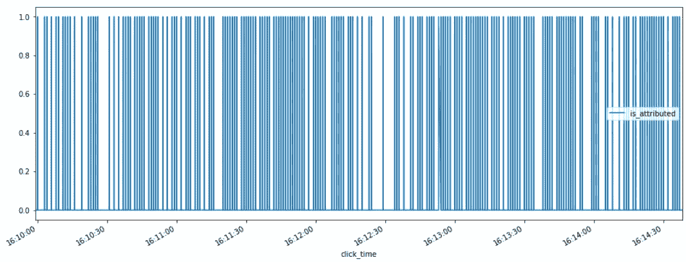
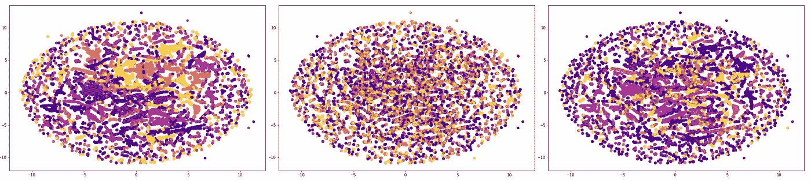
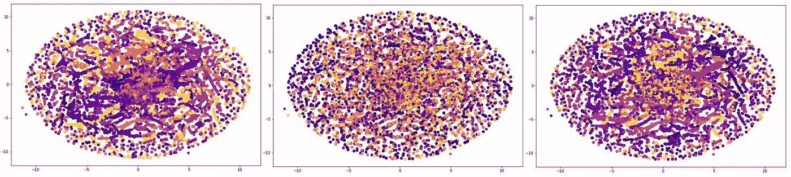
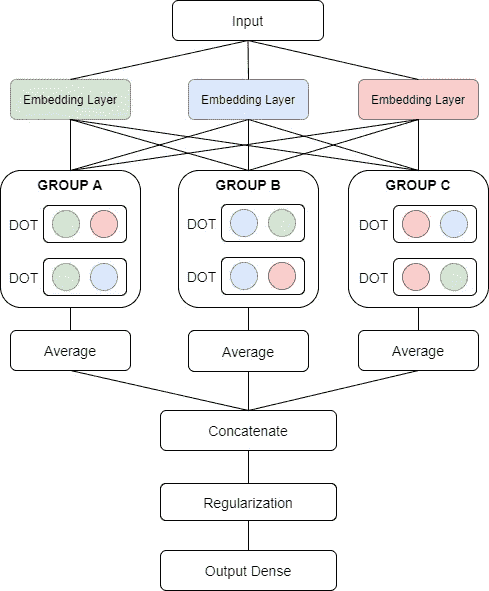
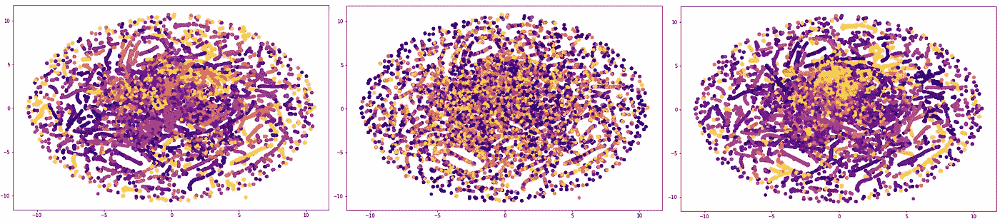

# Group2Vec 用于高级分类编码

> 原文：<https://towardsdatascience.com/group2vec-for-advance-categorical-encoding-54dfc7a08349?source=collection_archive---------33----------------------->

## 创建高基数类别的有价值的表示

在 [Unsplash](https://unsplash.com?utm_source=medium&utm_medium=referral) 上由 [VanveenJF](https://unsplash.com/@vanveenjf?utm_source=medium&utm_medium=referral) 拍摄的照片

对分类变量进行编码是每个机器学习项目中必需的预处理步骤。选择正确的编码技术是一项严肃而重要的任务。有许多选择:从经典的一键或整数映射到巧妙的目标编码或散列函数，最后得到更复杂的向量表示。

固定的收据是不存在的，采用一种技术而不是另一种技术是基于我们可以处理的数据类型和我们的分析范围。例如，one-hot 保持了类别的对称性，但是它很消耗内存。整数映射更简单，但是在类之间创建了无意义的关系。目标编码与目标直接相关，但如果应用不当，往往会过度拟合。嵌入表示是一种新趋势，包括分配一个神经网络来产生类别的感知向量表示。

在这篇文章中，我处理了一个点击欺诈识别的问题。我们的分析领域是移动设备，只有分类变量可供我们使用。我们的范围是从这个数据结构中提取值，引入一些用于分类编码的高级矢量化技术。**共有三种不同的方法:前两种通过组计数和其他变换，应用手动创建矢量特征来管理数据；最新的是一个纯粹的神经网络结构，用于创建类别的深度表示，以某种方式，它倾向于从'*组* '** (因此得名 Group2Vec)中提取值。

# 数据

[通话数据和跟踪欺诈检测](https://www.kaggle.com/c/talkingdata-adtracking-fraud-detection)是卡格尔为[通话数据](https://www.talkingdata.com/)*主办的挑战，该平台是中国最大的独立大数据服务平台，覆盖全国 70%以上的移动设备。他们每天处理 30 亿次点击，其中 90%是潜在的欺诈。他们目前为应用程序开发人员防止点击欺诈的方法是，测量用户在他们的文件夹中点击的行程，并标记产生大量点击但从未安装应用程序的 IP 地址。利用这些信息，他们建立了一个 IP 黑名单和设备黑名单。*他们需要构建一个算法，来预测用户点击移动应用广告后是否会下载应用。为此，他们提供了一个丰富的数据集，在 4 天内覆盖了大约 2 亿次点击！

可用信息以点击记录的形式存在，具有以下结构: *ip、app、device、os、channel、点击时间、归属时间，是归属*(我们的目标)。阅读和使用所有怪物数量的数据是出于我们的目的。我们提取了 3 个时间样本:第一个(200.000 次点击)用于 train，另两个(每次 50.000 次点击)用于验证和测试；我们还提供了验证和测试之间的时间下降，以提高结果的可靠性。

列车集中时间函数的标签分布

我们掌握的有价值的变量是 *ip、应用、设备、操作系统、渠道；*均为分类式。每个特性的大量类是我们想要评估的一个积极方面。从这个意义上说，经典的编码方法并没有发挥出最好的效果，我们需要更多，因此，我们建立了一些特殊而有趣的方法。*分组*和*计数*是开发我们先进编码技术的两个神奇元素，它们是从我们手工特征工程过程的第一步开始引入的。最后，我们尝试在不需要人工工程的情况下，创建一个足够聪明的神经网络结构，以产生有价值且可比的结果，但让我们按顺序进行！

# 组计数+截断的 SVD

我们介绍的第一种技术利用了截断奇异值分解(LSA)，LDA 或类似的方法也是很好的选择。如前所述，我们的范围是对我们的分类列进行编码，生成其中每个类的向量表示。这里是模式化的过程:

*   *分组依据*各分类变量训练(*分组依据*);
*   对于每一个剩余的分类变量( *passive_key* )，我们按组计算可用类的连接，就像它们是字符串一样。每对 *group_key — passive_key* 是一串来自 *passive_key* 域的类；
*   用 CountVectorizer 将字符串检索为数字编码；
*   然后用截断的 SVD 来减少所得到的稀疏矩阵。

这样，我们获得了每个分类变量的每个类别的向量表示，作为截断 SVD 向量的串联。向量的长度取决于归约分量的数量和串联的数量，由所有可能的组合(n_comp*n_cat*(n_cat-1))导出。在我们的例子中，3 是简化组件的数量，每个变量中的每个类是一个长度为 60(3 * 5 * 5(5–1))的向量。为了澄清，没有出现在 trainset 或 NaN 中的类别类在早期被编码为 0。

所创建的特征对于每一种进一步的任务都是有用的。我们用它们来构建欺诈性点击预测的模型。使用一个简单的 RandomForest，在验证上进行调整，我们在看不见的测试数据上达到 0.908 AUC。

数据特性方面的 TNSE(左起:app、ip、渠道)

# 组计数+熵

如上所述，第二种技术采用人工分组的方式将原始范畴转换成数字。这里是图解程序:

*   *groupby* 按每个分类变量训练(*group _ key*)；
*   依次对每个剩余的分类变量( *passive_key* )，计算未堆叠计数矩阵。其中在第一维上我们有 *group_key* 类，而在第二维上我们有 *passive_key* 类。交集是分组计数频率；
*   对行应用熵来总结计数事件。

通过这种方式，我们获得了作为熵值串联的每个分类变量的每个类别的向量表示。因为熵是单个标量值，所以向量表示的长度取决于由所有可能的适用组合(n_cat*(n_cat-1))导出的串联的数量。在我们的例子中是 20(5 * 5(5–1))。

如下所示，我们使用生成的特征集来输入机器学习模型，该模型预测哪些点击是欺诈性的。使用一个简单的 RandomForest，在验证上进行调整，我们在看不见的测试数据上达到了 0.896 的 AUC。

验证数据方面的 TNSE(左起:应用、ip、渠道)

# Group2Vec

在本节中，我们将介绍一种自动技术，它试图为我们制作所有以前的手工特征工程。由于神经网络和深度学习的力量，这种神奇是可能的。这个任务的架构被称为 Group2Vec(在示意图可视化下方)。

Group2Vec 架构

它接收表格分类特征作为输入，并试图以监督的方式学习它们的有价值的嵌入表示。这个问题对于神经网络来说并不新鲜:最简单的模型学习分类数据的嵌入表示，训练嵌入层，最后，在输出之前连接所有的分类数据。我们的策略既简单又有效:

*   为每个分类输入初始化嵌入层；
*   对于每个类别，在其他嵌入表示中计算点积。这些是我们在分类层次上的'*组*；
*   汇总各'*'组'*采用平均汇集；
*   串接'*'组'*平均值；
*   应用正规化技术，如批处理正规化或退出；
*   输出概率。

在我们的特定任务上训练的组 2Vec 在测试数据上实现了 0.937 的 AUC。

验证数据方面的 TNSE(左起:应用、ip、渠道)

# 摘要

在这篇文章中，我介绍了一些分类编码的高级技术。它们不同于随处可得的标准方法，如果在分类任务中采用，同时显示出巨大的预测能力。在具有大量类别的分类特征的情况下，它们的有用性是明显的，同时避免了维度和代表性问题。

[**查看我的 GITHUB 回购**](https://github.com/cerlymarco/MEDIUM_NoteBook)

保持联系: [Linkedin](https://www.linkedin.com/in/marco-cerliani-b0bba714b/)