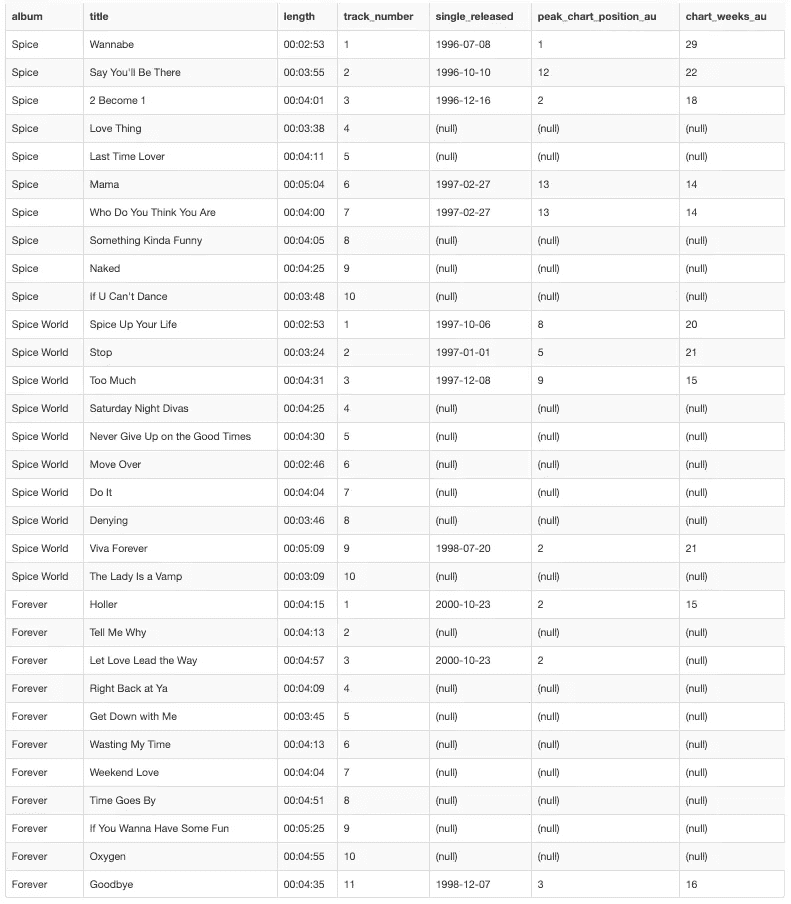

# 如何使用 SQL 对数据进行分组和聚合

> 原文：<https://towardsdatascience.com/grouping-and-aggregating-data-using-sql-7ac85d654fe4?source=collection_archive---------20----------------------->

## [在保持社交距离的同时学习数据科学](https://towardsdatascience.com/tagged/ldswsd)

## 使用 Spice Girls 示例说明如何使用 SQL 关键字 GROUP BY、MIN、MAX、COUNT、AVG 和 SUM 对数据进行分组和聚合


由 [Kiana Bosman](https://unsplash.com/@capturedby_kiana?utm_source=medium&utm_medium=referral) 在 [Unsplash](https://unsplash.com?utm_source=medium&utm_medium=referral) 上拍摄的照片

# 介绍

我非常喜欢和我的朋友一起分享我对数据科学的热爱。我们正在努力学习 SQL，已经学了三课了。如果你想从头开始，这里有一个第一课的[链接。所有的课程也可以在](/learn-data-science-while-practicing-social-distancing-lesson-1-making-a-table-using-sql-13fb9678282b)[这里](https://towardsdatascience.com/tagged/ldswsd)找到。否则，请继续学习关于使用 SQL 对数据进行分组和聚合的课程。

# 前一课

上周，我们讨论了使用 SQL 过滤数据。使用我最喜欢的一个节目，比如数据，我们在查询中使用 WHERE 子句。此外，我们还探讨了关键字 In、AND、OR、LIKE、BETWEEN 和 NOT 的用法。

# 这一课

现在我们知道了如何过滤数据，我们将转向聚合。我们将学习如何使用关键字 MIN 和 MAX 来分别查找数据的最小值和最大值。我们还将以类似的方式练习使用计数、AVG 和求和关键字。

这也将是我们遇到空值的第一课。所以我们将学习如何在我们的数据集中处理它们。

碰巧的是，我教数据科学的所有朋友都是女性。因此，在这节课中，还有什么比辣妹组合更好的例子来庆祝一点女孩的力量呢？我们将使用辣妹第一张专辑《辣妹》的数据。这是我成长过程中在我家经常看到的。

## 主要学习内容:

*   使用关键字 MIN 查找列中的最小值
*   使用关键字 MAX 查找列中的最大值
*   使用关键字 COUNT 计算列或表格中的行数
*   使用关键字 AVG 查找数字列的平均值
*   当所有值相加在一起时，使用关键字 SUM 来查找数字列的总计
*   使用关键字 GROUP BY 按表中的列进行分组
*   了解如何在上述方法中处理空值
*   了解别名的工作原理以及如何使用 AS 关键字来创建它们

# 问题是

我认为辣妹的第一张专辑是最好的一张。以防别人不信，我想找点数据来佐证。用澳大利亚的排行榜数据来分析辣妹每张专辑的单曲，我想我可以证明第一条规则！

# 数据

该数据集包含辣妹组合发行的每张专辑中所有曲目的信息。这个表格包含了每首歌的长度，每首单曲发行的时间，这首歌在澳大利亚排行榜上的最高位置，以及这首歌在澳大利亚排行榜上的第几周。我没有包括最受欢迎的专辑，因为我认为这会混淆视听。



我从[辣妹组合唱片](https://en.wikipedia.org/wiki/Spice_Girls_discography)维基百科页面、[辣妹(专辑)](https://en.wikipedia.org/wiki/Spice_(album)#Weekly_charts)维基百科页面、[辣妹世界(专辑)](https://en.wikipedia.org/wiki/Spiceworld_(album))维基百科页面、[永远(辣妹专辑)](https://en.wikipedia.org/wiki/Forever_(Spice_Girls_album))和一个[澳大利亚排行榜网站](https://australian-charts.com/showinterpret.asp?interpret=Spice+Girls)上获得了这张表的数据。

# 聚合数据的语法

在这一课中，我将教你如何在 SELECT 语句中使用聚合关键字 MIN、MAX、COUNT、SUM 和 AVG。这些聚合器也可以用在查询中的其他地方。例如，它们可以用在 HAVING 子句中，但这超出了本课的范围。我写了另一个故事[来比较 SQL](/what-is-the-difference-between-a-having-clause-and-a-where-clause-in-sql-ed74e0a8ad6d?source=friends_link&sk=10639653636d515c1c1870cc78d2d965) 中的 WHERE 和 HAVING，以防你想了解更多。

MAX 关键字可用于查找列中的最大值。它可以用于许多不同的数据类型，包括整数、浮点数、字符串和日期。

正如您在下面看到的，使用 MAX 的语法包括将 MAX 关键字放在 select 语句中。MAX 关键字后面有一组方括号，您可以在其中放置要查找其最大值的列名。

```
SELECT 
    MAX(name_column_one) AS 'largest_col_one'
FROM
    name_of_table
;
```

可以与聚合器结合使用的另一个有用的关键字是 AS。AS 用于为聚合器在返回的表中创建的列创建别名或临时名称。因为聚合器已经用在列 1 上，所以给结果起一个新的名字是很有用的，这样它在结果表中很容易识别。关键字 AS 也可以用来给一个表起一个别名，但是我们将在关于连接表的课程中讨论这个问题。

MIN 关键字的用法与 MAX 关键字非常相似。如您所料，它用于返回所选列的最小值。

```
SELECT 
    MIN(name_column_two) AS 'smallest_col_two'
FROM
    name_of_table
;
```

COUNT 是一个关键字，用于计算所选列中的行数。所以在下面的例子中，它会计算表中的总行数。

```
SELECT 
    COUNT(name_column_three) AS 'col_three_counts'
FROM
    name_of_table
;
```

但是，当对表应用了一些过滤器或分组时，COUNT 更有用。在这种情况下，您将计算表中满足筛选或分组条件的行数。

```
SELECT 
    COUNT(name_column_three) AS 'col_three_counts'
FROM
    name_of_table
WHERE
    name_column_one = value
;
```

与 MIN、MAX 和 COUNT 不同，关键字 SUM 和 AVG 只能用于包含数字数据类型(如整数或浮点数)的列。AVG 用于返回列的平均值。

```
SELECT 
    AVG(name_column_four) AS 'mean_col_four'
FROM
    name_of_table
;
```

SUM 将数字列中的值相加。使用 SUM 的语法与其他聚合器相同。

```
SELECT 
    SUM(name_column_five) AS 'summed_col_five'
FROM
    name_of_table
;
```

# 对数据分组的语法

分组对于汇总具有重复值的数据非常有用。它通常与聚合器 MIN、MAX、COUNT、SUM 和 AVG 一起使用。GROUP BY 将应用它的列中的相同值收集在一起。然后可以基于这些分组在另一列上使用聚合器。GROUP BY 子句通常用于包含类别值的列。

例如，如果将 AVG 聚合器与 GROUP BY 一起使用，则可以找到一列中每组值在另一列中的平均值。这个例子的语法如下所示。在这种情况下，返回的表将包含第一列中第二列中每个值的平均值。

```
SELECT 
    AVG(name_column_one) AS mean_col_one, name_column_two
FROM
    name_of_table
GROUP BY 
    name_column_two
;
```

# 空值会发生什么？

当字段中没有输入值时，就会出现空值。所以它就像一个占位符，让你知道表中有一个空的位置。它不同于 0 值或空字符串“”，因为它们仍然是值。NULL 有自己的关键字。

可以使用 IS NULL 关键字检查列中的空值。这是在 WHERE 语句中完成的，将只返回在 WHERE 语句中指定的列中包含 NULL 值的记录。

```
SELECT 
    *
FROM
    name_of_table
WHERE
    name_column_one IS NULL
;
```

但是，更常见的情况是您希望排除所有包含空值的记录。在这种情况下，您可以在查询中添加 NOT 关键字。在下面的示例中，只有第二列中没有空值的记录才会包含在返回的表中。

```
SELECT 
    *
FROM
    name_of_table
WHERE
    name_column_two IS NOT NULL
;
```

聚合关键字 MIN、MAX、AVG、SUM 和 COUNT 会忽略空值。对于最小值和最大值，这是相当简单的，您将在忽略所有空值的列中获得最小值或最大值。类似地，对于 SUM，列中所有不为空的值将被加在一起。对于 AVG，当所有空值都被删除时，您将获得列的平均值。

COUNT 只是稍微复杂一点，除了包含空值的行之外，所选列中的所有行将被计数。该规则的唯一例外如下所示。在这种情况下，无论是否有空值，都将计算表中的所有行。

```
SELECT 
    COUNT(*)
FROM 
    name_of_table
;
```

与聚合器不同，GROUP BY 不忽略空值。相反，它们被组合在一起作为单个分组类别。

# 现在让我们试着解决我们的问题

1.  去[http://sqlfiddle.com/](http://sqlfiddle.com/)(或者你可以用[https://www.db-fiddle.com/](https://www.db-fiddle.com/)，因为我发现 SQL fiddle 最近停机了一段时间)
2.  在左边的框中放入创建表并插入到下面的查询中

```
CREATE TABLE spice_girls(
    album varchar(255),
    title varchar(255),
    length TIME(0),
    track_number int,
    single_released date,
    peak_chart_position_au int,
    chart_weeks_au int);INSERT INTO spice_girls(
    album,
    title,
    length,
    track_number,
    single_released,
    peak_chart_position_au,
    chart_weeks_au
)
VALUES
    ("Spice", "Wannabe", '000:02:53', 1, '1996-07-08', 1, 29),
    ("Spice", "Say You'll Be There", '000:03:55', 2, '1996-10-10', 12, 22),
    ("Spice", "2 Become 1", '000:04:01', 3, '1996-12-16', 2, 18),
    ("Spice", "Love Thing", '000:03:38', 4, NULL, NULL, NULL),
    ("Spice", "Last Time Lover", '000:04:11', 5, NULL, NULL, NULL),
    ("Spice", "Mama", '000:05:04', 6, '1997-02-27', 13, 14),    
    ("Spice", "Who Do You Think You Are", '000:04:00', 7, '1997-02-27', 13, 14),
    ("Spice", "Something Kinda Funny", '000:04:05', 8, NULL, NULL, NULL),
    ("Spice", "Naked", '000:04:25', 9, NULL, NULL, NULL),
    ("Spice", "If U Can't Dance", '000:03:48', 10, NULL, NULL, NULL),
    ("Spice World", "Spice Up Your Life", '000:02:53', 1, '1997-10-06', 8, 20),
    ("Spice World", "Stop", '000:03:24', 2, '1997-01-01', 5, 21),
    ("Spice World", "Too Much", '000:04:31', 3, '1997-12-08', 9, 15),
    ("Spice World", "Saturday Night Divas", '000:04:25', 4, NULL, NULL, NULL),
    ("Spice World", "Never Give Up on the Good Times", '000:04:30', 5, NULL, NULL, NULL),
    ("Spice World", "Move Over", '000:02:46', 6, NULL, NULL, NULL),    
    ("Spice World", "Do It", '000:04:04', 7, NULL, NULL, NULL),
    ("Spice World", "Denying", '000:03:46', 8, NULL, NULL, NULL),
    ("Spice World", "Viva Forever", '000:05:09', 9, '1998-07-20', 2, 21),
    ("Spice World", "The Lady Is a Vamp", '000:03:09', 10, NULL, NULL, NULL),
    ("Forever", "Holler", '000:04:15', 1, '2000-10-23', 2, 15),
    ("Forever", "Tell Me Why", '000:04:13', 2, NULL, NULL, NULL),
    ("Forever", "Let Love Lead the Way", '000:04:57', 3, '2000-10-23', 2, NULL),
    ("Forever", "Right Back at Ya", '000:04:09', 4, NULL, NULL, NULL),
    ("Forever", "Get Down with Me", '000:03:45', 5, NULL, NULL, NULL),
    ("Forever", "Wasting My Time", '000:04:13', 6, NULL, NULL, NULL),    
    ("Forever", "Weekend Love", '000:04:04', 7, NULL, NULL, NULL),
    ("Forever", "Time Goes By", '000:04:51', 8, NULL, NULL, NULL),
    ("Forever", "If You Wanna Have Some Fun", '000:05:25', 9, NULL, NULL, NULL),
    ("Forever", "Oxygen", '000:04:55', 10, NULL, NULL, NULL),
    ("Forever", "Goodbye", '000:04:35', 11, '1998-12-07', 3, 16)
;
```

**关于特殊字符的注意事项:**在创建这个表格的过程中，我们遇到了一个新的语法上的细微差别，这是我们在前面的课程中没有看到的。一些歌曲名称包含撇号。因此，如果我们像往常一样用单引号''将歌曲名称字符串括起来，就会出现错误。这是因为撇号会被程序误认为是结束引用。因此，要在我们的表中包含一个包含撇号的字符串，我们需要在字符串周围使用双引号。

如果需要一个包含双引号的字符串，也可以反过来。如果你想了解更多关于引号这样的特殊字符，这是一个很好的资源。

**关于时间数据类型的注意事项:**这个表中还有一个数据类型，我们在前面的任何课程中都没有见过。它是时间数据类型。时间的格式为“小时:分钟:秒”。

3.单击“构建模式”按钮

4.在右边的框中输入您的问题

5.运行下面的查询，看看它是否会返回您所期望的结果:

```
SELECT
    SUM(length) AS 'total_length'
FROM 
    spice_girls
;
```

6.运行下面的查询，看看它是否会返回您所期望的结果:

```
SELECT
    SUM(length) AS 'album_length', 
    album
FROM 
    spice_girls
GROUP BY 
    album
;
```

7.运行下面的查询，看看它是否会返回您所期望的结果:

```
SELECT
    album,
    SUM(length) AS 'album_length', 
    AVG(length) AS 'average_song_length',
    COUNT(length) AS 'number_of_songs',
    MIN(length) AS 'shortest_song_length',
    MAX(length) AS 'longest_song_length'
FROM 
    spice_girls
GROUP BY 
    album
ORDER BY 
    album
;
```

**练习 1:** 写一个查询，显示哪张专辑是最好的，如果我们把最好的专辑定义为其中一张单曲的最高峰值排行榜位置。

**练习 2:** 如果我们将最佳专辑定义为专辑中所有单曲的平均峰值排行榜位置最高的专辑，编写一个查询来显示哪张专辑是最佳专辑。

**练习 3:** 写一个查询，显示哪张专辑是最好的，如果我们把最好的专辑定义为在澳洲排行榜上至少 5 周单曲数最高的那张专辑。

# 学习回顾

学完本课后，你应该知道:

*   如何使用关键字 MIN 查找列中的最小值
*   如何使用关键字 MAX 查找列中的最大值
*   如何使用关键字 COUNT 计算列或表格中的行数
*   如何使用关键字 AVG 来寻找一个数字列的平均值
*   当所有值相加时，如何使用关键字 SUM 来计算数字列的总和
*   如何使用关键字 GROUP BY 按表中的列进行分组
*   了解如何处理空值
*   能够使用上述一种或多种方法编写自己的查询
*   能够使用 AS 关键字为聚合列创建别名

# 下一课

下周将是我们最后一堂 SQL 课。我们将学习如何将表连接在一起。我们可以使用 UNION、UNION ALL 和 JOIN 关键字以几种不同的方式组合数据集。如果你渴望在下周之前开始研究连接，我之前写过一篇关于 SQL 中内部和外部连接的[区别的文章。](/what-is-the-difference-between-an-inner-and-an-outer-join-in-sql-5b5ec8277377?source=your_stories_page---------------------------)

除了数据，我的另一个爱好是绘画。你可以在 www.katemarielewis.com 的[找到我的野生动物艺术](http://www.katemarielewis.com)

# 社交距离学习数据科学的所有课程(LDSWSD)

[](https://towardsdatascience.com/tagged/ldswsd) [## Ldswsd -走向数据科学

### 阅读《走向数据科学》中关于 Ldswsd 的文章。共享概念、想法和代码的媒体出版物。

towardsdatascience.com](https://towardsdatascience.com/tagged/ldswsd)