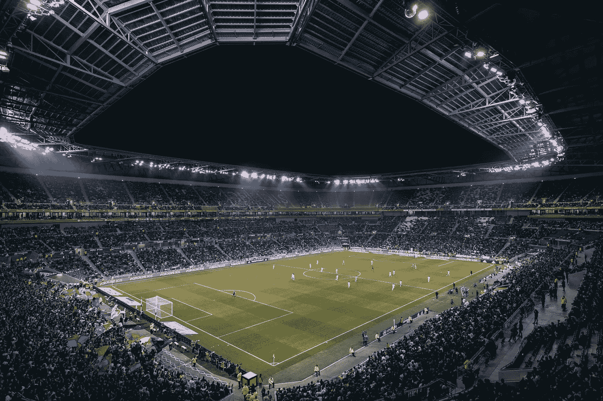
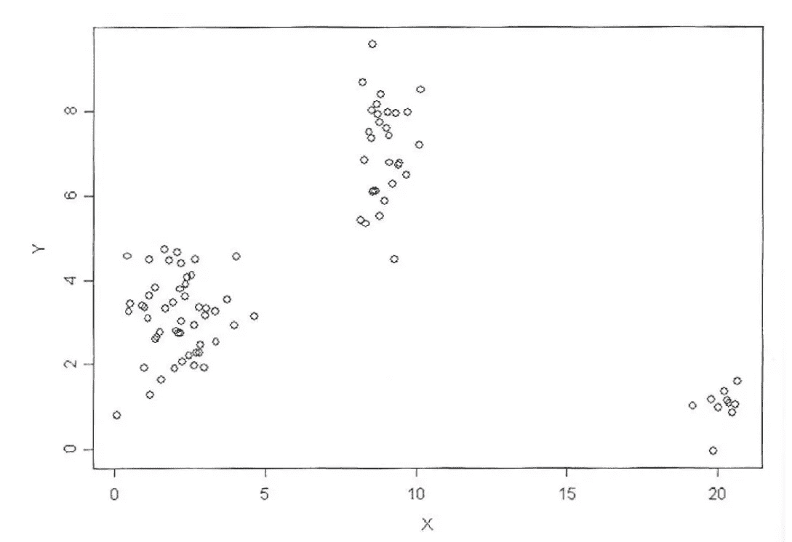
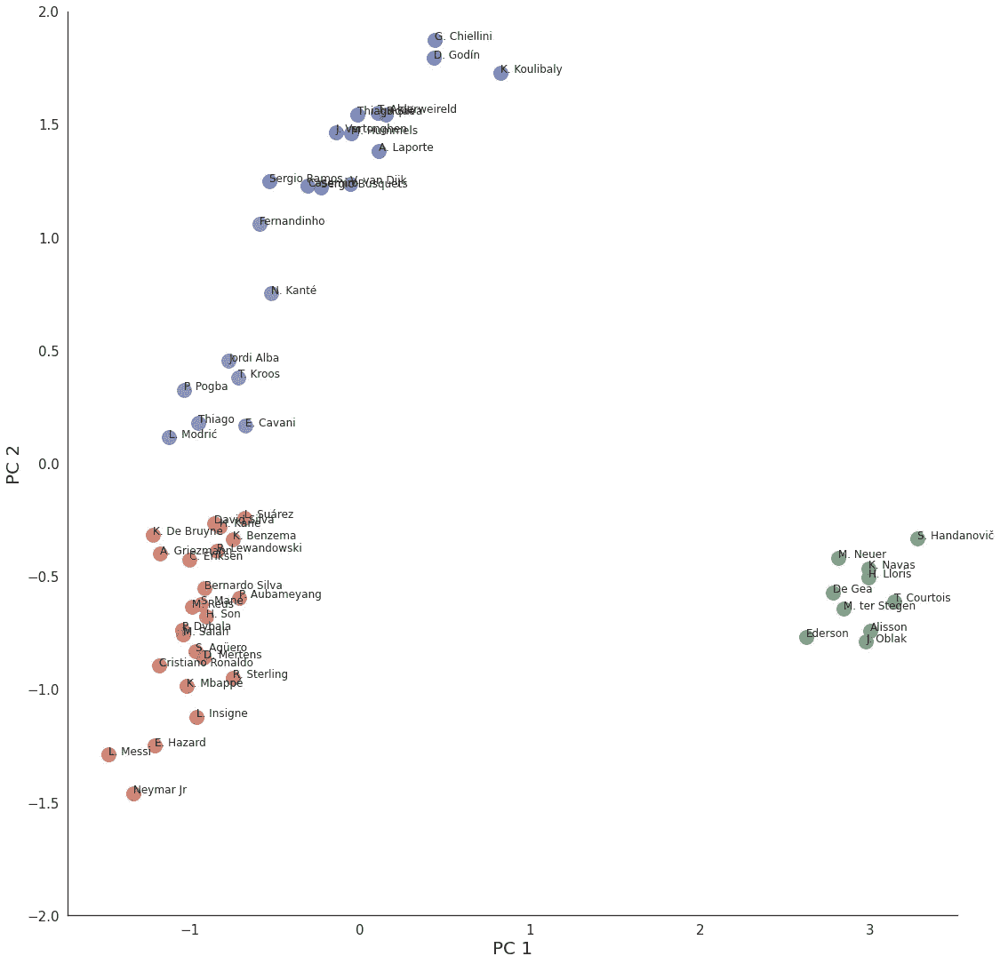

# 国际足联 20 |第 1 部分:K-均值聚类

> 原文：<https://towardsdatascience.com/grouping-soccer-players-with-similar-skillsets-in-fifa-20-part-1-k-means-clustering-c4a845db78bc?source=collection_archive---------37----------------------->

## [机器学习中的聚类分析](https://towardsdatascience.com/tagged/clustering-analysis-in-ml)

## 机器学习中的聚类算法教程的第 1 部分



由[托马斯·塞勒](https://unsplash.com/@jesusance?utm_source=unsplash&utm_medium=referral&utm_content=creditCopyText)在 [Unsplash](/s/photos/soccer?utm_source=unsplash&utm_medium=referral&utm_content=creditCopyText) 上拍摄的照片

视频版本

# 介绍

足球(欧洲足球)是我从小就喜欢的运动之一。我过去无论去哪里都带着一个球，这样我就可以最大限度地利用踢足球的机会。

我也喜欢踢足球——国际足联。我觉得用机器学习来分析国际足联的球员会很酷。

在本教程中，我将使用 K-Means 聚类算法对 FIFA 20 中具有相似技能的足球运动员进行分组。

# 了解聚类

聚类是一种无监督学习技术(PCA 是另一种)。

我们可以将观测值聚类(或分组)到相同的子组中，使得子组中的观测值彼此非常相似，而不同子组中的观测值彼此非常不同。



聚类示例

上面的散点图向我们展示了数据集中有三个不同的组。

# 了解 K-均值聚类

K-Means 聚类是聚类算法的一种。

基本算法是这样的:

*   指定 K 簇并初始化随机质心
*   迭代直到集群分配停止变化。该方法将每个观察精确地分配给 K 个聚类中的一个
*   对于每个 K 分类，计算分类平均值
*   继续查看观察值列表，并将一个观察值分配给平均值最接近的群集。

目标是以这样一种方式形成聚类，即同一聚类内的观察尽可能相似。

K-Means 聚类使用平方欧几里得距离计算相似性。

# **数据集**

我们准备用 Kaggle 的 [**FIFA 20 数据集**](https://www.kaggle.com/stefanoleone992/fifa-20-complete-player-dataset/data?select=players_20.csv) **。**

# 特征工程

我们将只选择数字值和每个玩家的名字。

```
df = df[['short_name','age', 'height_cm', 'weight_kg', 'overall', 'potential','value_eur', 'wage_eur', 'international_reputation', 'weak_foot','skill_moves', 'release_clause_eur', 'team_jersey_number','contract_valid_until', 'nation_jersey_number', 'pace', 'shooting','passing', 'dribbling', 'defending', 'physic', 'gk_diving','gk_handling', 'gk_kicking', 'gk_reflexes', 'gk_speed','gk_positioning', 'attacking_crossing', 'attacking_finishing','attacking_heading_accuracy', 'attacking_short_passing','attacking_volleys', 'skill_dribbling', 'skill_curve','skill_fk_accuracy', 'skill_long_passing', 'skill_ball_control','movement_acceleration', 'movement_sprint_speed', 'movement_agility','movement_reactions', 'movement_balance', 'power_shot_power','power_jumping', 'power_stamina', 'power_strength', 'power_long_shots','mentality_aggression', 'mentality_interceptions','mentality_positioning', 'mentality_vision', 'mentality_penalties','mentality_composure', 'defending_marking', 'defending_standing_tackle','defending_sliding_tackle', 'goalkeeping_diving','goalkeeping_handling', 'goalkeeping_kicking','goalkeeping_positioning', 'goalkeeping_reflexes']]
```

我正在抽取工装裤在 86 以上的玩家，因为我们不想用 18000 以上的玩家来分组。

```
df = df[df.overall > 86] # extracting players with overall above 86
```

用平均值替换空值。

```
df = df.fillna(df.mean())
```

使数据正常化(标准化/重新标度)。

*   我们希望将数据标准化，因为变量是在不同的尺度上测量的。

```
from sklearn import preprocessingx = df.values # numpy arrayscaler = preprocessing.MinMaxScaler()x_scaled = scaler.fit_transform(x)X_norm = pd.DataFrame(x_scaled)
```

使用主成分分析将该图的 60 维减少到 2 维。

```
from sklearn.decomposition import PCApca = PCA(n_components = 2) # 2D PCA for the plotreduced = pd.DataFrame(pca.fit_transform(X_norm))
```

# **执行 K 均值聚类**

我们将指定有 5 个集群。

```
from sklearn.cluster import KMeans # specify the number of clusterskmeans = KMeans(n_clusters=5)# fit the input datakmeans = kmeans.fit(reduced)# get the cluster labelslabels = kmeans.predict(reduced)# centroid valuescentroid = kmeans.cluster_centers_# cluster valuesclusters = kmeans.labels_.tolist()
```

通过添加玩家的名字和他们的集群创建一个新的数据框。

```
reduced['cluster'] = clustersreduced['name'] = namesreduced.columns = ['x', 'y', 'cluster', 'name']reduced.head()
```

# **可视化 K 均值聚类图**

```
import matplotlib.pyplot as pltimport seaborn as sns%matplotlib inlinesns.set(style="white")ax = sns.lmplot(x="x", y="y", hue='cluster', data = reduced, legend=False,fit_reg=False, size = 15, scatter_kws={"s": 250})texts = []for x, y, s in zip(reduced.x, reduced.y, reduced.name):texts.append(plt.text(x, y, s))ax.set(ylim=(-2, 2))plt.tick_params(labelsize=15)plt.xlabel("PC 1", fontsize = 20)plt.ylabel("PC 2", fontsize = 20)plt.show()
```



k 均值聚类

看看基于玩家位置的集群是如何形成的，这很酷！

我希望你觉得这个教程有用，并期待下一个！