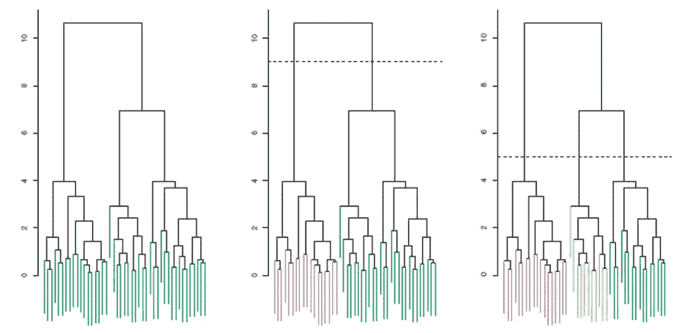
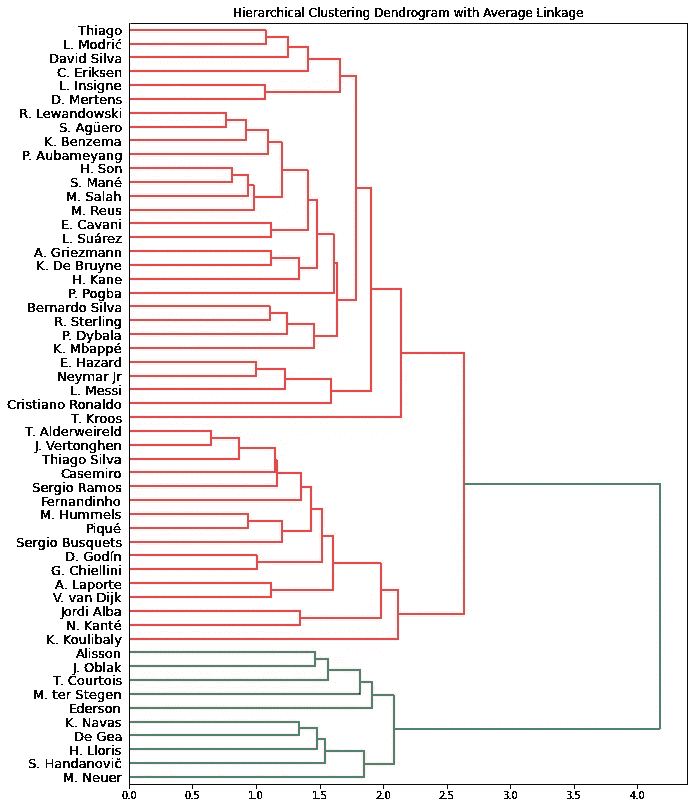
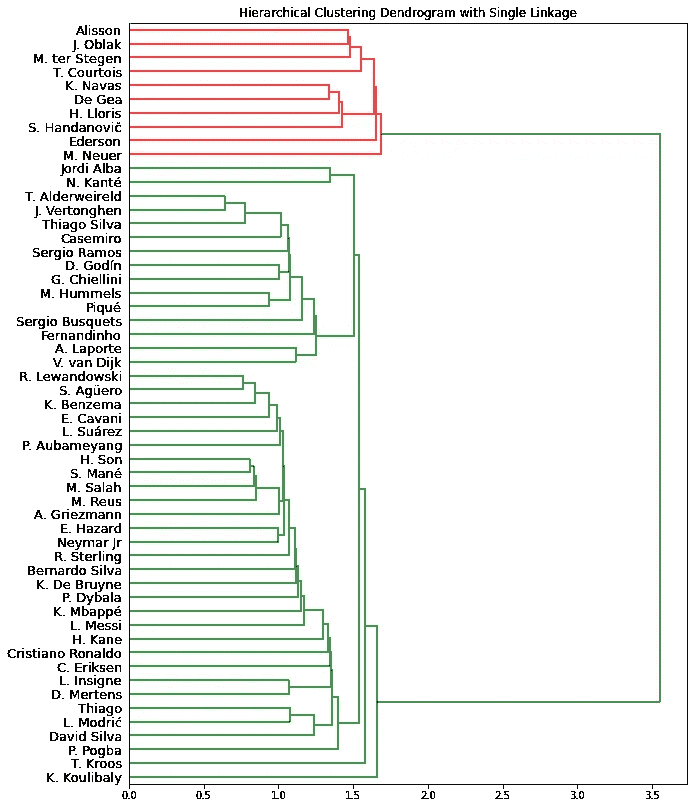
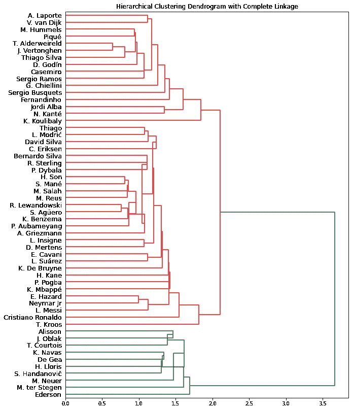
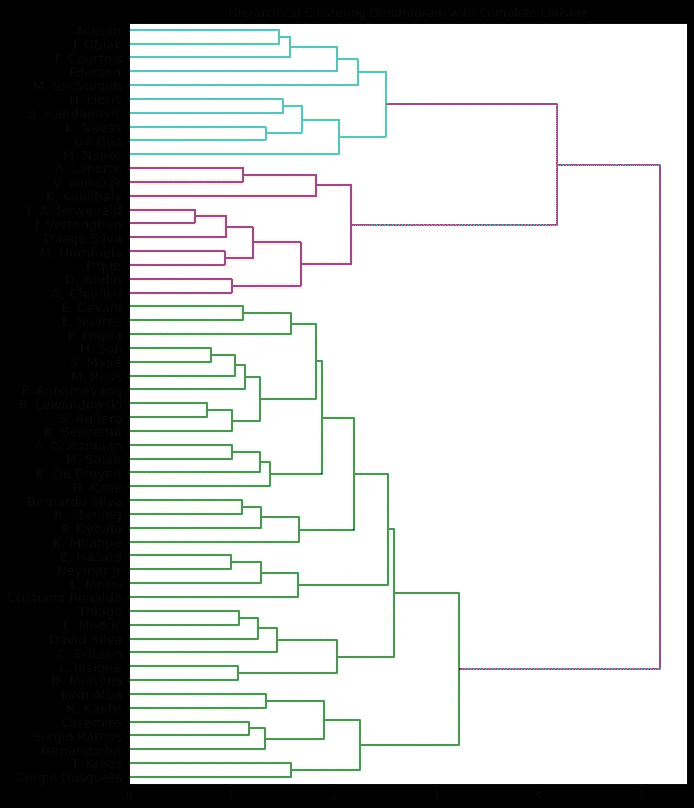

# FIFA 20 中具有相似技能的足球运动员分组|第 2 部分:层次聚类

> 原文：<https://towardsdatascience.com/grouping-soccer-players-with-similar-skillsets-in-fifa-20-part-2-hierarchical-clustering-839705f6d37d?source=collection_archive---------39----------------------->

## [机器学习中的聚类分析](https://towardsdatascience.com/tagged/clustering-analysis-in-ml)

## 机器学习中的聚类算法教程的第 2 部分


由[托马斯·塞勒](https://unsplash.com/@jesusance?utm_source=unsplash&utm_medium=referral&utm_content=creditCopyText)在 [Unsplash](https://towardsdatascience.com/s/photos/soccer?utm_source=unsplash&utm_medium=referral&utm_content=creditCopyText) 上拍摄的照片

视频版本

查看我的聚类算法系列 [**这里**](https://towardsdatascience.com/tagged/clustering-analysis-in-ml) 。

在本教程中，我们将使用层次聚类对 FIFA 20 名球员进行分组！

# 了解分层聚类

*   与 K-means 不同，不需要指定聚类数。
*   结果汇总在一个树状图中，这是一个树形图，可以轻松解释数据并选择任意数量的聚类

## **基本思想**

*   **焦点**:自下而上(又名。凝聚聚类)
*   从个人观察开始(又名。**叶子**成簇
*   通过将叶子合并成**分支**向上移动
*   将树枝与其他树叶或树枝合并
*   最终，当所有的东西都合并成一个集群时，到达顶端



树状图示例

## 解读树状图

*   在适当的高度切割，以获得所需的簇数
*   **纵轴**:相异度(或距离)——两个聚类合并的高度
*   高度代表聚类的相似性
*   **身高更低- >更相似**
*   横轴不表示相似性
*   交换左右分支不会影响树状图的含义

## 它如何度量集群之间的不相似性？

1.  基于公制的(曼哈顿距离或欧几里德距离——最常见)

*   完全连锁(最远邻法)
*   单一连锁(最近邻法)
*   平均连锁
*   质心连杆机构

2.基于相关性的距离

*   找出观察值之间的相关性

## 分层聚类的缺点

1.  计算成本高—不适合大数据集

*   O(N log N)，而 O(N)用于 K-means

2.对噪音和异常值敏感

# 使用层次聚类对 FIFA 20 球员进行分组

## 数据清理/预处理(第 1 部分的代码)

```
import pandas as pdimport numpy as npdf = pd.read_csv("/content/players_20.csv")df = df[['short_name','age', 'height_cm', 'weight_kg', 'overall', 'potential','value_eur', 'wage_eur', 'international_reputation', 'weak_foot','skill_moves', 'release_clause_eur', 'team_jersey_number','contract_valid_until', 'nation_jersey_number', 'pace', 'shooting','passing', 'dribbling', 'defending', 'physic', 'gk_diving','gk_handling', 'gk_kicking', 'gk_reflexes', 'gk_speed','gk_positioning', 'attacking_crossing', 'attacking_finishing','attacking_heading_accuracy', 'attacking_short_passing','attacking_volleys', 'skill_dribbling', 'skill_curve','skill_fk_accuracy', 'skill_long_passing', 'skill_ball_control','movement_acceleration', 'movement_sprint_speed', 'movement_agility','movement_reactions', 'movement_balance', 'power_shot_power','power_jumping', 'power_stamina', 'power_strength', 'power_long_shots','mentality_aggression', 'mentality_interceptions','mentality_positioning', 'mentality_vision', 'mentality_penalties','mentality_composure', 'defending_marking', 'defending_standing_tackle','defending_sliding_tackle','goalkeeping_diving','goalkeeping_handling', 'goalkeeping_kicking','goalkeeping_positioning', 'goalkeeping_reflexes']]df = df[df.overall > 86] # extracting players with overall above 86df = df.fillna(df.mean())names = df.short_name.tolist() # saving names for laterdf = df.drop(['short_name'], axis = 1) # drop the short_name columndf.head()
```

## 标准化数据

```
from sklearn import preprocessingx = df.values # numpy arrayscaler = preprocessing.MinMaxScaler()x_scaled = scaler.fit_transform(x)X_norm = pd.DataFrame(x_scaled)
```

## 平均链接的层次聚类

```
import matplotlib.pyplot as pltimport scipy.cluster.hierarchy as sch# plot dendrogram using average linkageplt.figure(figsize=(10,14))plt.title('Hierarchical Clustering Dendrogram with Average Linkage')dendrogram = sch.dendrogram(sch.linkage(X_norm, method="average"), labels= names, leaf_font_size = 13, orientation='right')
```



*   分成两个位置——守门员和其他人

## 单键

```
# plot dendrogram using single linkageplt.figure(figsize=(10,14))plt.title('Hierarchical Clustering Dendrogram with Single Linkage')dendrogram = sch.dendrogram(sch.linkage(X_norm, method="single"), labels= names, leaf_font_size = 13, orientation='right')
```



*   分成守门员和其他人

## 质心连杆机构

```
# plot dendrogram using centroid linkageplt.figure(figsize=(10,14))plt.title('Hierarchical Clustering Dendrogram with Centroid Linkage')dendrogram = sch.dendrogram(sch.linkage(X_norm, method="centroid"), labels= names, leaf_font_size = 13, orientation='right')
```



*   再一次，分成守门员和其他人

## 完全连锁

```
# plot dendrogram using complete linkageplt.figure(figsize=(10,14))plt.title('Hierarchical Clustering Dendrogram with Complete Linkage')dendrogram = sch.dendrogram(sch.linkage(X_norm, method="complete"), labels= names, leaf_font_size = 13, orientation='right')
```



# 结论

完全联动似乎对玩家分组最准确！

感谢你阅读这篇文章，希望你觉得有用！

GitHub 回购:[https://github.com/importdata/Clustering-FIFA-20-Players](https://github.com/importdata/Clustering-FIFA-20-Players)