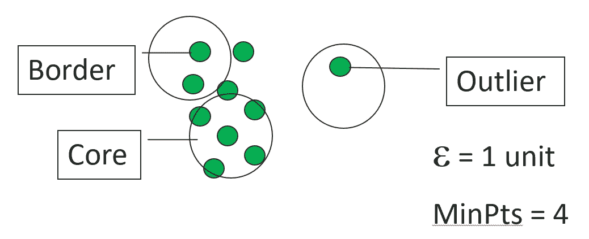
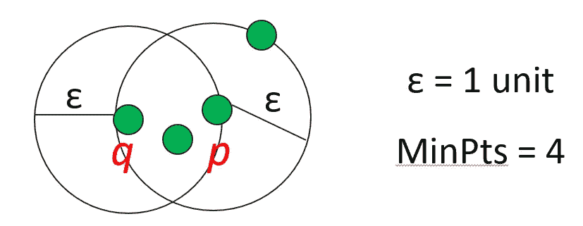
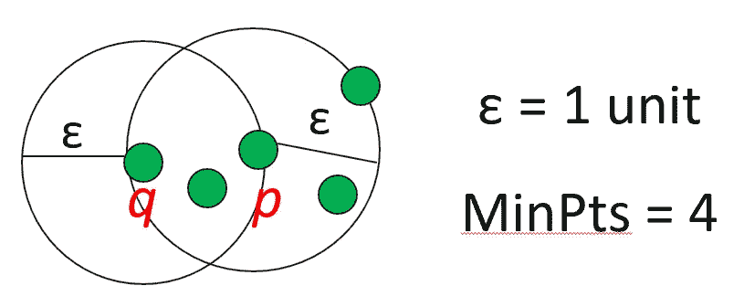
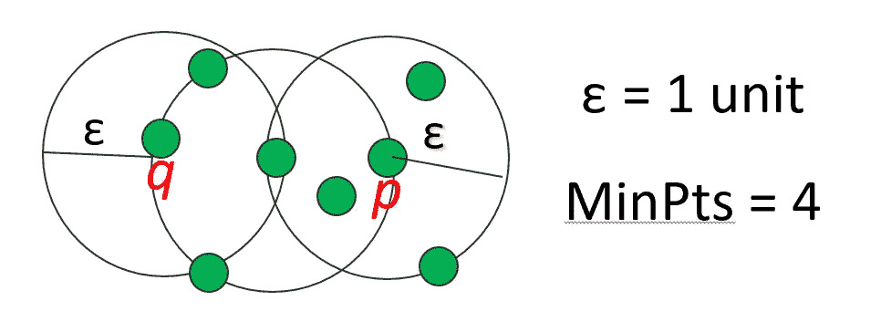
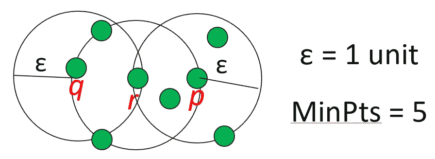
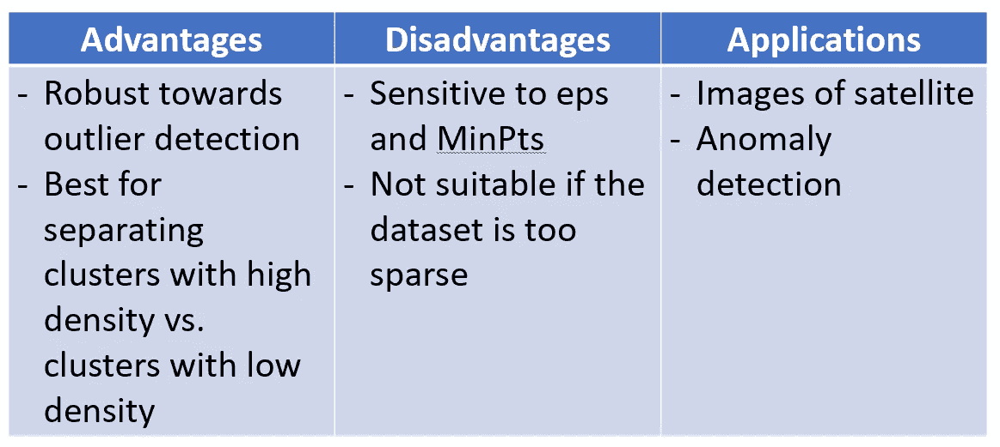
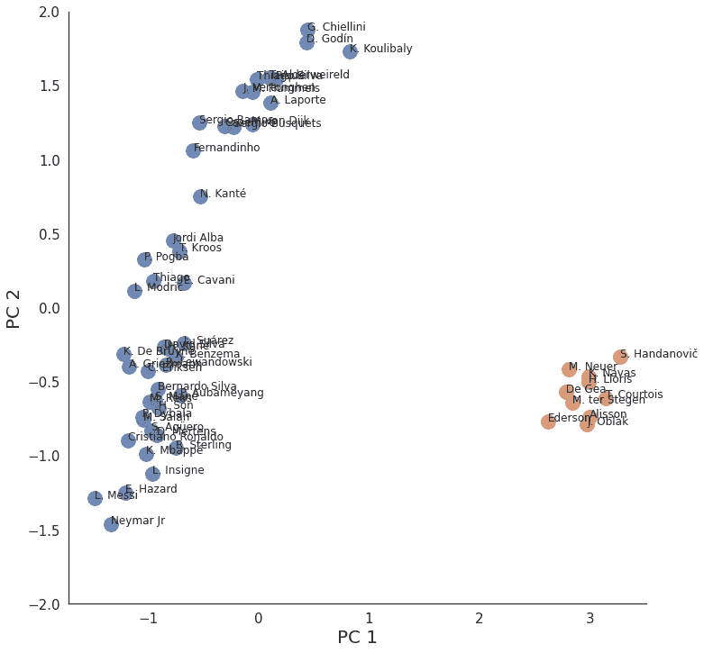
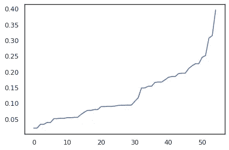
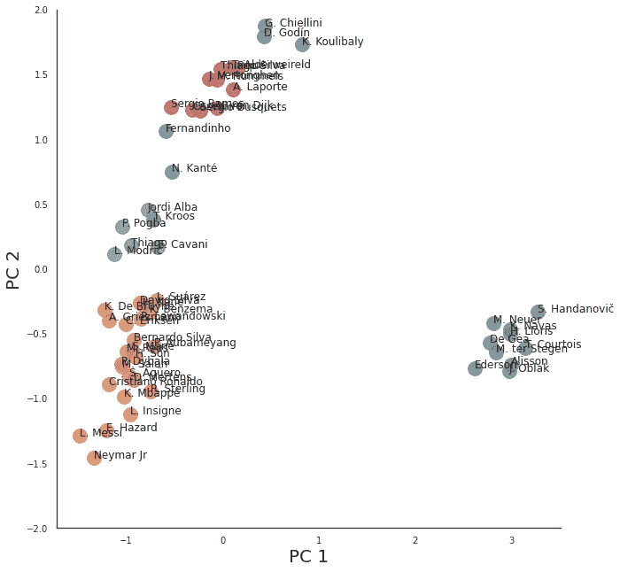

# FIFA 20 中具有相似技能的足球运动员分组|第 3 部分:DBSCAN

> 原文：<https://towardsdatascience.com/grouping-soccer-players-with-similar-skillsets-in-fifa-20-part-3-dbscan-b23389a08cc7?source=collection_archive---------43----------------------->

## [机器学习中的聚类分析](https://towardsdatascience.com/tagged/clustering-analysis-in-ml)

## 机器学习中的聚类算法教程的第 3 部分


由[托马斯·塞勒](https://unsplash.com/@jesusance?utm_source=unsplash&utm_medium=referral&utm_content=creditCopyText)在 [Unsplash](https://towardsdatascience.com/s/photos/soccer?utm_source=unsplash&utm_medium=referral&utm_content=creditCopyText) 上拍摄的照片

视频版本

查看我的聚类算法系列 [**这里**](https://towardsdatascience.com/tagged/clustering-analysis-in-ml) 。

在本教程中，我们将使用 DBSCAN 算法对 FIFA 20 名球员进行分组！

# 了解 DBSCAN

*   基于密度的含噪声应用空间聚类
*   基于密度的聚类定位被低密度区域彼此分开的高密度区域
*   密度:指定半径内的点数。Eps 或ε)

## 点

*   **核心点**:如果一个点在 Eps 内有超过规定的点数(分点数)
*   **边界点**:它在 Eps 内的分点少于，但在核心点的附近
*   **噪声(离群点):**不是核心点或边界点的任何点



核心、边界、异常值示例

## 集群是如何形成的？

1.  选择一个点 p
2.  检索从 p . w . r . t . EPS 和 MinPts 可达到的所有点密度。

*   如果 p 是一个核心点，就形成了一个集群。
*   如果 p 是一个边界点，没有点是从 p 密度可达的，DBSCAN 访问数据库的下一个点。

3.继续该过程，直到处理完所有点。

4.结果与处理点的顺序无关

## ε-邻域概念

*   距离一个物体ε半径内的物体
*   核心对象:一个对象的ε-邻域至少包含**个对象的 MinPts**



p 是一个核心对象

## 能达到性

*   **直接密度可达**:如果 q 在 p 的ε-邻域内，且 p 是核心点，则点 q 是从 p 直接密度可达的。



q 是从 p 直接密度可达的

*   **密度可达**:如果点“p”距离点“q”在ε距离内，并且“q”在它的相邻点中有足够多的点在ε距离内，则称点“p”是从点“q”密度可达的。



q 是从 p 密度可达的吗

## 连通性

*   **密度-连通性**:如果有一个点 r 使得 p 和 q 是从 r w.r.t 和 MinPts 密度可达的，则点 p 是密度-连通到点 q w.r.t 和 MinPts 的



q 通过 r 与 p 密度相关

## 优点、缺点和应用



# 使用 DBSCAN 对 FIFA 20 名球员进行分组

## 数据清理/预处理(第 1 部分和第 2 部分的代码)

```
import pandas as pdimport numpy as npdf = pd.read_csv("/content/players_20.csv")df = df[['short_name','age', 'height_cm', 'weight_kg', 'overall', 'potential','value_eur', 'wage_eur', 'international_reputation', 'weak_foot','skill_moves', 'release_clause_eur', 'team_jersey_number','contract_valid_until', 'nation_jersey_number', 'pace', 'shooting','passing', 'dribbling', 'defending', 'physic', 'gk_diving','gk_handling', 'gk_kicking', 'gk_reflexes', 'gk_speed','gk_positioning', 'attacking_crossing','attacking_finishing','attacking_heading_accuracy', 'attacking_short_passing','attacking_volleys', 'skill_dribbling', 'skill_curve','skill_fk_accuracy', 'skill_long_passing','skill_ball_control','movement_acceleration', 'movement_sprint_speed', 'movement_agility','movement_reactions', 'movement_balance', 'power_shot_power','power_jumping', 'power_stamina', 'power_strength', 'power_long_shots','mentality_aggression', 'mentality_interceptions','mentality_positioning', 'mentality_vision', 'mentality_penalties','mentality_composure', 'defending_marking', 'defending_standing_tackle','defending_sliding_tackle', 'goalkeeping_diving','goalkeeping_handling', 'goalkeeping_kicking','goalkeeping_positioning', 'goalkeeping_reflexes']]df = df[df.overall > 86] # extracting players with overall above 86df = df.fillna(df.mean())names = df.short_name.tolist() # saving names for laterdf = df.drop(['short_name'], axis = 1) # drop the short_name columndf.head()
```

## 标准化数据

```
from sklearn import preprocessingx = df.values # numpy arrayscaler = preprocessing.MinMaxScaler()x_scaled = scaler.fit_transform(x)X_norm = pd.DataFrame(x_scaled)
```

## 使用主成分分析将 60 列减少为 2 列

```
from sklearn.decomposition import PCApca = PCA(n_components = 2) # 2D PCA for the plotreduced = pd.DataFrame(pca.fit_transform(X_norm))
```

## 应用数据库扫描

```
from sklearn.cluster import DBSCAN# train the model using DBSCANdb = DBSCAN(eps=1, min_samples=5)# the prediction for dbscan clustersdb_clusters = db.fit_predict(reduced)
```

## 通过添加玩家的名字和他们的集群创建一个新的数据框

```
reduced['cluster'] = db_clustersreduced['name'] = namesreduced.columns = ['x', 'y', 'cluster', 'name']reduced.head()
```

## 绘制 DBSCAN

```
import matplotlib.pyplot as pltimport seaborn as sns%matplotlib inlinesns.set(style="white")ax = sns.lmplot(x="x", y="y", hue='cluster', data = reduced, legend=False,fit_reg=False, size = 10, scatter_kws={"s": 250})texts = []for x, y, s in zip(reduced.x, reduced.y, reduced.name): texts.append(plt.text(x, y, s)) ax.set(ylim=(-2, 2))plt.tick_params(labelsize=15)plt.xlabel("PC 1", fontsize = 20)plt.ylabel("PC 2", fontsize = 20)plt.show()
```



Eps = 1 且 MinPts = 5 时的 DBSCAN

*   集群被组成守门员对抗其他的
*   不太准确

## 找到一个最佳的ε

*   通过计算每个点到最近的 n 个点的距离，排序并绘制结果，找到一个最佳ε。

```
from sklearn.neighbors import NearestNeighbors# calculate the distance from each point to its closest neighbornn = NearestNeighbors(n_neighbors = 2)# fit the nearest neighbornbrs = nn.fit(reduced)# returns two arrays - distance to the closest n_neighbors points and index for each pointdistances, indices = nbrs.kneighbors(reduced)# sort the distance and plot itdistances = np.sort(distances, axis=0)distances = distances[:,1]plt.plot(distances)
```



寻找最佳 Eps

*   看起来曲率在 eps = 0.3 左右开始加快

## 使用新的 Eps 再次应用 DBSCAN

```
from sklearn.cluster import DBSCAN# train the model using DBSCANdb= DBSCAN(eps=0.3, min_samples=4)# prediction for dbscan clustersdb_clusters = db.fit_predict(reduced)reduced['cluster'] = db_clustersreduced['name'] = namesreduced.columns = ['x', 'y', 'cluster', 'name']reduced.head()
```

## 用新的 Eps = 0.3 和 MinPts = 4 再次绘图

```
import matplotlib.pyplot as pltimport seaborn as sns%matplotlib inlinesns.set(style="white")ax = sns.lmplot(x="x", y="y", hue='cluster', data = reduced, legend=False,fit_reg=False, size = 9, scatter_kws={"s": 250})texts = []for x, y, s in zip(reduced.x, reduced.y, reduced.name): texts.append(plt.text(x, y, s)) ax.set(ylim=(-2, 2))plt.tick_params(labelsize=10)plt.xlabel("PC 1", fontsize = 20)plt.ylabel("PC 2", fontsize = 20)plt.show()
```



Eps = 0.3、MinPts = 4 时的 DBSCAN 图

# 结论

Epsilon = 0.3 和 MinPts = 4 的 DBSCAN 在分组和检测异常值方面做得更好！

感谢你阅读这篇文章，希望你觉得有用！

GitHub 回购:[https://github.com/importdata/Clustering-FIFA-20-Players](https://github.com/importdata/Clustering-FIFA-20-Players)