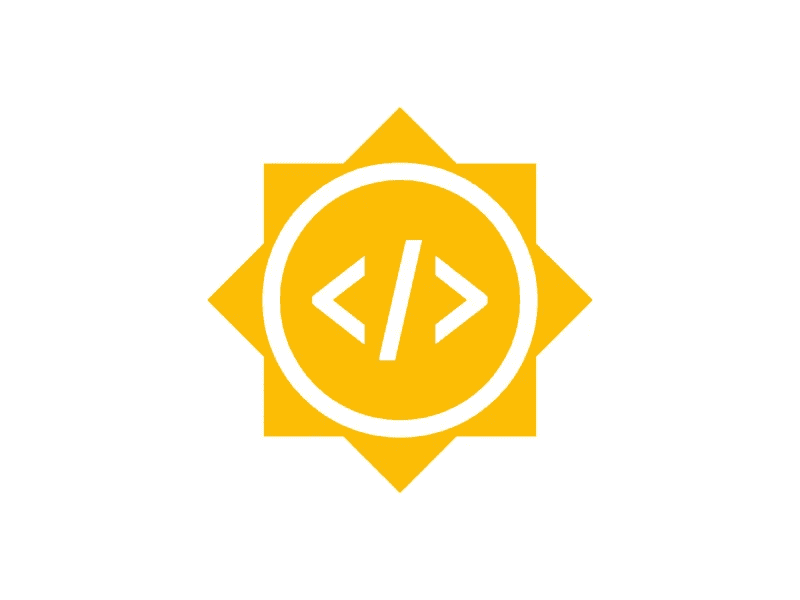
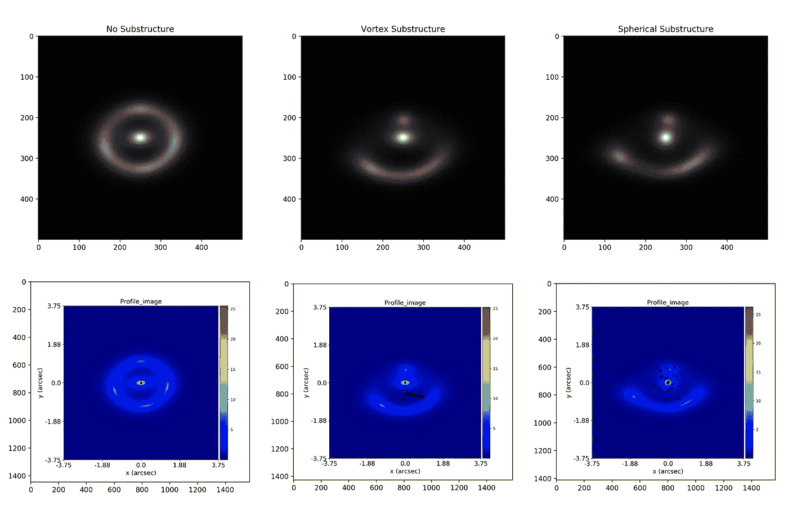
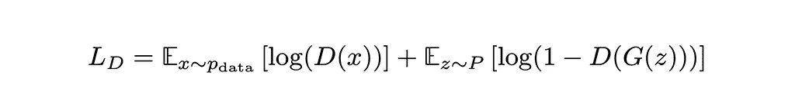
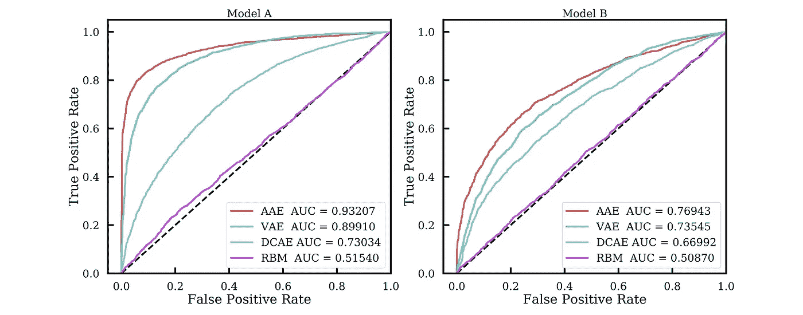
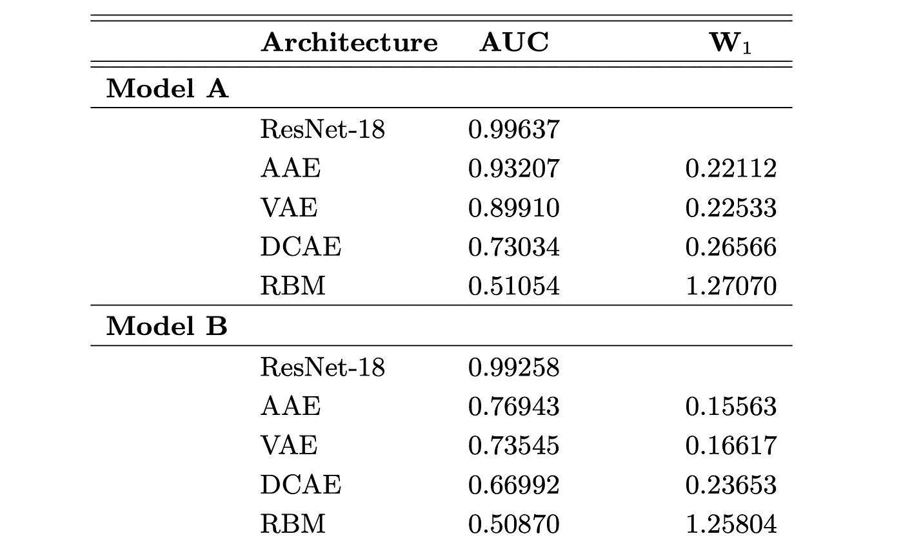

# GSoC 2020 与 CERN-HSF |暗物质和深度学习

> 原文：<https://towardsdatascience.com/gsoc-2020-with-cern-hsf-dark-matter-and-deep-learning-eb611850bb79?source=collection_archive---------44----------------------->

这个博客是我在 HSF 欧洲核子研究中心的谷歌代码之夏(GSoC) 2020 项目的一个非常简短的总结。今年是谷歌代码之夏 16 周年，共有 6，626 名学生提交了 8，902 份提案，其中 1，198 名学生获得了与 199 个组织合作的机会。



图片来源:[谷歌代码之夏](https://developers.google.com/open-source/gsoc/resources/marketing)

# DeepLense 项目

## 项目描述

DeepLense 是一个深度学习管道，用于利用强引力透镜进行粒子暗物质搜索，是伞式组织 [CERN-HSF](https://hepsoftwarefoundation.org/activities/gsoc.html) 的一部分。具体来说，我的项目是题为“[深度学习暗物质亚结构的形态学](https://arxiv.org/abs/1909.07346)”的论文中发表的工作的扩展，在该论文中，我的导师探索了使用最先进的监督深度学习模型，如 ResNet，对强透镜图像进行多类分类。

自 1936 年爱因斯坦的计算中讨论引力透镜并于 1979 年发现以来，引力透镜一直是许多宇宙学实验和研究的基石，一个特别感兴趣的领域是通过强透镜图像中的亚结构研究暗物质。虽然统计和监督机器学习算法已经实现了这项任务，但无监督深度学习算法的潜力仍有待探索，并可能被证明在 LSST 数据的分析中至关重要。这个 GSoC 2020 项目的主要目标是设计一个基于 python 的框架，用于实现无监督的深度学习架构，以研究强透镜图像。

更多细节参见论文“[无监督解码暗物质子结构](https://arxiv.org/abs/2008.12731)”。

## 仓库

我已经将我的工作编译成了两个开源库。第一个名为 [PyLensing](https://github.com/DeepLense-Unsupervised/PyLensing) ，这是一个基于 PyAutoLens 模拟生成透镜图像的工具，第二个名为 [Unsupervised Lensing](https://github.com/DeepLense-Unsupervised/unsupervised-lensing) ，这是一个基于 PyTorch 的工具，用于强透镜宇宙学中的无监督深度学习应用。

## 关于我

我是 K·普拉纳斯·雷迪，荣誉理学硕士。物理学和理学士(荣誉)。)印度 Pilani Birla 理工学院(BITS)海德拉巴校区电气和电子工程专业。

## 为什么是 DeepLense？

作为一名物理系学生，我熟悉 CERN 的运作，并对该组织的许多相关项目有着基本的了解，我在宇宙学领域的深度学习应用方面做了大量工作。这一经历激励我为 DeepLense 项目做贡献。

## **数据**



不同子结构的模拟样品透镜图像。无(左)、漩涡(中)和球形(右)。|作者图片

我们的数据集由三类组成，没有子结构的强透镜图像、涡旋子结构和球形子结构。考虑到具有子结构的样本是异常值，我们将在一组没有子结构的强透镜图像上训练我们的无监督模型，以解决异常检测的任务。

我们已经生成了两组透镜图像，模型 A 和模型 b。我们已经使用 python 包 [PyAutoLens](https://github.com/Jammy2211/PyAutoLens) 进行模拟。这两个模型之间的区别在于，模型 A 的所有模拟图像都保持在固定的红移，而模型 B 允许透镜星系和透镜星系的红移在一个数值范围内浮动。两种模型的另一个区别是信噪比。模型 A 的图像 SNR ≈ 20，而模型 B 的构造使得模拟产生的图像 SNR 在 10 到 30 之间变化。关于模拟的更多细节可以在[的论文](https://arxiv.org/abs/2008.12731)中找到。

# 无监督模型

我在异常检测的背景下研究并实现了各种无监督模型。在本节中，我将讨论四个模型，即深度卷积自动编码器(DCAE)、卷积变分自动编码器(VAE)、对抗自动编码器(AAE)和受限玻尔兹曼机器(RBM)，以及使用我的 PyTorch 工具[无监督透镜](https://github.com/DeepLense-Unsupervised/unsupervised-lensing)实现这些模型的代码。

## 深度卷积自动编码器(DCAE)

自动编码器是一种学习自身表示的神经网络，由编码器网络和解码器网络组成。编码器学习将输入样本映射到其维度低于输入样本维度的潜在向量，解码器网络学习从潜在维度重构输入。因此，自动编码器可以定性地理解为寻找给定类的最佳压缩表示的算法。

我们首先考虑深度卷积自动编码器，它主要用于图像的特征提取和重建。在训练期间，我们利用均方误差(MSE)，


MSE 损失|作者图片

作为我们的重建损失，其中θ和θ’是真实的和重建的样本。

使用 [PyTorch 工具](https://github.com/DeepLense-Unsupervised/unsupervised-lensing)实现:

```
**from** **unsupervised_lensing.models** **import** Convolutional_AE
**from** **unsupervised_lensing.models.DCAE_Nets** **import** *
**from** **unsupervised_lensing.utils** **import** loss_plotter **as** plt
**from** **unsupervised_lensing.utils.EMD_Lensing** **import** EMD*# Model Training*
out = Convolutional_AE.train(data_path='./Data/no_sub_train.npy', 
                             epochs=100,
                             learning_rate=2e-3,
                             optimizer='Adam',
                             checkpoint_path='./Weights',         
                             pretrain=**True**,                       
                             pretrain_mode='transfer',            
                             pretrain_model='A')                  

*# Plot the training loss*
plt.plot_loss(out)*# Model Validation*
recon_loss = Convolutional_AE.evaluate(data_path='./Data/no_sub_test.npy', 
                                       checkpoint_path='./Weights',        
                                       out_path='./Results')               

*# Plot the reconstruction loss*
plt.plot_dist(recon_loss)

*# Calculate Wasserstein distance*
print(EMD(data_path='./Data/no_sub_test.npy', recon_path='./Results/Recon_samples.npy'))
```

## 卷积变分自动编码器(VAE)

我们还考虑了一个变分自动编码器，它以 Kullback-Liebler (KL)散度的形式对潜在维度的表示引入了一个附加约束，


Kullback-Liebler (KL)散度|作者图片

其中 P(x)是目标分布，Q(x)是算法学习的分布。r.h.s .上的第一项是 P 和 Q 之间的交叉熵，第二项是 P 的熵。因此，KL 散度对分布 Q 离 P 有多远的信息进行编码。在变分自动编码器的情况下，KL 散度用作正则化，以在潜在空间上施加先验。出于我们的目的，P 被选择为在潜在空间 z 上采用高斯先验的形式，而 Q 对应于由编码器表示的近似后验 q(z|x)。模型的总损失是重建(MSE)损失和 KL 散度之和。

使用 [PyTorch 工具](https://github.com/DeepLense-Unsupervised/unsupervised-lensing)实现:

```
from unsupervised_lensing.models import Variational_AE
from unsupervised_lensing.models.VAE_Nets import *
from unsupervised_lensing.utils import loss_plotter as plt
from unsupervised_lensing.utils.EMD_Lensing import EMD# Model Training
out = Variational_AE.train(data_path='./Data/no_sub_train.npy', 
                           epochs=100,
                           learning_rate=2e-3,
                           optimizer='Adam',
                           checkpoint_path='./Weights',         
                           pretrain=True,                      
                           pretrain_mode='transfer',            
                           pretrain_model='A')# Plot the training loss
plt.plot_loss(out)# Model Validation
recon_loss = Variational_AE.evaluate(data_path='./Data/no_sub_test.npy', 
                                     checkpoint_path='./Weights',        
                                     out_path='./Results')# Plot the reconstruction loss
plt.plot_dist(recon_loss)# Calculate Wasserstein distance
print(EMD(data_path='./Data/no_sub_test.npy', recon_path='./Results/Recon_samples.npy'))
```

## 对抗性自动编码器(AAE)

最后，我们考虑一个对抗的自动编码器，它用对抗学习代替变分自动编码器的 KL 散度。我们训练鉴别器网络 D，以在由自动编码器 G 生成的样本和从对应于我们的训练数据的先验分布 P(z)获取的样本之间进行分类。该模型的总损耗是重建(MSE)损耗和鉴别器网络损耗之和，



鉴别器丢失|作者图片

我们另外向自动编码器添加以下形式的正则化项，


作者图片

随着自动编码器在重建输入方面变得熟练，鉴别器的能力下降。然后，鉴别器网络通过提高其区分真实数据和生成数据的性能来进行迭代。

使用 [PyTorch 工具](https://github.com/DeepLense-Unsupervised/unsupervised-lensing)实现:

```
from unsupervised_lensing.models import Adversarial_AE
from unsupervised_lensing.models.AAE_Nets import *
from unsupervised_lensing.utils import loss_plotter as plt
from unsupervised_lensing.utils.EMD_Lensing import EMD# Model Training
out = Adversarial_AE.train(data_path='./Data/no_sub_train.npy', 
                           epochs=100,
                           learning_rate=2e-3,
                           optimizer='Adam',
                           checkpoint_path='./Weights',         
                           pretrain=True,                       
                           pretrain_mode='transfer',            
                           pretrain_model='A')# Plot the training loss
plt.plot_loss(out)# Model Validation
recon_loss = Adversarial_AE.evaluate(data_path='./Data/no_sub_test.npy', 
                                     checkpoint_path='./Weights',        
                                     out_path='./Results')# Plot the reconstruction loss
plt.plot_dist(recon_loss)# Calculate Wasserstein distance
print(EMD(data_path='./Data/no_sub_test.npy', recon_path='./Results/Recon_samples.npy'))
```

## 受限玻尔兹曼机(RBM)

为了与我们的三个自动编码器模型进行比较，我们还训练了一个受限的波尔兹曼机器(RBM)，这是一个生成式人工神经网络算法，实现为一个二分图，学习输入的概率分布。RBMs 由两层组成，一个隐藏层和一个可见层，其中训练是在一个称为对比发散的过程中完成的。

所有模型的详细架构可在[论文](https://arxiv.org/abs/2008.12731)的附录 B 中找到。

使用 [PyTorch 工具](https://github.com/DeepLense-Unsupervised/unsupervised-lensing)实现:

```
from unsupervised_lensing.models import RBM_Model
from unsupervised_lensing.models.RBM_Nets import *
from unsupervised_lensing.utils import loss_plotter as plt
from unsupervised_lensing.utils.EMD_Lensing import EMD# Model Training
out = RBM_Model.train(data_path='./Data/no_sub_train.npy', 
                      epochs=100,
                      learning_rate=2e-3,
                      optimizer='Adam',
                      checkpoint_path='./Weights',         
                      pretrain=True,                       
                      pretrain_mode='transfer',            
                      pretrain_model='A')# Plot the training loss
plt.plot_loss(out)# Model Validation
recon_loss = RBM_Model.evaluate(data_path='./Data/no_sub_test.npy', 
                                checkpoint_path='./Weights',        
                                out_path='./Results')# Plot the reconstruction loss
plt.plot_dist(recon_loss)# Calculate Wasserstein distance
print(EMD(data_path='./Data/no_sub_test.npy', recon_path='./Results/Recon_samples.npy'))
```

## 结果

我使用了 25，000 个没有子结构的样本和每类 2，500 个验证样本来训练和评估无监督模型。这些模型是使用 PyTorch 包实现的，并在单个 NVIDIA Tesla K80 GPU 上运行 500 个时代。我们利用 ROC 曲线下的面积(AUC)作为我们所有模型的分类器性能的度量。对于无监督模型，ROC 值是针对重建损失的设定阈值计算的。此外，我们还使用 Wasserstein 距离值来比较重建的保真度。一组更详细的结果可以在[的论文](https://arxiv.org/abs/2008.12731)中找到。



无监督算法的 ROC-AUC 曲线。左边的图对应于模型 A，右边的图对应于模型 b。|图片由作者提供



本分析中使用的体系结构的性能。ResNet 的 AUC 值是针对有和没有亚结构的图像分类计算的，因此它不是宏观平均 AUC。W₁是没有子结构的图像的平均第一瓦瑟斯坦距离。|作者图片

# 未来的工作和最后的想法

尽管我们的无监督模型得到了一些非常有希望的结果，但是与 ResNet 模型的监督结果相比，它们的性能仍有进一步改进的空间。我目前正在探索基于图的模型的应用，因为它们在与稀疏数据集相关的任务中取得了成功，如稀疏 3D 点云和稀疏探测器数据。另一个未来的任务是使用迁移学习，通过从我们已经在模拟上训练过的模型开始，在真实数据上训练我们的架构。

我要感谢我的导师迈克尔·图米、谢尔盖·格莱泽、斯蒂芬·亚力山大和伊曼纽·乌赛，以及整个欧洲粒子物理研究所-HSF 社区对我的支持。我在 GSoC 项目上度过了一个美好的夏天。我还要感谢阿里·哈里里、汉娜·帕鲁尔和赖克·冯·克拉尔进行了有益的讨论。

给以后想参加 GSoC 的同学们，不要把 GSoC 看成一个需要“破解”的竞赛或者考试。GSoC 是关于开源开发和成为优秀开发者社区的一部分。找到你热爱的项目，了解组织的需求。最重要的是，在社区论坛上保持活跃，定期与你的项目导师互动。

感谢谷歌给我这么一个神奇的机会。

> **更新:**deep lens 项目现在是 [ML4SCI](https://ml4sci.org/) 保护伞组织的一部分。

# 重要链接

 [## 无监督解码暗物质亚结构

### 暗物质的身份仍然是当今物理学中最紧迫的问题之一。虽然许多有前途的黑暗…

arxiv.org](https://arxiv.org/abs/2008.12731)  [## 用强引力透镜模拟暗物质

### 强引力透镜是对暗物质亚结构的一个有希望的探索，以更好地理解它的结构。

hepsoftwarefoundation.org](https://hepsoftwarefoundation.org/gsoc/2020/proposal_DEEPLENSE.html) [](https://github.com/DeepLense-Unsupervised/unsupervised-lensing) [## 深透镜-无监督/无监督-透镜

### 基于 PyTorch 的工具，用于强透镜宇宙学中的无监督深度学习应用

github.com](https://github.com/DeepLense-Unsupervised/unsupervised-lensing) [](https://github.com/DeepLense-Unsupervised/PyLensing) [## DeepLense 无人监督/PyLensing

### 一个基于 PyAutoLens 模拟生成透镜图像的工具

github.com](https://github.com/DeepLense-Unsupervised/PyLensing) [](https://www.linkedin.com/in/pranath-reddy/) [## 印度特伦甘纳邦皮兰尼-海德拉巴普拉纳特·雷迪-比拉科技学院

### 查看 Pranath Reddy 在全球最大的职业社区 LinkedIn 上的个人资料。Pranath 有 2 份工作列在…

www.linkedin.com](https://www.linkedin.com/in/pranath-reddy/) [](https://github.com/pranath-reddy) [## 普拉纳斯-雷迪-概述

### 此时您不能执行该操作。您已使用另一个标签页或窗口登录。您已在另一个选项卡中注销，或者…

github.com](https://github.com/pranath-reddy)