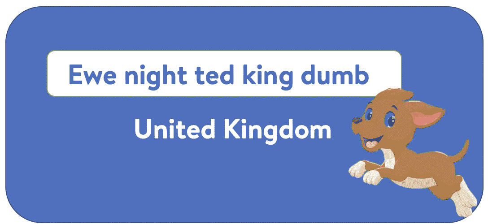
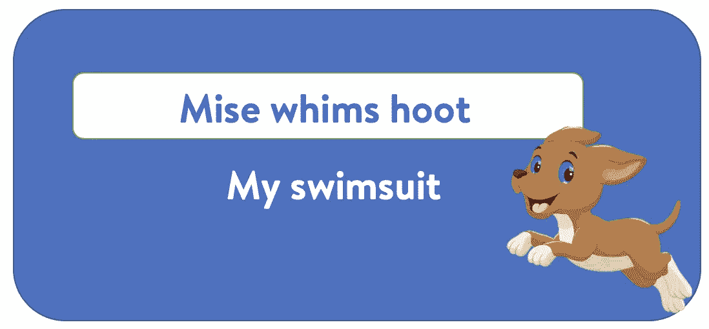
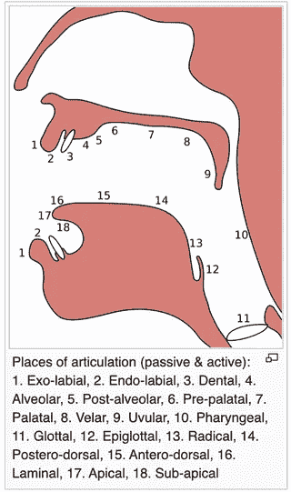
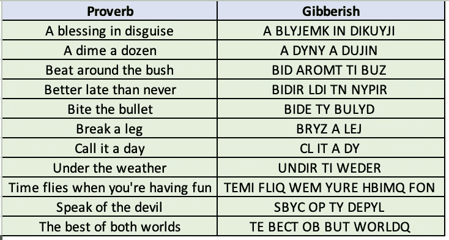

# 如果可以的话，猜猜这些胡言乱语

> 原文：<https://towardsdatascience.com/guess-the-gibberish-if-you-can-29433bc658db?source=collection_archive---------8----------------------->

## 一个简单的算法来创建你的胡言乱语的挑战



图片来源:自创

社交媒体是 21 世纪的强大平台。它已经成为[数字营销](https://en.wikipedia.org/wiki/Digital_marketing)的主要来源，表达观点，交友，娱乐方式等等。社交媒体应用不断创新和变化，通过显示正确的内容来了解用户的行为，从而保持用户的参与。经常可以看到新的挑战趋势，很多名人会发布相关的帖子。当前流行的一个挑战是“**猜胡言乱语挑战**”。

我相信你一定接受过或者至少见过有人接受这个挑战。在这个挑战中，屏幕上出现一些看似无意义但听起来有意义的乱码。让我们看一些例子。


图片来源:自创



图片来源:自创


我接受了胡言乱语的挑战

我亲自尝试过，我可以保证它有时会上瘾。作为一个算法爱好者，我想到的第一件事是我如何自己创造一个这样的挑战。我做了一些研究，创造了一个简单的游戏版本。这个简单的版本可以通过一些调整变得复杂，我将在最后作为开放式问题进行讨论。可以有许多不同的方法来创建它。在这篇博文中，我将讨论一种可能的方法。这篇博文中使用的所有代码都可以在[这里](https://github.com/samread81/Guess-The-Gibberish-Challenge)找到。那么，我们开始吧。

*你也可以找到我关于这个话题的 Youtube 视频。*

我在 Youtube 上关于这个话题的视频

# 语音算法

根据维基百科，[语音学](https://simple.wikipedia.org/wiki/Phonetics)是研究人类声音的科学。这个领域的主题专家被称为语音学家。基于语言学的语音学研究被称为[音系学](https://simple.wikipedia.org/wiki/Phonology)。

一个[语音算法](https://en.wikipedia.org/wiki/Phonetic_algorithm)是一个[算法](https://en.wikipedia.org/wiki/Algorithm)，用于通过[发音](https://en.wikipedia.org/wiki/Pronunciation)为[单词](https://en.wikipedia.org/wiki/Word)的[标引](https://en.wikipedia.org/wiki/Index_(publishing))。这些算法提供了识别发音相似的单词的能力。

读者能想到的第一个问题是，我们为什么要讨论语音学和语音算法。答案是，在我们试图解决的问题“猜测胡言乱语挑战”中，胡言乱语听起来类似于某种要被解码的有意义的东西，这也是最终的动机。直觉上，它想到一些语音算法可以帮助这一点。有许多好的[语音算法](https://en.wikipedia.org/wiki/Phonetic_algorithm#Algorithms)，其中一个流行且简单的算法是 [Soundex 算法](https://en.wikipedia.org/wiki/Soundex)。

# Soundex 算法

[Soundex](https://en.wikipedia.org/wiki/Soundex) 是一个[语音算法](https://en.wikipedia.org/wiki/Phonetic_algorithm)，用于[通过声音索引](https://en.wikipedia.org/wiki/Index_(publishing))姓名。目标是让同音字被[编码](https://en.wikipedia.org/wiki/Encoding)成相同的表示，这样即使[拼写](https://en.wikipedia.org/wiki/Spelling)有微小差异，它们也能被匹配。

Soundex 算法将英语单词编码成一个代码，其中第一位由一个字母和后面的“k-1”个数字组成，假设我们想要“k”位编码。

该算法在[维基百科](https://en.wikipedia.org/wiki/Soundex#American_Soundex)中有非常好的解释。从它身上取下一些部分，稍微简化一下，看起来是这样的:

 [## 桑迪克斯

### Soundex 是一种语音算法，用于按声音索引名称，如英语中的发音。我们的目标是让同音词…

en.wikipedia.org](https://en.wikipedia.org/wiki/Soundex#American_Soundex) 

第一步:保留单词的第一个字母，去掉所有其他出现的 a，e，I，o，u，y，h，w。

**第二步:**用数字替换辅音如下(第一个字母后):

★ b，f，p，v → 1

★ c，g，j，k，q，s，x，z → 2

★ d，t → 3

★ l → 4

★ m，n → 5

★ r → 6



图片来源~ [维基百科](https://en.wikipedia.org/wiki/File:Places_of_articulation.svg)

> 步骤 2 背后的逻辑:
> 
> 发音位置相似的[辅音](https://en.wikipedia.org/wiki/Place_of_articulation)共享相同的数字，例如[唇音辅音](https://en.wikipedia.org/wiki/Labial_consonant) B、F、P 和 V 都被编码为数字 1。

**第三步:**如果原词中有两个或两个以上同号字母相邻，只保留首字母；同样，由“h”或“w”分隔的具有相同数字的两个字母被编码为单个数字，而由元音分隔的这种字母被编码两次。这条规则也适用于第一个字母。

**步骤 4:** 如果最终编码少于 k 位，用 0 填充剩余的位。如果多于 k 位，只保留第一个 k 位。

使用此算法,“Robert”和“Rupert”返回相同的字符串“R163 ”,而“Rubin”返回“R150”。“阿什克拉夫特”和“阿什克罗夫特”都产生“A261”。“Tymczak”产生“T522”而不是“T520”(名称中的字符“z”和“k”被编码为 2 两次，因为它们之间有一个元音)。‘pfister’产生‘P236’而不是‘P123’(前两个字母的数字相同，编码一次为‘P’)，‘Honeyman’产生‘H555’。

在 python 中，[模糊包](https://pypi.org/project/Fuzzy/)提供了 Soundex 和其他语音算法的良好实现。

# 对 Soundex 的轻微修改

我们将使用 Soundex 算法生成编码，与步骤 1 略有不同。

我们不是删除 a、e、I、o、u、y、h、w 的所有出现，而是进一步对它们进行聚类/编号。

★ e，I，y → 7

★ o，u → 8

★ a，h，w →忽略它们

推理:e，I 和 y 看起来相似，例如' pic '，' pec '，' pyc '听起来相似。

我不能使用模糊包，因为我希望在原始的 Soundex 算法中执行这些建议的修改。我发现卡洛斯·德尔加多的这个伟大的实现。这并不完全正确，但对我们的用例来说已经足够好了。

[](https://ourcodeworld.com/articles/read/249/implementation-of-the-soundex-algorithm-function-in-different-programming-languages) [## Soundex 算法(函数)在不同编程语言中的实现

### 查看我们用不同的和已知的编程语言编写的 Soundex 函数的复制。

ourcodeworld.com](https://ourcodeworld.com/articles/read/249/implementation-of-the-soundex-algorithm-function-in-different-programming-languages) 

改进的 Soundex 算法；

```
def get_soundex_modified(name):
    # Get the soundex code for the string
    name = name.upper()soundex = ""
    soundex += name[0]# numbering of letters based on phonetic similarity
    dictionary = {"BFPV": "1", "CGJKQSXZ":"2", "DT":"3", "L":"4",   "MN":"5", "R":"6","EIY":"7","OU":"8","AHW":"."}for char in name[1:]:
        for key in dictionary.keys():
            if char in key:
                code = dictionary[key]
                if code != soundex[-1]:
                    soundex += codesoundex = soundex.replace(".", "")

    # We prefer a 8-bit output
    soundex = soundex[:8].ljust(8, "0")return soundex
```

# 猜猜胡言乱语挑战算法

对 Soundex 算法稍加修改，我们就可以完成“猜测胡言乱语挑战”算法。这些步骤将是

**步骤 1:** 给定句子，一次取一个单词，使用上述修改的 sounded 算法生成 8 位编码。例如，单词“under”的编码为“U5376000”。

**步骤 2:** 从步骤 1 中取出编码，一次取出编码中的一个字母，并执行以下操作:

*   如果字母是字符，就保持原样。
*   如果字母是一个数字，从该组中随机选择一个字符。例如，如果字母是 2，我们可以随机选择 c、g、j、k、q、s、x 和 z 中的任意一个。群集是:

★ b，f，p，v → 1

★ c，g，j，k，q，s，x，z → 2

★ d，t → 3

★ l → 4

★ m，n → 5

★ r → 6

★ e，I，y → 7

★ o，u → 8

*   如果字母是 0 或者编码中没有剩余的字母，我们就完成了这个单词

**第三步:**对句子中的所有单词重复同样的过程。

猜谜挑战算法的实现

让我们可视化一些谚语的乱码输出。



最终输出:生成的乱码

输出是胡言乱语，虽然听起来类似于实际的谚语。这就是我们简单的“猜谜挑战”解决方案。

# 可能的增强

在目前的方法中，我们正在为每个可能被改变的单词创建一个乱码。同样，第一个字符在原始输入和乱码输出中都保持不变。我们可以有一些解决办法。我将提供两种可能的方法来增强我们的“猜测胡言乱语”算法，并把它作为一个开放式问题留给观众来展示创造力。

1.  一些智能的启发式算法，智能地拆分和组合单词，然后使用修改的 Soundex 算法进行编码。例如，英国的一个可能有趣的胡言乱语是“母羊之夜特德国王哑巴”。
2.  原始输入和乱码输出中的第一个字符不必相同。例如，对字母“U”进行编码的一种可能方式可以是“Ewe”。

# 结论

通过这篇博文，我们开发了一个有趣且非常简单的算法来创建我们自己的“猜测胡言乱语挑战”。在这个过程中，我们还学习了语音学、音韵学和语音算法。我们还研究了如何让它变得更具挑战性。希望你喜欢。这篇博文中使用的所有代码都可以在[这里](https://github.com/samread81/Guess-The-Gibberish-Challenge)找到。

> 如果你有任何疑问，请联系我。我很想知道你是否想到了更多可能的改进。

***我的 Youtube 频道获取更多内容:***

[](https://www.youtube.com/channel/UCg0PxC9ThQrbD9nM_FU1vWA) [## 阿布舍克·蒙戈利

### 嗨，伙计们，欢迎来到频道。该频道旨在涵盖各种主题，从机器学习，数据科学…

www.youtube.com](https://www.youtube.com/channel/UCg0PxC9ThQrbD9nM_FU1vWA) 

> ***关于作者-:***
> 
> Abhishek Mungoli 是一位经验丰富的数据科学家，拥有 ML 领域的经验和计算机科学背景，跨越多个领域并具有解决问题的思维方式。擅长各种机器学习和零售业特有的优化问题。热衷于大规模实现机器学习模型，并通过博客、讲座、聚会和论文等方式分享知识。
> 
> 我的动机总是把最困难的事情简化成最简单的版本。我喜欢解决问题、数据科学、产品开发和扩展解决方案。我喜欢在闲暇时间探索新的地方和健身。关注我的 [**中**](https://medium.com/@mungoliabhishek81) 、**[**Linkedin**](https://www.linkedin.com/in/abhishek-mungoli-39048355/)**或**[**insta gram**](https://www.instagram.com/simplyspartanx/)**并查看我的[往期帖子](https://medium.com/@mungoliabhishek81)。我欢迎反馈和建设性的批评。我的一些博客:********

*   ******[一个无监督的数学评分模型](/an-unsupervised-mathematical-scoring-model-f4f56a756f)******
*   ******[降维:PCA 与自动编码器](/dimensionality-reduction-pca-versus-autoencoders-338fcaf3297d)******
*   ******[体验遗传算法的威力](/experience-the-power-of-the-genetic-algorithm-4030adf0383f)******
*   ******[每个数据科学家都应该避免的 5 个错误](/5-mistakes-every-data-scientist-should-avoid-bcc8142d7693)******
*   ******[以简单&直观的方式分解时间序列](/decomposing-a-time-series-in-a-simple-and-intuitive-way-19d3213c420b?source=---------7------------------)******
*   ******[GPU 计算如何在工作中拯救了我？](https://medium.com/walmartlabs/how-gpu-computing-literally-saved-me-at-work-fc1dc70f48b6)******
*   ******信息论& KL 分歧[第一部分](/part-i-a-new-tool-to-your-toolkit-kl-divergence-5b887b5b420e)和[第二部分](/part-2-a-new-tool-to-your-toolkit-kl-divergence-736c134baa3d)******
*   ******[使用 Apache Spark 处理维基百科，创建热点数据集](/process-wikipedia-using-apache-spark-to-create-spicy-hot-datasets-1a59720e6e25)******
*   ******[一种基于半监督嵌入的模糊聚类](/a-semi-supervised-embedding-based-fuzzy-clustering-b2023c0fde7c)******
*   ******[比较哪个机器学习模型表现更好](/compare-which-machine-learning-model-performs-better-4912b2ed597d)******
*   ******[分析 Fitbit 数据，揭开疫情封锁期间身体模式变化的神秘面纱](/analyzing-fitbit-data-to-demystify-bodily-pattern-changes-amid-pandemic-lockdown-5b0188fec0f0)******
*   ******[神话与现实围绕关联](/myths-and-reality-around-correlation-9b359456d8e1)******
*   ******[成为面向业务的数据科学家指南](/a-guide-to-becoming-business-oriented-data-scientist-51da5c829ffa)******