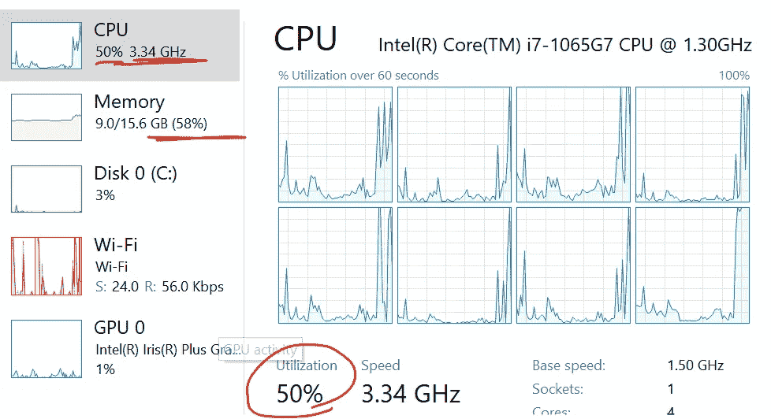
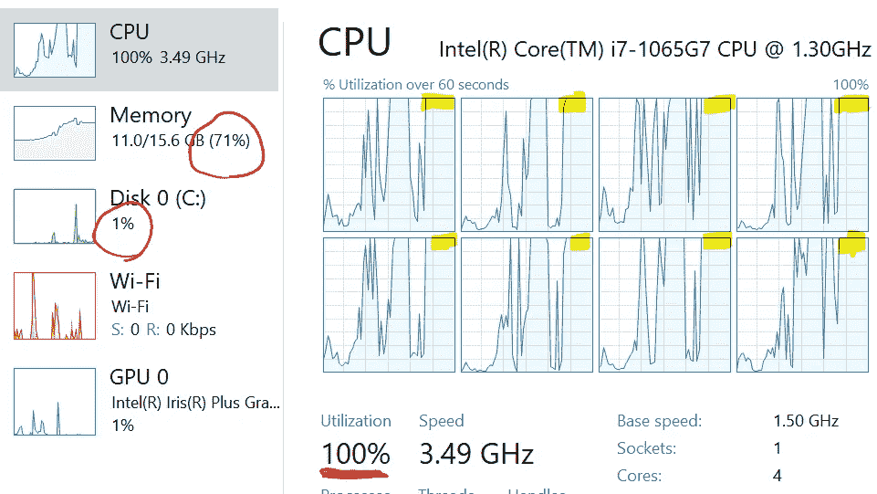

# 大数据连接指南— Python、SQL、Pandas、Spark、Dask

> 原文：<https://towardsdatascience.com/guide-to-big-data-joins-python-sql-pandas-spark-dask-51b7f4fec810?source=collection_archive---------2----------------------->

## 如何以最佳方式连接大数据集—多种方法指南


大数据——Patrick linden Berg 在 [Unsplash](https://unsplash.com?utm_source=medium&utm_medium=referral) 上拍摄的照片

有许多方法可以旋转磁盘、切鱼片或处理大数据，这里有一个快速指南。

## **样本数据集**

Kaggle 电影数据库[8]—45，000 部电影的 2，600 万个评级，数据分布在 5 个文件中:


Foostack。人工智能

要找到电影的最高平均评分，您需要加入**链接**到**元数据**到**评分**:

> SELECT m.title，avg(r . rating)FROM links l INNER JOIN to metas m ON m . imdbid = l . imdbid INNER JOIN to ratings ON r . movie id = l . movie id GROUP BY m . title count(r . rating)> 2 且 avg(r.rating) > 4.5

# 老式 SQL RDBMS

经典的方法是加载一个数据库，索引并运行前面提到的 SQL(或使用下面的经典 SQL):

> 从链接 l，metas m，ratings r 中选择 m.title，avg(r.rating)其中 m.imdbId=l.imdbId 和 r . movie id = l . movie id GROUP BY m . title 具有 count(r.rating) > 2 和 avg(r.rating) > 4.5

对于某些平台变体，RDBMS 中的连接有三种主要方式:

1.  **嵌套循环—** 对于表 A 中的每一行，查找表 B 中的匹配键。B 上的索引使得查找为 O(A*log B)，否则连接为慢速— O(A*B)。
2.  **Hash-Join —** 通过查找键构建表 B 的散列/映射，使得连接查找非常快速— O(A*1)
3.  **合并-排序** —对两个表进行排序，并在一次通过中合并，除非预先排序，否则速度不会很快—O(A+B+A log A+B log B)→O(A log A+B log B)

使用 Sqlite3 [1]—创建数据库、表和加载非常简单:

SQLite3 表加载/设置

用**加载和查询 26m 行数据需要大约 10 分钟**(也许我们可以合并- *调整前两步..*

*   从 CSV/磁盘加载— 35 秒
*   插入数据库— **8 分钟**
*   添加索引— 30 秒
*   按查询分组— 20 秒

您还可以使用 sqlite3 命令行来测试和查看查询执行计划，如下所示。在联接列上添加一些额外的索引后，我们的目标查询大约需要 21 秒来执行。


SQLite 查询执行(来自 cmdline 工具)

使用 SQL 数据库是可扩展的，但是很老派。接下来我们将尝试潮人技巧。

# python——终极黑客

我们可以省去数据库开销，直接用 Python 编写数据加载和连接&这很麻烦:

自定义 python 合并(NL 连接)

“merge()”是一个没有索引的**嵌套循环连接**。该循环必须扫描 metas 和链接表以获得每个评级(26m * 50k *2)。10 万条评论只需要 5 分钟，所以 2600 万条评论将永远不会结束...

“merge_wmap()”是一个**散列连接—** 我们为元和链接构建一个映射，从而获得 O(n*1)的性能。**连接 26m 排只需 3 秒**！

使用 hashmap 查找的自定义 python NL 连接

我没有实现分组过滤——这相对较快(需要对 26m 的行结果进行排序-扫描-合并)—我估计加载和处理的总时间为**0:53**

*   将原始 CSV 加载到阵列— 35 秒
*   手动合并索引— 3 秒
*   手动分组和过滤— 15 秒(TBD～估计值)

*生蟒速度快但是丑。全速你的本地电脑和完全控制你所有的错误。*

# **熊猫数据帧拯救行动**

Pandas[2]是 Python 上用于数据准备的事实上的包。速度极快且易于使用，我们可以用最少的代码进行加载、连接和分组:

熊猫加入例子

熊猫很聪明。您不需要预定义散列或索引，它似乎可以动态生成优化连接所需的内容。最大的限制是它存在于单个机器上。**处理 26m 行的时间约为 0:17，**代码更少，无需外部系统(数据库、集群等)。

*   将 3 个 csv 加载到数据帧— **5 秒**
*   连接 3 个数据帧— 8 秒
*   加入、分组和过滤— +4 秒

熊猫文件加载比我的自定义 py 快得多，35 秒对 5 秒！这表明不要做黑客，使用库。理论上，Pandas 是单线程/进程(在我的 TaskManager 上看起来不像),因此数据集的大小受到你的电脑内存的限制。

*尽管如此——Pandas 是处理中小型数据的终极方式——但是我们想要* ***大数据*** *！*

# 火花簇 FTW(为了胜利)

SQL 很棒，但并行性和破解能力有限。Python 和 Pandas 超级灵活，但是缺乏可伸缩性。Apache Spark [5]实际上是在大数据上并行化内存操作的方式。

Spark 有一个名为 DataFrame *的对象(是的另一个！)*这就像一个熊猫的数据框架，甚至可以加载/窃取数据(尽管你可能应该通过 HDFS 或云加载数据，以避免大数据传输问题):

最小火花码(本地独立设置)

我写了两个 Spark join 方法。两者并行运行。默认模式(第 15 行)将对您的数据进行分区，并在集群节点间移动(传播)。后面的“**广播**”模式(第 18 行)复制一次较小的表，只对大表内容进行分区和发送。使用较小的连接表，广播模式会快得多。

Spark 在 workers 节点(JVM——设置为 8，以匹配我的 CPU 内核数)之间划分工作，分而治之，回到聚合中。火花代码和结果输出如下:

```
df.groupBy('title').agg(func.mean('rating').   
    alias('avg_rating'),func.count('rating').   
    alias('r_count')).filter('r_count >2').    
    filter('avg_rating > 4.5').show()
```


Spark 对 26m 行的连接和分组操作的输出

# 绩效总结

*(来自我笔记本电脑的非实验室认证结果)*

首先记下将 3 个数据集连接在一起的运行时间:


连接的性能

令人惊讶的是，原始 Python 解决方案是最快的？黑黑！

顶级电影团体(包括 Spark)的最终结果:


连接和分组+过滤的性能

## **外卖:**

*   熊猫是非凡的快速和高效，在这一点上，你有核心记忆。在某个时候，Python/Pandas 会耗尽内存并崩溃。
*   Spark 是一个很好的扩展解决方案，尽管集群管理可能比较棘手。内存分布式处理、分区作业和数据+分区存储策略(HDFS 或其他)是正确的方向。
*   RDBMS 是可靠的，但是在移动数据和处理方面有伸缩限制

在接下来的章节中会有更多关于 Spark 的内容…糟糕，我忘了 **Dask** (原生 Python 集群)——也许下次吧。

## SQLite3 资源配置文件


只有 2 个真正活跃的内核，额外的 I/O(尽管大部分都被缓存)

## 熊猫资源概况



对于我所认为的单线程/任务进程，CPU 利用率出奇的高？

## Spark 资源配置文件(8 个工人，10 个分区)



所有内核都利用了 8 个工作线程—良好的 CPU 和内存分配

*以上数据来自我的 MSFT Surface 笔记本电脑 3-i7/16gb/256 GB 固态硬盘*

# 参考和启示

[0]测试代码的完整源代码(不仅仅是 gist)——[Doug foo 的 GitHub](https://github.com/dougfoo/machineLearning/tree/master/notebooks/movies)

[1] SQLite Python 指南— [官方 Python 文档](https://docs.python.org/2/library/sqlite3.html)

[2]熊猫指南— [10 分钟教程](https://pandas.pydata.org/docs/getting_started/10min.html)

[3]有点老的分析 SQLite vs Pandas — [韦斯·麦金利博客](https://wesmckinney.com/blog/high-performance-database-joins-with-pandas-dataframe-more-benchmarks/)

[4] Spark Joins DB Deck— [数据块演示](https://databricks.com/session/optimizing-apache-spark-sql-joins)

[5]关于 Spark 的精彩详细介绍—[a . Ialenti 撰写的 TDS 文章](/the-art-of-joining-in-spark-dcbd33d693c)

[6] PYArrow 用于 Spark 中的快速数据帧加载— [Bryan Cutler IBM](https://bryancutler.github.io/createDataFrame/)

[7]在 10 分钟内安装 PySpark Win—[TDS 文章作者 Uma G](/installing-apache-pyspark-on-windows-10-f5f0c506bea1)

[8]电影评论文件— [Kaggle 数据集](https://www.kaggle.com/rounakbanik/the-movies-dataset#ratings.csv)