# YOLO 汽车检测指南

> 原文：<https://towardsdatascience.com/guide-to-car-detection-using-yolo-48caac8e4ded?source=collection_archive---------6----------------------->

## YOLO 算法的深入概念——包围盒、非最大值抑制和 IOU。

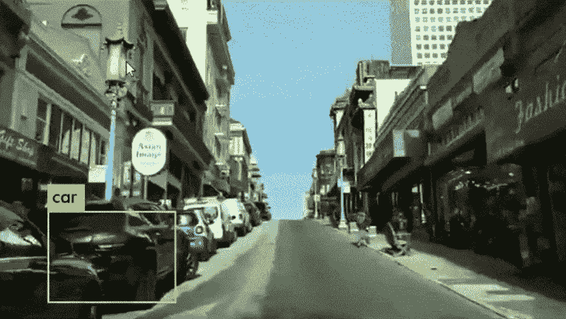

**使用 YOLOv3 的实时对象检测**

# 1.问题陈述

你正在研究一辆自动驾驶汽车。作为这个项目的一个关键组成部分，你想首先建立一个汽车检测系统。为了收集数据，你在汽车引擎盖上安装了一个摄像头，当你开车时，它每隔几秒钟就拍摄一次前方道路的照片。

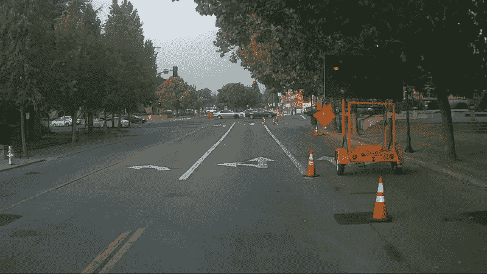

在硅谷开车时用车载相机拍摄的照片。
感谢 [drive.ai](https://en.wikipedia.org/wiki/Drive.ai) 提供本数据集。

你已经将所有这些图像收集到一个文件夹中，并通过在你找到的每辆车周围绘制边框来标记它们。下面是一个边界框的示例:

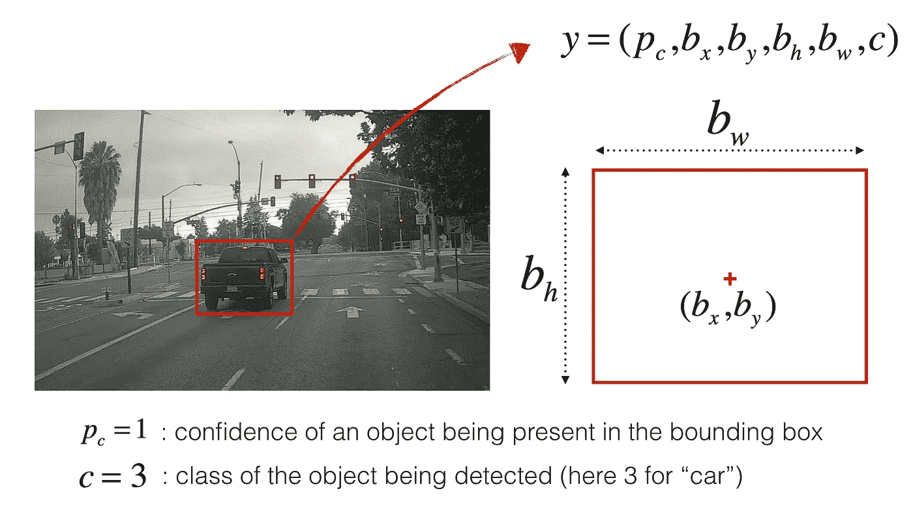

图 1:边界框的定义

如果您想要对象检测器识别 80 个类别，您可以将类别标签 *c* 表示为 1 到 80 之间的整数，或者表示为 80 维向量(80 个数字)，其中一个分量为 1，其余为 0。在本文中，我将使用这两种表示法，这取决于哪种表示法对特定步骤更方便。

# 2.YOLO

**“你只看一次”(YOLO)** 是一种流行的算法，因为它实现了高精度，同时还能够实时运行。这种算法“只看一次”图像，因为它只需要一次通过网络的前向传播来进行预测。在 [**非最大抑制**](https://www.coursera.org/lecture/convolutional-neural-networks/non-max-suppression-dvrjH) 之后，输出识别的对象和边界框。

## 2.1 模型细节

## **输入和输出**

*   **输入**是一批图像，每幅图像的形状为( *m，608，608，3* )。
*   **输出**是一个包含已识别类的边界框列表。每个边界框由 6 个数字表示——如上所述的 *pc* 、 *bx* 、 *by* 、 *bh* 、 *bw* 、 *c —* 。如果你将 *c* 展开成一个 80 维的向量，那么每个边界框由 85 个数字表示。

## **锚箱**

*   通过探索训练数据来选择代表不同类别的合理的高/宽比，从而选择锚定框。
*   锚盒尺寸为编码中倒数第二个尺寸: *m* ， *nH* ， *nW* ，*锚*，*类。*
*   **YOLO** 架构为:图像( *m，608，608，3* ) - >深度 CNN - >编码( *m，19，19，5，85* )。

## 编码

让我们更详细地看看这种编码代表了什么。

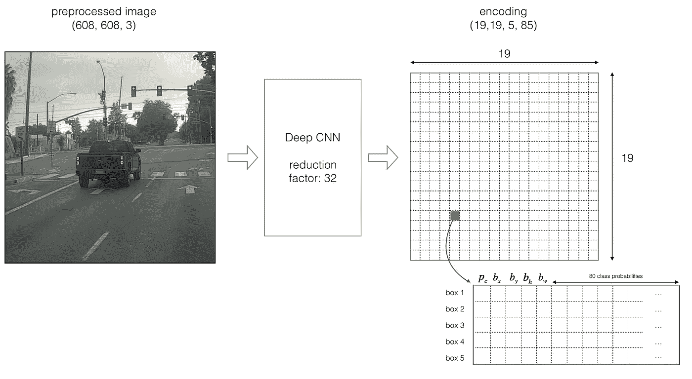

**图 2:YOLO 的编码架构**

如果对象的中心/中点落入网格单元，则该网格单元负责检测该对象。

由于我们使用 5 个锚盒，因此每个*19×19*单元编码了关于 5 个盒的信息。锚定框仅由其宽度和高度定义。

为简单起见，我们将展平形状的最后两个维度( *19，19，5，85* )编码。所以深度 CNN 的输出是( *19，19，425* )。

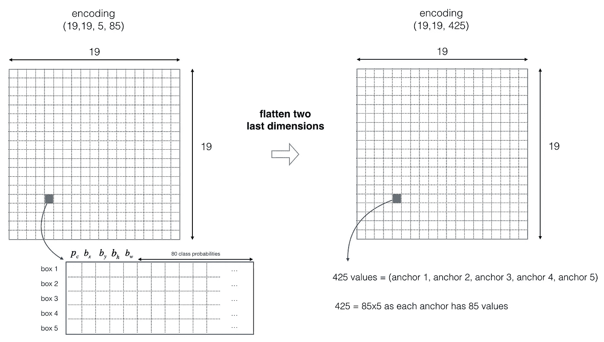

**图 3:展平最后两个尺寸**

## **班级成绩**

现在，对于(每个单元格的)每个盒子，我们将计算下面的元素乘积，并提取盒子包含某个类的概率。

类得分是*score _ c*ᵢ=*p _ c * c*ᵢ——存在一个对象的概率 *p_c* 乘以该对象是某类的概率 *cᵢ.*

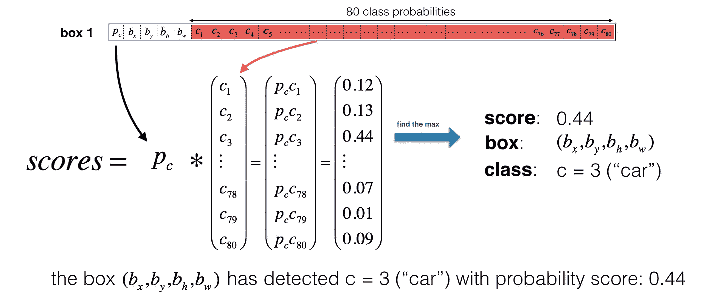

**图 4:找出每个方框检测到的类别**

在*图 4* 中，假设对于盒子 1(单元格 1)，物体存在的概率为 *p₁* = 0.60。因此，有 60%的可能性，一个对象存在于框 1(单元格 1)。

物体是类别 3(汽车)的概率是 *c₃ = 0.73。*

方框 1 和类别 3 的分数为*score _ c*₁,₃= 0.60 * 0.73 = 0.44。

假设我们计算了方框 1 中所有 80 个类别的分数，发现汽车类别(类别 3)的分数最大。因此，我们将把分数 0.44 和类别 3 分配给这个框 1。

## **可视化类**

这里有一种方法可以形象化 YOLO 在图像上预测的东西:

*   对于每一个 *19 x 19* 网格单元，找到概率得分的最大值，即在 80 个类中取一个最大值，5 个锚框中的每一个都取一个最大值)。
*   根据网格单元认为最有可能是什么对象来给网格单元着色。

这样做的结果是这幅图:

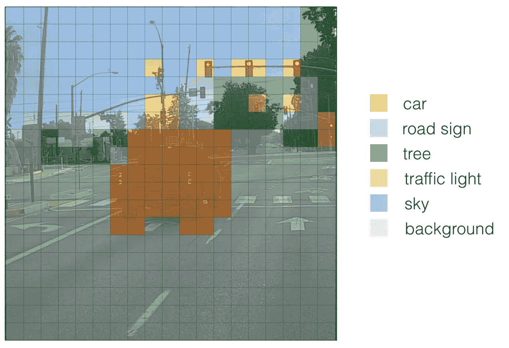

**图 19 x 19 网格单元中的每一个都根据在该单元中哪个类具有最大的预测概率而被着色。**

注意，这种可视化并不是进行预测的 **YOLO** 算法本身的核心部分；这只是可视化算法中间结果的一种很好的方式。

## 可视化边界框

另一种可视化 **YOLO** 输出的方式是绘制它输出的边界框。这样做的结果是这样的可视化:

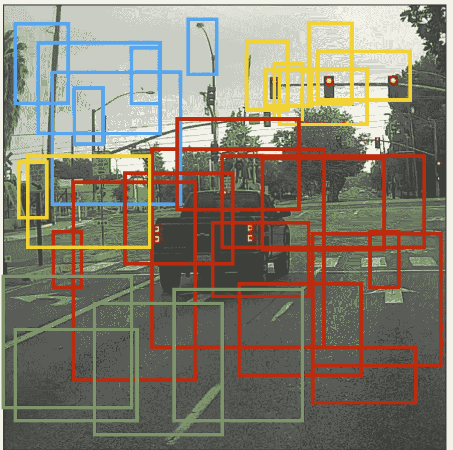

**图 6** :每个单元格给你 5 个盒子。总的来说，该模型仅通过查看图像一次(通过网络向前传递一次)就预测了 19×19×5 = 1805 个盒子！不同的颜色代表不同的类别。

## 非最大抑制

在上图中，我们只绘制了模型分配了高概率的盒子，但这仍然是太多的盒子。我们希望将算法的输出减少到更少数量的检测对象。

为此，我们将使用**非最大抑制**。具体来说，我们将执行以下步骤:

*   去掉分数低的盒子。意思是，盒子对检测一个类不是很有信心；要么是由于任何物体的低概率，要么是这个特殊类的低概率。
*   当几个框相互重叠并检测同一对象时，仅选择一个框。

## 2.2 利用类别分数的阈值进行过滤

我们将首先通过设定阈值来应用过滤器。我们想摆脱任何盒子的类“分数”小于一个选择的阈值。

该模型总共为我们提供了 *19 x 19 x 5 x 85* 个数字，每个盒子由 85 个数字描述。将( *19，19，5，85* )或( *19，19，425* )维张量重新排列成以下变量是很方便的:

*   `box_confidence`:形状张量( *19×19，5，1* )( *19×19，5，1* )，包含 *p_c —* 在 *19x19* 单元格中预测的 5 个框中的每一个中，存在某个对象的置信概率。
*   `boxes`:形状张量( *19×19，5，4* ，包含每个单元格中 5 个盒子的中点和尺寸( *bx* ， *by* ， *bh* ， *bw* )。
*   `box_class_probs`:形状张量( *19×19，5，80* )，包含每个单元格 5 个盒子的 80 个类别中的每个类别的“类别概率”( *c* ₁ *，c* ₂ *，…，c* ₈₀)。

> ***实现*** `***yolo_filter_boxes()***`

1.  按照图 4 中的*所述，通过进行元素乘积( *p * c)* 来计算 box 分数。*
2.  对于每个盒子，找到具有最大盒子分数的类的索引，以及相应的盒子分数。
3.  使用阈值创建遮罩。作为提醒:`([0.9, 0.3, 0.4, 0.5, 0.1] < 0.4)`回报:`[False, True, False, False, True]`。对于您想要保留的盒子，掩码应为`True`。
4.  使用 TensorFlow 对`box_class_scores`、`boxes`和`box_classes`应用蒙版，过滤掉我们不想要的盒子。你应该只留下你想保留的盒子的子集。

**有用的参考资料**

*   [Keras argmax](https://keras.io/backend/#argmax)
*   [Keras max](https://keras.io/backend/#max)
*   [布尔掩码](https://www.tensorflow.org/api_docs/python/tf/boolean_mask)

## 2.3 非最大抑制

即使在通过对类分数进行阈值化过滤之后，我们可能仍然会得到许多重叠的盒子。用于选择正确框的第二个过滤器被称为**非最大抑制(NMS)** 。

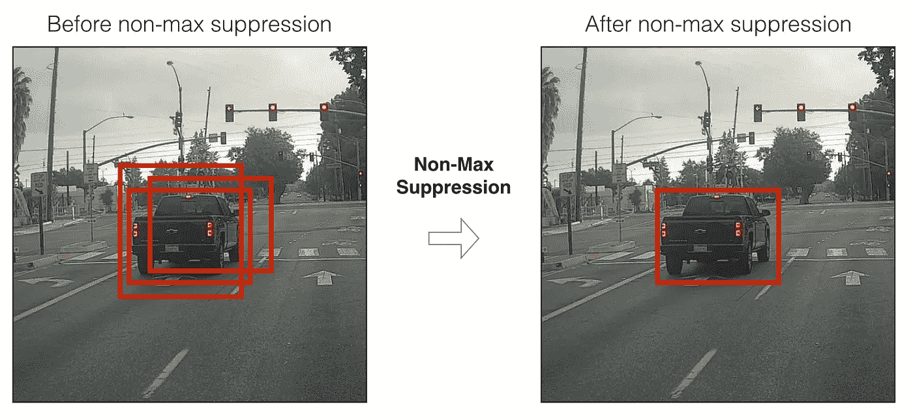

**图 7** :在本例中，模型预测了 3 辆汽车，但实际上是同一辆汽车的 3 次预测。运行非最大抑制(NMS)将只选择 3 个框中最准确(概率最高)的一个。

非最大值抑制使用一个非常重要的函数，叫做 [**交集超过并集**](https://www.coursera.org/lecture/convolutional-neural-networks/intersection-over-union-p9gxz) ，或者 **IoU** 。

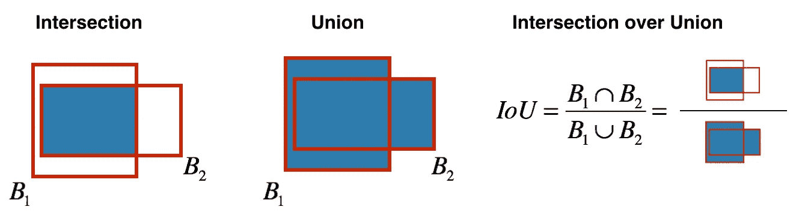

**图 8**:Union 上**交点的定义。**

> **实现**

在这段代码中，我将使用这样的约定，即( *0，0* )是图像的左上角；( *1，0* )是右上角；( *1，1* )是右下角。换句话说，( *0，0* )原点从图像的左上角开始。随着 *x* 增加，我们向右移动。随着 y 的增加，我们向下移动。

我将使用它的两个角来定义一个盒子:左上角( *x₁，y₁* )和右下角( *x₂，y₂* )，而不是使用中点、高度和宽度。这使得计算交集变得更加容易。

要计算一个矩形的面积，用它的高度(*y₂*-*y₁*)乘以它的宽度(*x₂*-*x₁*)。既然( *x₁* 、 *y₁* )是左上方( *x₂、y₂* )是右下方，这些差异应该是非负的。

请随意在纸上画一些例子来从概念上阐明这一点。要找到两个盒子的**交集**(*xi₁，yi₁，xi₂，yi₂* ):

*   交点的左上角( *xi₁，yi₁* )通过比较两个盒子的左上角( *x₁* ， *y₁* )，然后找到具有更靠近右边的*x*-坐标和更靠近底部的*y*-坐标的顶点来找到。
*   交点的右下角( *xi₂，yi₂* )是通过比较两个盒子的右下角( *x₂，y₂* )找到的，然后找到一个顶点的*x*-坐标更靠近左边，而*y*-坐标更靠近上面。
*   两个框**可能没有交集**。如果我们计算的交点坐标最终是一个交点框的右上角和/或左下角，我们可以检测到这一点。另一种思考方式是，如果您计算了高度(*y₂*—*y₁*)或宽度(*x₂*—*x₁*)并且发现这些长度中至少有一个是负的，那么就没有相交(相交面积为零)。
*   两个框可能在**边或顶点**相交，在这种情况下，相交面积仍然为零。当计算的交叉点的高度或宽度(或两者)为零时，会出现这种情况。

## YOLO 非最大抑制

我们现在准备实施**非最大抑制**。关键步骤是:

1.  选择得分最高的方框。
2.  计算此框与所有其他框的重叠，并移除明显重叠的框(`iou` > = `iou_threshold`)。
3.  回到步骤 1，重复直到没有比当前选择的盒子分数更低的盒子。

这将删除与所选框有大量重叠的所有框。只有“最好的”盒子保留下来。

> **实施** `**yolo_non_max_suppression()**`

**参考文件**

*   [TF . image . non _ max _ suppression()](https://www.tensorflow.org/api_docs/python/tf/image/non_max_suppression)

## 2.4 完成过滤

是时候实现一个函数了，它接受深度 CNN 的输出(T42 19 x 19 x 5 x 85 维度编码)并使用我们刚刚实现的函数过滤所有的盒子。

> **实现**

该函数获取 **YOLO** 编码的输出，并使用分数阈值和 **NMS 过滤盒子。**

有一个实现细节你需要知道。有几种表示盒子的方法，比如通过它们的角或者通过它们的中点和高度/宽度。 **YOLO** 使用以下函数在不同时间在几种格式之间转换:

```
boxes = yolo_boxes_to_corners(box_xy, box_wh)
```

它将 **YOLO** 框坐标( *x，y，w，h* )转换为框角坐标( *x* ₁ *，y* ₁ *，x* ₂ *，y* ₂)以适应`yolo_filter_boxes`的输入。

```
boxes = scale_boxes(boxes, image_shape)
```

YOLO 的网络被训练运行在 608 x 608 的图像上。如果您在不同尺寸的图像上测试该数据，例如，具有 *720 x 1280* 图像的汽车检测数据集，该步骤将重新缩放这些方框，以便它们可以绘制在原始 *720 x 1280* 图像的顶部。

## 2.5 概述

*   输入图像( *608，608，3* )
*   输入图像通过 CNN，产生( *19，19，5，85* )维输出。
*   展平最后两个维度后，输出的是一个体积形状( *19，19，425* )。输入图像上的*19×19*网格中的每个单元给出 425 个数字:425 = 5×85，因为每个单元包含 5 个框的预测，对应于 5 个锚框；85 = 5 + 80 其中 5 是因为( *pc，bx，by，bh，bw* )有 5 个数，80 是我们想要检测的类的个数。
*   然后，我们基于**分数阈值化—** 丢弃已经检测到分数小于阈值的类的盒子，以及**非最大值抑制—** 计算联合**【IOU】**上的**交集并避免选择重叠的盒子，来仅选择几个盒子。**
*   这给了你 **YOLO** 的最终输出。

# 3.在图像上测试 YOLO 预训练模型

在这一部分中，我们将使用一个预训练的模型，并在汽车检测数据集上进行测试。我们需要一个会话来执行计算图并评估张量:

```
sess = K.get_session()
```

## 3.1 定义类别、锚点和图像形状

回想一下，我们试图检测 80 个类，并且使用了 5 个锚盒。我们将读取存储在两个文件中的 80 个类和 5 个盒子的名称和锚点— `coco_classes.txt` 和`yolo_anchors.txt`(更多信息请参见 Github repo)。汽车检测数据集有 *720 x 1280* 图像，这些图像被预处理成 *608 x 608* 图像。

## 3.2 加载预训练模型

训练一个 **YOLO** 模型需要很长的时间，并且对于大范围的目标类需要一个相当大的标签包围盒数据集。因此，我们将加载一个现有的预先训练好的 **Keras YOLO** 模型。(更多信息见 Github repo)。这些重量来自 YOLO 官方网站，并由艾伦·泽勒纳编写的函数转换而来。参考文献在本文末尾。从技术上来说，这些是来自 **YOLOv2** 模型的参数，但在本文中我们将简称它为 **YOLO** 。

```
yolo_model = load_model(“model_data/yolo.h5”)
```

这将加载一个经过训练的 YOLO 模型的权重。你可以在 Github repo 里的笔记本里看看模型包含的图层汇总。

**提醒**:该模型将预处理后的一批输入图像(shape: ( *m，608，608，3* )转换成形状张量( *m，19，19，5，85* )，如图*图 2 所示。*

## 3.3 将模型的输出转换为可用的边界框张量

`yolo_model`的输出是一个( *m，19，19，5，85* )张量，需要经过非平凡的处理和转换。下面的代码为我们完成了这项工作:

```
yolo_outputs = yolo_head(yolo_model.output, anchors, len(class_names))
```

如果你很好奇`yolo_head`是如何实现的，可以在 Github repo 的文件 ['keras_yolo.py'](https://github.com/allanzelener/YAD2K/blob/master/yad2k/models/keras_yolo.py) 中找到函数定义。

将`yolo_outputs`加入我们的图表后。这组 4 个张量已准备好用作`yolo_eval`功能的输入。

## 3.4 过滤箱

`yolo_outputs`以正确的格式给了我们所有`yolo_model`的预测框。我们现在准备通过调用之前实现的`yolo_eval`来过滤和选择最好的盒子。

```
scores, boxes, classes = yolo_eval(yolo_outputs, image_shape)
```

## 3.5 在图像上运行图形

让欢乐开始吧。我们创建了一个图表，可以总结如下:

1.  **yolo_model.input** 给`yolo_model`。该模型用于计算输出 **yolo_model.output** 。
2.  **yolo_model.output** 由`yolo_head`处理。它给你 **yolo_outputs** 。
3.  **yolo_outputs** 经过过滤功能`yolo_eval`。它输出你的预测:`scores, boxes, classes.`

> **实施** `**predict()**`

`**predict()**`运行图形以测试图像上的 **YOLO** 。你需要运行一个 TensorFlow 会话，让它计算`scores, boxes, classes`。

下面的代码也使用了下面的函数:

```
image, image_data = preprocess_image("images/" **+** image_file, model_image_size = (608, 608))
```

哪些输出:

*   图像:用于绘制框的图像的 python (PIL)表示。你不需要使用它。
*   image_data:表示图像的 numpy 数组。这将是 CNN 的输入。

在测试图像上测试功能:

```
out_scores, out_boxes, out_classes = predict(sess, “test.jpg”)
```

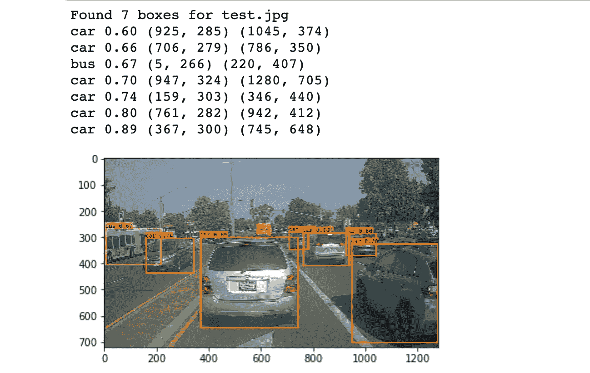

**test.jpg 上的输出示例**

我们刚刚运行的模型实际上能够检测到`coco_classes.txt`中列出的 80 个不同的类。通过下载 Github repo 中的文件，您可以随意尝试使用您自己的图像。

如果我们在所有图像上运行 for 循环会话。下面是我们将得到的结果:

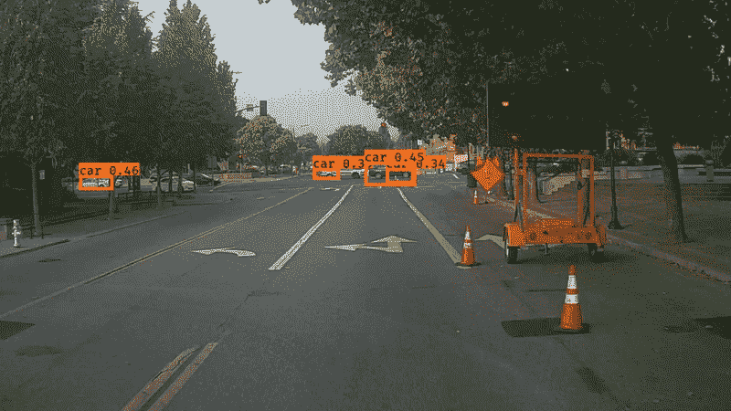

# 4.结论

*   **YOLO** 是一个快速准确的最先进的物体检测模型。
*   它通过 CNN 运行输入图像，CNN 输出一个 *19 x 19 x 5 x 85* 尺寸的体积。
*   编码可以被视为一个网格，其中每个 *19 x 19* 单元格包含关于 5 个盒子的信息。
*   使用**非最大抑制过滤所有框。**具体来说，使用**分数阈值**检测类的概率以仅保留准确(高概率)的框，以及**交集超过并集(IoU)** 阈值以消除重叠的框。
*   因为从随机初始化的权重中训练 YOLO 模型是非常重要的，并且需要大的数据集以及大量的计算，所以我们在这个练习中使用了先前训练的模型参数。如果您愿意，也可以尝试用自己的数据集微调 YOLO 模型，尽管这将是一项相当重要的工作。

# 引用和参考文献

特别感谢[**deep learning . ai**](https://www.deeplearning.ai/)。

所有*图*由 **deeplearning.ai** 提供。

本文提出的观点主要来自于 YOLO 的两篇论文。这里的实现也从 Allan Zelener 的 GitHub 库中获得了很多灵感并使用了很多组件。本次训练中使用的预训练重量来自 YOLO 官方网站。

*   约瑟夫·雷德蒙、桑托什·迪夫瓦拉、罗斯·吉斯克、阿里·法尔哈迪— [你只看一次:统一的实时物体检测](https://arxiv.org/abs/1506.02640) (2015)
*   约瑟夫·雷德蒙，阿里·法尔哈迪— [YOLO9000:更好、更快、更强](https://arxiv.org/abs/1612.08242) (2016)
*   艾伦·泽伦纳— [亚得 2K:又一个黑暗之网 2 Keras](https://github.com/allanzelener/YAD2K)
*   https://pjreddie.com/darknet/yolo/ YOLO 官方网站()

**汽车检测数据集**:Drive.ai 样本数据集(由 drive . ai 提供)在[知识共享署名 4.0 国际许可](http://creativecommons.org/licenses/by/4.0/)下获得许可。

**Github 回购**:[https://github.com/TheClub4/car-detection-yolov2](https://github.com/TheClub4/car-detection-yolov2)