# 不平衡数据集分类指南

> 原文：<https://towardsdatascience.com/guide-to-classification-on-imbalanced-datasets-d6653aa5fa23?source=collection_archive---------3----------------------->

## 理解和纠正阶级不平衡的教程

> 不平衡中的平衡平衡什么是不平衡 ***—阿马杜·贾鲁呸***


**免责声明:**这是一个关于处理不平衡数据集的综合教程。虽然这些方法对于多类分类仍然有效，但为了简单起见，本文的主要焦点将放在二分类上。

# **简介**

任何经验丰富的数据科学家或统计学家都知道，数据集很少均匀分布在感兴趣的属性之间。假设我们的任务是发现欺诈性信用卡交易——很自然，这些交易中的绝大多数都是合法的，只有极小一部分是欺诈性的。类似地，如果我们测试个体的癌症或病毒(包括新冠肺炎病毒)的存在，阳性率将(希望)只是被测试者的一小部分。更多例子包括:

*   一家电子商务公司预测哪些用户将在其平台上购买商品
*   一家制造公司分析生产材料的缺陷
*   垃圾邮件过滤试图区分“火腿”和“垃圾邮件”
*   入侵检测系统检查网络流量中的恶意软件签名或非典型端口活动
*   预测客户流失率的公司
*   在银行或金融机构关闭特定账户的客户数量
*   电信设备故障预测
*   从卫星图像探测石油泄漏
*   保险风险建模
*   硬件故障检测

来自不利类别的数据点通常要少得多。这是不幸的，因为我们非常关心避免这个类的错误分类。

事实上，在分类任务中很少有完全平衡的数据。通常，我们感兴趣分析的项目本质上是“罕见”事件，因为它们非常罕见，因此难以预测。这给有抱负的数据科学家带来了一个奇怪的问题，因为许多数据科学计划没有正确解决如何处理不平衡的数据集，因为它们在行业中非常普遍。

## **数据集何时变得“不平衡”？**

不平衡数据集的概念有点模糊。通常，两个变量之间具有 49–51 分割的二元分类数据集不会被视为不平衡。然而，如果我们有一个 90-10 分割的数据集，对我们来说这显然是一个不平衡的数据集。显然，不平衡数据的边界位于这两个极端之间。

从某种意义上说,“不平衡”一词是一个主观的词，由数据科学家来判断。一般来说，当标准分类算法(固有地偏向多数类(更多细节见[上一篇文章](/programming-fairness-in-algorithms-4943a13dd9f8?source=your_stories_page---------------------------&gi=5e1d5d3b8e16))由于多数类的偏向而返回次优解决方案时，数据集被认为是不平衡的。数据科学家可能会查看 45–55 分割的数据集，并判断这已经足够接近，不需要采取措施来纠正不平衡。然而，数据集变得越不平衡，就越需要校正这种不平衡。

**在一个概念学习问题中，如果数据集包含的一个类别的例子比另一个类别多得多，那么就说数据集呈现了类别不平衡。**

**因此，这些分类器倾向于忽略小类，而专注于准确分类大类。**

假设你在网飞工作，负责确定哪些客户流失率(客户“流失”意味着他们将停止使用你的服务或产品)。

在一个理想的世界中(至少对于数据科学家来说)，我们的训练和测试数据集将接近完全平衡，大约 50%的数据集包含会流失的个人，而 50%不会。在这种情况下，90%的准确度将或多或少地表示正分类组和负分类组的 90%的准确度。我们的误差将在两组中平均分配。此外，我们在两个类中有大致相同的点数，这从大数定律告诉我们减少了类中的总体方差。这对我们来说很好，在这种情况下，准确性是一个信息指标，我们可以不受阻碍地继续我们的分析。

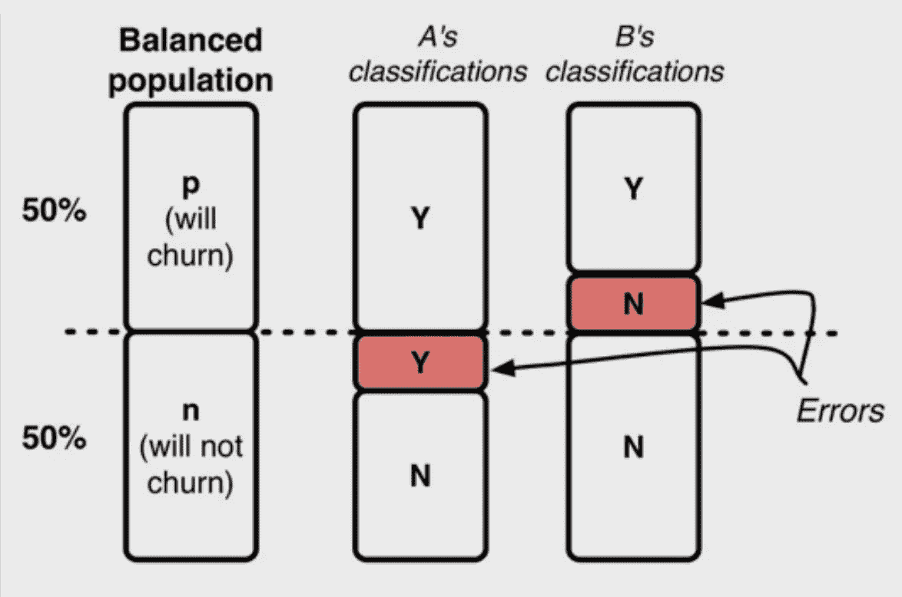

在二进制响应变量中对半分割的数据集。这个例子中没有多数类。

正如你可能已经怀疑的那样，大多数已经为网飞付费的人没有 50%的机会每月停止他们的订阅。事实上，会流失的人的比例相当小，接近 90-10 的比例。这种数据集不平衡的存在是如何使问题复杂化的？

假设 90-10 的比例，我们现在有一个非常不同的数据故事要讲。将这些数据交给算法而不做任何进一步的考虑可能会导致接近 90%的准确率。这看起来很不错，对吧？这和我们以前得到的差不多。如果你尝试将这种模型投入生产，你的老板可能会不高兴。

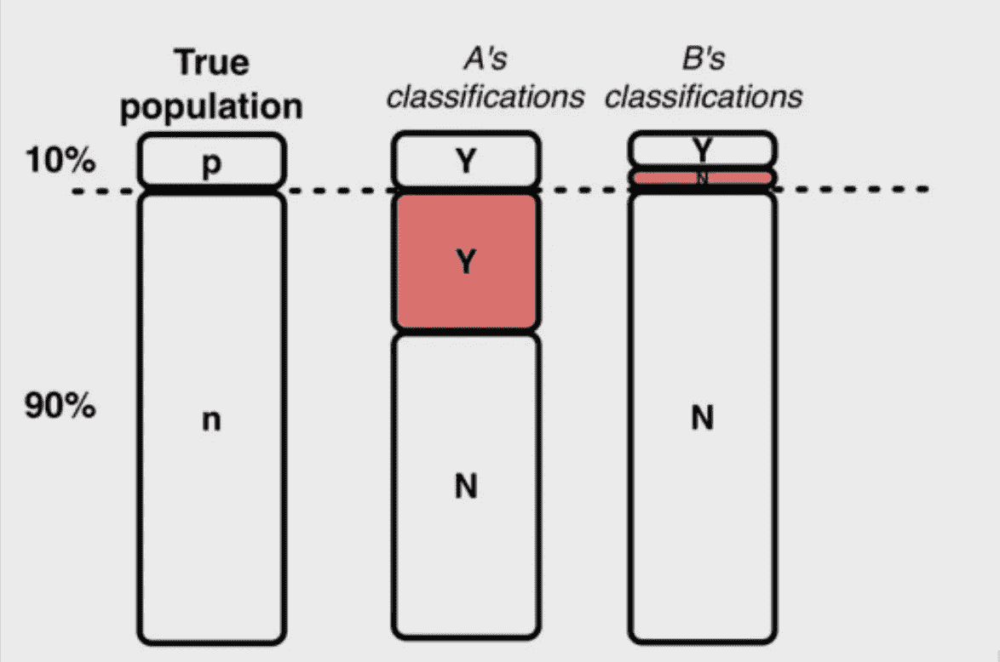

90–10 分割的不平衡数据集。假阳性会比假阴性大很多。由于数据点较少，少数集合中的方差会更大。多数类将支配算法预测，而不对不平衡进行任何校正。

给定多数类(90%类)的流行，我们的算法将可能回归到多数类的预测。该算法可以通过任意预测多数类每次出现来非常接近地最大化其准确性(我们选择的评分标准)。这是一个微不足道的结果，提供了接近零的预测能力。

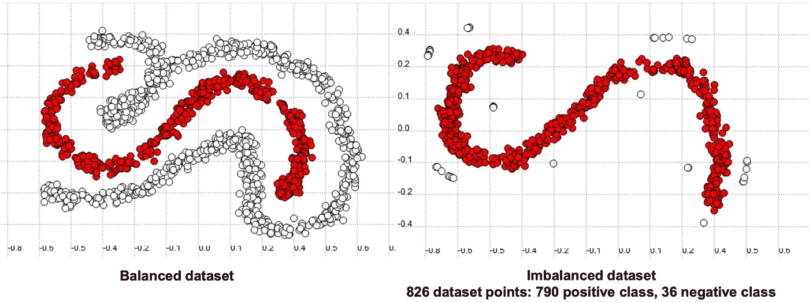

(左)正负类项目数相同的平衡数据集；在这种情况下，假阳性和假阴性的数量大致相等，导致很少的分类偏差。(右图)一个不平衡的数据集，其中大约 5%的样本属于负类，95%的样本属于正类(这可能是为网飞付费并决定在下一个付费周期退出的人数)。

**当数据不平衡和/或不同错误的成本差异显著时，预测准确性(一种评估分类器性能的常用选择)可能不合适。**

从视觉上看，该数据集可能如下所示:

默认情况下，机器学习算法假设数据是平衡的。在分类中，这对应于每个类的相对数量的实例。分类器从*平衡*分布中学习得更好。纠正失衡取决于数据科学家，这可以通过多种方式完成。

## 不同类型的不平衡

我们已经清楚地表明，不平衡数据集对标准数据集有一些额外的挑战。更复杂的是，在一个数据集中可能会出现不同的**类型**的不平衡。

**(1)课间**

当每个类别中包含的数据点数量不平衡时，就会出现类别间不平衡。这方面的一个例子如下所示:

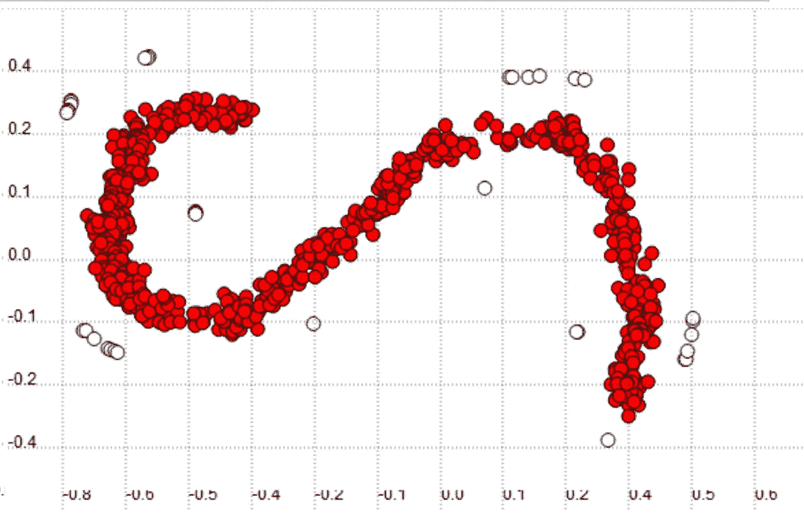

阶级间不平衡的例证。我们有大量红色类的数据点，但白色类的数据点相对较少。

这方面的一个例子是乳房 x 线照相数据集，它使用称为乳房 x 线照片的图像来预测乳腺癌。考虑与阳性和阴性癌症诊断相关的乳房 x 线照片的数量:

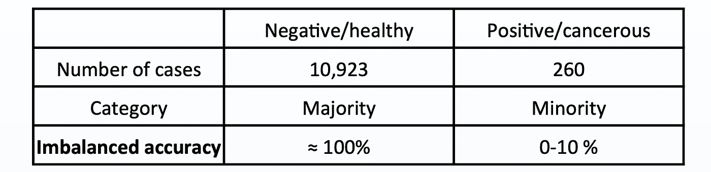

绝大多数样本(> 90%)为阴性，而相对较少(<10%) are positive.

Note that given enough data samples in both classes the accuracy will improve as the sampling distribution is more representative of the data distribution, but by virtue of the law of large numbers, the majority class will have inherently better representation than the minority class.

**(2)类内**

当数据集平衡了类间数据，但其中一个类在某些区域不具有代表性时，就会出现类内不平衡。这方面的一个例子如下所示:

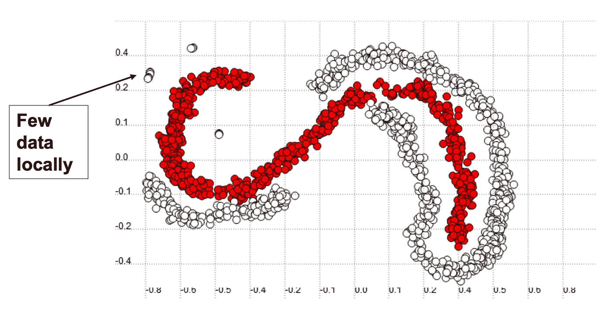

阶级内部不平衡的例证。这两个类别都有大量的数据点，但左上角白色类别中的数据点数量非常稀少，这可能导致与这些区域中预测的类别间不平衡类似的复杂性。

**(3)内在和外在**

一个**内在**不平衡是由于数据集的性质，而**外在**不平衡与时间、存储和其他限制数据集或数据分析的因素有关。内在特征相对简单，是我们常见的，但外在不平衡可以单独存在，也可以增加数据集的不平衡。

例如，公司经常使用入侵检测系统来分析进出网络的数据包，以检测恶意活动的恶意软件。根据您是分析所有数据还是仅分析通过特定端口或特定设备发送的数据，这将显著影响数据集的不平衡(大多数网络流量可能是合法的)。类似地，如果与可疑恶意行为相关的日志文件或数据包通常被存储，而正常日志没有被存储(或者只存储选定的几种类型)，那么这也会影响数据集的不平衡。类似地，如果日志仅在正常工作日(比如晚上 9-5 点)存储，而不是 24 小时，这也会影响不平衡。

## 失衡的进一步复杂化

不平衡的数据集增加了更多的困难。首先，我们有**类重叠**。这并不总是一个问题，但经常会在不平衡的学习问题中出现，并引起头痛。下面的数据集中显示了类重叠。

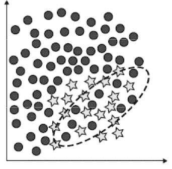

类重叠的例子。一些正数据点(星形)与负数据点(圆形)混杂在一起，这将导致算法构建不完美的决策边界。

类别重叠发生在正常的分类问题中，那么这里的附加问题是什么呢？在重叠区域中更多表示的类倾向于通过基于全局学习(在完整数据集上)的方法更好地分类。这是因为该算法能够更好地了解多数类的数据分布。

相比之下，在这样的区域中较少被代表的类倾向于通过局部方法被更好地分类。如果以 k-NN 为例，随着 k 值的增大，它变得越来越全局化，越来越局部化。可以看出，k 值较低时，少数数据集的性能较好，而 k 值较高时，性能较低。多数类不会出现这种精度变化，因为它在所有点上都有很好的表现。

这表明地方方法可能更适合研究少数民族阶层。对此进行校正的一种方法是 **CBO 方法**。CBO 方法使用基于聚类的重采样来识别“罕见”病例，并对它们分别进行重采样，以避免在已有假设中产生小的析取项。这是一种过采样方法，我们将在下一节详细讨论。

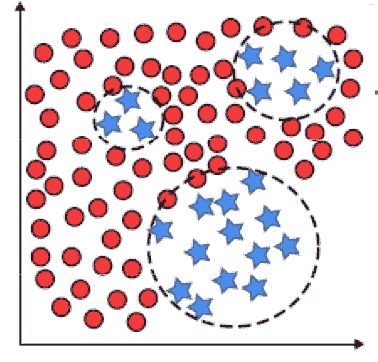

CBO 方法。一旦每一类的训练样本被聚类，过采样就开始了。在多数类中，除了最大的一个聚类之外，所有聚类都被随机过采样，以便获得与最大聚类相同数量的训练样本。

# **校正数据集不平衡**

有几种技术可以控制数据集的不平衡。处理不平衡数据集的技术主要有两种:**采样方法**和**成本敏感方法**。

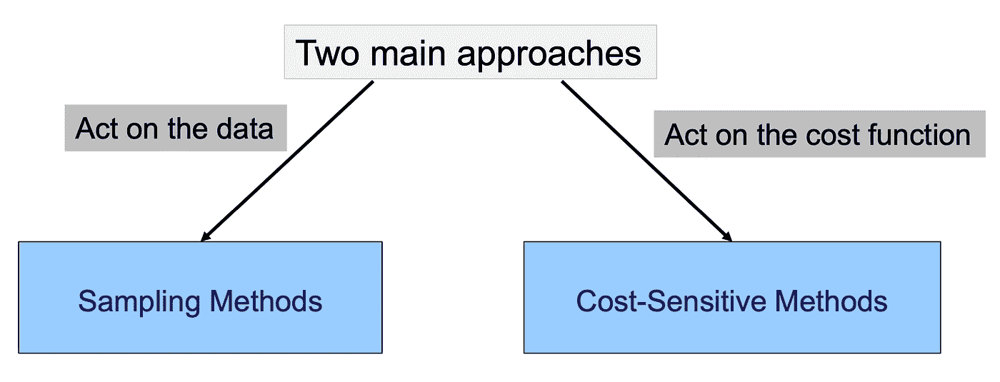

其中最简单和最常用的是采样方法，称为过采样和欠采样，我们将对此进行更详细的讨论。

**过采样/欠采样**

简单地说，过采样涉及为少数类生成新的数据点，而欠采样涉及从多数类中移除数据点。这在一定程度上降低了数据集中的不平衡程度。

欠采样是什么样子的？我们不断地移除非常接近的相似样本，直到两个类别具有相同数量的数据点。

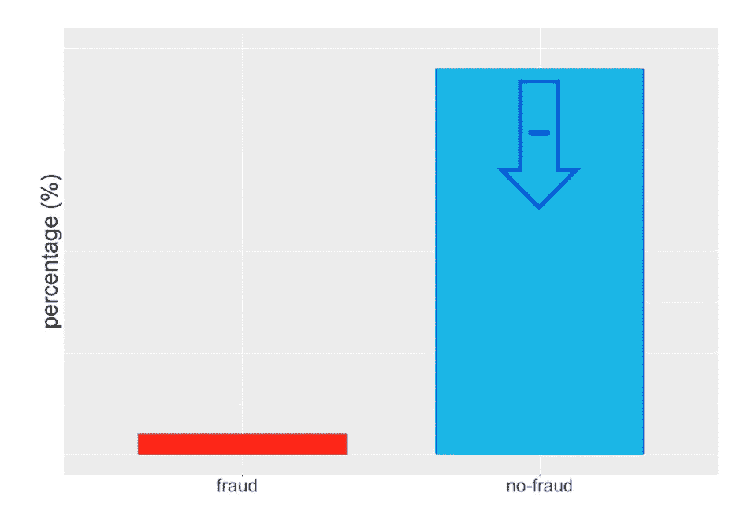

**欠采样。**假设您正在分析欺诈交易的数据集。大多数交易都不是欺诈性的，这造成了一个根本不平衡的数据集。在欠采样的情况下，我们将从多数类中获取较少的样本，以帮助减少这种不平衡的程度。

欠采样是个好主意吗？许多统计研究人员建议使用欠采样，但只有在欠采样类上有足够多的数据点时，欠采样才有用。此外，由于多数类最终将与少数类具有相同的点数，分布的统计特性在某种意义上将变得“更松散”。然而，我们没有通过添加人工数据点来人为地扭曲这种方法的数据分布。

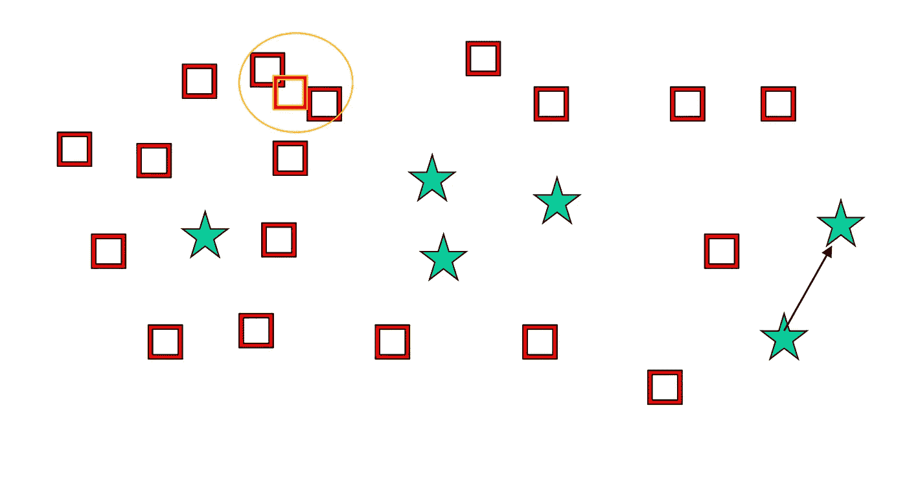

欠采样插图。在试图增加数据分布的稀疏性时，移除非常接近的相似样本。

过采样是什么样子的？简言之，与欠采样相反。我们人为地向数据集中添加数据点，以平衡每个类中的实例数量。

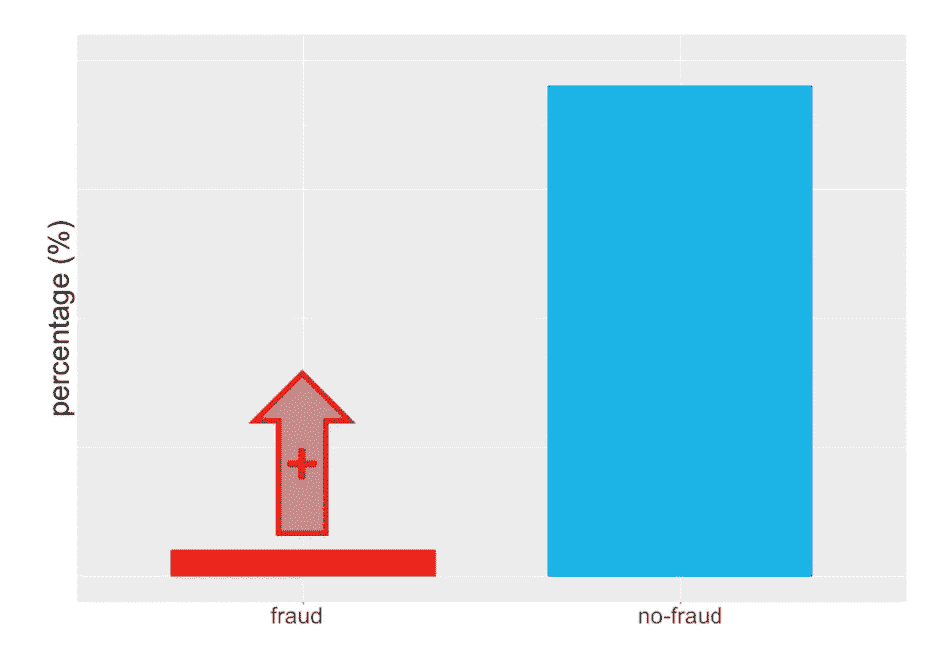

**过采样。**在过采样的情况下，我们将从少数类中进行过采样，以帮助降低这种不平衡的程度。

我们如何生成这些样本？最常见的方法是生成在数据空间中接近现有样本或位于两个样本之间的点，如下图所示。

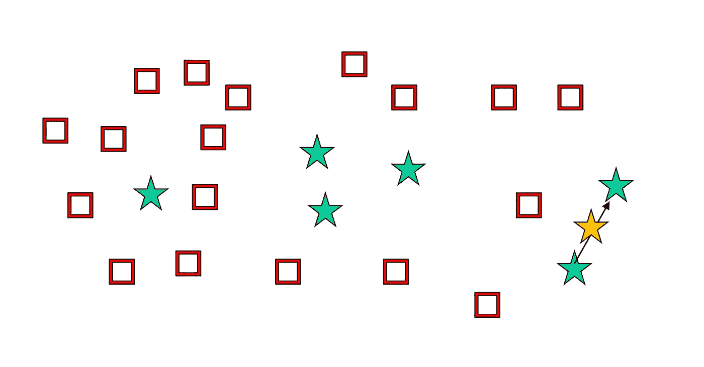

过采样示意图。

正如您可能已经怀疑的那样，添加虚假数据点有一些不利之处。首先，您有过度拟合的风险，尤其是如果您对有噪声的点这样做，您最终会通过添加增强的测量来加剧这种噪声。此外，随机添加这些值也会给我们的模型带来额外的噪声。

**SMOTE(合成少数过采样技术)**

幸运的是，我们不必为了过采样而编写随机生成数据点的算法。相反，我们可以使用 SMOTE 算法。

SMOTE 是如何工作的？SMOTE 根据现有数据点的局部密度及其与其他类的边界，在现有数据点之间生成新样本。它不仅执行过采样，而且可以随后使用清理技术(欠采样，稍后会详细介绍)来最终消除冗余。下面是研究类数据时 SMOTE 如何工作的图示。

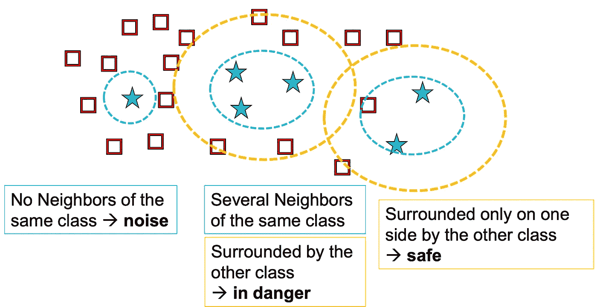

SMOTE 功能的说明。左侧的实例是孤立的，因此被算法视为噪声。在其附近没有生成额外的数据点，或者，如果有的话，它们将非常接近奇点。中间和右侧的两个聚类有几个数据点，表明这些点不太可能对应于随机噪声。因此，更大的聚类(经验数据分布)可以由算法绘制，由此可以产生额外的样本。

SMOTE 的算法如下。对于每个少数民族样本:

–找到其 k 个最近的少数民族邻居

–随机选择 j 个邻居

–沿着连接少数样本及其 j 个选定相邻样本的线随机生成合成样本(j 取决于所需的过采样量)

**知情与随机过采样**

使用少数类的**随机过采样**(替换)具有使少数类的决策区域非常具体的效果。在决策树中，这将导致新的分裂，并经常导致过度拟合。SMOTE 的**知情过采样**概括了少数类的决策区域。结果，学习了较大的和不太具体的区域，因此，关注少数类样本而不会导致过度拟合。

**SMOTE 的弊端**

**过度概括。SMOTE 的程序可能是危险的，因为它盲目地概括少数民族地区，而不考虑多数民族阶层。这种策略在高度偏斜的阶级分布的情况下特别成问题，因为在这种情况下，少数阶级相对于多数阶级来说非常稀疏，从而导致更大的阶级混合机会。**

**不灵活。**SMOTE 生成的合成样本数量是预先固定的，因此不允许在重新平衡速率上有任何灵活性。

另一个潜在的问题是 SMOTE 可能会在多数类空间中引入过多的人为少数类示例。这个缺点可以通过混合来解决:结合 SMOTE 和欠采样算法。其中最著名的就是 [**Tomek 链接**](https://github.com/ojtwist/TomekLink) 。Tomek 链接是相对类的实例对，它们是自己最近的邻居。换句话说，它们是非常接近的对立实例对。

Tomek 的算法寻找这样的配对，并移除配对的多数实例。这个想法是为了澄清少数民族和多数民族阶级之间的界限，使少数民族地区更加分明。Scikit-learn 没有内置的模块来做到这一点，尽管有一些独立的包(例如 [TomekLink](https://github.com/ojtwist/TomekLink) 、[不平衡学习](https://imbalanced-learn.readthedocs.io/en/stable/index.html))。

因此，Tomek 的算法是一种欠采样技术，充当 SMOTE 的数据清理方法，以调节冗余。正如您可能已经怀疑的那样，有许多额外的欠采样技术可以与 SMOTE 结合使用来执行相同的功能。这些功能的完整列表可以在[不平衡学习文档](https://imbalanced-learn.readthedocs.io/en/stable/api.html#module-imblearn.ensemble)的功能部分找到。

另一个示例是编辑最近邻(ENN)。ENN 删除其类标签不同于至少两个其邻居的类的任何例子。ENN 比托梅克链接删除了更多的例子，也可以从两个类中删除例子。

SMOTE 的其他更细致的版本包括 Borderline SMOTE、SVMSMOTE 和 KMeansSMOTE，与 SMOTE 配合使用的欠采样技术的更细致的版本是压缩最近邻(CNN)、重复编辑最近邻和实例硬度阈值。

## 成本敏感学习

我们已经讨论了抽样技术，现在准备讨论成本敏感的学习。在许多方面，这两种方法是相似的——主要区别在于，在成本敏感学习中，我们通过改变单个样本的相对权重来执行欠采样和过采样。

**上升流。**上加权类似于过采样，其工作原理是增加一个类的权重，同时保持另一个类的权重为 1。

**降体重。**向下加权类似于欠采样，其工作原理是降低一个类的权重，同时保持另一个类的权重为 1。

如何使用 sklearn 实现这一点的一个例子是通过`sklearn.utils.class_weight`函数并应用于任何 sklearn 分类器(以及 keras 内)。

```
from sklearn.utils import class_weight
class_weights = class_weight.compute_class_weight('balanced',                                                  np.unique(y_train), y_train)
model.fit(X_train, y_train, class_weight=class_weights)
```

在这种情况下，我们已经将实例设置为“平衡的”，这意味着我们将根据它们的相对点数来处理这些实例，使其具有平衡的权重——这是我的建议，除非您有自己设置值的充分理由。如果您有三个类，并且希望将其中一个类的权重增加 10 倍，将另一个类的权重增加 20 倍(因为数据集中的这些点比多数类少 10 倍和 20 倍)，那么我们可以将其重写为:

```
class_weight = {0: 0.1,
                1: 1.,
                2: 2.}
```

一些作者声称，成本敏感学习比随机或定向过采样或欠采样稍微更有效，尽管所有方法都是有帮助的，并且定向过采样在功效上接近成本敏感学习。就我个人而言，当我在处理机器学习问题时，我会使用成本敏感学习，因为它更容易实现并与个人沟通。然而，使用采样技术可能还有其他方面可以提供我所不知道的更好的结果。

# **评估指标**

在这一节中，我概述了几个可用于分析分类器性能的指标，这些分类器被训练来解决二元分类问题。这些包括(1)混淆矩阵，(2)二进制分类度量，(3)接收器操作特性曲线，和(4)精度-召回曲线。

## **混淆矩阵**

不管你从它的名字中获得了什么，混淆矩阵是绝对令人困惑的。混淆矩阵是评估二元分类器的最基本形式。给定我们的分类器的预测输出和真实的响应变量，混淆矩阵告诉我们每个类别有多少预测是正确的，有多少是不正确的。混淆矩阵提供了基于这些因素的分类器性能的简单可视化。

这是混淆矩阵的一个例子:


希望这显示的相对清晰。TN 单元格告诉我们真阳性的数量:我*预测*为阳性的阳性样本的数量。

TP 单元格告诉我们真正阴性的数量:我*预测*为阴性的阴性样本的数量。

FP 细胞告诉我们假阳性的数量:我*预测*为阳性的阴性样本的数量。

FN 细胞告诉我们假阴性的数量:我*预测*为阳性的阳性样本的数量。

这些数字非常重要，因为它们构成了接下来讨论的二元分类度量的基础。

## **二元分类度量**

二元分类有过多的单值度量。因此，此处仅介绍一些最常用的方法及其不同的公式，更多详细信息可在 [sklearn 文档](https://scikit-learn.org/stable/modules/model_evaluation.html#scoring-parameter)中找到，以及它们与混淆矩阵和 ROC 曲线的关系(在下一节讨论)[此处](https://en.wikipedia.org/wiki/Receiver_operating_characteristic)。

可以说，二元分类最重要的五个指标是:(1)精确度，(2)召回率，(3) F1 分数，(4)准确度，和(5)特异性。

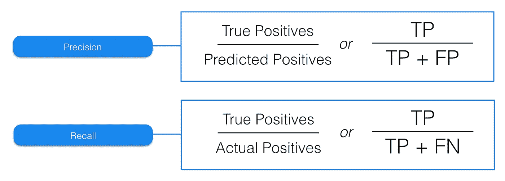

**精度。**精确为我们提供了问题的答案*“在我所有的积极预测中，有多少是正确的？”*。如果您有一个正确预测所有阳性类别的算法，但也有很大一部分误报，精度将会很低。为什么称之为精度是有道理的，因为它是我们预测有多“精确”的一个度量。

**回忆。**回忆为我们提供了另一个问题的答案*“在所有阳性样本中，我正确预测的比例是多少？”*。我们现在对假阴性感兴趣，而不是假阳性。这些是我们的算法遗漏的项目，并且通常是最严重的错误(例如，未能诊断出实际上患有癌症的癌症，未能发现恶意软件，或未能发现有缺陷的项目)。在这种情况下,“召回”这个名称也是有意义的，因为我们可以看到算法能够提取多少样本。

应该清楚的是，这些问题虽然相关，但彼此有很大的不同。有可能具有非常高的精度，同时具有低的召回率，反之亦然。例如，如果您每次都预测多数类，那么您会对多数类有 100%的回忆，但是您会从少数类得到很多误报。

要指出的另一个要点是，可以为每个单独的类确定精度和召回率。也就是说，我们可以谈论 A 类的精度，或者 B 类的精度，它们会有不同的值——在这样做的时候，我们假设我们感兴趣的类是正类，而不考虑它的数值。

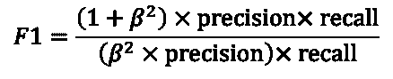

F1 分数是精确度和召回率的调和平均值，它们的相对权重可以使用参数β *来调整。*

**F1 比分。**F1 分数是一个单值指标，通过使用调和平均值(一种奇特的平均类型)结合了精确度和召回率。 *β* 参数是一个严格的正值，用于描述召回率对精确度的相对重要性。较大的 *β* 值更强调查全率而不是查准率，而较小的值则不太强调查全率。如果该值为 1，则精确度和召回率的权重相等。

F1 高分意味着什么？这表明精度和召回率都有很高的值，这很好，也是在不平衡数据集上生成功能良好的分类模型时所希望看到的。较低的值表示精确度或召回率较低，可能需要引起关注。良好的 F1 分数通常低于良好的准确性(在许多情况下，0.5 的 F1 分数被认为是非常好的，例如从乳房 x 光片预测乳腺癌)。

**特异性。**简单来说，特异性就是对负值的回忆。它回答了问题*“在我所有的负面预测中，有多少是正确的？”*。这在需要检查假阳性的相对比例的情况下可能很重要。

**宏观、微观和加权分数**

这就是事情变得有点复杂的地方。任何在 sklearn 上钻研过这些指标的人可能都注意到了，我们可以参考 recall-macro 或者 f1 加权分数。

**宏观 F1** 分数是每个班级 F1 分数的平均值。

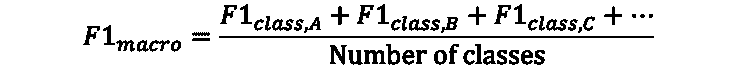

如果我们有很多班级，并且我们对每个班级的平均 F1 分数感兴趣，这是非常有用的。如果你只关心一门课的 F1 分数，你可能不需要一个宏观的 F1 分数。

一个**微 F1** 分数从所有类中获取所有的真阳性、假阳性和假阴性，并计算 F1 分数。


微观 F1 分数在效用上与宏观 F1 分数非常相似，因为它给出了分类器在多个类别上的总体性能。也就是说，他们会给出不同的结果，并理解潜在的差异，结果可能是给定应用程序的信息。

**加权 F1** 分数与宏观 F1 分数相同，但是每个特定于类别的 F1 分数是由该类别的样本的相对数量来衡量的。

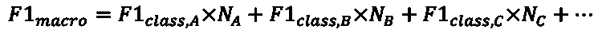

在这种情况下， *N* 是指数据集中属于单个类的样本的比例。对于 A 类，其中 A 类是多数类，这可能等于 0.8 (80%)。B 和 C 的值可能分别是 0.15 和 0.05。

对于一个高度不平衡的数据集，一个大的**加权 F1** 分数可能会有些误导，因为它受到多数类的过度影响。

**其他指标**

对于二元分类(在某种程度上也包括多类分类)来说，您可能会看到的其他一些指标有:

**准确度。如果你正在读这篇文章，我想你已经对准确性很熟悉了，但对其他的可能就不那么熟悉了。根据混淆矩阵的度量，准确性可以描述为真实预测(阳性和阴性)与阳性和阴性样本总数之和的比率。**

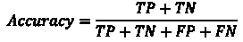

**G-均值。**G 均值是一个不太常见的指标，有点类似于 F1 得分。这通常用两种不同的公式表示，第一种是精确召回 g 均值，第二种是灵敏度特异性 g 均值。在分析算法性能方面，它们可以以类似于 F1 分数的方式使用。精确召回率 g 均值也可以称为 [Fowlkes-Mallows 指数](https://en.wikipedia.org/wiki/Fowlkes%E2%80%93Mallows_index)。

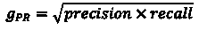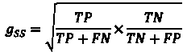

还有许多其他可以使用的度量标准，但是大多数都有专门的用例，除了这里描述的度量标准之外，几乎没有提供额外的效用。读者可能有兴趣查看的其他指标有*平衡准确度*、[、*马修斯相关系数*、](https://en.wikipedia.org/wiki/Matthews_correlation_coefficient)[、*标记性*、](https://en.wikipedia.org/wiki/Markedness)和*信息量*、。

**受试者工作特性(ROC)曲线**

ROC 曲线是一个二维图形，用来描述收益(真阳性)和成本(假阳性)之间的权衡。它显示给定分类器(二元问题、参数化分类器或分数分类)的**灵敏度**和**特异性**之间的关系。

这是一个 ROC 曲线的例子。


这里有很多东西需要打开。首先，穿过中心的虚线对应于一个分类器，该分类器充当“抛硬币”的角色。也就是说，它大约有 50%的正确率，是最差的分类器(我们只是猜测)。这作为我们的基线，我们可以对照它比较所有其他分类器——这些分类器应该更靠近图的左上角，因为我们希望在所有情况下都有高的真阳性率。

应当注意，ROC 曲线不评估一组分类器。相反，它在一组**分类阈值**上检查单个分类器。

这是什么意思？这意味着，对于一个点，我将我的分类器和阈值设置为 0.3 (30%倾向)，然后评估真阳性和假阳性率。

> ***真阳性率:*** *由特定分类器和分类阈值的组合产生的真阳性(对真阳性和假阴性之和)的百分比。*
> 
> ***假阳性率:*** *特定分类器和分类阈值组合产生的假阳性(占假阳性和真阴性之和)的百分比。*

这给了我两个数字，我可以把它们画在曲线上。然后我取另一个阈值，比如 0.4，重复这个过程。在对每个感兴趣的阈值(可能以 0.1、0.01 或 0.001 的增量)做了这些之后，我们为这个分类器构建了一个 ROC 曲线。

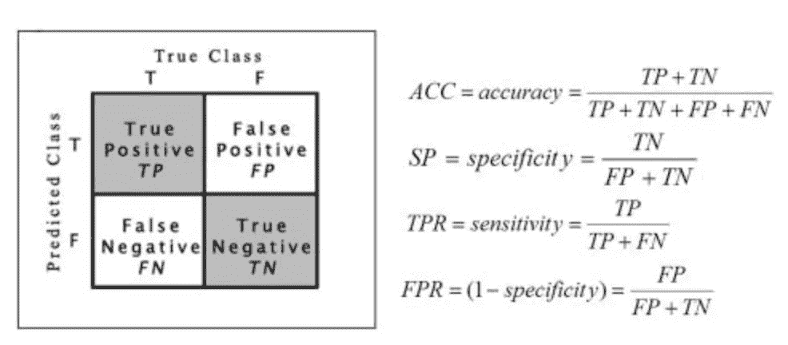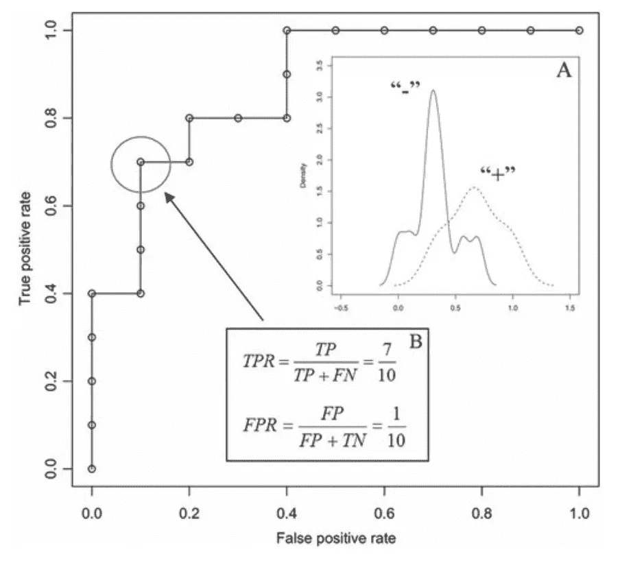

ROC 曲线示例显示了如何绘制单个点。与分类阈值一起选择分类器。接下来，计算这种分类和阈值组合的真阳性率和假阳性率，并随后绘图。

这样做有什么意义？根据您的应用，您可能非常反对假阳性，因为它们可能非常昂贵(例如发射核导弹)，因此希望分类器具有非常低的假阳性率。相反，只要您获得了高的真阳性率，您可能就不会那么关心高的假阳性率(阻止大多数欺诈事件可能是值得的，即使您必须检查更多被算法标记为有缺陷的事件)。对于这两个比率之间的最佳平衡(其中假阳性和假阴性的代价相等)，我们将采用导致离左上角最小对角线距离的分类阈值。

为什么左上角对应理想分类器？ROC 曲线上的理想点应该是(0，100) **，**也就是说，所有阳性样本都被正确分类，并且没有阴性样本被错误分类为阳性。在一个完美的分类器中，不会有错误分类！

虽然图表本身可能看起来不太有用，但它有助于比较分类器。一个特殊的指标，曲线下面积(AUC) 得分，允许我们通过比较 ROC 曲线上产生的线下总面积来比较分类器。对于理想的分类器，AUC 等于 1，因为我们将 100% (1.0)的真阳性率乘以 100% (1.0)的假阳性率。如果某个分类器的 ROC 为 0.6，而另一个分类器的 ROC 为 0.8，那么后者显然是更好的分类器。AUC 的优势在于它独立于决策标准——分类阈值——因此更容易比较这些分类器。

现在可能会想到一个问题——如果一些分类器在较低阈值时更好，一些在较高阈值时更好，会怎么样？这就是 ROC 凸包的用武之地。凸包为我们提供了一种识别潜在最佳分类器的方法——即使我们可能没有直接观察到它们，我们也可以推断它们的存在。请考虑下图:

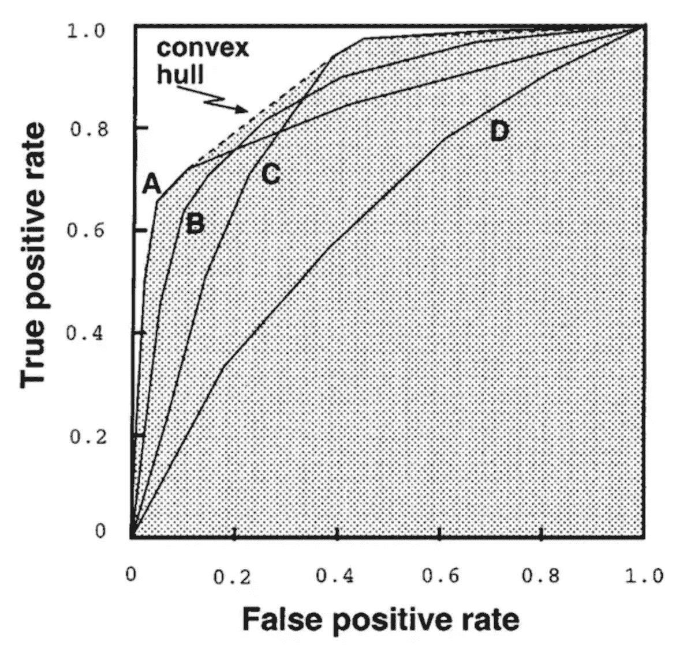

**来源:** [Quora](https://www.quora.com/What-is-the-best-way-to-combine-multiple-models-in-machine-learning-to-achieve-a-better-AUC-for-the-ROC-curve)

给定一族 ROC 曲线，ROC 凸包可以包括更靠近 ROC 空间左上角(完美分类器)的点。如果一条直线通过凸包上的一点，那么就没有其他斜率相同的直线通过另一个真正截距更大的点。因此，在该点的分类器在与该斜率串联的任何分布假设下都是最优的。检查图像后，这可能更容易理解。

欠采样/过采样如何影响 ROC 曲线？一篇名为“[*SMOTE:Synthetic Minority Over-sampling Technique*](https://www.researchgate.net/publication/220543125_SMOTE_Synthetic_Minority_Over-sampling_Technique)”的关于 SMOTE(之前讨论过)的著名论文概述了通过对多数类进行欠采样，我们迫使 ROC 曲线向上和向右移动，从而有可能增加给定分类器的 AUC(这本质上只是验证 SMOTE 功能正确，如预期的那样)。类似地，对少数类进行过采样也会产生类似的影响。

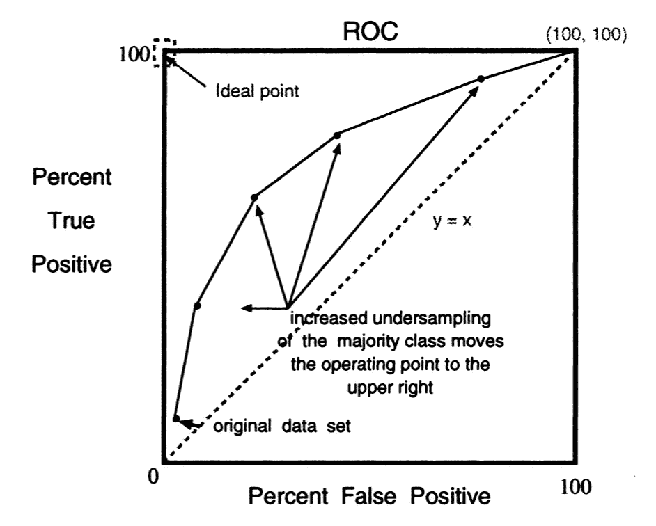

通过欠采样扫描 ROC 曲线的图示。多数(负)类的欠采样增加会将性能从左下角移动到右上角。**来源** : [研究之门](https://www.researchgate.net/publication/220543125_SMOTE_Synthetic_Minority_Over-sampling_Technique)

**精确召回(PR)曲线**

可以从 ROC 空间重铸类似于 ROC 曲线的图，并将其重新表达到 PR 空间。这些图表在许多方面类似于 ROC 曲线，但我们没有绘制召回率对辐射(真阳性率对假阳性率)，而是绘制精确度对召回率。这产生了 ROC 曲线的某种镜像(曲线本身看起来有些不同),因为 PR 曲线的右上角指定了理想的分类器。这通常比 ROC 曲线更容易理解，但提供了非常相似的信息。PR 曲线下的面积通常称为 mAP，类似于 ROC 空间中的 AUC。

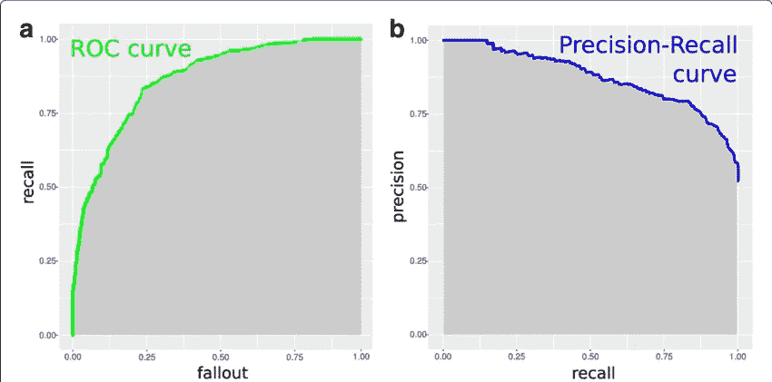

**来源:** [研究之门——计算生物学中机器学习的十个快速提示](https://www.researchgate.net/publication/321672019_Ten_quick_tips_for_machine_learning_in_computational_biology)

# **最终点评**

与不平衡数据集在许多工业机器学习应用中的流行性和重要性相反，不平衡数据集在许多数据科学项目中的代表性不足(没有双关语)。数据科学家的工作是能够识别数据集何时失衡，并遵循程序和利用指标来充分理解和控制这种失衡。

我希望在阅读这篇文章的过程中，您已经了解了一些关于处理不平衡数据集的知识，并且在将来面对这种不平衡问题时能够游刃有余。如果你是一个认真的数据科学家，这些应用程序之一的出现只是时间问题！

## **简讯**

关于新博客文章和额外内容的更新，请注册我的时事通讯。

[](https://mailchi.mp/6304809e49e7/matthew-stewart) [## 时事通讯订阅

### 丰富您的学术之旅，加入一个由科学家，研究人员和行业专业人士组成的社区，以获得…

mailchi.mp](https://mailchi.mp/6304809e49e7/matthew-stewart)