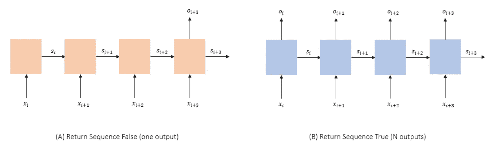
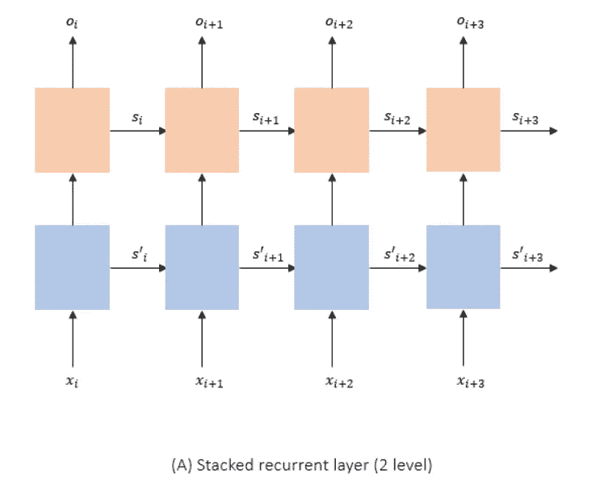
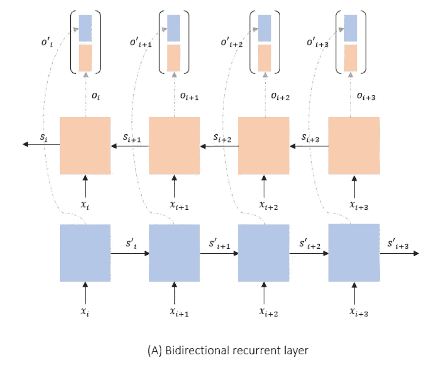
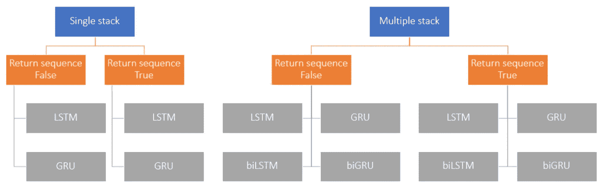
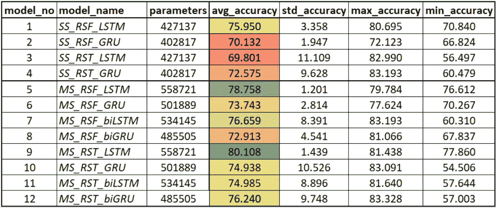
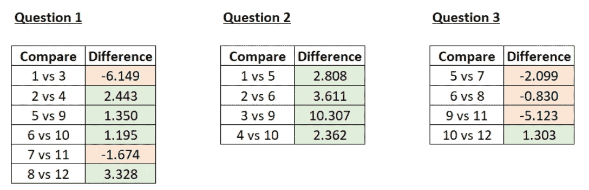

# Keras 中的自定义递归建模指南

> 原文：<https://towardsdatascience.com/guide-to-custom-recurrent-modeling-in-keras-29027e3f8465?source=collection_archive---------16----------------------->

## 探索由基本循环层组成的 12 种不同排列，实验性地回答 3 个关于模型构建的有趣问题！


弗兰基·查马基在 [Unsplash](https://unsplash.com?utm_source=medium&utm_medium=referral) 上拍摄的照片

# 介绍

递归神经操作的初始层次通常从 LSTM、GRU 和 RNN 开始。但是随着任务复杂性的增加，我们应该使用更复杂的模型。也就是说，在直接转向不同的、相对复杂的模型(如注意力或变形金刚)之前，我们应该先问一个简单的问题——我们还能快速处理基本的循环层吗？在这篇文章中，我将关注同样的哲学——我们应该先尝试简单的解决方案，然后再尝试更复杂的解决方案。在接下来的部分中，我们将探索相同的一组旧的循环层(尽管有一些有趣的安排)，以获得更好的数据推断。总共，我们将讨论 12 个这样的安排(包括原始设置)。最后，我们将在文本情感检测任务上测试我们的所有模型，以比较它们的性能。我们开始吧！

# 先决条件

在继续之前，让我们讨论几个我们应该知道的主题，以便完全理解这篇文章。还有一点，我交替使用排列和模型，因为所有讨论的模型不过是基本循环层的组合，它充当最小的构建块。

# 递归层输出类型

任何递归层都可以选择返回两种类型的输出— (1)最后状态输出(1 个输出)和(2)所有状态输出(N 个输出)。实际上，第二种类型更通用，因为它也包含最后的状态输出(即，第一种类型)，但通常，流行的深度学习库的实现提供了返回两种类型输出的选项。对于 Keras，默认为第一种类型，您可以设置参数`return_sequence=True`转换为第二种类型。请注意，这里的“状态”是指递归图层的隐藏状态，N 个输出通常是数据集中的时间步长数。为了了解更多关于循环层和隐藏状态的内部情况，我推荐这篇[优秀文章](https://colah.github.io/posts/2015-08-Understanding-LSTMs/)。现在回到主题，有趣的是，虽然第二种类型包含更多的信息(这通常是一件好事)，但它也可能令人不知所措，因为我们不知道该如何处理它。由于大多数下游应用程序仍然需要一个输出，我们最终将所有状态的输出合并为一个最终输出(可能的技术—使用`AveragePooling`或`MaxPooling`)。在某种程度上，LSTM 或 GRU 也是如此，他们使用前一个州的输出(和当前输入)来创建下一个州的输出。那么有趣的问题是，“什么更好——信任 LSTM/GRU 来巩固国家产出还是应用我们自己的逻辑？”。我们将在后面的章节中尝试回答这个问题，现在，让我们继续。



循环层中的变化与输出数量有关。(作者)

# 堆叠循环层

递归层接受顺序输入并处理它们以返回一个或多个输出(状态向量)。现在，由于输出(如果我们返回所有状态的输出)也遵循顺序感，它们可以被认为是一些转换的原始输入，并可以被传递到 LSTM/GRU 的另一层进行进一步处理。这被称为堆叠，这里的主要直觉是，就像普通的深度神经网络，你可以添加更密集的层，或者 CNN，你可以一个接一个地添加多个卷积层，在循环分层中，你可以将多个层一个接一个地堆叠起来。理想情况下，层数越多，可调参数越多，学习能力越强。但是要小心添加太多的栈，因为这可能会导致过度拟合(对于太简单的学习需求来说，网络太复杂)。我们在这里可以问的主要问题是“增加堆叠层会带来更好的性能吗？”。



2 级堆叠循环模型，其中每一级都有不同的循环层(不同的权重)

# 双向循环层

一个有趣的安排是，当您有两个递归层(它们没有堆叠)时，在一个层中，数据从左到右传递用于训练，而在另一个层中，这个方向相反。这是双向递归层，直觉是，与仅具有前向训练和左上下文的正常层相比，在准备状态向量输出时具有左和右上下文可以导致更高的性能。通常，对于您期望完整数据(双向上下文)存在的任务，这是正确的，因此这对于情绪检测是有效的，因为我们有完整的句子字符串可用，但对于时间序列预测是不正确的，因为如果我们想要今天的值(比如温度)，我们没有未来日期的数据。由于双向系统使用 2 个循环层，我们将其与堆叠架构进行比较，并询问“哪一个更好——2 层堆叠循环层还是双向循环层？”。



具有两个不同循环层的双向层。

# 方法学

接下来，让我们尝试使用我们知道的模型(基本循环层)和上面学到的技术来定义和分组我们可以创建的不同排列。在更高的层次，我们把所有的安排分成两大类—

1.  **单栈(SS)** :其中我们只使用一个循环层
2.  **多栈(MS)** :其中我们使用了多个循环层。为了保持分析简单，我将只使用 2 层安排。

此外，由于 rnn 已经[让位于“更好”](https://stats.stackexchange.com/questions/222584/difference-between-feedback-rnn-and-lstm-gru#:~:text=We%20can%20say%20that%2C%20when,Inputs%20as%20per%20trained%20Weights.&text=So%2C%20LSTM%20gives%20us%20the,more%20Complexity%20and%20Operating%20Cost.)的循环层，我们在分析中将只考虑 LSTM 和 GRU。现在，在 SS 的情况下，我们可以使用 LSTM 或 GRU，我们也可以通过只取 1 个输出或 N 个输出来增加味道。这给了我们可能想要考虑的不同安排。接下来，在 **MS** (本文只有 2 个)的情况下，让我们首先从 1 个和 N 个输出开始。对于每个这样的设置，我们可以使用两层堆叠或双向 LSTM 和 GRU。这给了我们`2x2x2=8`不同的安排。所有 12 种排列组合如下所示。注意，我说的“返回序列错误”是指 1 个输出，因为你只返回一个输出，而不是完整的序列。



循环层排列的分离。

# 密码

现在让我们看看如何在 Keras 中编码不同的安排。为了简洁起见，我将只展示 LSTM 递归层的代码。转移到 GRU 就像在代码中用 GRU 替换 LSTM 一样简单(不过别忘了导入 GRU)。我也将只涵盖 4 个不同的品种，因为休息可以很容易地建立后，小的修改。LSTM RSF 市入门，即单一堆叠-返回序列错误-LSTM 图层😉

**SS_RSF_LSTM**

```
# import 
from tensorflow.keras import layers
from tensorflow import keras
# model
inputs = keras.Input(shape=(99, )) # input layer - shape should be defined by user.
embedding = layers.Embedding(num_words, 64)(inputs) # embedding layer
rl = layers.LSTM(128)(embedding) # our LSTM layer - default return sequence is False
dense = layers.Dense(64)(rl) # a dense layer on the output of LSTM
output = layers.Dense(1, activation='sigmoid')(dense) # final layer which gives classification result
self.model = keras.Model(inputs=inputs, outputs=output, name="SS_RSF_LSTM") # stitching everything together
```

需要注意的事情很少，

*   代码是根据情感分类任务创建的(下一节)。因此，最终的输出层的大小为 1，具有 sigmoid 激活以返回概率作为输出。
*   我们定义一个输入，其中我们说 shape=99，即我们在数据中预期的时间步长。这里指的是每个句子的字数。
*   我们使用嵌入层将单词转换成向量表示。我们可以使用现成的单词嵌入，如 Glove 或 Word2Vec，但是我们初始化了一个新的，专门为这个任务训练的单词嵌入。每个向量的大小是 64，`num_words`是我们正在使用的数据集的词汇大小。
*   我们使用一个状态输出大小为 128 的 LSTM 层。注意，由于默认返回序列为假，所以我们只得到一个输出，即 LSTM 的最后一个状态。
*   我们将最后一个状态输出与大小=64 的密集层连接起来。这用于增强 LSTM 输出的复杂阈值处理。

**SS_RST_LSTM**

这里唯一的区别是，我们从 LSTM 返回所有州的输出。我们可以这样做:

```
inputs = keras.Input(shape=(99, ))
embedding = layers.Embedding(num_words, 64)(inputs)
rl = layers.LSTM(128, return_sequences=True)(embedding)
avg = tf.keras.layers.AveragePooling1D(pool_size=99)(rl)
dense = layers.Dense(64)(avg)
output = layers.Dense(1, activation='sigmoid')(dense)
self.model = keras.Model(inputs=inputs, outputs=output, name="SS_RST_LSTM")
```

注意事项:

*   第一个变化是在 LSTM 定义中增加了`return_sequence=True`。
*   接下来，我们需要将 99x128 矩阵合并成 1x128 大小的向量。虽然有很多方法可以做到这一点，但我们将选择`AveragePooling1D`，它简单地取每 99 个时间步长向量的平均值来返回 1 个向量输出。这里的`pool_size`是指我们取每 99 个时间步的平均值。

**MS _ RSF _ 比尔斯特姆**

要有一个双向层，我们需要做的就是在 LSTM 之上添加一个`Bidirectional`函数。

```
inputs = keras.Input(shape=(99, ))
embedding = layers.Embedding(num_words, 64)(inputs)
rl = layers.Bidirectional(layers.LSTM(128))(embedding)
dense = layers.Dense(64)(rl)
output = layers.Dense(1, activation='sigmoid')(dense)
self.model = keras.Model(inputs=inputs, outputs=output, name="MS_RSF_biLSTM")
```

注意要移动到**MS _ RST _ 比尔斯特姆**你需要做两件事——(1)在 LSTM 层内添加`return_sequence=True`，以及(2)在双向 LSTM 层后添加`AveragePooling1D`逻辑，如上所述。

**RST LSTM 女士**

```
inputs = keras.Input(shape=(99, ))
embedding = layers.Embedding(num_words, 64)(inputs)
rl = layers.LSTM(128, return_sequences=True)(embedding)
rl = layers.LSTM(128, return_sequences=True)(rl)
avg = tf.keras.layers.AveragePooling1D(pool_size=99)(rl)
dense = layers.Dense(64)(avg)
output = layers.Dense(1, activation='sigmoid')(dense)
self.model = keras.Model(inputs=inputs, outputs=output, name="MS_RST_LSTM")
```

注意事项:

*   要堆叠多个 LSTM，所有较低的 lstm 都必须有`return_sequence=True`，因为它们将作为输入馈送到下一个 LSTM。
*   对于最顶端的 LSTM，它的用户的选择。正如我们看到的一个 *RST* 的例子，代码返回所有的状态序列，然后进行平均。
*   要以这种方式堆叠更多的层，我们需要做的就是一次又一次地复制粘贴`rl = layers.LSTM(128, return_sequences=True)(rl)`行。这里我们有两条这样的线，我们有两层堆叠的 LSTM。

按照上面分享的提示，剩下的安排可以很容易地编码。我把它作为一个练习，并在这里分享完整的[代码](https://gist.github.com/imohitmayank/757a2d878a1510180f134a8c7f45d6dc)以供参考。

# 实验

## 资料组

为了测试我们的模型，我选择了 [IMDB 情感分类数据集](https://www.tensorflow.org/api_docs/python/tf/keras/datasets/imdb)，其中包含 25，000 条高度极性的电影评论，其二元情感由标签 0 和 1 表示。为了在我的笔记本电脑上更方便，我进一步整理了数据，只考虑了频率最高的 5000 个单词，并截断了超过 100 个单词的句子。由于数据 API 是由 Keras 公开的，所有这些都可以由，

```
# import
import tensorflow as tf
# set parameters
num_words = 5000
maxlen = 100
# fetch data
(x_train, y_train), (x_test, y_test) = tf.keras.datasets.imdb.load_data(num_words=num_words, 
                                                                        maxlen=maxlen)
```

此外，Keras 已经将单词转换成整数表示形式，从而更容易输入到我们的模型中。剩下的就是确保所有的句子大小相同，因为可能有一些句子的大小小于`maxlen`。这可以通过用一个虚拟数字(比如 0)填充较小的句子来实现。你可以在短句的左边或右边添加填充，我选择了左边。这样做的代码是，

```
## perform padding
x_train = tf.keras.preprocessing.sequence.pad_sequences(x_train, padding="pre")
x_test = tf.keras.preprocessing.sequence.pad_sequences(x_test, padding="pre")
```

## 结果

为了比较所有模型的性能得分，我们将根据准备好的数据和报告准确性，对每个模型进行指定次数的训练。为了处理训练中的变化，我们将多次重复训练过程(运行),并报告每次运行中观察到的准确度分数的变化以及最高和最低分数。最后，为了确保随机权重初始化不会引入模型性能的变化，我们将为每次运行使用相同的初始权重。然后，引入的主要差异在于模型拟合及其内部训练验证数据分割。

每个实验(针对一个模型)运行 5 次，每次运行 5 个时期。总共，我们运行了 12 个这样的实验(对于我们所有的模型)。综合业绩报告卡如下所示，



看看 LSTM RST 的获胜者，这比 LSTM RSF 的简单 SS(香草 LSTM)要好得多。

现在，让我们试着回答我们之前提出的问题，



报告精确度差异的问题相关模型比较表(右侧模型减去左侧模型)。对于每个问题，更多的绿色表示是，更多的红色表示不是。

*   Q1:不同的经常性产出类型有关系吗？ —简答:有！为了理解其中的原因，让我们将每一款 *RSF* 车型与其对应的 RST 车型进行比较。所有这些可能的比较和差异(右减去左)如上所示。很明显，4/6 的模型表现更好。事实上，我们最好的模型是 MS_RST_LSTM，它比它的 RSF 版本有超过 3%的改进。
*   **Q2:堆叠多层很重要吗？** —又来了！见第二个比较表，所有正差异。增加更多的层会产生额外的可调参数，从而获得更大的学习能力。但是，这并不意味着你可以堆叠 100 层，并期望它比以前工作得更好——在某一点上，它会收敛，即增加更多的层不会有帮助。但是堆叠几层确实有帮助，如图所示。
*   **Q3:双向分层在对抗正常堆叠时表现更好吗？**——有趣的是没有！3/4 倍堆叠层性能更好。这可能是因为多个堆栈层具有更多训练参数，因此对数据的推断更好。

# 结论

让我从一个免责声明开始——虽然我(或者更确切地说是实验结果)说一种安排比另一种安排更好，但我并不是暗示你应该只训练“好”的模型，而忽略其他的。请记住，每个任务及其数据都是不同的，可能会导致与上述报告不同的结果。以双向为例，通常，我发现双向与堆叠层竞争，在某些情况下甚至表现更好。这与我们之前看到的形成了对比，这证明了每个数据都是不同的。也就是说，这篇文章的目的有两个——( 1)展示仅使用基本的递归层就可以实现的不同种类的分层排列，以及(2)基于实验来帮助排列优先级，而不是忽略它们。所以下次你有一个文本分类项目，你可以从 MS_RST_LSTM 模型开始，用时间(如果你有的话)在别人身上做实验。

干杯！

在 LinkedIn 上与我联系，或者在我的网站上阅读更多这样的文章。