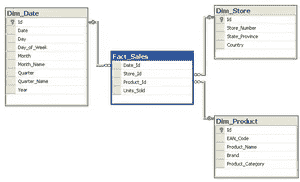
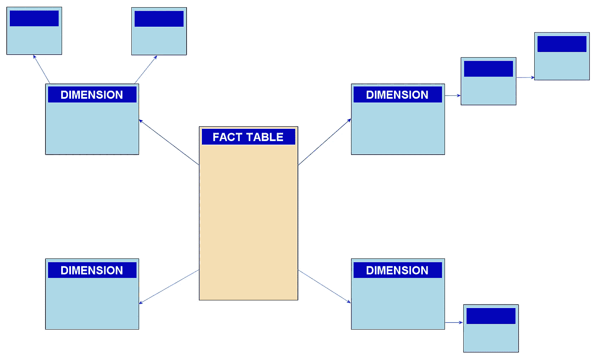

# 数据仓库指南

> 原文：<https://towardsdatascience.com/guide-to-data-warehousing-6fdcf30b6fbe?source=collection_archive---------6----------------------->

## 关于不同数据建模技术的简短而全面的信息

卢克·切瑟在 [Unsplash](https://unsplash.com/s/photos/data?utm_source=unsplash&utm_medium=referral&utm_content=creditCopyText) 上的照片

在本指南中，我将尝试涵盖几种方法，解释它们的差异，以及何时以及为什么(在我看来)一种比另一种更好，并可能介绍一些在建模 DWH(数据仓库)或 EDW(企业数据仓库)时可以使用的工具。

# 我的故事

我在一家小公司开始了我的 BI(商业智能)职业生涯，该公司向其他公司咨询如何改进他们的流程，或者只是帮助他们建立一个 BI 系统，以便他们可以自己做出决定。

那段时间我是如何想象工作的(几乎是大学一毕业):我会去工作，得到设备，有人会解释我必须做什么，我会开始做。当我第一天来上班时，我感到非常惊讶:我已经拿到了 Ralph Kimball 的书“[数据仓库工具包”，我的经理告诉我要阅读和学习。于是，我开始阅读，试图理解它。我花了一些时间。我不记得花了多长时间，但也许一周左右，才能得到适当的理解(至少在我看来)。](https://www.kimballgroup.com/data-warehouse-business-intelligence-resources/books/data-warehouse-dw-toolkit/)

# 词汇表

需要解释的术语，您可能会在本文中找到:

**暂存区** —原始/源数据的副本在我们拥有 DWH 的同一个数据库/机器上

**转换区** —转换后的暂存数据。准备装载到 DWH

**事实表** —带有一些度量的事务性或基于事件的数据。即销售信息、仓库产品移动。

**维度表** —特定事物的所有信息都在一个地方。即所有产品相关信息、客户信息。

# 涵盖的方法

*   [金博尔方法论](#5461)
*   [英蒙方法论](#7e71)
*   [数据保险库](#9b1c)
*   [数据湖](#92fb)
*   [湖畔小屋](#016b)

# 金博尔方法论

我从一个我首先学会的技术开始，主要是因为它容易理解。

它是由拉尔夫·金博尔和他的同事创造的(因此得名)。这种方法被认为是一种**自下而上的设计方法**。对于更一般的受众来说，可能更熟悉的是次元建模名称。就个人而言，我喜欢这种建模方式的原因是——易于设计和分析。它旨在回答特定问题或帮助理解特定领域(如人力资源、销售)。这种方法允许快速开发，但是我们失去了一些灵活性。通常，我们需要重新构建 DWH(或它的某些部分)来应用这些更改。大多数 BI 报告工具可以理解这种模型，并且可以快速拖放报告(即 MS SQL Server Analysis Services，Tableau)

金博尔流量:

*   将数据从源系统加载到登台
*   转换数据
*   加载 do 星形/雪花模式。

我将在下面的小节中更详细地介绍星型和雪花型模式。

## 星形模式

在星型模式中，我们有一个事实表和维度表(事实表中有所有的外键)。你可以在这篇[维基百科文章](https://en.wikipedia.org/wiki/Star_schema)中找到更多细节。简单地说，看起来是这样的:

[SqlPac](https://en.wikipedia.org/wiki/User:SqlPac) at [英文维基百科](https://en.wikipedia.org/wiki/Star_schema#/media/File:%D0%9F%D1%80%D0%B8%D0%BA%D0%BB%D0%B0%D0%B4_%D1%81%D1%85%D0%B5%D0%BC%D0%B8_%D0%B7%D1%96%D1%80%D0%BA%D0%B8.png) [CC BY-SA 3.0](https://creativecommons.org/licenses/by-sa/3.0)

优点:

*   如果我们想在某些维度上进行过滤，速度会更快(不需要多个连接)
*   简单建模(不需要标准化)

缺点:

*   我们需要更多的空间来存储事实表中的所有外键。
*   向事实表添加额外的维度键需要更大的努力(如果很大，更新将需要更多的时间)

## 雪花模式

雪花是一个多层次的星型模式。也就是说，我们在商店维度中有一个地址。我们可以用 address_PK 创建一个地址维度，它将指向 dim_shop。你可以在这篇[维基百科文章](https://en.wikipedia.org/wiki/Snowflake_schema)中阅读雪花模式。简化的 it 视图:

[SqlPac](https://en.wikipedia.org/wiki/User:SqlPac) at [英文维基百科](https://en.wikipedia.org/wiki/Snowflake_schema#/media/File:Snowflake-schema.png) [CC BY-SA 3.0](https://creativecommons.org/licenses/by-sa/3.0)

优点:

*   减少在现有维度上添加额外层或分组的工作量
*   更少的存储

缺点:

*   更难过滤值(可能需要更多连接)

我并不是说一种建模比另一种更好；这完全取决于用例、可用资源和最终目标。权衡所有选项，考虑是否要向维度添加更多分组，是否要在以后添加更多原子层(用维度表的外键更新事实表)。

# 英蒙方法论

实际上我没有使用过它，所以这将是一个更理论性的概述。

这种方法是由比尔·恩门创立的，被认为是一种自上而下的方法。我们必须有一个完整的图片，并相应地将其建模为 3NF(范式)，这使得这种方法比 Kimballs 更复杂。不利的一面是，您需要有技能的人来设计这个数据模型，并将所有的主题领域集成到其中。与 Kimballs 相比，它需要更多的时间来运行，但它更容易维护，而且更像是一种企业级的方法。

Inmon 流量:

*   将数据从源加载到阶段
*   将数据添加到符合 3NF 标准的 EDW(企业数据仓库)
*   在 EDW 上构建数据集市

为了将这些数据与 it 进行比较，我们需要对公司/业务领域的数据进行建模。从我个人的经验来看，我的第一个项目来自零售客户。我们在 Kimball 上做了一个星型模式的模型，因为我们知道需求和他们的数据问题。如果它想要更多的集成到他们的 DWH，像加入那些工作的员工，库存管理，它将更适合与 Inmon 的方法。

> 在我看来，如果一家公司很小，他们只想跟踪和改进特定的元素——通常用 Kimballs 的方法会更容易、更快。

# 数据库

从小公司跳槽到大公司对我来说也是一种打击。我更好地理解了有时候我们需要一个更好更简单的 EDW。那是我开始使用 Data Vault 的时候。在我看来——它是 Kimballs 星型模式和 Inmons 方法论的结合。两全其美。如果你想看得更详细，可以去丹·林斯特兹[网站](https://danlinstedt.com/solutions-2/data-vault-basics/)看看，他是这种方法的创始人。

我将介绍 Data Vault 的几个最重要的组件。

## 中心

Hub 是所有不同实体的集合，例如，对于 account hub，我们有一个**帐户，account_ID，load_date，src_name** 。因此，我们可以跟踪记录最初是从哪里加载的，以及我们是否需要从业务键生成一个代理键。

## 链接

听起来不好笑，但是链接是不同集线器之间的链接。也就是说，我们有员工，他们属于团队。团队和员工有不同的中心，所以我们可以有 team_employee_link，它会有 **team_employee_link，team_id，employee_id，load_date，src_name** 。

## 卫星

特定实体属性的维度缓慢变化。也就是说，我们有一个作为实体的产品。我们有多个产品信息栏，名称，价格。因此，我们将此信息作为一个渐变维度加载，其中包含信息**产品标识、打开日期、关闭日期、已删除、产品名称、产品价格**。捕捉所有的变化让我们能够重新创建数据的快照，并了解它是如何演变的。

除了这些最基本的实体，我们还有卫星链接，交易链接。这些我就不赘述了；如果你想了解更多——查看丹·林斯特茨网站或维基百科。

# 数据湖

我来自一个简单的数据背景，遇到了一个数据湖术语。它存储了我们所有的信息(结构化的和非结构化的)。如今，像**大数据**、**数据湖**这样的术语正得到大量关注。直到我开始处理大量的数据，我才明白为什么我们需要存储那么多不同类型的数据。数据是今天和未来的黄金。根据我对所有数据驱动型公司的经验，数据湖几乎是必须的。尽可能多地储存，然后进行分析，寻找见解。

以原始格式存储来自多个来源的数据有其自身的成本。

> 如果您不正确地记录和管理您的数据湖，它可能会变成一个数据沼泽。

在我看来，这是创建 EDW 前的一个附加层。数据工程师将原始数据引入数据湖，并在此基础上构建 EDW。分析师可以工作并依赖预处理和净化的数据。

# 莱克豪斯

Databricks 公司[在 2020 年](https://databricks.com/blog/2020/01/30/what-is-a-data-lakehouse.html)1 月底引入了这个术语。这里的想法是我们直接在源数据上做任何事情。大多数 ML/AI 工具更多地是为非结构化数据(文本、图像、视频、声音)设计的。将它们处理到 DWH 或数据湖需要一些时间，而且肯定不会接近实时。我对这种方法有点怀疑。这就像创造了一个巨大的数据沼泽，让人们淹没在其中。太多未经管理和清理的数据可能会导致错误的假设，并且不会成为大公司的真实来源。至少现在，虽然流不是一件大事情，但我认为等待这种方法更加成熟是值得的。除非你是某个想在竞争中遥遥领先并使用尖端技术的科技初创公司，但这只是我的假设。

# 摘要

在我看来，所有这些方法将长期共存。这完全取决于公司及其使用案例！

如果它只是一个小型或中型企业，如果旧的学校数据仓库方法满足您的需求，为什么要使用可能不会为您带来更多利润的东西呢？

如果是大型企业，如果您想保持竞争力并为客户提供优质服务，数据湖可能是必不可少的。在我看来，您仍然需要创建一个预处理层，这将是报告的某种真实来源，具有更多聚合/清理的数据。这里最适合的(在我看来)是星型或雪花型模式。它将使我们能够更快地寻找一般模式和趋势。如果我们需要深入研究，而 DWH/数据集市过于集中，我们可以随时去数据湖查看原始数据。

或者，也许你的员工精通技术，而你是一家下一代科技创业公司，你想通过提供见解并使用尖端技术来击败竞争对手——也许你需要一个湖边小屋？不幸的是，我还没有看到真正的用例，想不出它如何能与旧的学校方法一起工作，进行更干净和更流畅的分析。

# 引用表

[1][https://www . Kimball group . com/data-warehouse-business-intelligence-resources/books/data-warehouse-dw-toolkit/](https://www.kimballgroup.com/data-warehouse-business-intelligence-resources/books/data-warehouse-dw-toolkit/)

[2]https://en.wikipedia.org/wiki/Star_schema

[3]https://en.wikipedia.org/wiki/Snowflake_schema

[https://danlinstedt.com/solutions-2/data-vault-basics/](https://danlinstedt.com/solutions-2/data-vault-basics/)

[https://en.wikipedia.org/wiki/Data_vault_modeling](https://en.wikipedia.org/wiki/Data_vault_modeling)

[6][https://databricks . com/blog/2020/01/30/what-is-a-data-lake house . html](https://databricks.com/blog/2020/01/30/what-is-a-data-lakehouse.html)