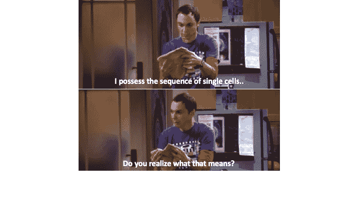
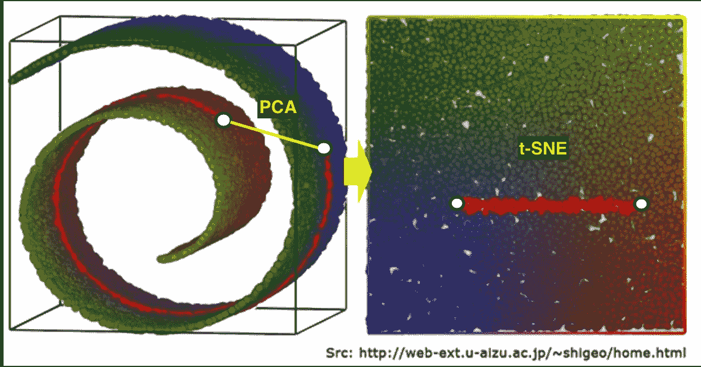
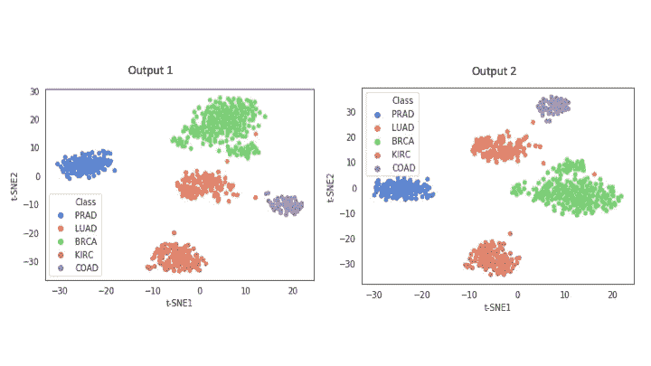
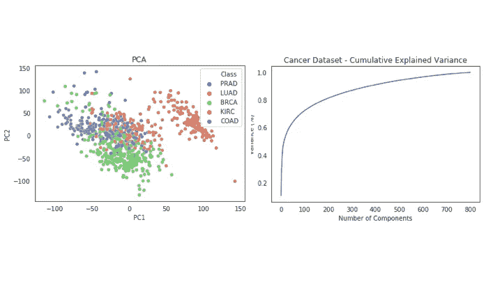
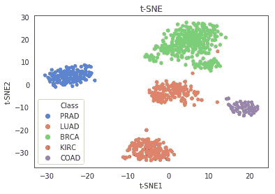
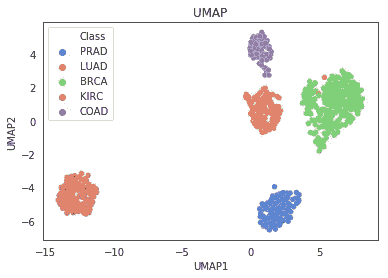

# 单细胞 RNA-seq 分析中的降维指南

> 原文：<https://towardsdatascience.com/guide-to-dimensionality-reduction-in-single-cell-rna-seq-analysis-1d77284eed1c?source=collection_archive---------4----------------------->

图片来源: [Unsplash](https://unsplash.com/photos/OgvqXGL7XO4)

2000 年初，单细胞 RNA 测序(scRNA-seq)技术在组学领域取得了重大突破。分离和排序单细胞遗传物质的能力使研究人员能够识别每个细胞中哪些基因是活跃的。这为批量 RNA 测序技术提供了前所未有的机会，批量 RNA 测序技术可以在群体水平上产生平均基因表达谱。据信，scRNA-seq 将在未来十年内改变生物学和医学研究的格局。

典型的 scRNA-seq 数据表由大约 20，000 个基因作为列/特征和 50，000 到多达一百万个细胞作为行/观察值组成。正如你可以立即指出的，这种技术受到“维数灾难”的困扰。并不是所有的基因对于根据它们的表达谱将细胞分类成有意义的簇都是重要的。因此，降维技术被用于降低数据复杂性和数据可视化。它还有助于下游应用，如聚类分析，因为一些聚类算法受到高维数的影响。在这篇文章中，我将讨论三种最流行的用于 scRNA-seq 数据的降维技术——PCA、t-SNE 和 UMAP。在简要介绍了它们的工作原理和优缺点之后，我们将在真实世界的数据集上应用它们。

## 主成分分析

让我们考虑一个有 m 个变量和 n 个观测值的 mxn 数据集矩阵。我们数据集中的每个观察值都是 m 维向量空间中的一个向量，该向量空间由某个正交基跨越。我们知道变量之间存在固有的冗余，并且不是所有的 m 维对于理解数据集的动态都是重要的。主成分分析提出一个问题:*是否存在另一种基，它是原始基的线性组合，能最好地重新表达我们的数据集？*

PCA 对原始数据集执行正交变换，以创建一组新的、不相关的变量或主成分。这些主成分是原始数据集中变量的线性组合。该变换被定义为使得主分量以方差的降序排列。因此，第一主成分达到最大可能方差。其思想是丢弃方差最小的主成分，在不损失太多信息的情况下有效地降低数据集的维数。

关于 PCA 更直观的解释请参考[的帖子](/principal-component-analysis-math-and-intuition-post-1-d44bf32844f3)。

***优点***

高度可解释、计算高效

***缺点***

由于遗漏事件(弱表达基因被遗漏)，scRNA-seq 数据是稀疏的，这意味着数据矩阵中有 60-80%的零。它是高度非线性的结构，而 PCA 是线性降维技术，因此被认为非常不适合数据可视化。PCA 仅用于选择大约前 10-50 个主成分，这些主成分可以用下游应用程序(如聚类分析)进行处理。

## t-随机邻域嵌入(t-SNE)

t-SNE 是一种基于图形的非线性降维技术。它将高维数据投影到 2D 或 3D 组件上，是一种非常流行的数据可视化方法。关于 t-SNE 的精彩直观解释，我强烈推荐你观看 StatQuest 网站上的这个视频。简而言之，该算法首先创建定义高维空间中点之间关系的高斯概率分布。然后，它使用学生 t 分布在低维空间中重建概率分布。使用梯度下降来优化低维空间中的嵌入。

***利弊***

**非线性数据集** : t-SNE 强有力地捕捉了高维数据集中的非线性，并能够保留低维中的局部结构。这是对 PCA 的巨大改进。例如，考虑下图所示的瑞士滚动流形。由 PCA 计算的两个突出显示点之间的接近度将是连接这两个点的直线，而 t-SNE 在理论上应该能够通过适当地展开它来解决流形的非线性。

**最先进的方法**:算法被设计成保留局部结构，因此高维空间中的邻近点在低维嵌入中结束得更近。t-SNE 已被用作 scRNA-seq 数据可视化的金标准方法。

***缺点***

**随机性:** t-SNE 是一种随机方法，涉及随机初始化，在连续运行时不会产生类似的输出。虽然这可能会让用户感到不安，但重要的是要注意保留了局部子结构。因此，只要您允许足够数量的迭代以允许收敛，总体输出不会有太大变化。此外，您可以始终设置一个种子，以确保每次运行算法时结果都是相同的。

例如，以下图像是使用相同输入参数运行两次的程序的 t-SNE 输出(没有设置随机种子)。如您所见，聚类改变了它们的位置，但是两个输出产生了总体上相似的结果，即 5 个聚类。

**全局结构未保留:**t-SNE 的工作方式是，在进行降维的同时，不可能保留全局结构。这可能与优化 Kullback-Liebler 分歧有关，更多细节请参考这篇优秀的[在 Medium 上的帖子](/why-umap-is-superior-over-tsne-faa039c28e99)。在上面的示例中，两个输出中各个组的形状相似，即保留了局部结构。但是，在两个输出中，组之间的距离有很大不同(参见紫色和红色组)，因此没有意义。

**仅数据可视化** : t-SNE 仅将数据点嵌入 2 维或最多 3 维。与 PCA 不同，它不会产生 10-50 个可被聚类算法利用的成分。t-SNE 作为一种降维技术，因此只限于数据探索或可视化。

**计算量大:**对于庞大的数据集，算法需要很长的运行时间。通常首先通过 PCA 降低维度，然后对顶部的几个主成分执行 t-SNE。尽管已经设计出了一种叫做 FItsne 的更快的实现，但它仍然存在 t-SNE 的其他缺点。

**一致流形逼近和投影(UMAP)**

UMAP 是麦金尼斯等人在 2018 年推出的一种相对较新的降维技术。该算法是基于图形的，主要类似于 t-SNE，它构建数据的高维图形表示，然后优化低维图形，使其在结构上尽可能相似。其背后的数学知识要高级得多，超出了本文的范围。感兴趣的读者不妨参考[原文](https://arxiv.org/pdf/1802.03426.pdf)或者麦金尼斯在 [youtube](https://www.youtube.com/watch?v=nq6iPZVUxZU&t=597s) 上的解释。

***优点***

**非线性数据集** : UMAP 是多方面学习降维技术，从而捕捉真实世界数据集的非线性。在数据可视化方面，它与 SNE 霸王龙不相上下。

**计算效率**:UMAP 的数学改进使得运行时性能优于 t-SNE(以及临时算法 FItsne)。

**全局结构保存:**与 t-SNE 相比，UMAP 能更好地保存数据的全局结构。通过调整超参数`n_neighbours`和`min_dist`，用户可以有效地控制局部和全局结构之间的平衡。

**下游应用**:与 t-SNE 不同，UMAP 对嵌入维数没有计算限制，可以用作有效的预处理步骤来提升基于密度的聚类算法的性能。

***缺点***

**缺乏可解释性:**与主成分分析不同，主成分是源数据的最大方差方向，UMAP 的低维嵌入缺乏强可解释性。

**噪声的伪检测:**UMAP 的核心假设之一是数据中存在流形结构。正因为如此，UMAP 倾向于在数据集的噪声中找到流形结构。UMAP 对较大的数据集更稳健，因为在较大的数据集中，明显受噪声影响的结构量趋于减少。

**全局结构的准确性:**虽然 UMAP 比 t-SNE 等其他技术保留了更多的全局结构，但它主要关心的是准确地表示局部结构。如果全局结构是主要兴趣，那么 UMAP 可能不是降维的最佳选择。

# 对比分析

现在我们已经讨论了每种方法的优缺点，让我们在真实数据集上评估它们。我承认一个数据集是不够的，应该使用几个大小和复杂程度不同的数据集进行综合评估。有一些同行评审的出版物也是这样做的，你可能希望参考[和](https://genomebiology.biomedcentral.com/articles/10.1186/s13059-019-1898-6)。

我选择了一个包含真实聚类信息的数据集，该数据集可以用作比较分析中的基础事实。它是由癌症基因组图谱泛癌分析项目维护的来自不同类型癌症组织的基因表达的整理。样本(实例)按行存储。每个样本的变量(属性)是 illumina HiSeq 平台测得的 RNA-Seq 基因表达水平。每个属性都有一个假名(gene_XX)。下载链接可以在 [kaggle](https://www.kaggle.com/murats/gene-expression-cancer-rnaseq) 上找到(**注:**这不是一个单细胞 RNA-seq 数据集，但想法是相同的，并服务于我们对降维技术进行比较分析的目的。)

请查看我的 [github](https://github.com/CrazyDaffodils/scRNA/blob/master/code/Cancer_RNA_Dimesionality_Reduction.ipynb) 获取完整的脚本，这里我只展示了 PCA、t-SNE 和 UMAP 分析的代码。

在解决数据的异质性方面，主成分分析显然是次优的。虽然有几种其他基于矩阵分解方法的降维技术，但可能比 PCA 效果更好；一般来说，它们更擅长保存全局结构，而不太注重保存数据的局部结构。为了理解复杂生物数据集的动力学，通过保持相邻点之间的连接来维持局部结构是重要的。这就是 t-SNE 和 UMAP 等基于邻图的方法优于基于矩阵分解的方法的地方。

然而，PCA 仍然被广泛用作聚类算法的预处理步骤。例如，在我们的癌症数据集中，累积解释方差图显示前 100 个主成分解释了约 80%的数据方差。在这 100 台电脑上应用聚类算法将提高它们的性能，而不会损失太多信息。

SNE 霸王龙在分辨单个集群方面做得更好。LUAD(橙色)簇中只有 3 个数据点被不恰当地指定为 BRCA 和 COAD。输出在视觉上很吸引人，难怪在过去十年中它被用作单细胞分析的黄金标准技术。记住 t-SNE 的局限性，如前所述，这是一个值得探索的技术，并适当调整参数。

与 t-SNE 相比，UMAP 产生了同样好或者更好的分辨率。它还在一定程度上保留了全局结构，并且运行速度明显快于 SNE 霸王龙，这使得它非常有吸引力，在不久的将来，研究人员更倾向于 UMAP 也就不足为奇了。

我希望这篇文章对单细胞分析中使用的最重要的降维技术有一个很好的概述。我计划写一篇类似的文章来讨论聚类算法。敬请期待！