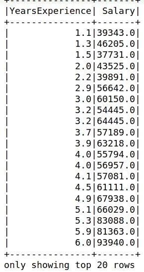
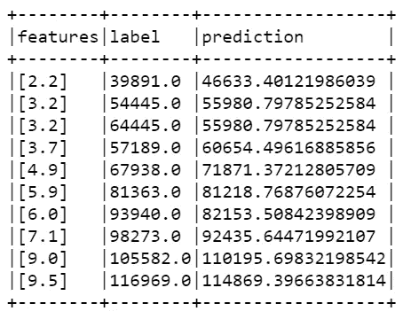
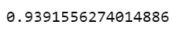
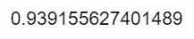

# 在 Pyspark 和 R 中实现线性回归的指南

> 原文：<https://towardsdatascience.com/guide-to-implement-linear-regression-in-pyspark-and-r-26a94fe938a3?source=collection_archive---------38----------------------->


凯利·西克玛在 [Unsplash](https://unsplash.com?utm_source=medium&utm_medium=referral) 上的照片

我应该使用哪种编程工具来构建我的线性回归模型？在预测准确性方面有什么不同吗？用几行代码实现哪个更简单？我的训练数据的大小有影响吗？让我们在这篇文章中探讨所有这些问题。

# 资料组

我使用的数据集是一个虚拟数据集，只包含两个变量，*年资*和*薪水*。我们试图找出一个雇员的工资是否与他的工作年限成线性关系，从逻辑上讲，我们希望这种关系存在。



按作者分类的图像-数据集预览

# Pyspark

我们将利用 Pyspark 在 Python 中训练我们的线性回归模型，因为 Pyspark 能够提升数据处理速度，这在大数据领域非常受重视。由于本文更侧重于实现线性回归模型，所以我不会触及设置 Pyspark(即 SparkContext、SparkSession、SparkConf)的技术方面，你可以在我之前的[帖子](/analysing-difference-between-scrum-agile-using-pyspark-c2fc4405217d)中找到。

```
from pyspark import SQLContext, SparkConf, SparkContext
from pyspark.sql import SparkSessionsc = SparkContext.getOrCreate()if (sc is None):
    sc = SparkContext(master="local[*]", appName="Linear Regression")
spark = SparkSession(sparkContext=sc)sqlcontext = SQLContext(sc)
data = sqlcontext.read.csv('./Salary_Data.csv', header = True, inferSchema = True)
```

一旦我们将数据导入 Pyspark，我们需要告诉它哪些是我们的特征变量，哪些是我们的目标变量。对于这个数据集，很明显*年资*是我们的特征变量，而*薪水*是我们的目标变量。我们有我们的数据，我们将建立我们的模型，但我们如何知道我们的模型是否表现良好？在数据科学家中，将我们的数据集分成训练和测试数据是一种方法，通常的比例是 70:30 或 80:20。在 Pyspark 中实现机器学习算法需要注意的另一件事是，我们可以利用[向量汇编器](https://www.bmc.com/blogs/introduction-to-sparks-machine-learning-pipeline/)，它将所有特征组合成一个稀疏的单个向量，这大大减少了机器学习模型的训练时间。

```
from pyspark.ml.feature import VectorAssembler# defining Salary as our label/predictor variable
dataset = data.select(data.YearsExperience, data.Salary.alias('label'))# split data into 70% training and 30% testing data
training, test = dataset.randomSplit([0.7, 0.3], seed = 100)
# assembler to assemble the features into vector form
assembler = VectorAssembler().setInputCols(['YearsExperience',]).setOutputCol('features')
trainingSet = assembler.transform(training)
# select only features column and label column since we have already vectorised our features
trainingSet = trainingSet.select("features","label")
```

最后，我们准备使用我们的训练数据集来训练线性回归模型。如上所述，我们还将利用测试数据集来了解我们的模型表现如何。如下面的输出所示，我们的模型现在包含一个*预测*列，当我们将我们的特征列(即*年资*)作为测试数据集放入我们的线性回归模型时，该列包含*预测工资*。我们可以看到，有些预测值接近实际值，有些则不然。

```
from pyspark.ml.regression import LinearRegression# fit the training set to linear regression model
lr = LinearRegression()
lr_Model = lr.fit(trainingSet)# assembler to assemble the features into vector form
testSet = assembler.transform(test)
# select only features column and label column since we have already vectorised our features
testSet = testSet.select("features", "label")
# fit the testing data into our linear regression model
testSet = lr_Model.transform(testSet)testSet.show(truncate=False)
```



按作者分类的图片 Jupyter 笔记本输出预测值

那么，我们如何衡量线性回归模型的表现呢？我们可以利用 [R](https://statisticsbyjim.com/regression/interpret-r-squared-regression/) ，它是 0 到 100%之间的拟合优度的度量。我们只用两行代码就可以在 Pyspark 中轻松实现。

```
from pyspark.ml.evaluation import RegressionEvaluatorevaluator = RegressionEvaluator()
print(evaluator.evaluate(testSet, {evaluator.metricName: "r2"}))
```



作者图片 Pyspark 中 R 度量的 Jupyter 笔记本输出

93.9%的 R 值表明，当我们使用*年的经验拟合我们的训练模型时，我们的线性回归在预测*工资*方面表现得非常好。*

# 稀有

现在，让我们在 r 中构建我们的线性回归模型。我们将数据分为 70%的训练数据和 30%的测试数据，就像我们在 Pyspark 中所做的那样。然而，让我们尝试使用我们在 Pyspark 中使用的相同测试数据，看看在模型的预测中 R 性能是否有任何差异。

```
data = read.csv("./Salary_Data.csv")# sample data
# set.seed(100)
# dt = sort(sample(nrow(data), nrow(data)*.7))
dt = c(5,8,9,10,16,19,20,22,26,27)
# split data into training and testing data
trainingSet<-data[-dt,]
testingSet<-data[dt,]
```

获得训练和测试数据集后，我们使用训练数据集训练我们的线性回归模型，并使用测试数据集预测*工资*。

```
# fit linear regression model
lm_model = lm(data = trainingSet, Salary~.)
# predict the target variable with testing data
predicted_salary = predict(lm_model, testingSet)
```

然后，我们通过计算 R 来测量预测值的拟合优度。注意，在 R 中，我们不能运行库或命令来直接获得 R。因此，我们必须通过获得残差平方和和以及平方和来手动计算它们，这可以在此处进一步探讨。

```
# residual sum of squares
rss <- sum((predicted_salary - testingSet$Salary) ^ 2) 
# total sum of squares
tss <- sum((testingSet$Salary - mean(testingSet$Salary)) ^ 2) 
# obtain r^2
rsq <- 1 - rss/tss
rsq
```



按作者分类的图像— Jupyter 笔记本输出的 R 度量单位为 R

# 摘要

我们获得了与在 Pyspark 中相同的 R，这意味着就模型的准确性而言，选择 Pyspark 或 R 来训练您的模型并不重要。显然，在 R 中训练线性回归模型比在 Pyspark 中简单得多。然而，需要注意的一点是，Pyspark 在训练大数据方面更为可取，处理速度将明显快于 R 本身。

以下是我在构建线性回归模型时选择 R 还是 Pyspark 的建议:

> **py spark**->-*适合处理大量数据*
> 
> **R**->适合于简单实现

感谢阅读，我将在接下来的几篇文章中研究其他几种机器学习算法，干杯！

[](https://www.buymeacoffee.com/tankahwang)