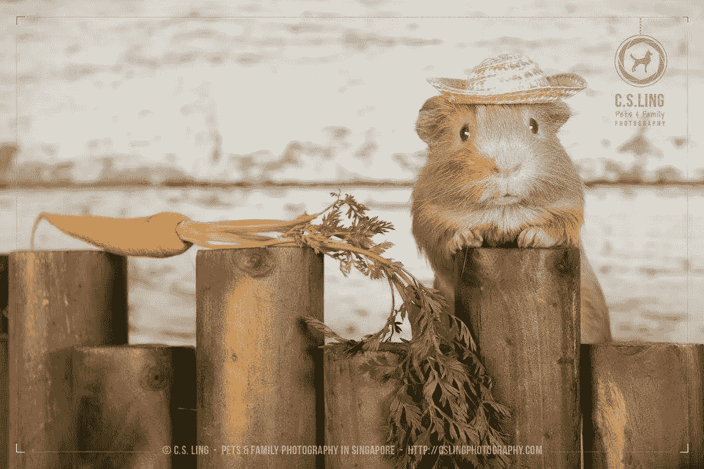
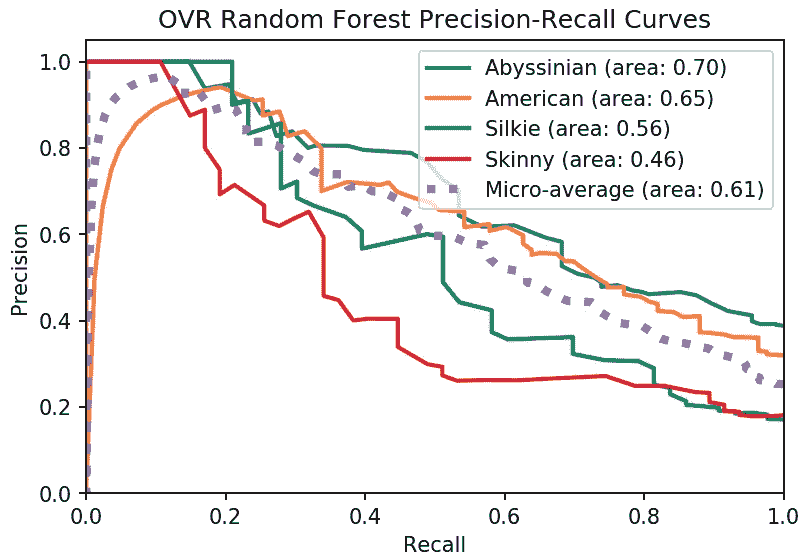

# 豚鼠品种分类

> 原文：<https://towardsdatascience.com/guinea-pig-breed-classification-517fbb036ee6?source=collection_archive---------20----------------------->

## 如何通过机器学习利用图像识别豚鼠品种

**TL:DR** 我用深度学习模型从图片中识别出了豚鼠的品种。该模型是图像 CNN，其应用了来自 Inception V3 模型的迁移学习，其中权重在 ImageNet 上预先训练。源图像来自多个图像搜索引擎。最终的模型能够对四种不同的豚鼠品种进行分类。

密码和笔记本可以在 [**这里**](https://github.com/ringoshin/cavy_breed_clf) 找到。

# 目录

1.  [前言](#5908)
2.  [简介](#d02c)
3.  [模型建立和发现](#6cb5)
    步骤 0。[项目文件夹格式化](#447c)
    步骤 1。 [Raw 图像刮](#9c5d)
    步骤 2。[数据集创建](#5011)
    第三步。[图像数据预处理](#14d4)步骤 4
    。[基线模型训练](#fb6b)
    第五步。[深度学习模型训练](#8b24)
    步骤 6。[型号比较和选择](#1aab)
4.  [结论](#aa43)

# 前言

这是我在 [**Metis 数据科学训练营**](https://metis.kaplan.com.sg/) 完成的第三个项目。当时，我们正在学习分类、各自的分类器和指标。我想给图像分类一个镜头，但不是用 [**狗 vs**](https://www.kaggle.com/c/dogs-vs-cats)。既然我的妻子和我都是豚鼠爱好者，那么为什么不应用我的领域知识，并从中获得一些乐趣呢？旅程就这样开始了…

[Bonnie Kittle](https://unsplash.com/@bonniekdesign?utm_source=medium&utm_medium=referral) 在 [Unsplash](https://unsplash.com?utm_source=medium&utm_medium=referral) 上拍摄的照片

[^](#d2b8)

# 介绍

豚鼠(或豚鼠)通常被作为家庭宠物饲养，因为它们的大小易于控制(0.7-1.2 公斤)，友好的天性和极度的可爱。这些可爱的动物是啮齿动物，大小介于仓鼠和龙猫之间。它们是食草动物，吃的食物和兔子差不多:颗粒饲料、干草、蔬菜和水果。

根据 [**维基百科**](https://en.wikipedia.org/wiki/List_of_guinea_pig_breeds) 记载，豚鼠的品种很多(13-18)。与大小和形状各异的狗不同，豚鼠的一切都与毛发有关:

在这个项目中，我选择了四个最容易识别的品种:

*   [红阿比](https://www.goodhousekeeping.com/life/pets/g25751355/guinea-pig-breeds/?slide=2)(短发夹玫瑰花)
*   [美国](https://www.goodhousekeeping.com/life/pets/g25751355/guinea-pig-breeds/?slide=4)(光滑，短毛)
*   丝毛/谢尔蒂(光滑、长毛)
*   [骨瘦如柴](https://www.goodhousekeeping.com/life/pets/g25751355/guinea-pig-breeds/?slide=14)(无毛)。

用于图像分类的豚鼠品种

[^](#d2b8)

# 模型构建和发现

对于本文的其余部分，您可以跟随我的 Google Colab [**笔记本**](https://github.com/ringoshin/cavy_breed_clf/blob/master/cavy_breed_clf_train_and_predict_abridged.ipynb) 。这是我完成这个项目的步骤的节略版。

你所要做的就是在你 Google Drive 的' *Colab Notebooks* '文件夹下新建一个名为' *cavy_breed_clf* 的子文件夹。将下面的笔记本和文件夹复制到' *cavy_breed_clf* '中，你就可以开始了。

*   /data (~163kB)
*   /图像(~130MB)
*   /lib (~67kB)
*   [cavy _ breed _ clf _ train _ and _ predict _ bridged . ipynb](https://github.com/ringoshin/cavy_breed_clf/blob/master/cavy_breed_clf_train_and_predict_abridged.ipynb)

然而，如果你想知道我是如何到达那里的，我已经把我的脚本和笔记本按数字顺序分类了。我希望这将为以下过程提供更清晰的感觉:数据准备、训练(经典 ML，然后是神经网络)和度量/预测。

[^](#d2b8)

## 步骤 0。项目文件夹格式

这是第一个项目，我根据这里的**和这里的**的建议，努力组织我的代码和文档。****

*   ****/data —项目数据集:原始、培训、验证和测试****
*   ****/images —原始图像存储在按品种排序的子文件夹中，另外还有一个样本子文件夹，用于存储数据集之外的临时图像****
*   ****/lib/data _ common . py-图像数据预处理例程****
*   ****/lib/ml_common.py —经典的 ml 处理流程，包括分类指标****
*   ****/lib/nn_common.py —神经网络 DL 处理过程****

****[^](#d2b8)****

## ****第一步。原始图像刮擦****

****拥有大量优质、干净和正确类型的数据非常重要。这可能是最痛苦的部分，但也是你 ML 项目中最关键的部分。它将确保你的模型将执行它被设定的目的，或者至少是一个像样的 MVP。在训练营期间，我们真正学到了这一课。****

****AFAIK，没有可用于机器学习的公共 cavy 图像数据集。幸运的是，基于这篇 [**文章**](https://www.searchenginejournal.com/best-image-search-engines/299963/#close) 有很多有用的搜索引擎。对我来说，我主要依靠 [**谷歌**](https://images.google.com/)[**雅虎**](https://images.search.yahoo.com/) 和 [**必应**](https://www.bing.com/images/discover) 。****

****一开始，我能为每个品种收集 500 到 1000 张原始图像。我非常依赖这个出色的 Chrome 扩展 [**Fatkun 批量下载图片**](https://chrome.google.com/webstore/detail/fatkun-batch-download-ima/nnjjahlikiabnchcpehcpkdeckfgnohf) 来批量下载图片。****

****请注意，每个品种 1000 张图片听起来可能很多，但事实并非如此。这些都是未加工的，没有标签。我不得不在下载期间和下载后仔细检查所有 4000 多张图片，以筛选出不合格的候选人:****

*   ****贴错标签的动物种类或豚鼠品种****
*   ****图像中缺少 cavy(是的，即使搜索引擎也不是完美的)****
*   ****多个 cavies(模型最好只从每个图像中学习一个)****
*   ****漫画，而不是真正的照片****
*   ****重要的品种特征没有完全展示出来(例如红阿比的玫瑰花结)****
*   ****分辨率太低****
*   ****太模糊了****

****最终，我把它缩减到 1600 多张图片:****

*   ****红阿比:553 人****
*   ****美国人:519****
*   ****西尔基:267****
*   ****瘦子:292****

****这是一个适度不平衡的数据集，但我相信它不会对模型的训练产生重大影响。****

****[^](#d2b8)****

## ****第二步。数据集创建****

****在我收集了需要的图片后，我将它们分类到各自的子文件夹中。然后，我运行一个简短的[脚本](https://github.com/ringoshin/cavy_breed_clf/blob/master/data/0a%20create_image_dataset.py)(也作为[笔记本](https://github.com/ringoshin/cavy_breed_clf/blob/master/data/0a%20create_image_dataset.ipynb))来生成这些数据集；原始、培训、验证和测试。后三个数据集将成为所有未来 ML 训练、验证和测试的输入数据。****

****快速健全检查，以确保品种分布均匀的数据集。****

********

****跨培训、验证和测试数据集的品种分布****

****再次检查以确保特征和目标处于良好状态。****

********

****对功能和目标进行健全性检查****

****[^](#d2b8)****

## ****第三步。图像数据预处理****

****每个图像文件将被转换为 ML ready 格式，方法是将其调整为特定的图像形状(150，150)，然后将其展平为一维数组。这些将被保存为特征(X_train，X_val，X_test)。****

****通过 OpenCV 进行图像转换****

****每个图像的品种将被一次热编码以成为标签(y_train，y_val，y_test)。****

****要素和标签的数据预处理****

****快速视觉健全检查，以确保一切正常:****

********

****[^](#d2b8)****

## ****第四步。基线模型训练****

****我从一开始就决定“随机森林”分类器将是我的基线模型。然而，我把这作为一个学习的机会，看看其他经典分类器与我的基线模型相比会有多好。****

****我创建了一个例程(Vanilla_ML_Run)来一起训练这四个分类器:****

*   ****[虚拟分类器](https://scikit-learn.org/stable/modules/generated/sklearn.dummy.DummyClassifier.html)****
*   ****[逻辑回归](https://scikit-learn.org/stable/modules/generated/sklearn.linear_model.LogisticRegression.html)****
*   ****[高斯朴素贝叶斯](https://scikit-learn.org/stable/modules/generated/sklearn.naive_bayes.GaussianNB.html)****
*   ****[随机森林](https://scikit-learn.org/stable/modules/generated/sklearn.ensemble.RandomForestClassifier.html)(我们的基线)****

****一旦已训练的分类器被保存/重新加载，我将性能与以下进行比较:****

*   ****[分类报告](https://scikit-learn.org/stable/modules/generated/sklearn.metrics.classification_report.html)****
*   ****[混乱矩阵](https://scikit-learn.org/stable/modules/generated/sklearn.metrics.confusion_matrix.html)****
*   ****[精确召回曲线](https://scikit-learn.org/stable/auto_examples/model_selection/plot_precision_recall.html#in-multi-label-settings)****
*   ****[ROC 曲线](https://scikit-learn.org/stable/auto_examples/model_selection/plot_roc.html#plot-roc-curves-for-the-multilabel-problem)****

****NB:我强烈推荐阅读[这个](/what-metrics-should-we-use-on-imbalanced-data-set-precision-recall-roc-e2e79252aeba)和[这个](https://machinelearningmastery.com/roc-curves-and-precision-recall-curves-for-classification-in-python/)来很好的把握 PR 和 ROC 曲线。还有[这个](https://datascience.stackexchange.com/questions/15989/micro-average-vs-macro-average-performance-in-a-multiclass-classification-settin)关于微观平均和宏观平均。****

## ****步骤 4a。高斯 NB 分类器****

****不用说，虚拟分类器做得不太好，显然，高斯分类器也是如此。“Silkie”和“Skinny”的准确率和召回率都很低。让我们以“Skinny”为例来看看:****

********

*   ****这里的低精度意味着它的许多预测不是“瘦的”(假阳性)****
*   ****召回率低意味着许多真正的“瘦子”被错误地识别为其他品种(假阴性)****

****混乱矩阵证实了这种理解。****

********

## ****步骤 4b。逻辑回归分类器****

****这种分类器的表现比 GaussianNB 好得多，GaussianNB 的大多数精度和召回分数都在 50 以上或接近 50。****

********

****然而，公关曲线似乎告诉了一个更清晰的故事，这种模式并没有表现得很好，特别是“瘦”。它的面积远不如其他的理想，它的曲线也偏离微观平均曲线最远。****

********

****不同品种的精确召回曲线(面积=平均值。精确分数)****

## ****步骤 4c。随机森林分类器****

****随机森林似乎是比逻辑回归更好的模型，尽管只是稍微好一点。看起来整体较高的分数是以“丝滑”和“骨瘦如柴”较低的回忆分数为代价的。****

********

****F1 分数和 PR 曲线强烈地表明，该模型对于较小的类(“丝滑”和“瘦”)表现得不是很好。****

********

****不同品种的精确召回曲线(面积=平均值。精确分数)****

****[^](#d2b8)****

## ****第五步。深度学习模型训练****

****既然我们已经训练和审查了我们的基线模型，我们接下来可以继续两个不同的 DL 模型，即:****

*   ****多层图像 CNN(卷积神经网络)****
*   ****使用 ImageNet 上预先训练的权重转移从 Inception V3 开始的学习****

****一旦训练完毕，我会用和以前一样的标准来比较模型的表现。****

## ****步骤 5a。多层图像 CNN 大楼****

****该架构对于一个图像 CNN 模型来说相当简单，你可以从 [**这里**](https://blog.keras.io/building-powerful-image-classification-models-using-very-little-data.html) 找到更多关于它的信息。****

****图像 CNN 模型架构****

****经过 100 个历元的训练，该模型达到了 78%的训练准确率和 67%的验证准确率。它肯定比基线模型更准确，但我认为它已经过度拟合了。****

********

****训练/验证准确度与历元数****

****我们来看看分类报告。与基线模型相比，总体分数令人信服地更好。令人惊讶的是，“瘦子”是最好的演员。没想到啊！****

********

****分类报告****

****有趣的是，其他品种的精确度和召回分数参差不齐。PR 和 ROC 曲线也是如此。“瘦子”在其他班级中非常突出。训练出一个能够区分无毛豚鼠和有毛豚鼠的模型确实很酷。:)****

********

****不同品种的精确召回曲线(面积=平均值。精确分数)****

********

****受试者工作特征曲线(AUC =曲线下面积)****

## ****步骤 5b。从 InceptionV3 (ImageNet)转移学习****

****这个模型是使用迁移学习技术构建的，如这里的[T5所示。它使用在](https://keras.io/applications/#fine-tune-inceptionv3-on-a-new-set-of-classes) [ImageNet](http://www.image-net.org/) 上预先训练的权重。对于这个特定的模型，我选择冻结前 230 层。****

****经过 100 个历元的训练，该模型达到了 99 %的训练准确率和 82%的验证准确率。这肯定是过度拟合，起伏不定的验证曲线似乎也支持这一点。这也可能意味着我的数据仍然不够。****

********

****训练/验证准确度与历元数****

****当我查看分类报告时，除了三个非常具体的问题，精确度和召回分数总体上都非常好。这个模型似乎倾向于将“红阿比”和“西尔基”误标为“美国人”。****

********

****分类报告****

****混淆矩阵也支持这一观察。这位模特狂热地将“红阿比”(31 岁)和“西尔基”(9 岁)误标为“美国人”。****

********

****直觉上，这是有道理的。与“瘦子”不同，“红阿比”是短毛，“西尔基”是皮毛光滑，从某些角度看，这两个品种很容易被误认为是“美国人”。****

****注意:当然，这也可能是一个简单的糟糕的原始图像的例子。我绝对想调查一下以确定。****

********

****[^](#d2b8)****

## ****第六步。模型比较和选择****

****InceptionV3 迁移学习模式总体得分最高。****

****不同模型的度量比较****

****最重要的是，它能够出色地分类“瘦”，而经典分类器通常都失败了(高召回率)。值得注意的是，没有一个模型能够自信地识别“红阿比”本身(低回忆)。似乎这个品种特有的[玫瑰花结图案](https://www.wideopenpets.com/everything-you-need-to-know-about-abyssinian-guinea-pigs/)并没有那么明显。可能需要获得更高质量的图像来改进。****

****不同模型的回忆分数比较****

****深度学习模型能够在预测中巧妙地区分大多数品种(高精度)。****

****在所有模型中，只有“美国”遭受了类似的痛苦:在预测过程中，这些模型经常将其他品种视为“美国”(低精度)。DL 型号稍微好一点，但也好不了多少。****

****不同模型的精度分数比较****

****当我们一起比较所有模型的 PR 曲线时，很明显我们有一个真正的赢家。****

********

****类似地，迁移学习模型也以最好的 ROC 曲线开始。****

********

****因此，通过迁移学习训练的最终模型显然是最佳候选。为了好玩，我甚至用它来预测保存在子文件夹“*/images/new _ samples”*中的超范围图像。****

********

****[^](#d2b8)****

# ****结论****

****这无疑是一个奇妙而充满乐趣的项目。尽管我知道迁移学习会创造奇迹，但亲眼目睹它就发生在我眼前确实令人振奋。当我不得不处理一个小数据集时，这尤其令人鼓舞，这个数据集的大部分图像质量都很差。你能想象如果我们有更多的数据，更好的图像，这个模型会变得多好吗？****

****此外，深度学习模型特别“聪明”，能够区分“瘦”和其他品种。这是经典分类器无法做到的。同样，我没有用其他分类器进行测试，尤其是 XGBoost。****

****对我来说这还不是结束。我非常希望将这个项目扩展到以下目标:****

*   ****添加更多高质量的图像****
*   ****识别更多品种****
*   ****尝试其他分类器和预训练模型****
*   ****部署 API****
*   ****创建一个网站****
*   ****构建移动应用程序****

****当网站或应用程序准备好了，我一定会在社交媒体上与其他豚鼠爱好者分享。****

****谢谢你阅读这篇文章，我希望你和我一样喜欢！****

****[^](#d2b8)****