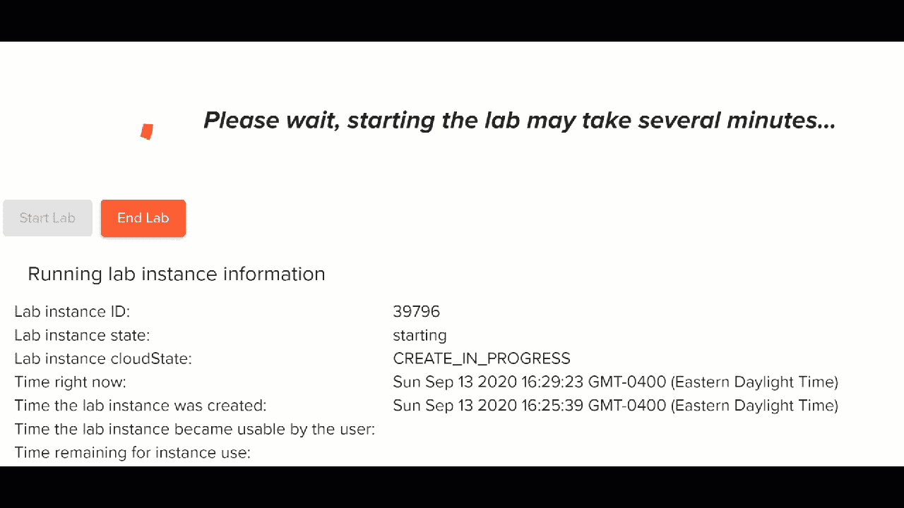
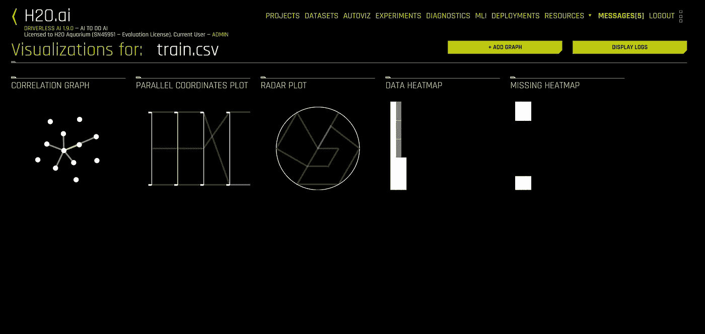
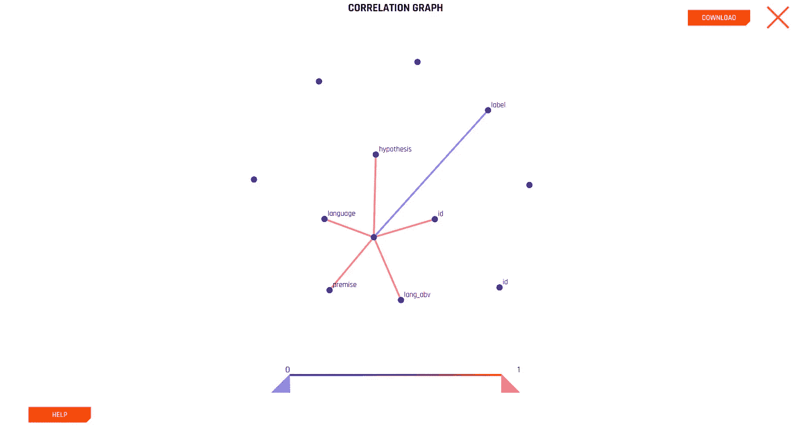
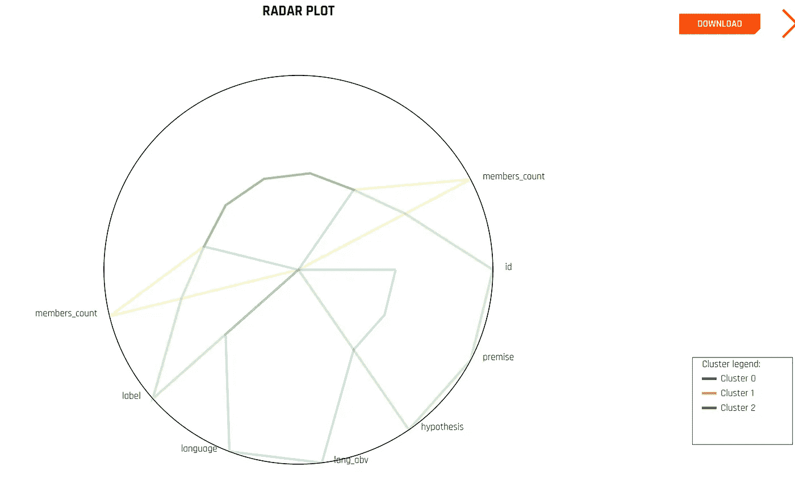
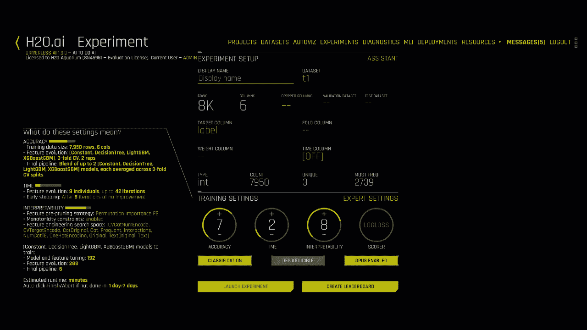
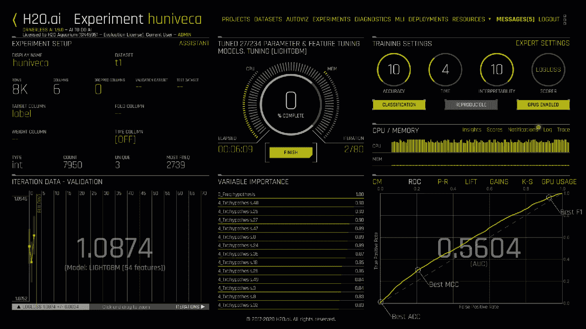
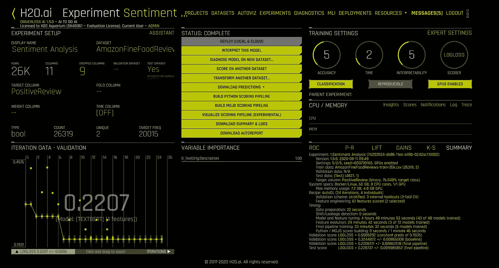
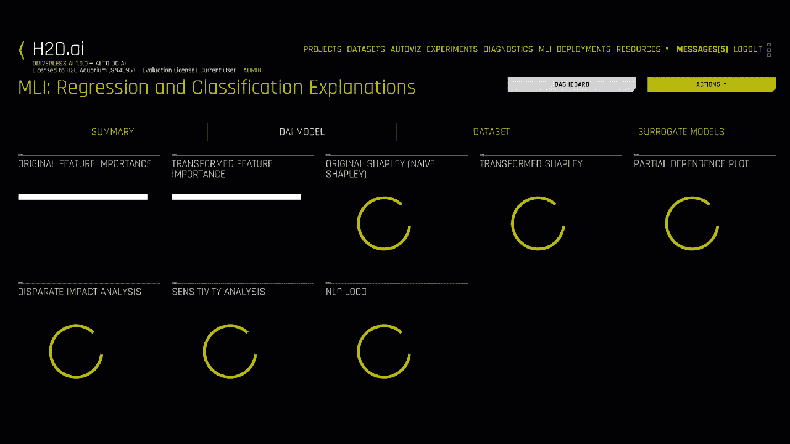
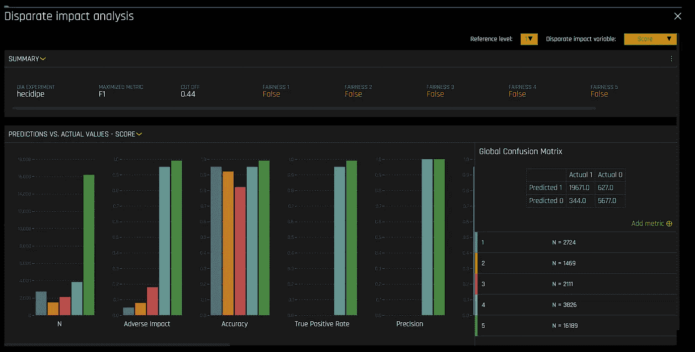
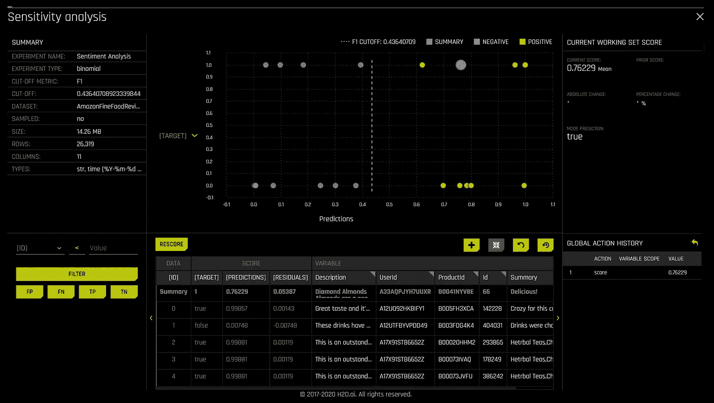

# H2O 无人驾驶人工智能

> 原文：<https://towardsdatascience.com/h2o-driverless-ai-71414b441425?source=collection_archive---------53----------------------->

## autoML 系列的第五名—可视化和可解释性的第一名

图片来自[皮克斯拜](https://pixabay.com/?utm_source=link-attribution&utm_medium=referral&utm_campaign=image&utm_content=1759703)

今天，我继续我在 autoML 工具中的冒险。其中一个领导者是 H2O 的无人驾驶人工智能产品。它有一些让我印象深刻的功能。我在这次评估中的一个缺点是，我没有足够的时间来正确训练“沃森”数据集。虽然无法获得结果，但我已经分享了足够多的经验，让您对该工具有所了解。

# 为什么是无人驾驶 AI？

在过去的几年里，我已经看过几次无人驾驶人工智能的演示。我自己在 2018 年用我的 AWS 账户里的试用做了一个评测。我从经验和名声中知道；这是可用的顶级 autoML 工具之一。他们兜售他们的可视化，两年前我对他们印象深刻。

# 设置和成本

像 DataRobot 一样，无人驾驶 AI 是一种[特许产品](http://docs.h2o.ai/driverless-ai/latest-stable/docs/userguide/licenses.html)。自去年以来，无人驾驶人工智能已经可以通过 IBM 和其他云平台使用。我无法找到一个指定用户 2020 年的确切许可成本。根据我的研究，价格似乎与每年 8 万美元的 DataRobot 费用相当。

幸运的是，我们可以免费试用无人驾驶人工智能。有几个选择。您可以获得 14 天的云实施或 2 小时的托管平台。过去，我一直使用 AWS Marketplace 产品。对于这个演示，我使用的是托管平台。两个小时是很短的时间，所以我需要有效率。

我在[水族馆](https://aquarium.h2o.ai/login)上开了一个账号。有几个实验室可供使用。按照建议，我开始了试驾实验室。我最初不确定是否可以加载我的数据集。我很高兴看到我可以。

等待我的实验室运转起来——作者的 gif 图

实验室启动后，我得到了一个指向 AWS 实例的 URL。又快又简单。

# 数据

为了保持本系列中各种工具的平等性，我将坚持使用 Kaggle 培训文件。矛盾，我亲爱的华生。使用 TPUs 检测多语言文本中的矛盾和蕴涵。在这个入门竞赛中，我们将句子对(由一个前提和一个假设组成)分为三类——蕴涵、矛盾或中性。

6 列 x 13k+行—斯坦福 NLP [文档](https://nlp.stanford.edu/projects/snli/)

*   身份证明（identification）
*   前提
*   假设
*   朗 abv
*   语言
*   标签

# 加载数据

加载数据非常容易，在进行任何训练之前，都可以看到一些非常好的可视化效果。您还可以在列表中添加图表，这是一个很好的特性。大多数 autoML 工具不会给你关联图和雷达图。我认为数据热图有点弱，但这似乎是由于数据(文本)的多样性。有趣的是，当你下载可视化效果时，它们就出现了。svg 格式。如果你有 Adobe 许可证就好了。

作者截图

作者截图

# 训练您的模型

让模特接受培训很简单。发射实验。您可以根据自己的喜好调整精确度、时间和可解释性刻度盘。还有很多专家设置可以查看。

作者截图

在这个主要的可视化和日志之间，您可以很好地了解您的培训工作正在取得的进展。我很欣赏这一点！我可能对我的拨号盘过于激进，在我分配的时间内，我无法完全完成整个实验。

实验运行—作者 gif

# 评估培训结果

嗯，我没有足够的时间用我的时间来训练模特。我试图启动一个新的实验室，并再次尝试，但我只是得到了 45 分钟的“等待工人”的消息。我会对生成的特征感兴趣。特征生成是该工具的一个显著特点。

好消息是有一些预运行的项目，你可以自己浏览。

我确实看到 H2O 增加了自动报告功能！很好的补充。这份报告不像 DataRobot 的报告那样全面，但它在正确的方向上做得很好。

作者的自动报告内容截图

H2O 有一本关于模型可解释性的免费小册子，我强烈推荐。他们是这个地区的领导者。

 [## 机器学习可解释性介绍——AI 和 ML 领域的开源领导者

### 理解和信任模型及其结果是好科学的标志。分析师、工程师、医生…

www.h2o.ai](https://www.h2o.ai/resources/ebook/introduction-to-machine-learning-interpretability/) 

当您单击“解释此模型”时，您必须等待流程运行。不要盯着屏幕，否则你会发现你的眼睛在状态上打转。

作者 gif

慢慢地，解释变得可行了。结果值得等待。

作者截图

作者截图

# 结论

无人驾驶人工智能是一个伟大的工具。它们提供了有趣的可视化效果，并允许您添加更多的可视化效果。模型可解释性度量和图表非常棒。和 DataRobot 一样，你需要为伟大付出代价。

实验室是免费的，所以我鼓励你今天就去尝试。预先训练的项目给你一个良好的开端，让你可以看看自己。

如果您错过了本系列中的一篇文章，这里有链接。

 [## AWS Sagemaker Studio 自动驾驶仪准备好迎接黄金时段了吗？

### 带有一些评论的自动驾驶界面演示

towardsdatascience.com](/is-aws-sagemaker-studio-autopilot-ready-for-prime-time-dcbca718bae7)  [## 免费体验 Google autoML 表格

### autoML 工具用户体验评论系列之二。

towardsdatascience.com](/experience-google-automl-tables-for-free-d5648ae3d0e5)  [## Azure Automated ML 倾听他们的设计师

### 本 autoML 系列的第 3 部分，微软，绝地大师

towardsdatascience.com](/azure-automated-ml-listens-to-their-designers-7f1c68d19eb4)  [## DataRobot 让生活变得简单。

### 汽车系列之四——设计之美

towardsdatascience.com](/datarobot-makes-life-easy-8505637241e5)