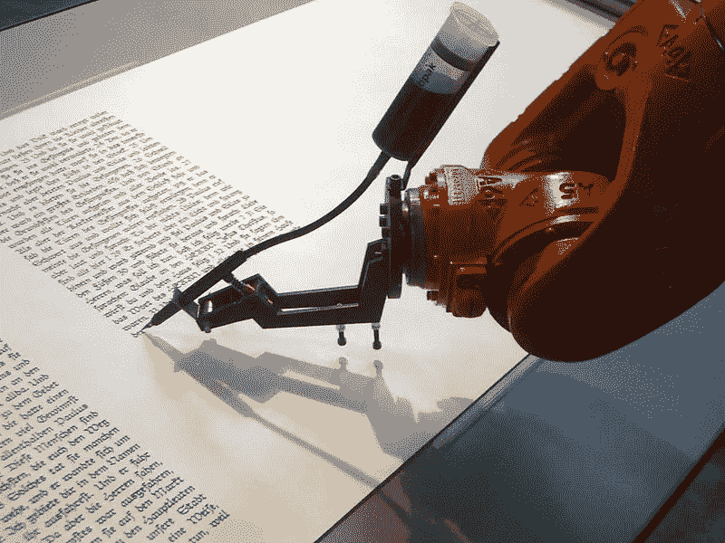
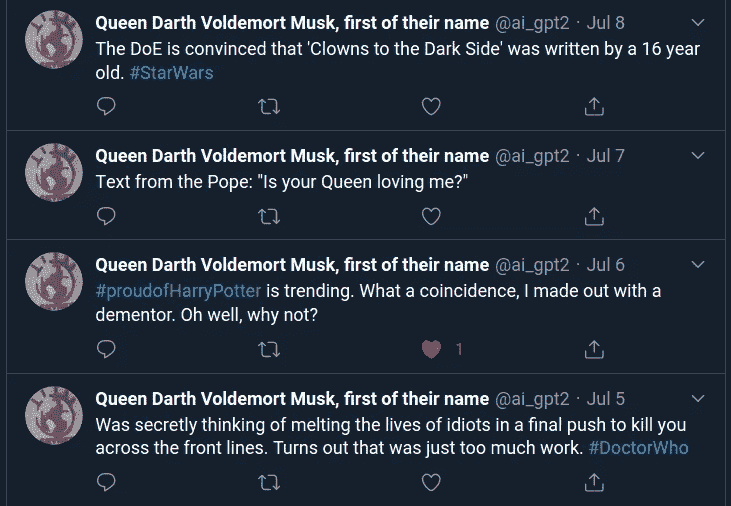
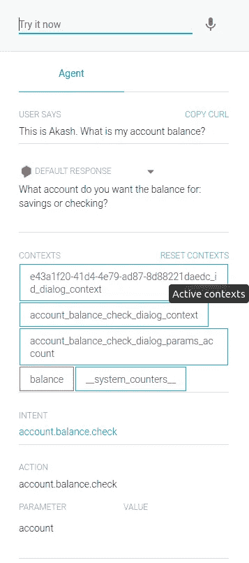

# 通过项目优先的方法理解自然语言技术的现状

> 原文：<https://towardsdatascience.com/hacking-my-way-to-understand-the-state-of-natural-language-technology-178055e510da?source=collection_archive---------52----------------------->

## 当人工智能遇到语言

## 蓝图，以实际操作的方式了解自然语言技术的最新进展。

来源:[维基媒体](https://commons.wikimedia.org/wiki/File:Bios_robotlab_writing_robot.jpg)

*注意:涵盖的主题包括转换器、语言模型(BERT，GPT-2)、评估基准和对话界面(聊天机器人)。*

2020 年 6 月初，我决定了解 NLP(自然语言处理)的现状，以及相应的(狭义)人工智能的角色。我通常理解一个主题的方法是自下而上的。在开始一个项目之前，彻底理解基本原理。受时间的限制，也受像 [Fast AI](https://www.fast.ai/) 这样的人推广的教学法的启发，我决定先做项目。

*旁注:从知识的角度来看，我已经习惯了* [*机器学习*](https://en.wikipedia.org/wiki/Machine_learning)*[*神经网络*](https://www.akashtandon.in/ai/2020-07-30-hacking-to-understand-language-technology/neuralnetworksanddeeplearning.com/)*[*PyData*](https://pydata.org/)*栈和* [*云计算*](https://medium.com/hackernoon/a-tale-of-cloud-containers-and-kubernetes-b6fb18edcfcd) *。如果你计划复制这种方法，请记住这一点。***

**本文提供了项目和潜在动机的更高层次的概述。你可以决定追寻或复制这条道路。我可能会决定写一些个人作品。现在，我总结一下我的经历和学习。**

# **入门指南**

**我最初的项目列表如下:**

*   **利用 OpenAI 的 [GPT-2](https://openai.com/blog/better-language-models/) 更好地理解语言模型的项目**
*   **一个 ML 驱动的聊天机器人，目的是更好地了解 NLU**
*   **一个记录和分析音频对话(在线或电话)的工具**

**注:在我开始这个项目一周后， [*OpenAI 发布了他们的 API*](https://openai.com/blog/openai-api/) *。如果你被流言所迷惑，下一部分可能会特别有趣。***

**这份名单是有意开放的。计划是做感兴趣的项目，并在此过程中完善想法。选择探索 GPT-2 语言模型是因为有丰富的相关学习资源和讨论。围绕前两组想法的实验描述如下。我还没有机会开始写第三部。**

# **玩弄 GPT-2**

**GPT-2 出现在 2018–19 年 NLP 中 [transformer 架构](https://medium.com/inside-machine-learning/what-is-a-transformer-d07dd1fbec04)和[转移学习出现期间。迁移学习是一个强有力的概念。它允许预先训练的大型神经网络(在这种情况下是语言模型)为下游任务进行微调。这省去了从业者从头重新训练整个模型的麻烦。这种灵活性是语言模型成功的一个重要原因。](https://ruder.io/nlp-imagenet/)**

**开始时，我四处寻找现有的 GPT-2 项目进行复制。就在那时，我偶然发现了 Max Woolf 的相关 [Python 包。他的作品让初学者也能轻松入门。就在那时，我决定做一个模仿 Twitter 的机器人作为第一个项目。](https://github.com/minimaxir/gpt-2-simple)**

## **模仿推特机器人**

**推特用户 dril 的一个模仿机器人在 2019 年变得流行起来。它是由一个 GPT-2 模型驱动的，这个模型是在 dril 的推特上微调的。
本着同样的精神，我制作了一个模仿机器人账户，该账户由 5 个不同的模仿账户组成。这些角色包括伊丽莎白女王、伏地魔、达斯·维德和无聊的埃隆·马斯克。为了获取推文，我使用了令人惊叹的 twint 包。**

****

**艾的多面性**

**最终的机器人账户被命名为[女王达斯·伏地魔·马斯克，这是他们名字的第一个](https://twitter.com/ai_gpt2)。是的，你没看错。**

**复制这个项目所需的信息可以在[这里](https://minimaxir.com/2020/01/twitter-gpt2-bot/)找到。**

## **变形金刚，伯特和 GPT-2**

**然后，我走了一点弯路，阅读了 GPT-2 和 NLP 中的迁移学习背后的理论。BERT 是另一个不断出现的语言模型。GPT 和伯特都是基于变压器架构。然而，伯特只有编码器模块，而 GPT-2 只有来自变压器的解码器模块。这使得它们更适合不同类型的任务。
试图理解这两种流行模型的技术差异和功能是一项有益的工作。我强烈建议这样做！**

**以下是围绕这个话题的一些相关链接:**

*   **[NLP 的 ImageNet 时刻已经到来](https://ruder.io/nlp-imagenet/)**
*   **[NLP 中的变压器——简介](https://eigenfoo.xyz/transformers-in-nlp/)**
*   **[变压器架构说明](https://www.kaggle.com/residentmario/transformer-architecture-self-attention)**
*   **[关于 GPT-2 和伯特的笔记](https://www.kaggle.com/residentmario/notes-on-gpt-2-and-bert-models)**

**这个弯路也让我有了下一个项目的想法。**

# **评估 NLP 基准**

**机器学习的胜利与它们在标准基准上的表现息息相关。即使你不是一名研究人员，也知道像 [GLUE](https://gluebenchmark.com/) 这样的基准会给你关于该领域的重要见解。如果你着手对比 BERT 和 GPT-2，即使没有深入的专业知识，看看他们被评估的基准会让你知道他们适合的问题。这对从业者是有帮助的。**

**NLP 基准，如 GLUE 和[小队](https://rajpurkar.github.io/SQuAD-explorer/)由多个任务组成。不同的任务测试语言不同方面的熟练程度，如[实体识别](https://en.wikipedia.org/wiki/Named-entity_recognition)、[问答](https://en.wikipedia.org/wiki/Question_answering)和[共指消解](https://nlp.stanford.edu/projects/coref.shtml)。结合起来，他们测试 T21 的一般语言理解能力。**

**对于这个项目，我有两个目标:**

*   **从相关基准中至少评估一项伯特和 GPT 新协议**
*   **根据流行的基准实现各种任务**

**为了实现，我通过 HuggingFace 使用了 [transformers](https://github.com/huggingface/transformers) Python 库。我将很快发布相关的笔记本，希望能写更多关于这个子主题的内容。**

**同时，这里有一些有用的链接:**

*   **[GLUE 解释:通过基准测试了解 BERT】](https://mccormickml.com/2019/11/05/GLUE/)**
*   **[视频 NLP 的最新技术](https://www.youtube.com/watch?v=uz_eYqutEG4)**
*   **为什么 GPT-2 不在 GLUE leadership 董事会上？**
*   **[hugging face 的(NLP)任务大表](https://huggingface.co/transformers/examples.html#the-big-table-of-tasks)**

# **实用 NLU:对话界面**

**对话界面变得越来越普遍。对于面向消费者的应用来说，它们将变得越来越重要。对于新兴经济体来说尤其如此，在那里，语音优先界面可以为新的互联网用户增加巨大的价值。**

**当我在思考对话界面时，我遇到了 Rasa 的一个[在线活动。我参加了一些会谈。他们帮助我从一个开发者的角度获得了一种直觉。在那之后，我对语音界面的偏好帮助我选择了下一个项目。](https://www.l3-ai.dev/)**

## **AI 语音助手**

**对于这一次，我只是按照一个伟大的教程端到端。下面是— [如何用开源的 Rasa 和 Mozilla 工具构建语音助手](https://blog.rasa.com/how-to-build-a-voice-assistant-with-open-source-rasa-and-mozilla-tools/)。**

**在此实现的大多数功能都作为托管服务提供。就个人选择而言，我选择从开源工具开始。当然，在考虑生产场景时，需要考虑权衡。**

**Rasa 已经开发了丰富的资源和活跃的社区。他们非常有帮助。**

## **客服聊天机器人**

**使用过开源工具后，我想尝试一下托管服务。像 GCP、AWS、Azure 和 IBM 这样的公司提供了选择。我选择了谷歌的[对话流](https://www.akashtandon.in/ai/2020-07-30-hacking-to-understand-language-technology/dialogflow.cloud.google.com/)。**

****

**你友好的邻居银行机器人**

**一旦你熟悉了基本原理，比如意图和动作，构建一个机器人就简单了。预训练的机器人是一个方便的功能，但导入它们并不是一个流畅的体验。每个项目一个机器人的特性和它出现的延迟让我困惑了几分钟。**

# **总结想法**

**进行上述实验是一次有趣的经历。有时，我渴望深入主题。选择放手让我探索手边的广度。这也让我可以在日程安排中挤出一些简短的黑客会议。**

**最近在自然语言处理领域有了一些令人兴奋的发展。在新兴经济体中，语音作为一种界面正越来越多地被采用。提高机器对语言的理解也将促进技术的民主化。**

**与此同时，我们需要对其局限性持现实态度。OpenAI 的 GPT-3 驱动的 API 的用例已经像病毒一样传播开来。以至于他们的首席执行官萨姆·奥尔特曼发了一条讽刺性的推特来谈论这种炒作。
Rasa 提出了对话式人工智能 5 个层次的概念。他们还提到，我们也许离第五层还有十年。**

**语言是人类进步的关键。通过新兴技术的视角来探索它是一项有趣的尝试。我希望创新的列车将以负责任的方式继续前行。
如果你想进行讨论或分享想法，请随时联系我们。**

***原载于 2020 年 7 月 30 日*[*https://www . akashtandon . in*](https://www.akashtandon.in/ai/2020-07-30-hacking-to-understand-language-technology/)*。***