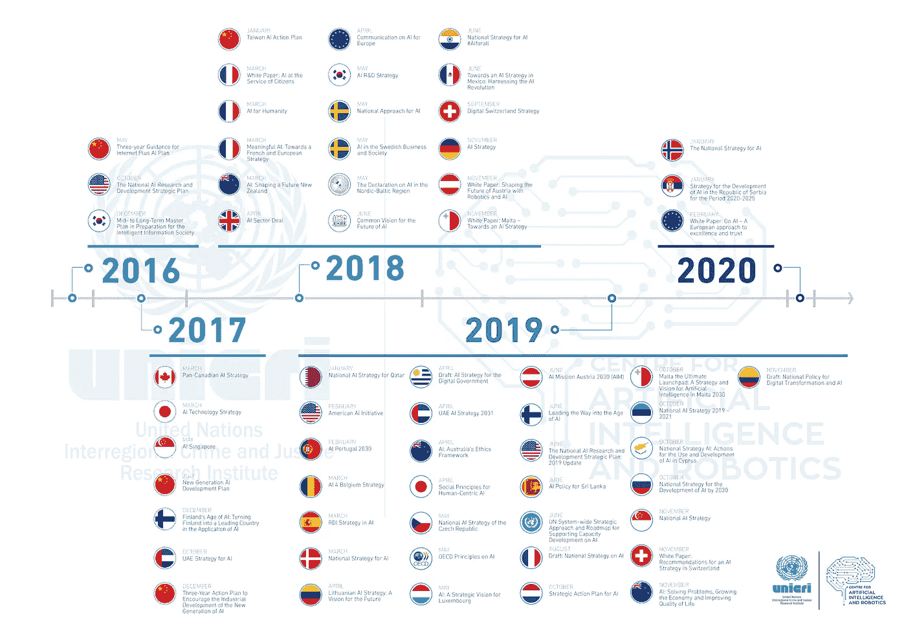
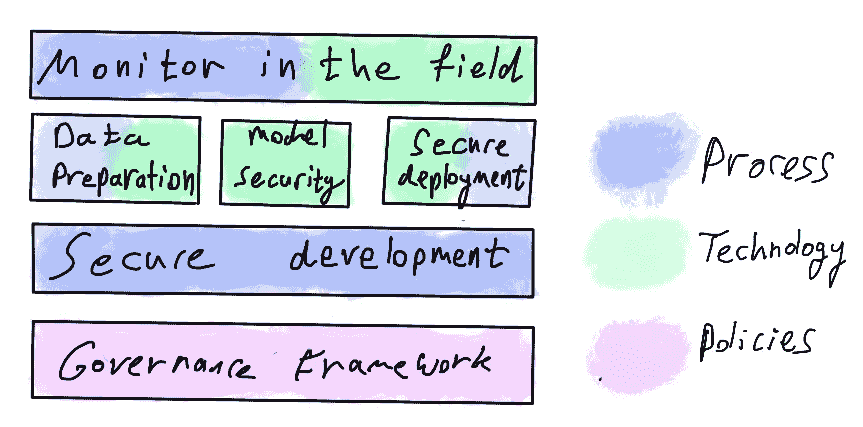
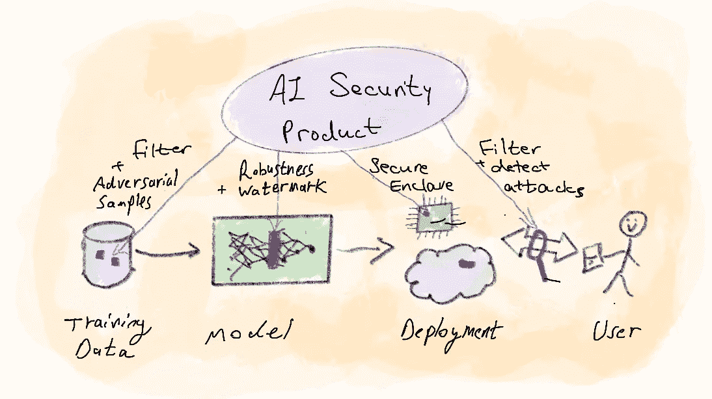

# 黑客超级智能

> 原文：<https://towardsdatascience.com/hacking-super-intelligence-af5fe1fe6e26?source=collection_archive---------11----------------------->

照片由 Allan Beaufour 拍摄，许可: [CC BY-NC-ND 2.0](https://creativecommons.org/licenses/by-nc-nd/2.0/)

## 人工智能/人工智能正在影响敏感的决策——为了保护我们的系统，我们需要一个统一的框架和一个新的学科:人工智能安全

世界上出现了一种新型的网络攻击。这些攻击与传统攻击不同，无法用传统方法应对。今天，这种攻击还很少，但在未来十年，我们可能会面临一场海啸。为了做好准备，我们需要从今天开始保护我们的人工智能系统。

我想从人工智能安全性的前提开始，只是意识到我在冒一个关于人工智能如何具有破坏性的陈词滥调的风险。为了让它离开桌子，我将提到 AI 不仅是我们日常生活的一部分(搜索引擎建议，照片过滤器，数字语音助手)。它已经参与了关键的决策过程；国家机构使用 AI 来更好地分析数据。汽车使用它来做出拯救生命的决定(并自动驾驶)。金融机构每天都在使用它——我们可能正在经历人工智能应用的寒武纪大爆发，在未来十年，人工智能将改变我们生活中最敏感的领域:医疗诊断、金融机构的决策、关键基础设施的控制和军事系统的决策。

基于 30 多年的数字黑客和欺诈，我们可以假设犯罪分子已经在努力利用这项技术的弱点——其中一些弱点就像人工智能一样新[1]。尽管如此，在成千上万致力于开发这些人工智能系统的人中，可能**只有一小部分人在关注** **人工智能系统**的安全性。

在这篇短文中，我打算简要回顾一下“人工智能固有的风险”，提供一些人工智能政策的背景，以强调这个主题被处理的强度，然后提出一个新的安全规程的框架:*人工智能安全*。

## **风险**

> *"* 人工智能是未来，不仅仅是俄罗斯，而是全人类。它带来了巨大的机遇，但也带来了难以预测的威胁。谁成为这个领域的领导者，谁就将成为世界的统治者。——弗拉基米尔·普京( [RT](https://www.rt.com/news/401731-ai-rule-world-putin/) )

在技术世界里，新的风险通常伴随着创新。这些风险开始很小，然后爆炸(见[我关于指数风险的帖子](https://medium.com/@GeorgeRaines/cyber-risks-in-new-industries-9481ea317daf?source=friends_link&sk=4c1339fb37dfa892ddf70931e0f9450b)，特别是物联网用例)。人工智能具有指数级的破坏力。想想它对数字数据的影响；想想所有的在线视频、录音电话、安全摄像头、网站……现在想象一种人工智能算法，它可以分析任何这样的数据，找到隐藏的联系，并从中提取新的意义。数据分析**创建了一个新的数据体，几乎和原始数据体**一样大，没有人能预料这些数据会是什么样子。今天，我们赋予这些系统反应和交互的能力，例如，让人工智能接听电话或驾驶汽车，从而成倍增加了破坏的途径。依靠不可预测的数据，以不可预测的方式做出决策。你觉得有多安全？

即使你信任人工智能做出正确决定的能力，并且你信任使用人工智能的企业/机构，也有另一个重要的警告:**人工智能容易受到新型攻击**。当今的网络安全主要集中在保护 IT 系统和网络物理系统(CPS)免受逻辑、代码或架构中漏洞的利用。当攻击人工智能系统时，攻击者拥有几乎无人能敌的新操作方法，例如:

1.  在学习阶段毒害训练数据以使模型产生偏差。
2.  利用训练白点欺骗人工智能的对抗性攻击。
3.  暴力迫使模型提取训练数据，违反隐私或数据保密。
4.  物理模型提取，允许攻击者提取模型，从而侵犯所有者的知识产权。

还有许多其他的例子[2]。当人工智能在公司的业务流程和敏感决策中变得至关重要时，很容易看到上述攻击如何在 SFOP 范围内导致**损害场景**:安全、财务、运营和隐私。

## 相关政策和研究

AI 战略文件时间表，自 2020 年 4 月起生效，[犯罪司法所](http://www.unicri.it/index.php/topics/ai_robotics)根据 [CC BY-SA 4.0](https://creativecommons.org/licenses/by-sa/4.0/)

人工智能安全工程一词早在 2010 年就由 Roman Yampolskiy 创造，开始引起人们对我们面临的问题的关注。2017 年 1 月，一群领先的行业和学术研究人员设计了 *Asilomar AI 原则[3]* 。由 1600 多名研究人员签名，并得到埃隆·马斯克和斯蒂芬·霍金等名字的认可，阿西洛马人工智能原则旨在为人工智能研究提供一个重要考虑因素的框架。大部分原则都是围绕 AI 伦理和价值观。**原则 6 明确指出** **AI 安全必须是所有 AI 实现中的一个考虑因素**。人们的意识肯定在提高，然而，只有一小部分人在积极研究人工智能的安全性。

从好的方面来看，世界各地的监管者都很早就意识到了这种风险。这与过去的技术风险相反。[例如，GDPR](https://en.wikipedia.org/wiki/General_Data_Protection_Regulation) 是在技术侵犯我们的隐私约 30 年后，以及物联网成为现实 20 年后加州物联网法案[4]出台的。就人工智能而言，政府很早就开始关注了[5]。例如，白宫在 2018 年发布了“美国人民的人工智能”概况介绍。欧盟委员会于 2019 年 4 月发布了“可信人工智能(AI)道德准则”[6]，中国多年来一直在该领域投资。人工智能政策是一个伟大的话题，我不会在这篇文章中详细阐述。为了更深入的了解，你可以研究上述战略文件的时间表，并阅读 CLTC 的总结论文[7]。

但即使有所有这些政策，任何人都可以在几分钟内编写一个人工智能应用程序，而不被人注意。**我们用来管理风险的工具实际上并不存在**。

解决人工智能安全有很多角度，作为一名技术人员，我想把重点放在技术选项上。

## **解决方案景观**

首先，让我们定义我们的术语。

*AI 安全*，在我的词汇里，只涵盖了我们需要信任 AI 的一部分。概括来说，我使用术语*人工智能信任:*当人工智能算法做出决策时，企业和用户睡得好的能力。为了指明保护人工智能系统免受攻击的原则，我使用了术语*人工智能安全*。

*人工智能信任*:人类信任人工智能考虑结果的能力:

1.  有限可解释性
2.  易受针对 IT 系统的网络攻击
3.  易受针对人工智能工作方式的攻击(例如敌对攻击、投毒等)
4.  重大数据泄露的风险

*人工智能安全*:保护人工智能系统免受以下危害的规则:

1.  人工智能本土攻击(敌对，中毒等…)
2.  盗窃人工智能模型(即知识产权)
3.  训练数据的推断
4.  侵犯隐私

虽然我一直在说只有一小部分人从事 AI 安全/安保，但业界和学术界并没有完全睡着。在加州大学的一篇技术论文[8]中，作者绘制了考虑到人工智能大规模采用的不同研究领域。其中三个领域属于人工智能安全领域:*稳健决策、安全领域、机密数据共享学习*和*对抗学习*。近年来，各大会议都选择将 AI 安全作为主题。例如，在 Black Hat USA 2020 中，围绕 ML/AI 主题进行了 8 次简报，其中两次直接关注模型提取[9]和防范敌对攻击[10]。ACM 人工智能与安全研讨会( [AISec](https://aisec.cc/) )涵盖了越来越多的人工智能安全主题会议。除了学术兴趣之外，我们还应该加上业界的关注点:例如，参见华为[11]的这篇综述文章和 IBM [12]领导的开源项目，该项目为您提供了一个完整的工具包，让您的系统做好准备，以应对恶意攻击(您可以在此处下载)。

## **AI 安全技术**

研究兴趣导致了实际的解决方案。有远见的公司已经可以依靠现有的知识体系来对抗人工智能的攻击。从专业的角度来看，我认为我们应该首先报道那些无聊的东西:

作者图片

治理:

1.  人工智能安全领域的清晰定义:我们要解决什么？
2.  组织中 AI 安全的明确责任:是产品所有者、工程部门还是合规部门？

R&D 进程:

1.  在开发生命周期中考虑与 AI 相关的风险。这应涵盖产品开发和数据科学运营。
2.  每个项目应在开始时确定人工智能风险和相关的人工智能安全目标。
3.  安全测试和红队应该被训练使用人工智能攻击媒介。
4.  必须保护培训数据，并对威胁进行分析。

技术:

1.  R&D 团队应该使用标准的现成工具来强化系统。
2.  必须对数据进行过滤，并做好应对敌对攻击的准备。
3.  人工智能模型应该被强化以降低敏感度，如果可能的话，还应该能够抵御攻击。
4.  生产中的部署应该使用不同的控制措施来保护模型和培训数据的机密性。

监控:

1.  应该监控人工智能系统的偏见、中毒和其他攻击企图。
2.  应在生产中分析推理和查询，以检测攻击企图(即恶意攻击或数据提取)。

就技术而言，现有工具至少可以应对基本威胁:

1.  **模型提取:**分析输入以检测模型推理尝试。例如，在线集成 PRADA 检测模型[13]并采取措施应对攻击企图。
2.  **投毒:**验证训练数据并采样(疏删样本，有多疼就多:)。在生产中，尽量实现不同独立模型之间推理结果的比较，即集成分析。此外，寻找数据中的异常。
3.  **对抗性攻击:**用对抗性训练数据训练你的模型。这可以在培训阶段使用 ART 工具箱来实现。在生产之前，尝试最小化你的模型的敏感性，例如通过使用知识转移[14]。最后，探索通过重建[15]和检测可疑输入来保护您的模型的选项。
4.  **IP 盗窃:**模型的部署，尤其是在边缘部署的情况下，必须在一个架构中保护模型的至少一部分免受本地攻击者的攻击。这可以通过在不使用模型时对其进行加密，并利用安全区域和三通来保护关键部分来实现。最后，考虑在你的模型中加入特定的水印，使用只由特定输入触发的神经路径，它可以帮助你发现别人是否偷了你的模型。

正如这篇 2016 年的论文[16]中提到的，我们真正需要的是一个统一的框架。像网络安全的其他领域一样，我们不希望每家公司都开发自己的安全风格——从社会的角度来看，技术领导者开发人工智能安全学科和最先进的技术来保护人工智能系统非常重要。

## **AI 安全创新**

在我看来，我们需要一个整体的解决方案，让公司在购买现成安全产品的同时专注于人工智能开发。该解决方案将涵盖从构思、开发到部署的人工智能安全。这种解决方案至少应包括以下要素:

1.  **风险和流程:**基础培训、治理框架和专业安全测试应由有能力的公司和卓越中心作为专业服务提供。
2.  **数据卫生性和健壮性**:过滤训练数据中的异常点，并向训练数据中注入敌对样本。
3.  **模型安全性**:执行标准例程(提取、修剪)并集成高级控制，使模型更加健壮。将水印路径注入到模型中，以便能够在野外进行模型盗窃检测。
4.  **安全部署**:通过在不可信和可信执行环境之间划分模型部署，保护模型免受物理盗窃[17]。在边缘运行时自动加密和解密模型。
5.  **威胁防范&检测**:在操作过程中(“现场”)过滤和预处理输入，以阻止攻击企图。监控使用情况以检测敌对攻击企图和/或模型提取企图。

作者图片

将上述控制集成到 AI 开发周期中对于任何客户来说都应该是容易和可访问的，从而将开发团队从开发内部能力和自制 AI 安全工具的需要中解放出来。它应该是每个公司都使用的标准解决方案，就像所有公司都在其系统中使用 TLS 并安装现成的防火墙一样。此外，还可以提供人工智能安全专业服务:例如，专注于人工智能的红队、风险评估和监控 SOC。

我们应该问自己的唯一问题是，是否有足够强大的商业案例来开发上述解决方案并将其作为产品进行营销。我认为这不是一个“**如果**会有商业案例”的问题，而是一个“**什么时候**的问题。至少有 4 种力量在发挥作用，使未来 5 年成为人工智能安全领域创新的有利可图的时间(没有特定的顺序):

*   人工智能在商业决策过程中的流行[18]
*   规程
*   信息物理系统开始利用人工智能[19]
*   人工智能操作成为一件事(简而言之:在人工智能世界里有一个类似 DevOps 的运动)[20]

但是对于投机者来说，未来 5 年内什么时候是个问题。既然我们在谈论安全性，那么有理由假设大玩家(即方)会照顾好自己，少数早期采用者会从外部寻找解决方案，而市场的大多数人只会等待大黑客的消息。让我们看看结果如何。

## **总结**

作为一名在保护 CPS 方面拥有专业知识的网络安全专家，我亲眼目睹了安全创新如何通常**跟随风险而不是先于风险**。对于一家开发人工智能的公司来说，正常的轨迹是首先投资让它工作，然后优化它，然后才保护它。然而，由于我们处于 2020 年，考虑到这项技术的颠覆性，我们不能等待人工智能安全的投资。监管机构非常(也是可以理解的)关注*可解释性—* 但是人工智能信任，即我们信任人工智能做出决策的能力，需要同样多的投资来应对这项技术带来的新攻击。

今天有很多事情可以做，甚至使用开源工具来保护你的人工智能系统。下一步自然是行业开发人工智能安全产品。虽然我不能 100%肯定会有一家领先的人工智能安全产品公司，但我非常确信我们会在该领域看到专家顾问和专业服务的利基。如果你觉得这个话题有趣，现在可以是发展你的人工智能安全技能的好时机。

我希望这篇短文提供一些思考的食粮，也许是管理你自己的 AI 安全风险的起点。

我**如果你想参与讨论，请评论，分享，随时联系我:**【harpakguy@gmail.com】T4

谢谢:)

**免责声明**:我的观点仅代表我个人，与我工作的任何公司或个人无关。

参考资料:

[1]- Roman V. Yampolskiy，人工智能安全和网络安全:人工智能失败的时间线(2016 年)， [Arxiv](https://arxiv.org/pdf/1610.07997.pdf)

[2]- [亚历山大·波利亚科夫](https://towardsdatascience.com/@alexanderpolyakov?source=post_page-----6af8026675ff--------------------------------)，AI 安全与对抗机器学习 101 (2019)，[中](/ai-and-ml-security-101-6af8026675ff)

[3]-阿西洛马尔原则(2017)，[https://futureoflife.org/ai-principles/?cn-reloaded=1](https://futureoflife.org/ai-principles/?cn-reloaded=1)

[4]- [参议院第 327 号法案](https://leginfo.legislature.ca.gov/faces/billTextClient.xhtml?bill_id=201720180SB327)

[5]-维基百科:[人工智能条例](https://en.wikipedia.org/wiki/Regulation_of_artificial_intelligence)

[6]- [可信人工智能(AI)的伦理准则](https://ec.europa.eu/digital-single-market/en/news/ethics-guidelines-trustworthy-ai)

[7]-加州大学伯克利分校 CLTC 分校，走向人工智能安全:全球对更具弹性的未来的渴望， [CLTC](https://cltc.berkeley.edu/towardaisecurity/)

[8]--斯托伊察、扬和宋、道恩和波帕、拉卢卡·阿达和帕特森、大卫·A .和马奥尼、迈克尔·w .和卡茨、兰迪·h .和约瑟夫、安东尼·d .和乔丹、迈克尔和赫勒斯坦、约瑟夫·m .和冈萨雷斯、约瑟夫和戈德堡、肯和古德西、阿里和卡勒、大卫·e .和阿贝耳、彼得、伯克利的人工智能系统挑战观点(2017)，[链接](https://www2.eecs.berkeley.edu/Pubs/TechRpts/2017/EECS-2017-159.html)

[9]-于，杨，张，蔡永元，何永元，金永元，“云漏洞:通过对抗实例窃取大规模深度学习模型”，《网络与分布式系统安全研讨会论文集》，(NDSS)，2020

[10]- Ariel Herbert-Voss，对抗对抗性机器学习的实际防御(2020)， [Blackhat 2020](https://www.blackhat.com/us-20/briefings/schedule/#practical-defenses-against-adversarial-machine-learning-20476)

[11]-华为，AI 安全白皮书(2018 年 10 月 01 日)，[华为](https://www.huawei.com/en/trust-center/resources/ai-security-white-paper)

[12]-玛丽亚-伊琳娜·尼古拉、马蒂厄·辛恩、明·恩哥克·特兰、比特·布瑟尔、安布里什·拉瓦特、马丁·威斯特巴、瓦伦蒂娜·赞泰德斯基、娜塔莉·巴拉卡尔多、布赖恩特·陈、海科·路德维希、伊恩·m·莫洛伊、本·爱德华兹，对抗性鲁棒性工具箱 v1.0.0 (2018)， [Arxiv](https://arxiv.org/pdf/1807.01069.pdf)

[13]-米卡·尤蒂，塞巴斯蒂安·西勒，萨缪尔·马沙尔，n .阿索坎，普拉达:防范 DNN 模特窃取攻击(2019)， [Arxiv](https://arxiv.org/pdf/1805.02628.pdf)

[14]- Nicolas Papernot，Patrick McDaniel，Wu，Somesh Jha，Ananthram Swami，蒸馏作为对抗深度神经网络的对抗性扰动的防御(2016)， [Arxiv](https://arxiv.org/abs/1511.04508)

[15]——石祥·古，卢卡·里加齐奥，面向对抗示例的深度神经网络架构(2015)， [Arxiv](https://arxiv.org/abs/1412.5068)

[16]- Nicolas Papernot，Patrick McDaniel，Arunesh Sinha，Michael Wellman，SoK:走向机器学习中的安全和隐私科学(2016)， [Arxiv](https://arxiv.org/pdf/1611.03814.pdf)

[17]- GlobalPlatform，TEE 系统架构 v1.2，[https://global platform . org/specs-library/TEE-System-Architecture-v1-2/](https://globalplatform.org/specs-library/tee-system-architecture-v1-2/)

[18]-约瑟芬·沃尔夫(Josephine Wolff)，如何为人工智能提高网络安全(2020)，[布鲁金斯学会](https://www.brookings.edu/research/how-to-improve-cybersecurity-for-artificial-intelligence/)

[19]-[https://www . the guardian . com/science/2019/mar/29/uk-us-Russia-opposing-killer-robot-ban-un-ai](https://www.theguardian.com/science/2019/mar/29/uk-us-russia-opposing-killer-robot-ban-un-ai)

[20]-比如:【https://research.aimultiple.com/ai-platform/】T4