# 入侵数据科学管道

> 原文：<https://towardsdatascience.com/hacking-the-data-science-pipeline-18303e2c4307?source=collection_archive---------66----------------------->

## 特征工程系列

## 功能改进—以#02.01 为例

昆腾·德格拉夫在 [Unsplash](https://unsplash.com/s/photos/pipelines?utm_source=unsplash&utm_medium=referral&utm_content=creditCopyText) 上的照片

# 这篇博文的目的

这是特征工程系列的第 02.01 课。在 [Take#01](/hacking-the-data-science-pipeline-b1121996f4b5) 中，我们专注于获得与 EDA 相结合的基线模型以及对数据的理解。我们能够为 ML 基线模型获得 0.59035 的 AUC -ROC。

> **因此，要击败的 AUC -ROC 是 0.59035！**

让我们继续“特性改进”的项目演练，这是特性工程管道的第二个也是最重要的组成部分之一。

> 面临的挑战是创建一个模型，使用重症监护最初 24 小时的数据**预测患者的存活率(标签:“hospital _ death”)**。麻省理工学院的 GOSSIS community initiative 拥有哈佛隐私实验室的隐私认证，提供了超过 130，000 名医院重症监护病房(ICU)患者的数据集，时间跨度为一年。【[来源](https://www.kaggle.com/c/widsdatathon2020/overview)】。关于挑战的详细描述可以在[这里](https://www.kaggle.com/c/widsdatathon2020)找到

## 说够了，让我们开始吧！

照片由 [Mael BALLAND](https://unsplash.com/@mael_bld?utm_source=unsplash&utm_medium=referral&utm_content=creditCopyText) 在 [Unsplash](https://unsplash.com/s/photos/diver?utm_source=unsplash&utm_medium=referral&utm_content=creditCopyText) 上拍摄

# 定义路线图…..🚵

**深入调查潜在的数据问题，如下所示:**

**里程碑# 1:确定明确的缺失值**

**里程碑# 2:注意隐式/ *隐藏的*缺失值&不正确的数据值**

最后是结束语。

**里程碑# 1:识别明确缺失的值**

所以在我们之前的迭代中，我们已经看到了缺失值的分布。这是一个简单的简写，因为我们能够识别编码为*nan 的缺失值。*就这么简单！

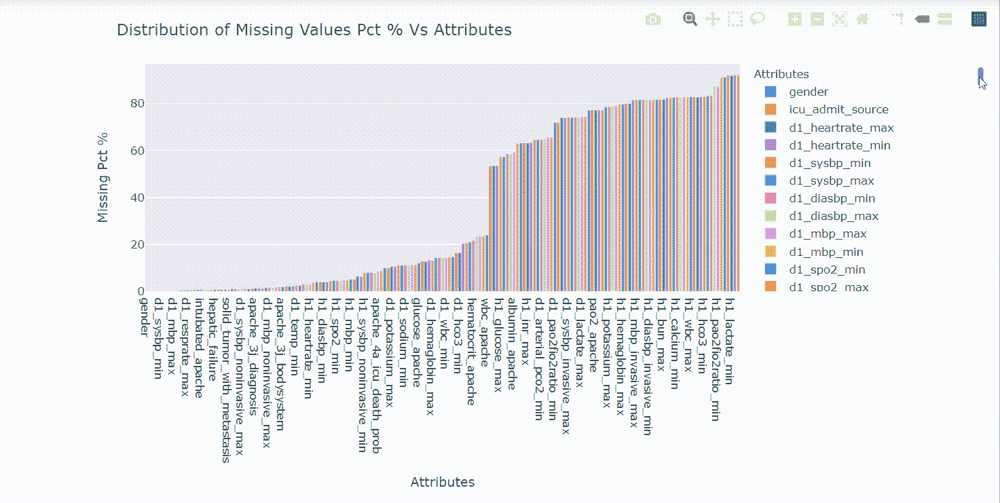

**里程碑# 2:注意隐式/ *伪装的*缺失值&不正确的数据值**

事实上，您也应该始终在数据集中寻找“伪装的”缺失值，以确保缺失值被正确编码为缺失值，更准确地说是 NaN。缺失值的几种伪装形式描述如下:

1.  ***范畴变量:名词性/序数串*** —空串/“未知数”/？”表示缺少的值

****很公平。****

> ****问题是，要识别隐藏的缺失值和潜在的损坏/不正确的数据，您几乎总是依赖于与您试图解决的问题的领域专家合作。在我们的例子中，领域专家是医疗从业者，但是由于它是一个 Kaggle 数据集，与领域专家合作的可能性是不存在的。但还是要注意一点！****
> 
> ****幸运的是，我们得到了数据文档，它本身并不详细，也没有指出数据问题，但是快速 EDA 和浏览文档向我揭示了许多关于隐藏的缺失值和可能不正确的数据的见解，这正是我接下来几分钟要关注的内容。****

## ****文档看起来是这样的:****

****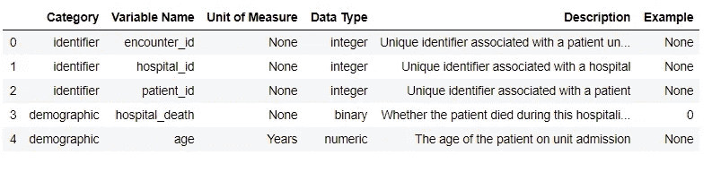****

****很明显，我们对每个属性 都有一个 ***【类别】。下面的图表总结了上述类别分布的信息:*******

****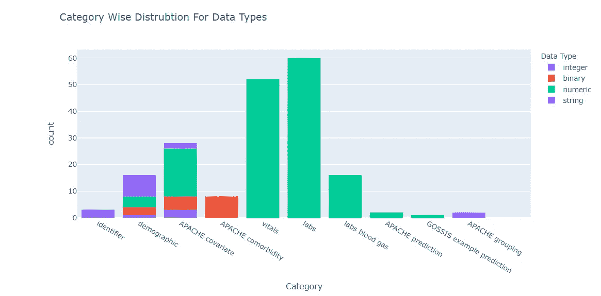****

****上面清楚地显示了什么特定的数据类型属于什么特定的类别。考虑到生命体征、实验室和实验室血气主要由数字变量组成，让我们首先关注它们。****

****探究这些变量是否由零值组成揭示了:****

****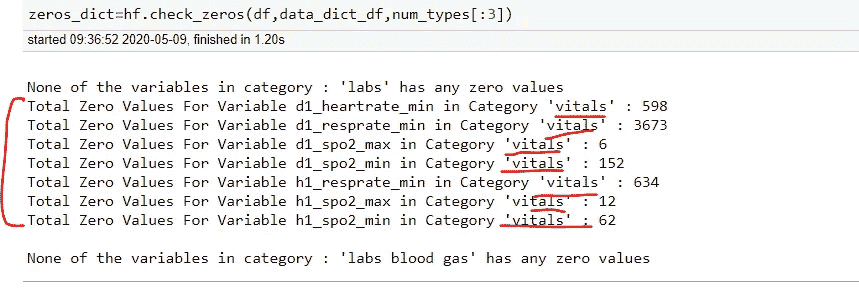****

****此外，通过对属于这三个类别的变量的描述，可以发现它们与人体内特定化学物质的存在有关，如果一个人活着，那么“0”表示有效值本身是没有意义的。这可以通过浏览这些变量的描述，由领域知识(如文档中提供的)进一步验证。例如，对于属于**生命体征类别的变量:******

****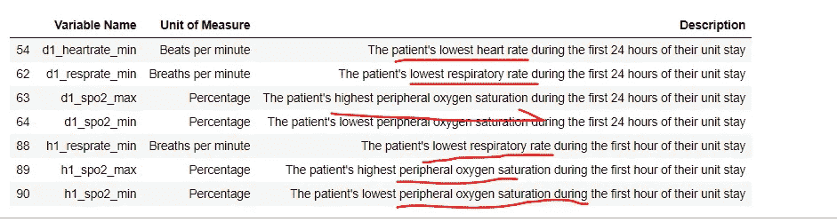****

****提供的数据符合患者之前的 24 小时，记录的值与患者死亡时间不完全一致。这引出了两个主要观点:****

1.  ****如果值为“0 ”,则患者不可能活着****
2.  ****反之亦然可能不是真的。例如，有可能患者已经死亡，但是*的“一些更低的”值可能存在。但是，这是一个假设，我们需要更多的 ed a 来验证这一点，如下所示:*****

*****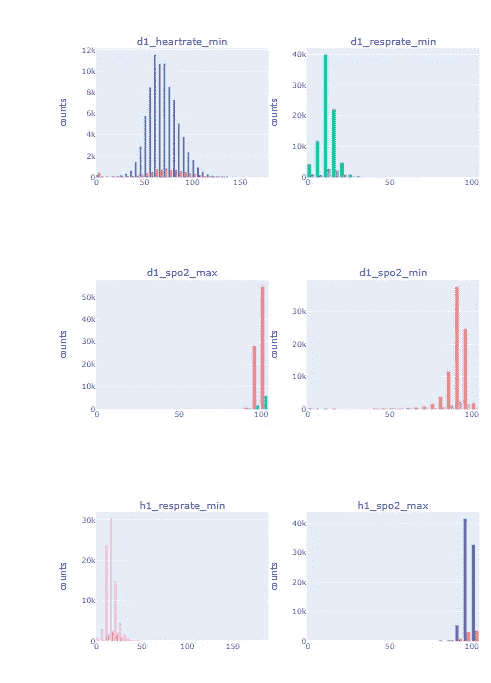*****

*****上述趋势分叉为医院死亡==1 和医院死亡==0，表明在“医院死亡”==1 的情况下有总体下降趋势。所以这确实支持了我们的第二个假设，即如果
医院 _ 死亡==1，一般会发现下降趋势。*****

*****接下来，对于我们的第一个假设，我们需要进一步放大精确“0”的值，我们可能会寻找“0”与检测为异常值的值的交集。这可以进一步验证我们的概念，即这些“0”实际上是丢失的值。*****

*****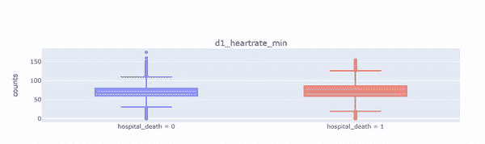*****

*****异常值分布*****

*****让我们来看看这些变量的异常值的一般分布*****

*****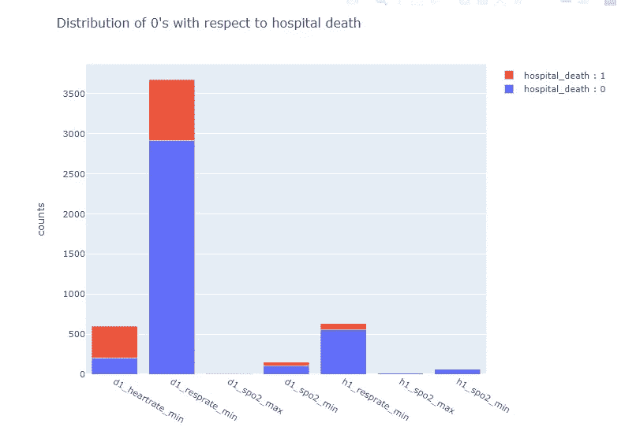*****

*****“0”在生命体征变量中的分布显示，***D1 _ heart rate _ min***&***D1 _ resprate _ min***具有大部分 0 值，而***D1 _ spo 2 _ min***&***h1 _ resprate _ min***具有相对较少的“0”。让我们绘制异常值分布。*****

*****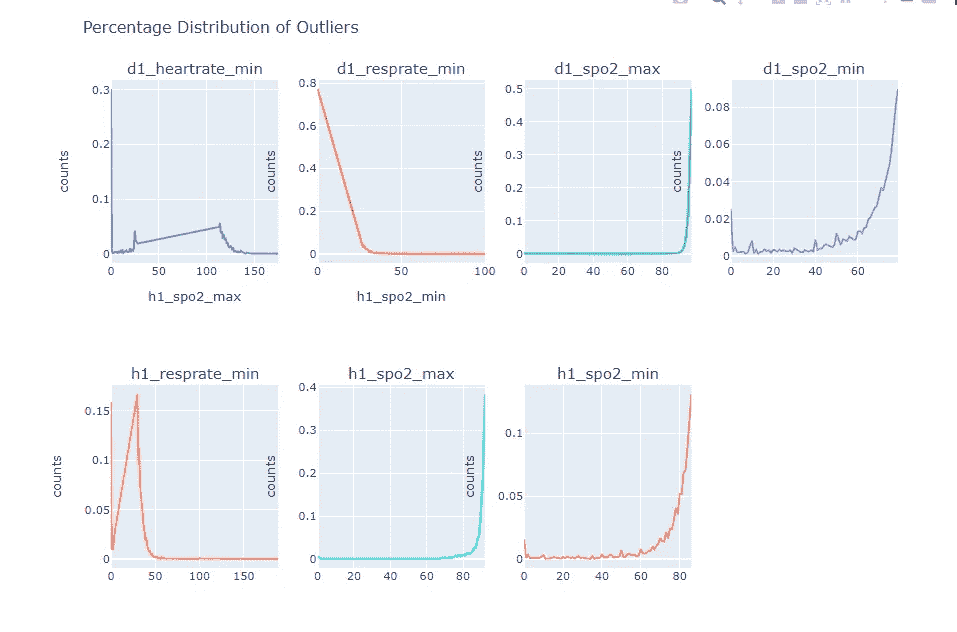*****

*****哇！因此，该图确实显示，对于具有相对较高数量的“0”的变量，作为异常值的“0”的数量也较高！我们可以通过明确检查所有这些“0”是否也是每个变量的总异常值集的一部分来进一步验证我们的想法，即“0”是缺失值。*****

*******将离群值的 0 分布与原始数据集中的 0 分布进行匹配:*******

*****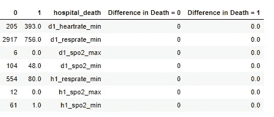*****

******“0”和“1”列对应的是 hospital_death==0 和 hospital_death==1。*原始数据集中的所有“0”都在异常值中找到并完全匹配！*****

*****所以到目前为止，我们已经收集了足够的证据来支持我们的论点，即对于生命体征类别的上述变量，0 的 ***最有可能是缺失值*** 。*****

> *****我们不是 100%确定托梁的概念，但同时，我们也不是绝对的盲点！*****

*****我想在这里提一下，这又是一个强调与领域专家合作的问题，如果这个问题是在现场处理的话，我们将有机会进一步验证我们的发现！*****

*****现在，通过将这些“0”编码为适当缺失的值***【nans】***，反映数据分布的变化总是一个好主意。*****

*****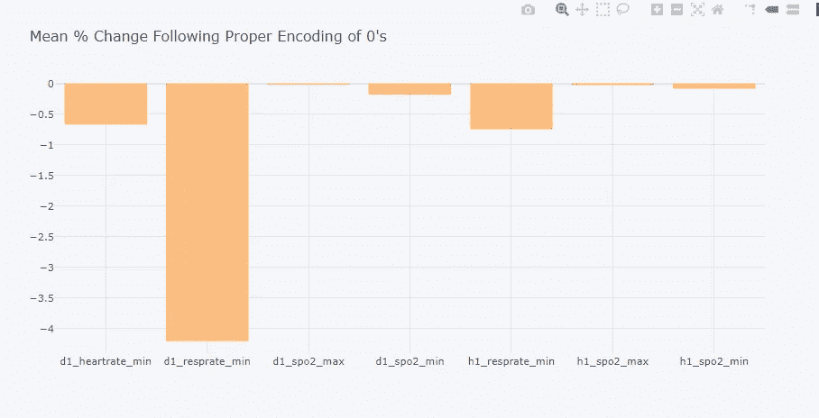*****

*****“平均值”的变化百分比*****

*****不出所料，由于 D1 _ heart rate _ min&***D1 _ resp rate _ min***的“0”数最多，因此它们被更改的次数最多。*****

# *******最后结束语……*******

1.  *****作为一名精明的数据科学家，您不断地与领域专家互动和协作！你将会向他们透露一些发现，另一方面，领域专家将会为你设定一个方向。它总是一个联合的努力。*****
2.  *****然而， ***您必须始终亲自检查数据完整性*** ，千万不要拘泥于您刚刚听到的 ***(就当它是潜在的进展)*** 因为在大多数情况下，公司本身也没有意识到潜在的数据问题，就像我们上面遇到的那些问题一样。*****

## *****即将发布的帖子将包括:*****

*****在这篇博文中，我们仅限于对生命体征变量的详细分析。在下一篇博文中，我们将转向其他类型的变量，并继续识别和修复其他数据问题。这很费时间，但最终，结果将是值得的！*****

*****敬请期待！📻*****

*****如果您有任何想法、意见或问题，欢迎在下面评论或联系📞跟我上 [**LinkedIn**](https://www.linkedin.com/in/aisha-javed/)*****

**********

*****照片由[马特·卡农](https://unsplash.com/@cannonmatt?utm_source=unsplash&utm_medium=referral&utm_content=creditCopyText)在 [Unsplash](https://unsplash.com/s/photos/victory?utm_source=unsplash&utm_medium=referral&utm_content=creditCopyText) 上拍摄*****