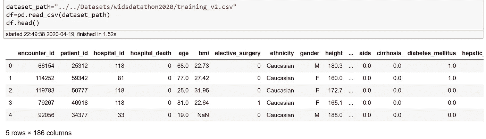
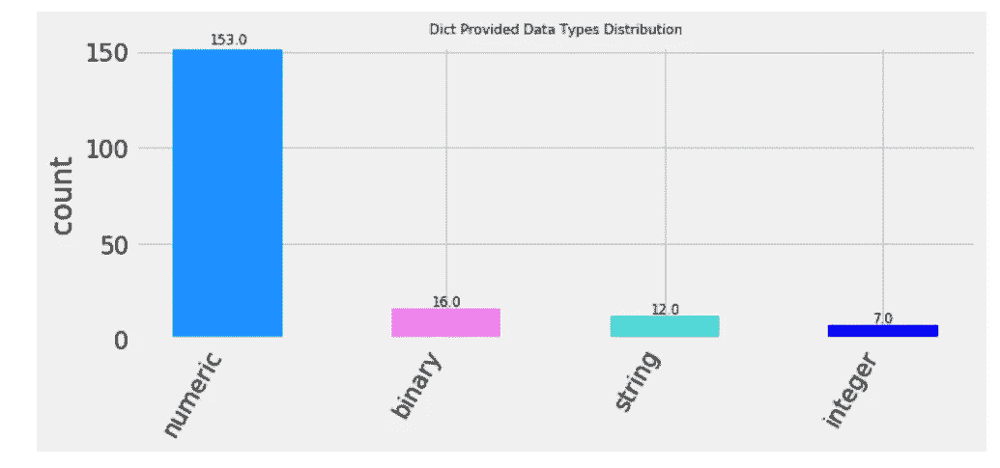
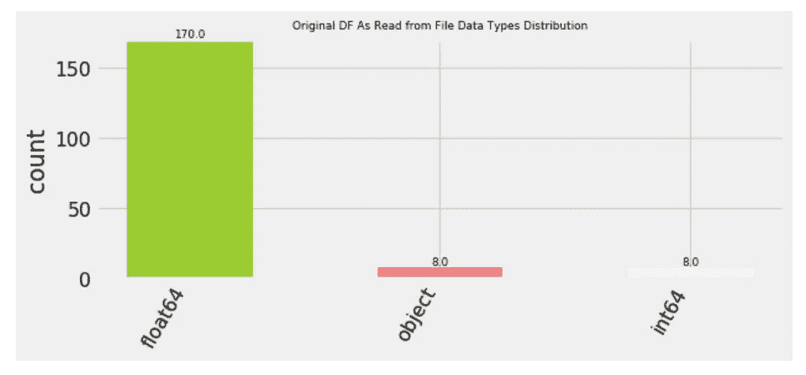

# 入侵数据科学管道！

> 原文：<https://towardsdatascience.com/hacking-the-data-science-pipeline-b1121996f4b5?source=collection_archive---------48----------------------->

## 特征工程系列

## 理解数据—参加#01


昆腾·德格拉夫在 [Unsplash](https://unsplash.com/s/photos/pipelines?utm_source=unsplash&utm_medium=referral&utm_content=creditCopyText) 上的照片

我们有 ***最先进的先进算法*** 来生成完全迷人的可视化效果，揭示数十亿美元的消费者购买模式，并利用大数据结合令人瞠目结舌的可扩展分析引擎来分析收入流。但是作为一名数据科学家，这一切都归结为一个切入点，特别是当步入行业时— ***“我从哪里开始一个数据科学项目！！!"***

# 这篇博文的目的

***揭开完整的数据科学项目管道……***

有大量的在线课程提供了训练通用机器机器学习模型的完整路径，从基本的机器学习算法到高度复杂的深度神经网络和强化学习。但是，从原始、混乱和不完整的真实世界数据集中破解建模特征的数据科学管道是最不可或缺的难题之一，没有它，为真实世界训练尖端机器学习模型的梦想仍然无法实现！


照片由 [Rodion Kutsaev](https://unsplash.com/@frostroomhead?utm_source=unsplash&utm_medium=referral&utm_content=creditCopyText) 在 [Unsplash](https://unsplash.com/s/photos/pipelines?utm_source=unsplash&utm_medium=referral&utm_content=creditCopyText) 上拍摄

# 目标受众是谁？

您应该在以下领域拥有扎实的专业知识:

1.  机器学习术语
2.  充分理解和深入实践基本的 ML 算法

如果您的工具包中有上述内容，并且您正在进一步寻找实践经验来展开从数据获取到构建特性集的特性工程过程，以提高您的 ML 模型的性能增益，那么这篇博客正是为您准备的！

# 本教程的结果

我们将通过最近在 [WiDS Datathon 2020](https://www.kaggle.com/c/widsdatathon2020?rvi=1) 举行的黑客马拉松的真实世界数据集的亲身体验，走过特征工程管道的早期阶段。

选择该数据集的原因如下:

1.  这不是练习 ML 算法的玩具数据集。事实上，这是一个真实世界的数据集，它需要有效的特征工程过程来训练一个良好性能的 ML 模型。
2.  有大量丢失的行和大量的数据问题，您在日常的数据科学项目中同样会遇到这些问题。
3.  完成工作后，您将开始欣赏特征工程的价值，以及为什么值得花时间玩数据集！

4.*挑战在于创建一个模型，使用从最初 24 小时的重症监护到* ***的数据来预测患者的存活率(标签:“医院 _ 死亡”)*** *。麻省理工学院的 GOSSIS community initiative 拥有哈佛隐私实验室的隐私认证，提供了超过 130，000 名医院重症监护病房(ICU)患者的数据集，时间跨度为一年。* [ [来源](https://www.kaggle.com/c/widsdatathon2020/overview) ]

5.关于挑战的详细描述可以在[这里](https://www.kaggle.com/c/widsdatathon2020)找到

# 如何跟进这个 BlogPost 项目演练？

我建议阅读并理解一般的思维过程，然后 ***在你自己选择的真实世界数据集***上调整这里定义的思维过程 *。*

# 说够了，让我们开始吧！


由[梅尔·巴兰德](https://unsplash.com/@mael_bld?utm_source=unsplash&utm_medium=referral&utm_content=creditCopyText)在 [Unsplash](https://unsplash.com/s/photos/diver?utm_source=unsplash&utm_medium=referral&utm_content=creditCopyText) 上拍摄的照片

# 定义路线图…..🚵

**里程碑# 1:特色工程&其不可或缺的价值！**

***然后:完成特征工程过程前期的项目走查***

**里程碑# 2:功能理解**

**里程碑# 3:功能改进**

**里程碑# 4:培训基线模型**

最后是结束语。

# **特色工程&其不可或缺的价值！**

**什么是特征工程？** 从原始数据中挖掘/建模/提取 ***特征的过程*** 。

**特征工程的目标？** 要素是嵌入基础数据模式的数据集属性，因此从原始数据属性中提取/建模要素意味着模型的高性能增益！

> **数据科学项目趣闻**:通常情况下，数据科学家将项目时间的 80%花在功能工程上，只有 20%花在训练前沿模型上。事实上，特征工程是任何数据科学项目中最有价值但最不被重视的部分。有效的特征工程付出了艰苦的努力，一旦你开始钻研真实世界的数据集，你将很快开始意识到它有价值的重要性！
> 
> 事实上，[这里有一个很好的解释来理解特征工程的重要性](https://whatsthebigdata.com/2016/05/01/data-scientists-spend-most-of-their-time-cleaning-data/)


来源:[https://whatshebigdata . com/2016/05/01/data-scientists-spend-the-most-time-cleaning-data/](https://whatsthebigdata.com/2016/05/01/data-scientists-spend-most-of-their-time-cleaning-data/)

> **特征工程过程早期阶段的项目走查**

# **里程碑# 2:特性理解**

特性理解侧重于 ***“理解您的数据”*** 我的意思是按照以下路线图仔细检查您的数据集(这不是每个数据科学项目的硬编码路线图！) :

> 你可以在这里找到完整的项目代码

**1。检查您的数据是结构化的还是非结构化的。对于这篇博文，我们将只处理结构化数据。**

**2。签出数据集的行和列。**



**3。计算描述性统计数据**


**4。确定给定数据集中的数据类型，并确定每个属性位于四个数据级别中的哪个级别**
将数据类型映射到分类和数值数据类型。此外，在数字数据类型的分类、区间和比率级别中寻找序数和名词。这将为你的 EDA 提供基础！你会在 [Github Repo Jupyter 笔记本](https://github.com/aishajv/Feature-Engineering-Series)中找到更全面的 EDA(为了这篇博文，让它简短一点)。此外，EDA 将贯穿任何数据科学项目的迭代，如本文后面所述。


# **里程碑# 3:功能改进**

## 数据清理

功能改进处理数据清理，只有在理解数据的基础上，您才能以合理的方式进一步清理数据集。

**更准确地说，数据清理处理:**

**根据数据类型和**识别缺失值，然后定义处理它们的策略。例如，字符串数据类型可以编码为空字符串作为缺失数据，而数字数据可以编码为 NaN 或简单的“0”来表示缺失值。此外，如果通过删除丢失的行，您只剩下一半的数据集或者大量的行被删除，则删除丢失的值不是明智之举。另一方面，缺失值的插补取决于哪种特定的插补策略能够最好地填补缺失值。

**缺失值的一些插补方法有:**

1.  通过均值、中值或众数替换缺失值。这同样取决于你对数据的理解。例如，对于名义数据类型，只有模式可能是填充缺失值的快速策略。但是对于序数和更高层次的数据属性，均值和中值也可能是值得探索的可行候选者。
2.  对于具有大量缺失值的属性，通过另一个训练好的模型来输入缺失值也可以是手边的策略之一。

在没有识别缺失值的情况下继续进行数据科学项目，会立即破坏您的结果，尤其是当您将使用聚合函数(更准确地说，是我们一直最喜欢的均值和计数)时，除此之外还有很多情况。趋势将完全相反，最后，你将回溯不正确的平均值，通过考虑“0”作为一个合法的变量值，而不是一个丢失的值。字符串值也是如此！空字符串值仍然会出现在计数函数中。为了避免这种情况，您应该将数字缺失值编码为适当的“NaN”和字符串，以表示其他一些缺失的标识符。

> 带走:要识别缺失值，首先要确保它们被正确编码为缺失值！然后，是丢弃缺失值还是对其进行插补，以及进一步选择插补标准，都取决于您手中的数据问题类型，以及在硬件资源和时间方面遇到的项目限制。

> ***足够的理论——映射到我们上面的问题陈述***

让我们针对数据集中的每一列检查缺失值的分布


该图清楚地显示了缺失值百分比从 0%到 90%的变化分布。哇！对于这个项目，这似乎是最大的数据问题之一，如果解决得当，也是最有回报的事情。

此外，dataset distributors 已经提供了一个完整的数据字典，需要对其进行详细的研究，以探索数据的进一步维度，最重要的是，缺失值是否可以用除 0 和空字符串之外的其他方式进行编码！

> 即使没有提供文档，我们仍然需要更深入地挖掘属性，以获得关于缺失值的见解。比如“身高”“bmi”等属性永远不能为零！如果对于这样的属性，存在零，这意味着我们的数据中缺少值！

> ***让我们检查在我们的数据集中有多少行至少有 1 个缺失值***


**整个 91688 数据集中只有 25 行有完整的值！**因此，放弃它们显然不是明智之举。似乎几乎每隔一行都有缺失值。让我们更深入地了解哪些列具有完整的行值。


因为我们不能删除缺少值的行，所以暂时让我们关注上面的列，因为我们的目标是训练一个基线模型。另外，还要注意有 4 个 id 列与预测没有关联，因此我们将删除它们。这样，在总共 185 个属性中，我们只剩下 6 个子集列(不包括标签列)。

# **里程碑# 3:培训基准模型**

# 探索特征子集

在这一点上，我们有 6 个特征的子集，没有很多缺失值。该功能集由以下数据属性组成:

```
**1\. elective_surgery
2\. icu_stay_type 
3\. icu_type
4\. pre_icu_los_days
5\. readmission_status
6\. apache_post_operative**
```

标签/预测变量

```
**hospital_death**
```

**数据类型分布的 EDA**

1.  **由数据分配器(即 WiDS)分配数据类型字典中提供的数据类型**



**2。当*从 *raw* csv 文件***中读取时分配数据类型



上面一个简单的 EDA 表明，相当多的二进制/布尔数据类型在被读取的文件中以 ***【数字】*** 数据类型结束。作为一名精明的数据科学家，对这些微小的细节保持警惕非常重要！

让我结合一个真实的生活场景。将二进制/布尔变量编码为数字似乎没有什么坏处，但是这会在内存中增加二进制/布尔变量，与浮点对象相比占用更少的字节！如果你的内存已经不足，那么这些被转换成浮点数的小的布尔字节将会聚集起来成为大字节，耗尽你的内存！再次强调——尽可能多地理解你的数据！

> 阅读数据附带的文档资源总是值得的。他们会让你对数据有敏锐的理解。例如，通过我阅读的文档，我可以相对容易地通过文档来确保提供的数据类型和编码的数据类型是相同的类型。
> 
> 此外，对于数字列，您可以通过文档解码，将丢失的值编码为“0”。在年龄、身高和 bmi 等变量中解码“0”很容易(因为我们已经有了领域知识)，但当我们自己的领域知识匮乏时，文档开辟了新的探索方式。
> 
> 例如，在给定的数据集中可能有几个其他属性可能有大量的缺失值，对于我这样一个没有医学背景的人来说，文档和与领域专家的合作讨论将提供更深层次的数据理解。
> 
> 事实上，与领域专家的密切合作也是精明的数据科学家从不同的看不见的维度分析数据从而提高性能的不可或缺的实践之一！


继续 EDA..
注意:下图对应于完全没有缺失值的数据类型/列，即左侧列出的列

**3。删除缺失值并选择 6 个特征的子集后，文件读取数据类型的数据类型分布显示**


**4。进一步挖掘上面的可视化——将文件读取数据类型进一步映射到 dict 提供的数据类型后的数据类型分布**


> *将 8 个整型变量中的 4 个分解为布尔数据类型。*


现在，我们已经固定了所有的固定数据类型，删除了 11 列中基于 ID 的列，剩下 7 列(包括标签列)。除了***pre _ ICU _ los _ days***之外，所有属性本质上都是范畴属性。

> 默认情况下，pd。DataFrame.describe()仅显示连续/数字变量的统计信息。还有，

**2。删除重复项！**

我们还需要根据特性集的 ***6 列来检查原始数据集中和所选数据集中的重复项。***


所以我们**最初有 91713 行，其中针对所选 6 个特性的唯一行仅构成 19438 行！**我想在这里强调两点非常重要:

1.  始终确保输入到模型中的数据集包含唯一的行！否则，你会毫无理由地增加计算时间，在现实世界中，时间已经是满足项目期限的紧迫资源。这也可能会降低性能。
2.  如果您注意到，6 个所选要素的总行数为 91713，即等于数据集本身的行数。但是，删除所选 6 个特性的重复项只会显示 19438 行！现在想象一下，如果我错过了这个复制步骤，并继续训练一个以“k”为重要超参数的 KNN 模型，这将会产生怎样的破坏性影响！该模型不仅计算时间长，而且从性能角度来看也很糟糕！
3.  在基于特征集删除重复项时，我保留了 drop_duplicated ***的 ***keep*** 参数“False”而不是“first”***


> ***保持=假的原因？***

使用 keep=first 会引入噪声！为什么？因为考虑到基于 6 个要素的数据框，相同的行可能会有不同的标注。所以我选择删除所有这些误导性的行(它们实际上并不误导，但基于 6 个特征，是的，它们是误导的)。如果您在这 6 个特性和标签的整个数据帧上调用 unique，您将得到 91713 行，但是如果我们打算只基于 6 列提供特性集，这是完全错误的(目前基线模型就是这种情况)

> 再次强调，这些看似微小的点将会对你的模型产生巨大的影响——小心！

另请注意，我们目前只从大约 20%的数据集学习基线模型！是的，我们很适合基线模型，但同时，这也揭示了:

1.  模型性能显然会很低，除非假设我们幸运地选择了仅包含特征(有价值的属性)的 6 个属性的子集！

> 关于以上这一点，在以后的迭代中，我们一点也没有盲点。通过属性/列与标签的相关性，可以洞察上述内容的有效性，并检查 6 个属性中是否包含相关性较高的重要列。此外，如果仅考虑 6 个属性的子集，标签的分布有显著变化，则数据的形状一定发生了变化，因此这也将导致低性能(更准确地说是数据不平衡)。
> 
> 当我们添加更多的列和更多的行(唯一的行)时，在以后的迭代中还有改进的空间。

# 相关矩阵


> #悟性—另一种见解！列 ***readmission_status 没有出现在相关矩阵中！*** 深挖其独特价值可见一斑:


对于所选的列和行的子集，它都是假的！因此，我们也将删除该列，因为它在提取模式或生成预测方面不起任何作用！


> **#savvy —简单的 EDA 和如此有价值的洞察力。再次一分钟的观察，但完全值得！**

## 训练基线模型

到目前为止，我们已经有了 5 列，我们可以开始训练基线模型了。请注意，我们有两个分类“字符串”变量/属性，在将数据输入训练模型之前，我们需要一些数值转换。为此，我们将在数据预处理管道中使用哑编码。

我们将使用 KNN 作为分类器。数据集的拆分、分类变量的虚拟化、缩放(Z 分数标准化)和“k”的网格搜索都已添加到数据预处理管道中(更准确地说是 sklearn 的管道组件)。

**fit&通过管道转换数据，调用 fit 显示:**


1.  训练行数:14578
2.  训练列数:12(列数从 5 增加到 12，因为在转换过程中为每个分类变量添加了(n-1)列，即哑编码)，其中 n 对应于每个分类字符串变量的唯一值的总数。另外，布尔分类变量没有经过任何虚拟编码或标准缩放的转换。
3.  到目前为止，最佳 k 值为 99，与以下候选值进行了交叉验证


## 测试基线模型


1.  测试行:4860
2.  测试列:12
3.  **ROC_AUC : 0.72 —(考虑到只使用了 20%的只有 5 列的数据集，这一点也不差)**

# **Kaggle 预测**

太好了！让我们预测 kaggle 测试集

## 值得一提的一点

值得检查的是**测试集的许多值实际上是如何存在的**以及**考虑到我们现在拥有的 5 列的特征子集，测试集有多少唯一值存在**


> #悟性—洞察力！因此，考虑到测试集只有 5 列，我们实际上预测的是 39308 行中的**9768 行，这只是 24%** ！此时**我们认为大多数测试集行是相同的，但事实并非如此，但**这也意味着模型性能(以及 Kaggle 提交)有很大的潜在增益空间。

## Kaggle 评分


# 得分率为 0.59035！这比排行榜上表现最差的型号要好😅

## 这是基线模型的简要概述


# 项目演练流程图

最后，这是我们到目前为止完成的整个过程的流程图


# **总结注释…**

## 培训基线模型的重要性

到目前为止，我们有一个很好的基线模型。基线模型作为性能增益的基准。我们继续将组件添加到我们的功能工程管道中，并将新获得的性能与基线模型中添加的每个组件进行比较，以评估我们在性能增益方面的进展。

## 毫无疑问——良好的软件工程实践是不可或缺的！！！

虽然，我没有在这篇博文中包含代码片段，但是你可以在我的 [Github Repo](https://github.com/aishajv/Feature-Engineering-Series) 中找到完整的项目代码。对于真实世界的数据科学项目，我们严格遵循 OOP 原则和管道方法。向管道方法添加新组件相当容易。随着更多东西的出现，你的代码将更容易重用、维护、调试并变得可扩展。这也意味着在后面的迭代中，您将有更多的时间花在问题本身上。

> ***如果你不信任我，拿任何 python 数据科学框架的源代码，你就能分析所有投入工作的软件工程原理！***

## 数据科学项目之美！

尽管任何数据科学项目都有标准的特征工程流程，但是每个数据集都有无限的创造力！你越深入研究特征工程，你就越被迫跳出框框思考，用你的数据分析问题，探索可能的解决方案，不仅是特征工程，也是 ML，并继续提升你的数据科学专业知识，乐趣永无止境！

即将发布的帖子将包括:

*   为特征工程管道 的下一阶段继续相同的 ***项目走查。***
*   ***AUC_ROC 为 0.59035***

敬请期待！📻

如果您有任何想法、意见或问题，欢迎在下面评论或联系📞与我一起上 [**LinkedIn**](https://www.linkedin.com/in/aisha-javed/)


照片由[马特·卡农](https://unsplash.com/@cannonmatt?utm_source=unsplash&utm_medium=referral&utm_content=creditCopyText)在 [Unsplash](https://unsplash.com/s/photos/victory?utm_source=unsplash&utm_medium=referral&utm_content=creditCopyText) 拍摄