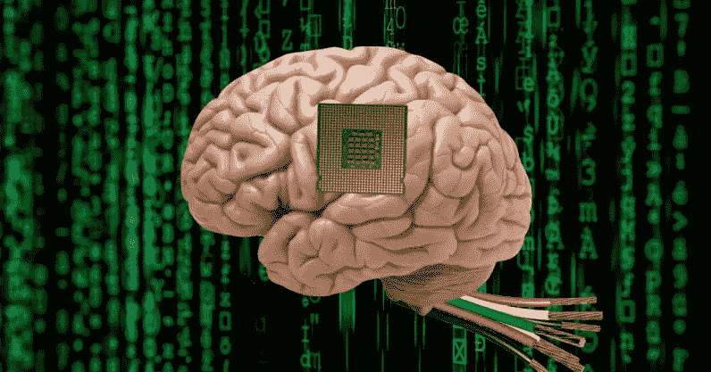
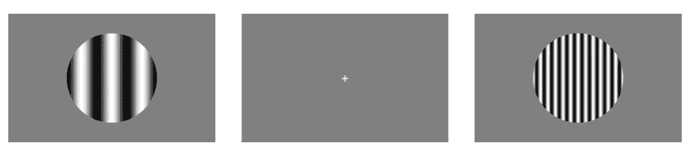
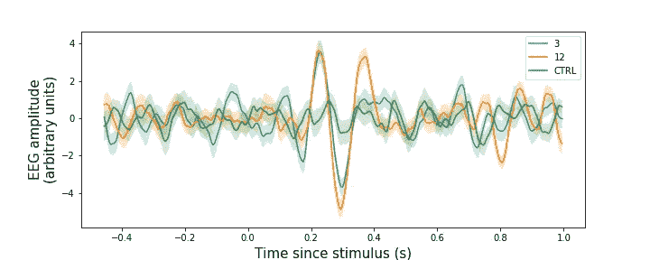

# 用 OpenBCI，Node.js 和 PsychoPy 来黑你的大脑

> 原文：<https://towardsdatascience.com/hacking-your-brain-with-openbci-and-psychopy-3c59b98e88ef?source=collection_archive---------28----------------------->

## 我如何使用 Python、Node.js 和 OpenBCI 硬件来准确读取我的大脑信号

*如最初出现在我的* [*个人博客*](http://falhazmi.com/blog/hacking-your-brain-with-openbci-and-psychopy/) *。*

我热爱编码，也研究大脑——为什么不同时解决这两个问题呢？在这篇文章中，我将向你展示如何利用代码和来自 OpenBCI 的令人惊叹的低成本硬件来操控你的大脑信号，从而破解你的大脑。我在 2014 年开始了我的神经科学之旅。从那以后，我一直想用现有的脑电图来探索大脑。这应该是每个认知神经科学学生和研究人员的必修实验室，因为它代表了探索许多神经科学问题的机会。反正最近才买了 [OpenBCI 芯片](https://shop.openbci.com/products/pre-order-ganglion-board?variant=13461804483)一直用到现在。在这篇博文中，我将报告我的第一次探索，这对于我未来关于#brain_hacking 之旅的帖子至关重要。

# 但是 BCI 怎么了？

这是一个合理的问题——我们为什么要关心与大脑的交流呢？有很多原因，我在这里将提到几个申请 BCI 希望他们会说服你。我想到的第一个应用是将 BCI 用于辅助和修复目的。具体来说，像耳蜗和视网膜植入物、假肢和深度大脑刺激技术这样的 BCI 工具正在帮助全世界数百万人。

恢复已经丧失的大脑功能是 BCI 技术背后最重要的动机之一。然而，还有许多其他的应用让大多数人兴奋，例如通过神经反馈增强大脑功能，使用思维的力量(独自)控制你最喜欢的设备或玩视频游戏，以及许多其他应用(如果你想查看可能应用的更广泛覆盖范围，请查看维基百科上令人惊叹的[脑机接口](https://en.wikipedia.org/wiki/Brain%E2%80%93computer_interface)条目)。

# P300

P300 是一种非常显著的神经活动，发生在看到受试者关心的东西的第一秒钟。它被用于许多创新的方式，如测谎和打字(仅用你的思想)，使它成为一种可行的工具，用于使瘫痪的病人能够用他们的思想交流。

## 试验设计

*实验设计:使用两幅不同空间频率的图像作为刺激。它们被呈现 0.5 秒，然后是 3 秒的试验间间隔。仅背景的第三条件(未示出)被用作控制条件。每个条件被呈现 50 次。*

我的实验设计非常简单。它们都包括随机展示不同的图像，同时记录枕部和颞区的脑电波。在这篇文章中，我使用了由多个以不同空间频率(或多或少的条)排列的黑条组成的光栅图像(见图)。这些图像在视觉研究中非常流行，原因超出了本文的范围。每个图像重复 50 次，产生 150 个图像呈现(空间频率为 3、12，没有图像)。每幅图像呈现半秒钟，随后是 3 秒钟的试验间隔(ITI ),其间呈现一个“+”符号。

## 结果

老实说，直到我看到这张图片，我才知道 [P300](https://en.wikipedia.org/wiki/P300_(neuroscience)) (该图片仅来自第一个通道，但在所有通道中都观察到了确切的模式)。这种积极的变化出现在我使用各种刺激类型进行的每个实验中(我将在以后的文章中探讨其中的一些)。请注意，控制条件没有显示任何偏转，而两个实验条件(显示实际图像)都显示了该模式。我没有预料到的是，第二个正斜坡仅在 400ms 左右出现在橙色部分(高频条)，而不是蓝色部分。这使得机器学习算法区分这两者变得容易得多。事实上，一个非常简单的逻辑回归分类器在区分这三个类别时达到了约 52%的准确率(在交叉验证设置中)。

*在 3 个不同图像期间的神经反应:蓝线是当看到具有 3 个条的光栅图像时神经反应的平均值，橙线是相同的，但是当看到具有 12 个条的光栅图像时，绿线是没有图像显示的控制条件。阴影区域是标准误差。请注意，当看到图像时有两个斜坡，而当看不到图像时没有斜坡。*

在这里，我展示了低成本的硬件(获得所有设备需要 322 美元)可以让你获得非常高质量的脑电图信号。事实上，OpenBCI 保存了一份在数据收集中使用 OpenBCI 的科学出版物的运行列表。我计划进行进一步的实验，并在这个博客中分享他们的结果。

最后，我要感谢 [OpenBCI 团队和社区](https://openbci.com/community/)做出的巨大努力，让神经科学和 BCI 的硬件和软件工具更容易为公众所用，还要感谢 [Neurotech@Berkeley](https://neurotech.berkeley.edu/) 团队提供的[令人惊叹的课程和软件](https://github.com/neurotech-berkeley/neurotech-course)，我曾用它们来做实验。

[查看我的 Github 库，获取本文使用的代码](https://github.com/fahd09/OpenBCI-visual-discrimination-exp)

**关于技术设置的更多细节**:我使用了从 OpenBCI 提供 4 个通道的神经节设备。这些通道附着于(大约)O1、O2、T1 和 T2(覆盖枕叶和颞区的两侧)。我使用 Node.js 连接芯片，并在 python 脚本中处理数据(通过实验室流层)，该脚本还将记录存储在文本文件中。[所有这些工具都改编自神经技术课程实验室](https://github.com/neurotech-berkeley/neurotech-course)。伴随着录音，我还使用了[心理](https://www.psychopy.org/)来设计和运行实验。