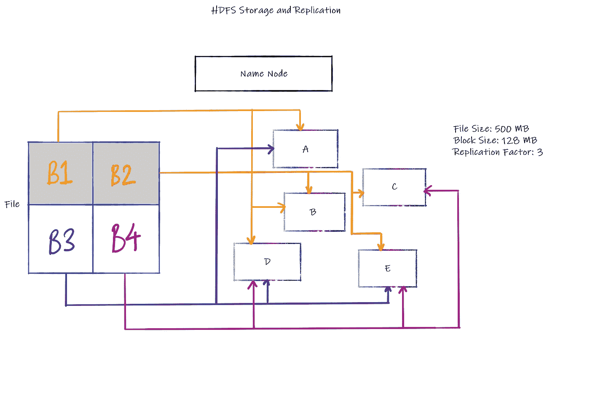
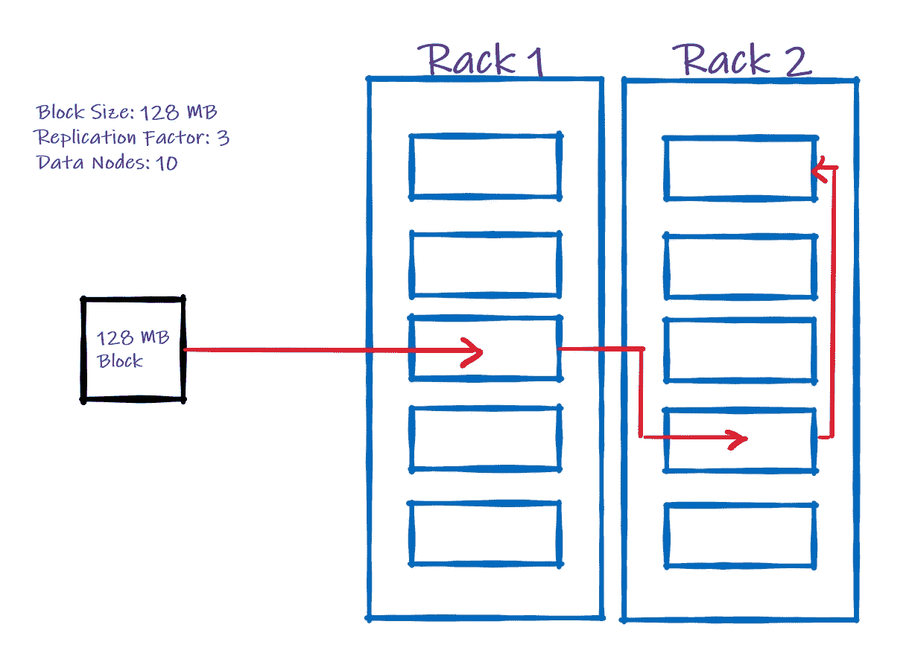
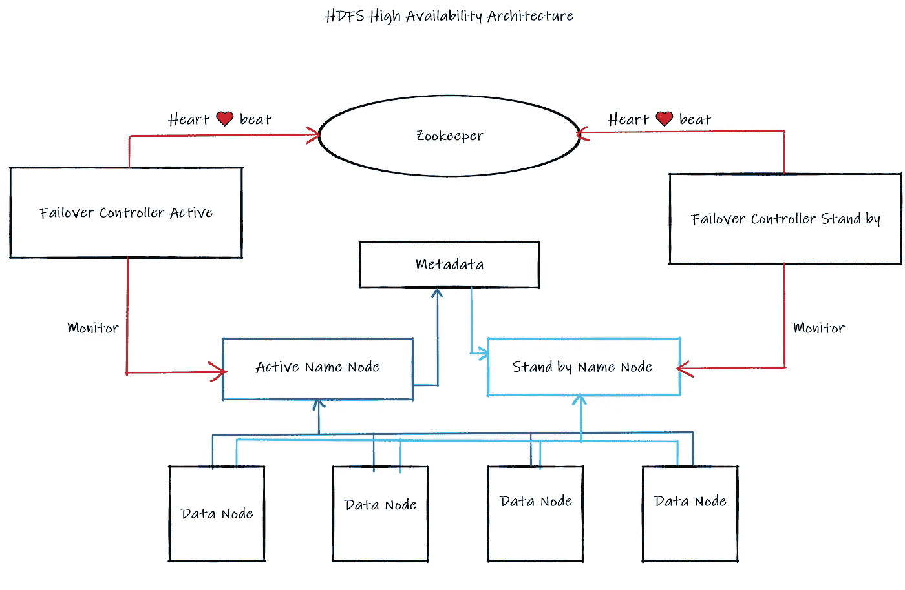
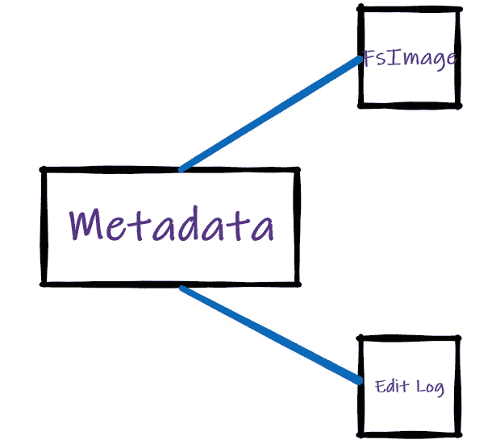
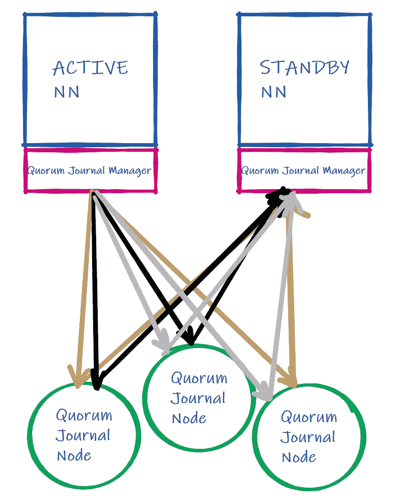

# Hadoop 分布式文件系统

> 原文：<https://towardsdatascience.com/hadoop-distributed-file-system-b09946738555?source=collection_archive---------25----------------------->

## 理解 HDFS 及其内部运作的综合指南

从计算的角度来看，基本上有两种类型的扩展—垂直和水平。在垂直扩展中，我们只是向单台计算机/机器(也称为“节点”)添加更多 RAM 和存储。在水平扩展中，我们添加更多通过公共网络连接的节点，从而增加系统的整体容量。记住这一点，让我们开始吧。

## **块大小**


文件分割成块

当一个文件被保存在 HDFS 时，文件被分割成更小的块，如上面的 GIF 图所示。块的数量取决于“块大小”。默认是 *128 MB* ，但是可以很容易地更改/配置。

在我们的示例中，一个 500 MB 的文件需要分成 128 MB 的块。 *500/128 = 3 块 128 MB 和 1 块 116 MB。*剩余的 12 MB 块空间被返回到名称节点，用于其他地方，从而防止任何浪费。任何文件系统都是如此，例如，Windows NTFS 的块大小在 4 KB 和 64 KB 之间，具体取决于文件大小(最大为 256 TB)。考虑到 Pb 及以上的大数据处理，KBs 会非常低效，可想而知。这就是 HDFS 块大小为 128 MB 的原因。

## **复制因子**


分身术

HDFS 是一个容错和弹性系统，这意味着它可以防止一个节点的故障影响整个系统的健康，并允许从故障中恢复。为了实现这一点，存储在 HDFS 中的数据会跨不同的节点自动复制。

复印了多少份？这个要看“复制因子”了。默认设置为 3，即 1 份原件和 2 份复印件。这也很容易配置。

在左侧的 GIF 中，我们看到一个文件被分成多个块，每个块都在其他数据节点上复制以实现冗余。

## 存储和复制架构



存储和复制架构

Hadoop 分布式文件系统(HDFS)遵循*主从*架构，其中“名称节点”为主节点，“数据节点”为从/工作节点。这仅仅意味着名称节点监视数据节点的健康和活动。数据节点是文件以块的形式实际存储的地方。

让我们继续上图中大小为 500 MB 的文件的相同示例。HDFS 的默认块大小为 128 MB，该文件分为 4 个块 B1-B4。请注意，A-E 是我们的数据节点。HDFS 的默认复制因子为 3，数据块在我们的 5 节点集群中复制。数据块 B1(黄色)在节点 A、B 和 D 之间复制，依此类推(遵循彩色线条)。
在这里，名称节点维护元数据，即关于数据的数据。*哪个文件的哪个块的哪个副本存储在哪个节点*维护在 NN 中—文件 xyz.csv 的块 B1 的副本 2 存储在节点 b 中。

因此，一个大小为 500 MB 的文件由于其复制，在 HDFS 需要 1500 MB 的总存储容量。这是从终端用户的角度抽象出来的，用户只能看到存储在 HDFS 的一个大小为 500 MB 的文件。

现在是动手的好时机:

[](https://medium.com/@prathamesh.nimkar/hdfs-commands-79dccfd721d7) [## HDFS 命令

### 常见的 HDFS 命令

medium.com](https://medium.com/@prathamesh.nimkar/hdfs-commands-79dccfd721d7) 

## 块复制算法



块复制算法

该算法首先在 HDFS 的默认配置文件夹下搜索 topology.map 文件。这个。映射文件包含有关其包含的所有可用机架和节点的元数据信息。在上图的示例中，我们有 2 个机架和 10 个数据节点。

一旦文件被划分为数据块，第一个数据块的第一个拷贝就被插入到离客户端(即终端用户)最近的机架和数据节点中。创建第一个数据块的副本，并通过 TCP/IP 将其移动到下一个可用机架(即机架 2)上，并存储在任何可用的数据节点中。在这里创建另一个拷贝，并通过 TCP/IP 等将其移动到下一个可用的机架上。但是，由于我们只有 2 个机架，该算法会在同一机架(即机架 2)上查找下一个可用的数据节点，并将第三个副本存储在那里。这种冗余性的存在使得即使一个机架出现故障，我们仍然有第二个机架来检索数据，从而实现容错和弹性。

## 高可用性架构

在 Hadoop 1.x 中，生态系统仅附带 1 个名称节点，导致单点故障。有一个*辅助或备份名称节点*，需要一个多小时的手动干预才能启动。随后，任何数据丢失都是不可恢复的。

在 Hadoop 2.x 中，提供了高可用性作为标准模式的替代方案。在标准模式下，您仍然有一个主要和次要的名称节点。在高可用性模式下，您有一个*主动和被动名称节点*。



数据节点向“活动”名称节点发送活动更新(至少每 5 秒一次—可配置)。此元数据实时同步到“袖手旁观”名称节点。因此，当“主动”服务器出现故障时，“袖手旁观”服务器拥有切换所需的所有元数据。

Zookeeper 通过其故障转移控制器，通过从每个 NN(每 5 秒，同样可配置)接收到的心跳或即时通知来监控活动和袖手旁观名称节点的健康状况。它还包含所有可用的袖手旁观名称节点的信息(Hadoop 3.x 允许多个袖手旁观名称节点)。

因此，建立了数据节点、名称节点和 zookeeper 之间的连接。当一个活动名称节点出现故障时，动物园管理员会选择一个合适的袖手旁观名称节点，并促进自动切换。袖手旁观成为新的活动名称节点，并向所有数据节点广播该选举。现在，数据节点会在几分钟内将其活动更新发送到新选出的活动名称节点。

## 什么是 NameNode 元数据？



NameNode 元数据

名称节点(NN)元数据由两个持久性文件组成，即 FsImage —名称空间和编辑日志—事务日志(插入、附加)

**名称空间& FsImage**

在每个文件系统中，都有一个到所需文件的路径— `On Windows: C:\Users\username\learning\BigData\namenode.txt and on Unix: /usr/username/learning/BigData/namenode.txt.` HDFS 遵循 Unix 的命名空间方式。此命名空间存储为 FsImage 的一部分。文件的每个细节，即谁、什么、何时等。也存储在 FsImage 快照中。为了一致性、持久性和安全性，FsImage 存储在磁盘上。

**编辑日志**

对所有文件的任何实时更改都会记录在“编辑日志”中。这些记录在内存(RAM)中，包含更改和相应文件/数据块的每个细节。

在 HDFS 启动时，从 FsImage 读取元数据，并将更改写入编辑日志。一旦在编辑日志中记录了当天的数据，它就会被刷新到 FsImage 中。这是两者协同工作的方式。

另外，FsImage 和编辑日志是不可读的。它们被二进制压缩(序列化)并存储在文件系统中。然而，出于调试目的，可以将其转换成 xml 格式，以便使用[离线图像查看器](https://hadoop.apache.org/docs/r1.2.1/hdfs_imageviewer.html)读取。

## NameNode 元数据如何同步？

正如您在“HDFS 高可用性架构”图像中所想象或看到的那样，名称节点元数据是一个单点故障，因此此元数据被复制以引入冗余并实现高可用性(HA)。

**共享存储**


共享存储同步

我们现在知道存在一个活动名称节点和一个备用名称节点。*活动*中的任何更改都会实时同步到共享文件夹/存储器，即网络文件系统(NFS)。此 NFS 可由备用服务器*访问，备用服务器*实时下载所有相关的增量信息，以保持命名节点之间的同步。因此，如果活动*节点*出现故障，备用*节点*名称节点已经拥有所有相关信息，可以在故障切换后继续“照常工作”。这不用于生产环境。

**仲裁日志节点(QJN)**



QJN 同步

“法定人数”是指促成一项活动所需的最低人数。这个词通常用于政治；这是众议院进行议事所需的最低代表人数。

这里，我们使用这个概念来确定建立多数和维护元数据同步所需的最小日志节点数(也称为仲裁数)。

该图显示了三个(总是奇数)日志节点(进程线程**而不是**物理节点),它们有助于建立元数据同步。当一个活跃的神经网络收到一个变化，它把它推到大多数 QJ 节点(遵循单一的颜色)。备用 NN 实时地向多数 QJ 节点请求建立同步所需的元数据。

QJN 起作用的最小数目是 3，法定人数/多数由以下公式确定:

```
**Q = (N+1)/2**
where N = total number of Journal Nodes 
For example, if we have N=5, the quorum/majority would be established by (5+1)/2 i.e. 3\. The metadata change would be written to 3 journal nodes.
```

QJN 是元数据同步的首选生产方法，因为它也是“高度可用的”。如果任何一个 QJ 节点出现故障，任何剩余的节点都可以提供维护元数据同步所需的数据。因此，*备用服务器*已经拥有了所有相关信息，可以在故障转移后继续“照常工作”。

这就把我们带到了我关于 HDFS 及其内部运作的综合指南的结尾。

参考资料:

[1] [HDFS 架构](https://hadoop.apache.org/docs/current/hadoop-project-dist/hadoop-hdfs/HdfsDesign.html) (2019)，Apache Hadoop，ASF

[2] [管理 HDFS](https://docs.cloudera.com/documentation/enterprise/6/6.3/topics/admin_hdfs_config.html) ，云时代

[](https://medium.com/@prathamesh.nimkar/cloudera-manager-on-google-cloud-3da9b4d64d74) [## Google Cloud 上的 Cloudera 管理器

### 通过 GCP 上的 CM 6.3.1 逐步安装 Hadoop 生态系统

medium.com](https://medium.com/@prathamesh.nimkar/cloudera-manager-on-google-cloud-3da9b4d64d74) [](/simplifying-hdfs-erasure-coding-9d9588975113) [## HDFS 擦除编码

### 通过利用擦除编码，显著降低 HDFS 集群的存储开销

towardsdatascience.com](/simplifying-hdfs-erasure-coding-9d9588975113) [](https://medium.com/@prathamesh.nimkar/big-data-analytics-using-the-hadoop-ecosystem-411d629084d3) [## 使用 Hadoop 生态系统的大数据分析渠道

### 登录页面

medium.com](https://medium.com/@prathamesh.nimkar/big-data-analytics-using-the-hadoop-ecosystem-411d629084d3)