# 第 1/3 部分——预测我的半程马拉松完成时间，误差小于 45 秒。

> 原文：<https://towardsdatascience.com/half-marathon-finish-time-prediction-part-1-5807760033eb?source=collection_archive---------35----------------------->

## 跑步的机器学习-数据分析与介绍。

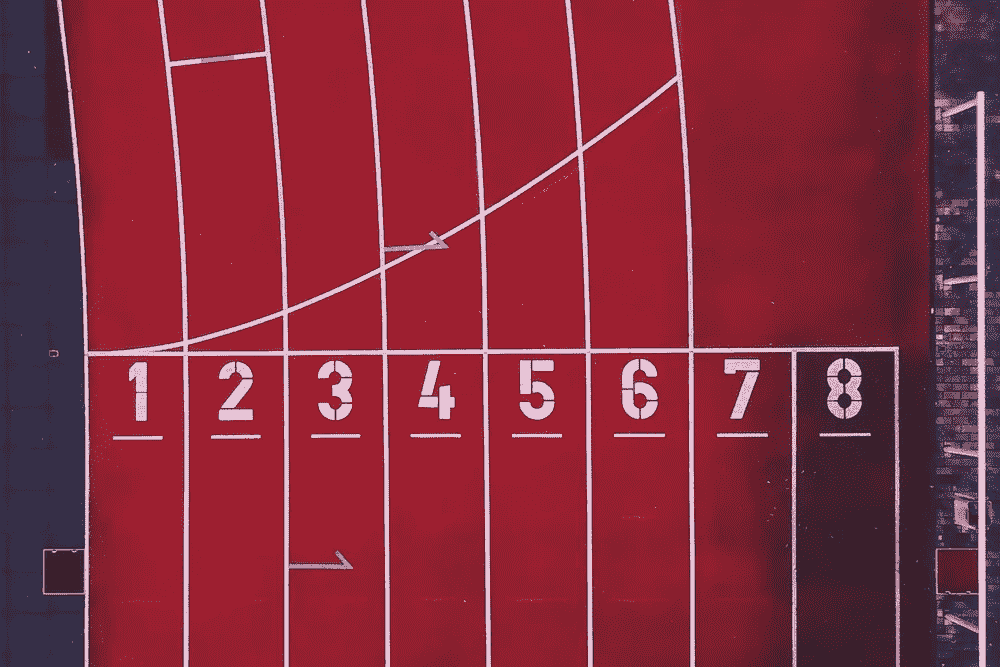

图片由 Marvin Ronsdrof 拍摄

哥德堡马拉松是世界上最大的半程马拉松。2019 年 5 月，比赛庆祝了 40 周年，吸引了超过 50，0 00 名选手和 200，00 0 名观众。

作为一名观众，你可以跟踪一份跑步者名单，看看他们在比赛中是如何进步的。这是可能的，因为跑步者每隔 5 公里就要经过跑道上的检查站。当你看不到你的朋友时，这是一种保持联系的有趣方式。您还将看到跑步者的预计完成时间，这是基于他们目前的平均配速。

结束时间预测是如此的基础和不准确，这一直困扰着我。它忽略了比赛的海拔曲线等因素，以及大多数跑步者在比赛中越跑越累的事实。它也无法在比赛开始前估计你的完成时间。

我们将在这个博客系列中解决这个问题，分为三个部分:

*   **第一部分—数据分析**(你在这里)
    *仅仅从不同角度看数据，我们能学到什么？*
*   [**Part 2 —狂妄分析**](https://medium.com/@ohandmark/predicting-my-half-marathon-finish-time-with-less-than-45-seconds-error-part-two-9cf6bb930e79)*什么年龄和性别的群体最高估自己的能力？这一部分还包括一些特征工程，这些特征工程将在第 3 部分中涉及的预测模型中发挥巨大作用。*
*   [**第三部分——跑步者完成时间预测**](https://medium.com/@ohandmark/part-3-3-predicting-my-half-marathon-finish-time-with-less-than-45-seconds-error-9d43d6fadf01)*我们能在比赛前和比赛中多好地预测跑步者的完成时间？*

# 这场比赛

哥德堡是围绕哥德堡市中心的半程马拉松。与大城市的其他半程马拉松相比，它的海拔曲线颇具挑战性。如果我们使用谷歌地图的海拔数据，我们可以绘制出比赛的海拔。谷歌高程数据的一个缺点是，它完全基于地球表面，如下所示:

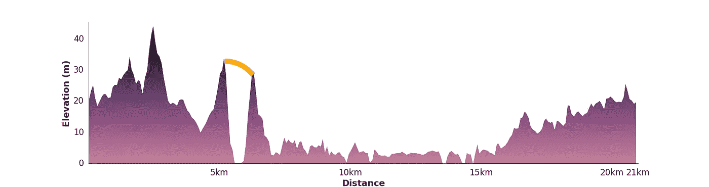

比赛高度——是的，那条橙色的线是一座桥。

# 数据集

为了帮助回答上述问题，我们有一个由 **~39000** 个跑步者组成的表格数据集(每行一个——仅包括实际开始的跑步者)。35%的参赛者是女性(13600 人)。它只包括 2019 年的数据，这是一个苛刻的限制。如果我们有过去 20 年左右的历史数据，我们可以做得更多。

虽然有一些跑步者来自世界各地，但大多数来自瑞典和中欧:

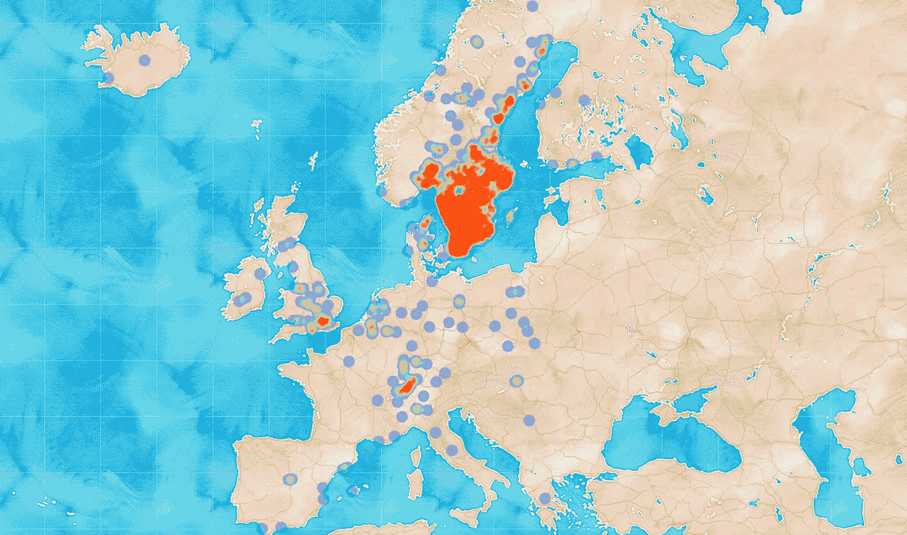

*跑步者家乡的热图，经纬度映射到他们所代表的城市。*

除了国籍和家乡(由每位跑步者在注册时声明)，我们还有以下信息:

**一般信息**

*   年龄
*   性别
*   起始号码
*   开始组
*   公司

**每位跑步者的关卡时间:**

*   5 公里
*   10 公里
*   15 公里
*   20 公里
*   终点(21 公里)

我们会对这些数据做很多不同的折叠来理解它。可视化数据集让我们对跑步者群体有了很好的了解——这将有助于我们在第 3 部分中为机器学习模型设计功能。

让我们更好地了解我们的跑步者:

## 按性别划分的完成时间分布

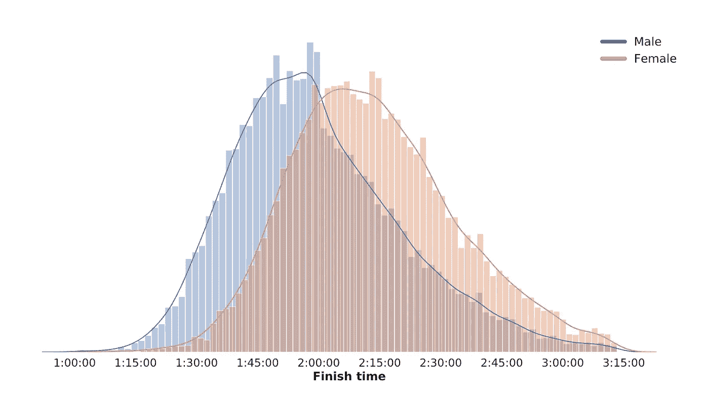

*男性和女性的完成时间都遵循正态分布。*

## 年龄分布

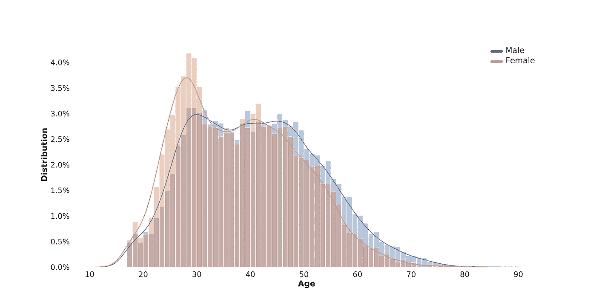

*25-30 岁的女性对这一比赛的兴趣增加，30 多岁时兴趣减少，40 出头时强势回归。*

年龄分布非常有趣，因为没有一条曲线(男性或女性)属于正态分布。人们可能会写文章解释为什么我们看到 30-40 岁的跑步者突然减少，但我简单的猜测是因为孩子和家人花了更多的时间。还需要指出的是，25-29 岁的人比其他任何年龄的人都要多一点(来自瑞典年龄结构的统计数据)。我们看到男性也有类似的双峰曲线，与女性相比，第一个峰值较小。

因为年龄分布不遵循正态分布，我们可以通过使用[内核密度估计值](https://mathisonian.github.io/kde/)绘制年龄分布与完成时间的关系图，从我们的数据中获得进一步的见解，以查看组出现的位置:

## 完成时间与年龄密度

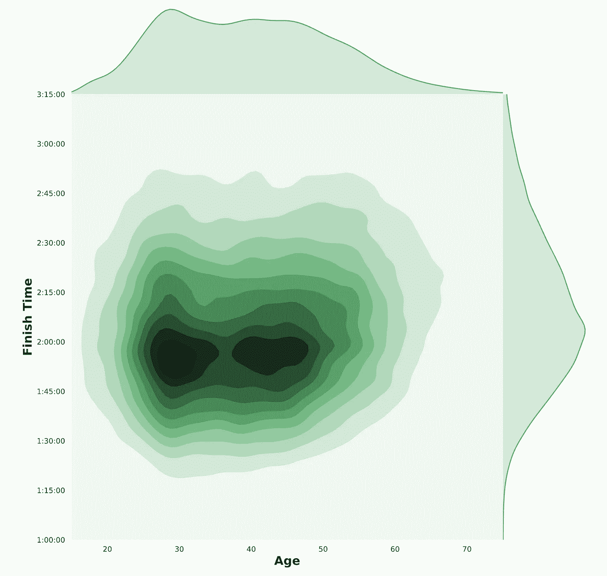

*在考察年龄与完成时间时，有两种不同的“典型跑步者”场景——30 岁的人跑了不到两个小时，40 岁出头的人跑了差不多同样的时间。*

让我们以稍微不同的方式绘制年龄与完成时间的关系图，看看我们是否能学到更多东西:

## 按年龄组的完成时间分布

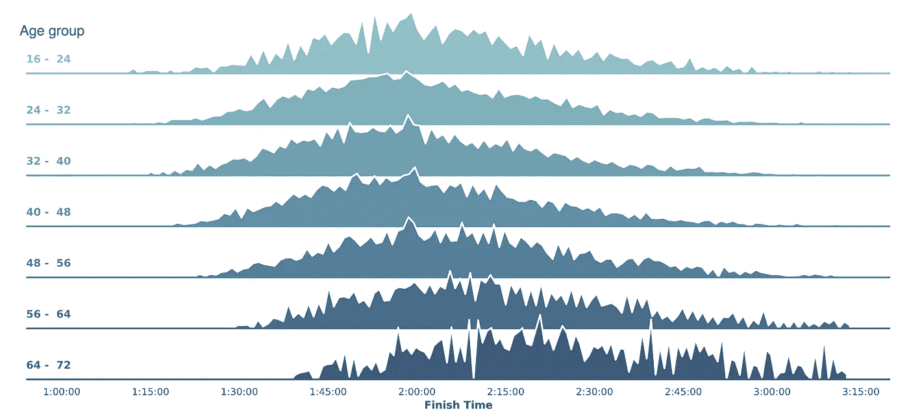

*按年龄组显示完成时间的山脊图。在 48 岁以上的年龄组，我们可以看到完成时间的变化(脊线随着其密度向右移动)。*

我们可以观察到年轻跑步者和老年跑步者的最大差距，平均完成时间约为两小时。令人鼓舞的是，32-48 岁的跑步者并没有明显慢于年轻跑步者。如果你仔细观察上图中每个年龄组在两个小时左右的峰值，你会看到心理学的最佳状态。

让我们仔细看看 2 小时左右的结束时间。

## 2:00:00 左右每次完成时间的跑步人数

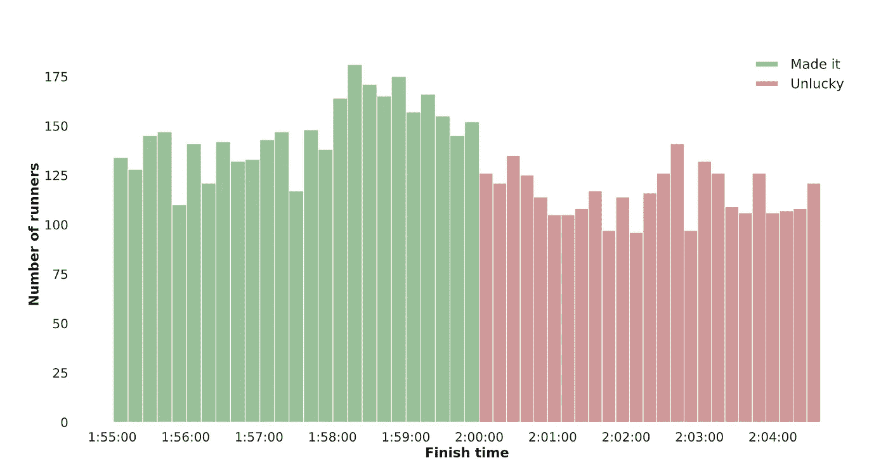

*进一步调查先前地块中的主要峰值。12 秒钟。两个小时的标记无疑激励了跑步者。*

两小时前后的正负两分钟，在分布上似乎有显著的差异。仅使用从 1:58:00 到 2:02:00 的数据，刚刚成功的跑步者的百分比大约为 **57%** (将每一边相加，然后将左边除以总数——使用桶围绕中心加减两分钟)。

使用这种测量方法，让我们看看哪个结束时间这种心理效应最强。我们不使用固定的 4 分钟窗口，而是通过使用 4 分钟窗口作为两小时里程碑的基础，将窗口大小标准化为里程碑时间(这算出约为 3%)。

## 不同完成时间的心理效应

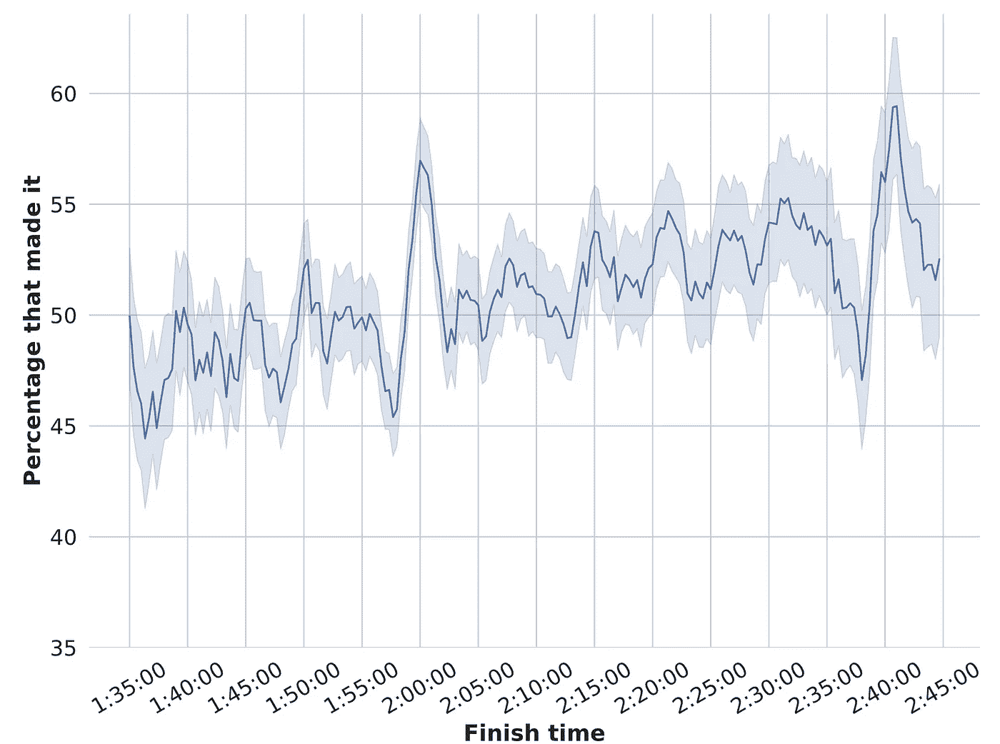

*对于 x 轴上的每个值，我们使用 x 轴值周围 3%的窗口来测量低于完成时间的跑步者的百分比(y 值)。*

我们可以看到，这种影响在 5 分钟和 10 分钟左右最强。这是因为人们倾向于在偶数时间设定目标，比如 2:00:00。

图中的趋势是成功率随着完成时间的增加而增加，这意味着当我们达到更慢的完成时间时，成功的平均百分比会慢慢增加。这很有道理。如果我们要画一条趋势线，我们会看到它在 2:05:00 左右突破 50%(这也是所有跑步者的平均时间)。

另一个有趣的观察是在里程碑之间有看似随机的峰值。比如看一下 2:07:00。这是跑步者设定配速目标而不是完成时间目标的结果。全程以每公里 6 分钟的速度跑步，你的总完成时间是 2:06:35。

这个情节并不意味着跑得慢的人更擅长完成目标，或者跑得快的人不太关心他们的目标。因为完成时间遵循正态分布，自然有更多的人在窗口的较慢一侧完成(因为完成时间比平均值快)。例如，遵循正态分布，您更有可能在 1:35:00 到 1:36:00 之间找到跑步者，而不是在 1:34:00 到 1:35:00 之间。同样，你在 2:44:00 到 2:45:00 之间找到跑步者的可能性比在 2:45:00 到 2:46:00 之间找到跑步者的可能性更大。请记住这一点，我们看同样的情节，但按男女分组:

## 不同完成时间的心理效应，按性别

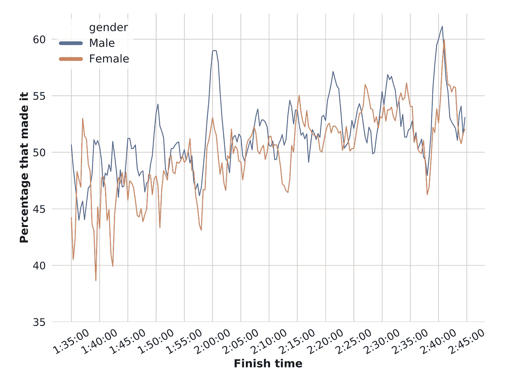

*对于 x 轴上的每个值，我们使用 x 值周围 3%的窗口来测量跑者在完成时间内的百分比(y 值)。这种心理影响对两性都存在，但似乎在时间对男性和女性的重要性上略有不同。*

很难从这个情节中得出进一步的结论。因为我们可以观察到男性和女性都有明显的峰值，所以这种心理效应对两种性别都存在。对于女性来说，两小时的峰值没有男性高，但这可能是因为她们遵循不同的正态分布，并且女性设定的其他目标更接近她们的平均完成时间。比如 2:40:00 左右效果好像差不多。

一种想法是将所有数据相对于它们的平均值进行归一化，以消除性别之间的绝对时间差异——然而，这种方法的主要缺点是失去了偶数里程碑时间的效果，因为所有的完成时间都会略有偏移。

我们可以天真地说，男人比女人设定更多的目标，甚至说男人更擅长实现他们的目标。然而，也可能是女性设定了更严格的目标，或者没有设定同样多的目标，或者是男性故意跑得更慢以达到他们的目标——我们不知道。我们将不得不参考其他的研究来找出更多的信息，以及男性和女性在设定和实现目标的方式上是否存在差异。

我们可以做的是浏览这些数据，并找出男性和女性是否倾向于设定完成时间的具体目标，或速度的具体目标。当我这样做时，我没有发现统计上的显著差异。

下面是一个类似的图，但显示了每个年龄组的影响，在 2 小时左右的 10 分钟标记处:

## 10 分钟里程碑对不同年龄组的心理影响

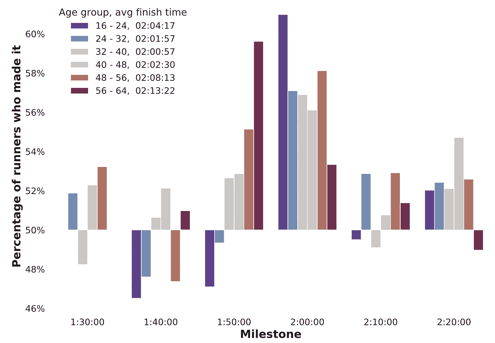

*对于不同的年龄组和每个里程碑周围的小窗口(里程碑时间的 3%)，跑得刚好在时间之下和刚好在时间之上的跑步者的百分比是多少？图例显示每个年龄组的平均完成时间。*

我们可以看到，尽管平均完成时间(02:04:17)比其他 3 组慢，但 16-24 岁的人在 2 小时里程碑附近的成功率最高。然而，当谈到打破 1:50:00 大关时，年龄似乎很重要——在这个里程碑，56-64 岁年龄组完全主导了年轻选手。在这个博客系列的第 2 部分中，我们将会得到一些可能导致这种情况的想法。

我们已经研究了跑步者的一些，但不是全部(起跑组、配速)特性。这有助于我们理解它们。但是是什么造就了一个跑得快的人呢？区分跑得快的人和跑得慢的人的标准是什么？光看别人的数据我们能学到什么？

有些事情你可以改变，但你不能改变自己——例如，你不能变得更年轻，你不能改变性别(嗯…)，你不能改变你的身体特征成为埃塞俄比亚人。

那么你能改变什么呢？准备是关键，一个好的建议显然是在比赛前进行更多的训练，并提高你的技术。如果我们通过观察北欧人口的平均值得出结论，你应该搬到库拉维克或奥斯陆。但是搬到另一个城市不会让你跑得更快，至少不会马上。相反，我们将查看检查点的数据，看看你是否可以对整场比赛中自己调整速度的方式做些什么。这将在第 2 部分继续。让我用这个情节来逗逗你。

## 速度变化——完成时间与年龄

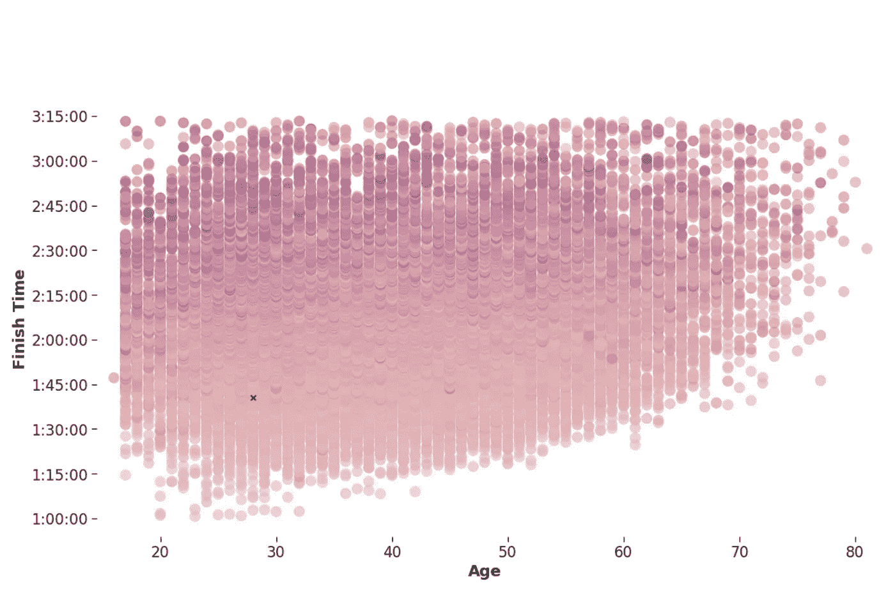

*为每位跑步者单独计算的五个不同检查点的跑步配速标准偏差。越暗意味着速度越不均衡。每个跑步者一圈。*

继续阅读:

*   **第一部分——数据分析**(你在这里)
*   [**第二部分——狂妄分析**](/predicting-my-half-marathon-finish-time-with-less-than-45-seconds-error-part-two-9cf6bb930e79)
*   [**第三部分——跑步者完成时间预测**](https://medium.com/@ohandmark/part-3-3-predicting-my-half-marathon-finish-time-with-less-than-45-seconds-error-9d43d6fadf01)