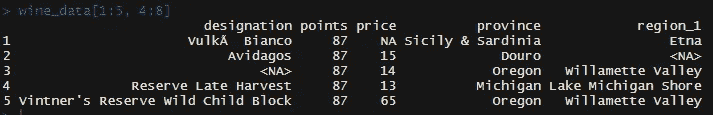
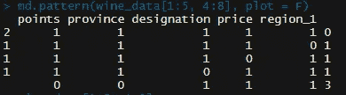
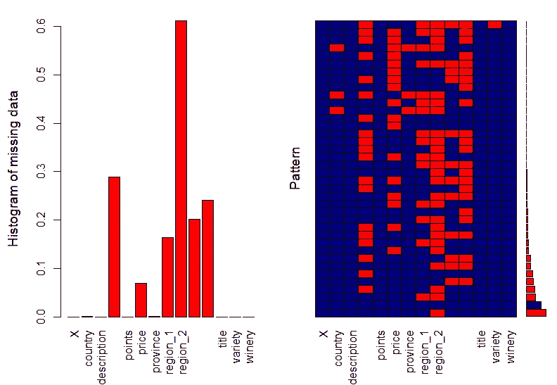

# 用 R: 10 日常习惯用法处理缺失数据

> 原文：<https://towardsdatascience.com/handle-missing-data-with-r-10-daily-used-idioms-13d849d01690?source=collection_archive---------47----------------------->

## r 提示

## 你应该把命令自动化


照片由[马特·阿特兹](https://unsplash.com/@mattartz?utm_source=medium&utm_medium=referral)在 [Unsplash](https://unsplash.com?utm_source=medium&utm_medium=referral) 上拍摄

数据清理是数据分析过程中最耗时的阶段之一。它的许多步骤包括熟悉数据集、搜索缺失值、插补或删除缺失值，以及可能对不同变量或其组合的相同代码行进行大量重复。因此，我们必须寻找并接受任何加快进程的可能性。

不久前，我提交了一篇关于针对数据集中缺失值的简短 Python 习惯用法的文章。今天，我准备了类似的脚本汇编，但在 R 语言。此外，我们将再次使用 Kaggle 的[葡萄酒评论数据集](/7-idioms-to-acquire-missing-values-every-data-scientist-should-know-2edf4224360c)。

## 0.使用 NAs 打开数据集

是的，R 中的向量从 1 开始，但是在处理缺失值之前，我们应该有一个包含缺失值的数据集。有时，空记录会被替换字符串填充，如空格(`“ “`)、`“empty”`、`“nan”`或一些垃圾。为了开始这项工作，我们应该用“真实的”`NA`值来代替它们。幸运的是，我们可以在数据集开放阶段做到这一点:

```
wine_data <- read.csv(‘winemag-data-130k-v2.csv’,
                       **na.string** = c(‘’, ‘i’, ‘P’))
```

`na.string`接受替代值的向量。

## 1.有没有完全缺失的值？

开始时，我们需要检查缺失值的存在。我们有`is.na()`用于这些目的。它接收数据并返回一个布尔向量。

*   检查是否缺少单个值:
    `is.na(wine_data$region_1[2])`
*   获取某些列中缺少元素的行:
    `wine_data[is.na(wine_data$country),]`
*   检查一列中是否有缺失值:
    `all(!is.na(wine_data$points))`
*   检查一列中是否有缺失值:
    `any(is.na(wine_data$country))`

## 2.检查缺失值存在的最短方法

以前的脚本需要一些关于数据集的知识和对独立元素的访问。但是如果我们想看到全貌呢？答案是`na.fail()`功能。如果整个数据中有任何缺失值，它将引发异常:

```
na.fail(wine_data)
```

## 3.了解整体情况

有一个特殊的函数，替代了一堆过滤器和索引。它主要用于数据框，可用于显示所有缺失值的行(在任何列中):`complete.cases()`。它返回一个布尔向量，非常方便索引。

*   获取缺失数据的行数
    `sum(!complete.cases(wine_data))`
*   获取有缺失数据的行
    `wine_data[!complete.cases(wine_data), ]`

## 4.更实用的命令

所有以前的脚本主要用于探索性任务:展示、获取等..但是如果我们需要得到缺失值的索引呢？在这种情况下，我们应该使用`which()`功能:

```
which(is.na(wine_data$country))
#returns indexes of rows with missing data
```

## 5.NA 值的高级使用

看来，`NA`价值观存在的唯一目的就是被清除。不过，我们可能会在一些非常有趣的组合中使用它们。例如，我们有一个混合数据向量:

```
test_vec <- c( 'ten', '5', 'n', '25', '10')
```

我们希望将“可转换”的字符串(如`‘5’`或`‘25’`)与其他字符串分开。我们可以和`is.na()`功能一起做:

```
test_vec[!is.na(as.numeric(test_vec))]
# returns ( '5', '25', '10' )
```

## 6.跳过 NAs 进行计算

`NAs`存在有一些副作用——它把几乎任何操作的结果值都变成了`NA`。但是有一个解决方案——很多 R 函数都有内置的`na.rm`参数，允许跳过缺失值。

```
mean(wine_data$price)
# returns NAmean(wine_data$price, **na.rm** = T)
# returns the result
```

## 7.忽略数据集中所有缺失的值

你可以看一下以前的脚本，然后想，省略丢失的值是一件非常乏味的工作。嗯，是的，它是。但是如果需要一次删除所有的`NA`并把它们当作一场噩梦忘记，R 为我们提供了以下功能:

```
wine_data_totally_cleared_1 <- na.omit(wine_data)wine_data_totally_cleared_2 <- wine_data[complete.cases(wine_data),]
```

如你所见，我们可以使用已知的特殊功能`na.omit()``complete.cases()`。结果是一样的:数据集中不再有缺失值。

## 8.省略数据集中一些缺失的值

当我们构建一些过滤器时，我们希望结果只有匹配的值。在处理数据框时，它变得尤其有价值。但是，如果您运行以下命令:

```
wine_data_condition_NA <- wine_data[wine_data$price > 20,]
```

您不仅会得到正确的子集，还会得到所有缺失的值。它是 R 数据帧索引、布尔数组和`NA`性质的结果:缺少值将条件结果变成被视为非`FALSE`的`NA`。我们仍然有丢失值搜索的痛苦。

解决方法是`subset()`功能:

```
wine_data_condition <- **subset**(wine_data, wine_data$price > 20)
```

它返回正确的子集，但没有 NAs，NAs 被过滤掉了。

## 9.关于缺失值的更多信息

让我们回到查看数据集全貌时的步骤。我们希望看到缺失值的分布，也许是一些模式，或者变量之间的依赖关系。我们还有另一个具有所需功能的 R 包— [“鼠标”包](https://cran.r-project.org/web/packages/mice/mice.pdf)。它包含一些函数，这些函数遍历数据集，统计所有的遗漏，并构建数据集的图片。举个例子，我们来举个例子:`wine_data[1:5, 4:8]`。它包含下一个数据:



正如我们看到的，有一些丢失的值。让我们应用上述包中的 md.pattern()函数:

```
require(mice)
md.pattern(wine_data[1:5, 4:8], plot = F)
```

我们得到了模式表:



最左边的索引显示行数。最右边的索引显示缺失特征的数量。中间的矩阵显示了模式:在计算的行中缺少哪个特征组合。所以第一行告诉我们，有 2 行没有缺失数据(0 个缺失特征)。第三行显示，数据片段中有一行缺少一个特征，即缺少`price`。

## 10.形象化

现在我们准备好可视化缺失值的分布。我们为这项工作准备了另一个 R 包— [VIM 库](https://cran.r-project.org/web/packages/VIM/index.html)。在许多其他函数中，它绘制空记录的分布直方图，并根据上一步构建模式表的可视化表示:

```
require(VIM)
aggr_plot <- aggr(wine_data, col=c(‘navyblue’,’red’),
 numbers=TRUE, labels=colnames(wine_data),
 ylab=c(“Histogram of missing data”,”Pattern”))
```

我们有一幅美丽的图画:



例如，现在我们可以看到，几乎 60%的行没有`region_2`值。

对于我来说，你应该把这些代码片段自动化。你会收集到超速行驶的重要分析。此外，和往常一样，您可以在我的 GitHub 上找到带有工作示例的代码:

[](https://github.com/Midvel/medium_jupyter_notes/blob/master/r_missing_values/missing-values.R) [## 中级/中等 _jupyter_notes

### 为中型文章构建的代码和模型示例- Midvel/medium_jupyter_notes

github.com](https://github.com/Midvel/medium_jupyter_notes/blob/master/r_missing_values/missing-values.R) 

请确保您已经看过我之前关于 Python 习惯用法的文章:

[](/7-idioms-to-acquire-missing-values-every-data-scientist-should-know-2edf4224360c) [## 每个数据科学家都应该知道的获取缺失值的 7 个习惯用法

### 你应该把命令自动化

towardsdatascience.com](/7-idioms-to-acquire-missing-values-every-data-scientist-should-know-2edf4224360c)