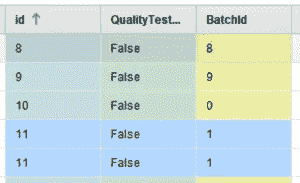

# 在制造业中处理批量生产数据

> 原文：<https://towardsdatascience.com/handling-batch-production-data-in-manufacturing-f720a6026bd?source=collection_archive---------78----------------------->

## 解决两个常见问题:验证和模型训练

埃文·德沃金在 [Unsplash](https://unsplash.com/s/photos/manufacturing?utm_source=unsplash&utm_medium=referral&utm_content=creditCopyText) 上拍摄的照片

很多制造业的生产过程都是分批完成的。一个批次中的两个项目以相同的生产设置生产。因此，这两件物品要么是完全相同的复制品，要么是非常相似的复制品——一件**伪复制品。**伪重复是指属性非常相似，甚至在某些情况下完全相同的项目。

这种批处理过程加快并简化了生产流程。然而，如果你在这样的环境中工作，并且想要使用数据科学和[机器学习](https://rapidminer.com/glossary/machine-learning/)来通知你的决策，你需要非常小心如何使用你的数据。

当考虑将机器学习应用于批量[制造数据](https://rapidminer.com/industry/manufacturing/)时，会出现两个主要挑战。第一是确保您正确地验证了您的模型，第二是使用批量数据处理实际的模型训练。

让我们依次看一看每一个，并给你一些如何解释这些问题的想法。

# 第一步——修正你的验证

批量数据的最大问题是验证。最常见的验证方案——[交叉验证](https://rapidminer.com/blog/validate-models-cross-validation/)、分割验证和引导验证——假设你的每一个例子都是独立的。

但是如果你批量生产，情况就不一样了。

让我们来看看，即使您的观察结果并不相互独立，您如何仍然能够验证您的模型。请记住，验证是数据科学家相信他们的分析的主要原因。这就是为什么把这件事做好是至关重要的。

要在批量生产环境中做到这一点，我们需要确保来自一个批次的所有示例总是在我们进行的任何数据验证分割的训练或测试端。

如果我们不这样做，我们正在训练的模型基本上就能够作弊——它会知道一些测试行的正确答案，因为在训练数据中存在一个相同(或非常相似)的行。因此，验证过程会说模型是好的，但是一旦它投入生产并且不能再欺骗了，它的性能就会下降，很可能*下降*很多。

在 [RapidMiner](https://rapidminer.com/) 中，这可以使用交叉验证操作符的“批量属性分割”选项来完成。如果选中，所提供的示例集需要包含一个批处理属性，以便该操作符进行操作。本字段手动定义属于一个批次(或一次交叉验证)的内容。

上面描述了一种派生 BatchId 属性的常见解决方案。这里，modulo 函数用于从数字 Id 生成 BatchId，在本例中，数字 ID 是一个商品 ID。mod 函数计算除法的余数，因此 mod(11，10)返回 11 除以 10 的余数。答案就是你在这里看到的 1。

使用这个选项，我们防止一个出现项 11 出现在训练集中，而另一个出现在测试集中。

如果您使用的是拆分验证而不是交叉验证，您可以通过首先使用排序运算符按 ID 列排序，然后使用筛选示例范围来解决这个问题。这将数据集分成两部分。但是这一次不是随机抽样，因为在分割之前已经按照 ID 进行了排序，所以相关的项目在数据集中并不相邻。

完成此操作后，您可以使用前 x 行训练，剩余的 y 行可用于测试，因为训练部分现在不同于测试部分。(由于数据量较小，在分割数据时数据集之间少量溢出的可能性通常可以忽略。)

既然我们已经处理了验证，我们需要解决批量数据可能存在的潜在混乱

# 第二步—处理数据本身

在普通学习者中使用您的数据可能会对模型造成一些混淆。请记住，由于数据的分批性质，您的学习者可能会遇到 10 个项目，其中只有一个是“正确的”，即使它们彼此非常相似。

根据您的算法，这可能会对您的模型最终的工作方式产生严重的影响。

因为学习者通常偏向于在他们不确定的情况下预测大多数，所以输入大量非常相似的数据点可能会使模型偏向这个方向。

对于基于树的算法，您必须修改您的修剪策略，因为在考虑批量数据时，类似“如果样本少于四个，则不要分割这个分支”这样的设置可能不合适。

因此，在模型训练过程中以特殊方式处理批数据可能是有意义的。以下是如何在模型训练过程中克服批量数据挑战的三种方法。

# 1.抽样

正如机器学习中经常出现的情况，解决问题的方法之一是使用采样方法。我们可以从批处理过程中随机抽取一个项目，并将其用于模型训练和测试。这很好地解决了分类问题中保持类别平衡的问题，以及回归问题中的标签分布问题。

这也是一个简单的技术。缺点是您会丢失示例，因此也可能会丢失信息。这实际上取决于是否通过使用给定批次中的多个项目获得了额外的信息。

可能会有，因为每个单独的项目可能是用相同的材料制作的，只有生产设置不同。但是，从每一批中包含一个以上的项目示例可能也不会有什么收获——这是您必须根据您的特定用例来决定的事情。

# 2.权衡和改变问题

就像不平衡分类问题一样，您也可以在这里使用一种加权技术来克服这个问题。您不需要删除示例，而是对单个批次中的项目进行平均，并将行数作为您的学员和表现的权重。

这对于所有的学习者来说是不可能的，但是相当多的普通人支持它。为了弄清楚你的学习者是否支持它，你可以右击一个操作符并说看看操作符信息。

当然，这种策略也有一些缺点。

首先，平均你的所有属性可能不是最好的办法。如果你的值相差很大，那么当你取平均值时，你又会丢失很多信息。这又可以归结为这些问题:*你的行有多少是重复的？它们只是依赖的伪副本还是真副本？*

手头的另一个问题是如何处理标签？对于回归问题，例如测量的浓度，当然可以取平均值。但这是你需要的吗？你对最大值更感兴趣吗？还是第八届十周年？与往常一样，您应该让您的数据科学方法与手头的业务需求保持一致，并仔细考虑您正在做出的选择。

对于分类问题，您会遇到模式(最频繁的类别)可能更不适合的问题。在这种情况下，分类问题通常是真正的挑战，当你问一些东西是否通过了质量测试。

在这里，你可以使用旧的计算机科学技巧，改变问题。你可以考虑从基于项目的问题转移到基于批量的问题。你可以回答的问题是:*我的批次中有多少部分不能通过质量测试？*

这是一个批量级的回归问题，如果需要可以转化为分类问题。

# 3.组装

解决批量问题的一个有趣的方法是使用抽样方法，但是使用集合方法。这个想法是你建立多个学习者。每个学员只能看到给定批次中的一个项目。

这个项目是随机选择的。多次这样做可以确保您不会丢失信息。这个想法可以被认为是一个[随机森林](https://docs.rapidminer.com/latest/studio/operators/modeling/predictive/trees/parallel_random_forest.html)，其中随机抽样被分层抽样所取代。

# 4.就让它保持原样

在谈了一些先进的想法之后，我想强调的是，仅仅“按原样”使用数据也是一个有效的选择。

机器学习算法被设计为鲁棒系统。他们习惯于在噪音中工作。因此，原则上他们也可以使用这些伪副本。

随机森林甚至在它们的引导抽样中有意产生相似的副本。因为随机森林是非常健壮的学习者，并且引导是随机过程，所以这不会损害森林。

# 最后的想法

和机器学习一样，没有免费的午餐，也没有简单的答案。上面列出的想法是坚实的起点。然而，您真正知道什么最适合您的数据的唯一方法是尝试一些事情，看看什么最适合。

记住，模型训练本质上是一个迭代的过程，所以看看什么最适合你的特定用例。

## 机器学习项目人类指南

启动机器学习项目很难。这个问题的解决方案是从一开始就建立一个坚实的项目基础，为自己的成功做准备。我在本指南中概述的[流程将有助于简化这一过程。](https://rapidminer.com/resource/humans-guide-machine-learning-projects/)

【rapidminer.com】这篇博文最早发表于 [*博客*](https://rapidminer.com/blog/batch-production-manufacturing-data/) *。*