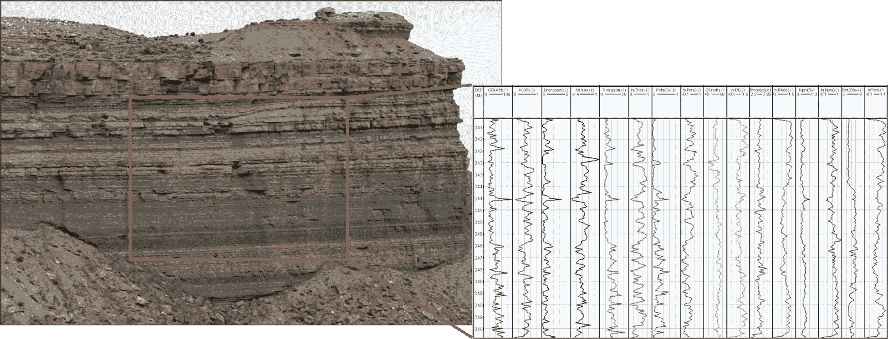
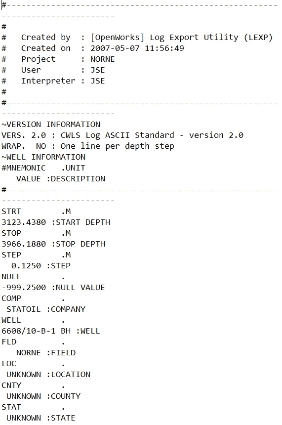
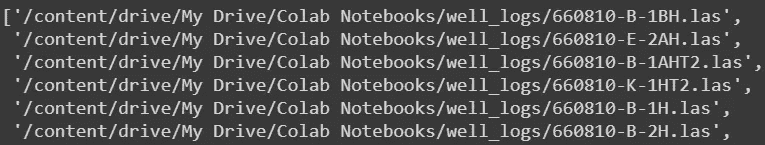
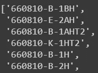
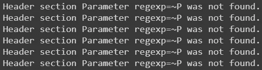
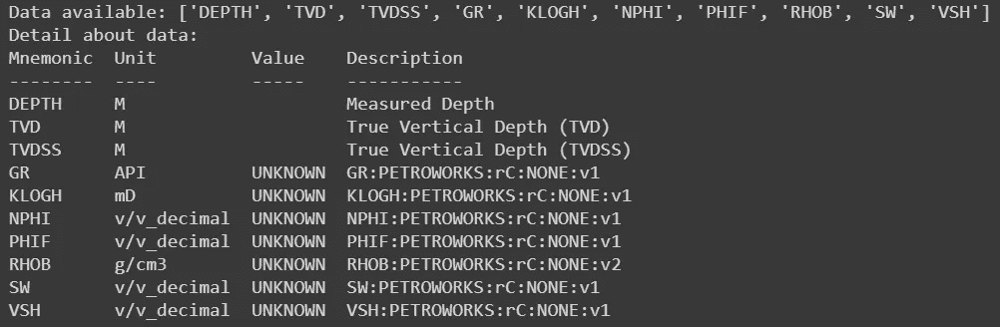
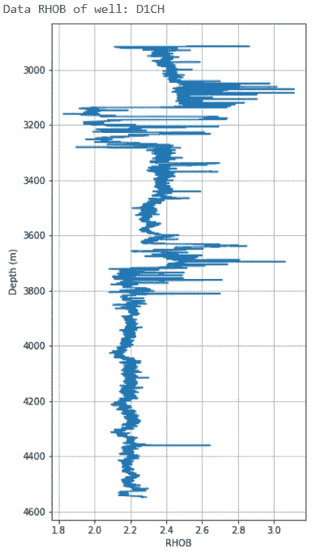

# 在 Python 上处理大量石油测井数据并提高时间效率

> 原文：<https://towardsdatascience.com/handling-big-volume-of-well-log-data-with-a-boosted-time-efficiency-with-python-dfe0319daf26?source=collection_archive---------23----------------------->

## Python 如何彻底改变了我们与石油行业大数据的交互方式，我们应该了解它吗


地球的一部分。图由[Ani-Mate](https://www.shutterstock.com/g/Ani-Mate/video)/shutterstock . com 提供

T 这是一个地球物理学家的故事，他已经厌倦了在大多数商业软件中用手工输入来处理大量的测井数据。谁和我有同样的感觉？然而，我成功地开发了一种方法，几乎不用 Python 编程技巧就能摆脱这种累人的手工输入。在这里**我想和你分享一个教程**。我假设你熟悉地质学、地球物理学、石油工程以及所有与地球科学相关的东西。然而，如果你不熟悉它，没关系，我很高兴向你介绍我们正在处理的日常活动。老实说，对于开源计算来说，Python 是一种非常灵活但非常强大的语言。



测井数据看起来是这样的！乱七八糟但是油油的有营养。 [(Aliouane 等人，2012 年)](https://www.intechopen.com/books/fractal-analysis-and-chaos-in-geosciences/well-logs-data-processing-using-the-fractal-analysis-and-neural-network)

在石油工业中，测井数据是一种非常有价值的数据来源，用于解释地球深处的地下图像，并获得更多关于岩石内部的信息:如果你足够幸运，你会发现石油。反正开玩笑！寻找石油的事业花了很多年。关键是，**时效**。时间效率，主要是在探索阶段，对企业的未来意义重大。当一个油田已经生产了几十年的时候，**测井数据从来不会以单一或少量的形式出现**。可以是 50 口，100 口，甚至 500 口油气井。这肯定是非常巨大的，因为已经钻了很多井。一个测井数据包含岩石的测量数据，例如密度、声速、伽马射线、电阻率等等。因此，总共 46 个井的大量数据可能占用大约 120 MB！测井数据通常采用 LAS 格式(我将在本教程中完全使用这种格式)。



LAS 数据中的测井数据示例

就我个人而言，迄今为止我所知道的大多数商业软件都有时间效率限制，因为我们必须重复地手动输入关于我们输入的每个测井数据的所有详细信息。**如果我们有大量数据，这可能会很乏味和麻烦**。

想象一下，光是手工输入和检查数据的单位，我们就要花费多少时间！然后我发现使用 Python 非常吸引人！

# 辅导的

打开你的 Python，先导入 Python 库的“三剑客”； ***numpy*** ， ***matplotlib*** ，以及 ***熊猫*** 。我之所以称他们为“三剑客”是因为他们不能独立工作，因为 Python 中的任何基本计算都需要 ***numpy*** 和 ***matplotlib*** ，以及数据需求 ***pandas*** 。

```
import numpy as npimport matplotlib.pyplot as pltimport pandas as pd
```

现在进入包含 LAS 格式的多井测井数据的文件夹。复制文件夹的路径，用 Python 指定路径，将路径粘贴在上面。

```
import syssys.path.append('...')
```

现在是有趣的部分！你会看到所有的文件。导入 ***glob*** 并导入文件。

```
import globimport os file_path = "/content/drive/My Drive/Colab Notebooks/well_logs"read_files = glob.glob(os.path.join(file_path, "*.las"))read_files
```

如果成功，将出现您的多条测井数据的**路径**和**文件名**。如果你读取 100 个测井数据，它将显示为一个很长的列表！



Glob 成功读取您的数据

由于您只对文件名**(无文件夹路径)感兴趣，即**井名**，例如从上面的例子中，只对`**660810-B-1BH**`感兴趣，而不是对整个`**/content/drive/My Drive/Colab Notebooks/well_logs/660810-B-1BH.las**`感兴趣，您可以将不需要的文件路径名分类出来，这样您将只得到井名。**

```
well_names = []for files in read_files: files = os.path.splitext(os.path.basename(files))[0] well_names.append(files)print(well_names)
```

这将为您提供油井名称



井名

调查你有多少数据。

```
print(len(well_names))
```

例如，你有 45 口井的数据。由于 **Python 从 0** 开始索引，而不是从 1 开始索引，这意味着**第一口井名** `660810-B-1BH`和**最后一口井**，分别被:

```
print(well_names[0])
print(well_names[44]) # 45 wells minus one
```

在 Python 和任何编程语言中，你几乎总是通过索引来调用一些东西。

> Python 索引的公式永远是:**从零开始，某物减一。**

现在您已经有了井名，是时候**读取所有 LAS 数据了。**你将使用一个非常专用的库来读取 LAS 文件，名为 [***lasio***](https://github.com/kinverarity1/lasio) 。Lasio 是一个可以读取 LAS 文件的优秀库，事实上你也可以自己从头开始构建一个程序！不过 lasio 对于**时效**来说已经足够了。这是我想强调的最重要的一点，即**您可以同时导入所有文件**，甚至一次点击 100 个文件，这是使用一些商业软件几乎无法做到的。在导入过程中，**你不需要专注于手动检查和输入合适的单位**。表演时间到了！

先安装 ***拉索*T22。我假设您可能已经非常熟悉如何安装库了。您可以编写一点儿代码`pip install`，或者更容易的是，您可以浏览这些库并将其导入到一个名为 ***PyCharm*** 的 Python IDE 中。**

```
pip install lasio
```

安装成功后，导入它，只用写 4 行代码就可以用 ***lasio*** 读取 LAS 文件。但是你必须有耐心，因为这需要相对较长的时间。所花费的时间取决于你导入的测井数据量，然而**估计读取 50 条测井数据不会超过 30 秒**。

```
lases = []for files in read_files: las = lasio.read(files) lases.append(las)
```

导入过程与从头到尾读取**井名**的顺序相同。在导入过程中，您可能会遇到一条警告，内容如下:



这是对 OK 的警告

以我的经验来看，很正常，所以一切都没问题。

> **恭喜你！您在总共不到 5 分钟的时间内导入了大量测井数据。**

是时候看看你的数据是什么样子了。请记住，在我们之前的讨论中，井名可以通过索引来调用。例如，我们称**为索引 19** 。

```
# type the numbers from 0 to max number of wells in the wellnames[...]find = well_names[19]# print the name of the searched wellprint("Well name:", find)
```

如果调用索引 19，它将打印第 20 个井的名称。请再次记住上面的经验法则:**指数是某个东西减一**。


上面的代码工作起来就像一个**目录**。现在编写下面的代码，看看第 20 个测井数据里面有什么。

```
id_ = np.int64(np.where(wellnames==find)).item()print("Data available:", lases[id_].keys())# check more detailsprint("Detail about data:")print(lases[id_].curves)
```

它将打印两件事:测井记录中的可用测量数据**和测井记录数据的详细信息**。****

****

**可用数据的打印输出**

**它告诉你什么数据是可用的。这里可用的数据有:**深度、TVD、TVDSS、GR、KLOGH、NPHI、PHIF、RHOB、SW 和 VSH** 。这些是什么？这些是岩石测量类型的首字母缩写词(或所谓的**助记符**，例如 **GR 代表伽马射线**， **KLOGH 代表渗透率**， **NPHI 代表中子孔隙度**， **RHOB 代表密度**，以及 **SW 代表水饱和度**。每个测量值都有特定的**单位**，你必须注意。**

**这条信息非常重要，比内容本身重要得多。这条信息就是我们在**文件头**中看到的。**

**现在终于到了我们教程的最后一部分。我们非常希望看到测井记录。**在** `data_view` **变量**中输入所需的测量类型。例如，我们有兴趣查看密度日志或 RHOB 数据。输入`RHOB`。我们将使用 **matplotlib** 。**

```
# peek or overviewing the well log# which data you want to see??? data_view = 'RHOB' # input the measurement type which data you want 
                   # to seeprint("Data", data_view, "of well:", find)plt.figure(figsize=(5,10))plt.plot((lases[id_][data_view]), (lases[id_]['DEPTH']))plt.xlabel(data_view); plt.ylabel("Depth (m)")plt.grid(True)plt.gca().invert_yaxis()
```

**可视化只是打印出以下内容:**

****

**密度测井可视化**

****恭喜，我们的教程到此结束！****

> **如果你仍然渴望**以上测井数据的更漂亮的可视化**，我有一个绝妙的配方！**

**但是因为这篇教程没有涉及到这个问题，所以我会把它留到以后，如果你渴望的话，我会写另一篇教程。**

# **你学到了什么？**

**首先，你已经学会了**如何导入多个测井数据文件；** 50，100，200 档，或更多**，**不超过 5 分钟。你已经打破了在商业软件中手工输入的平均时间。其次，你已经学会了如何通过索引数据对文件进行分类。有 50 个、100 个、200 个井名，你肯定不想一一点名，因此索引是一个更好的方法。最后但同样重要的是，你已经学会了**如何打印出数据的细节(标题)和可视化数据**。**

**从长远来看，我只能说 **Python 在处理大数据方面非常惊人**，超过了普通软件处理相同数量数据的平均时间。如果你觉得你可以通过编写更高效的代码及时击败我，请联系我并告诉我！**

> **到达我的 GitHub:github.com/yohanesnuwara**
> 
> **到达我的邮箱:ign.nuwara97@gmail.com**
> 
> **到达我的 LinkedIn:【https://www.linkedin.com/in/yohanes-nuwara-5492b4118/】T42**