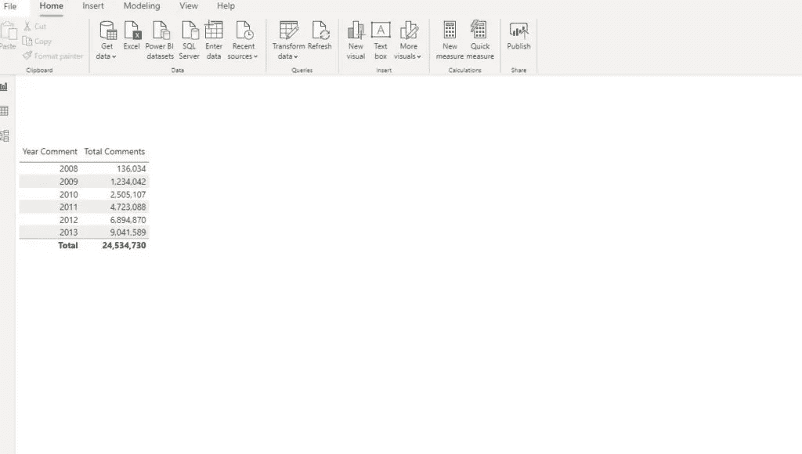
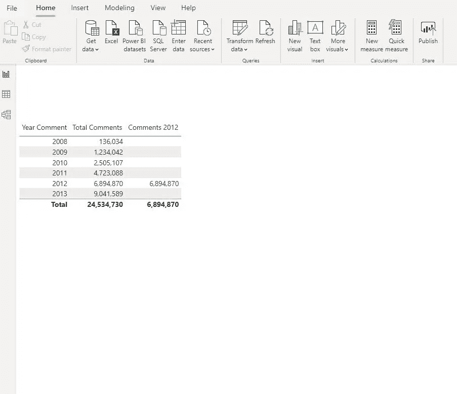
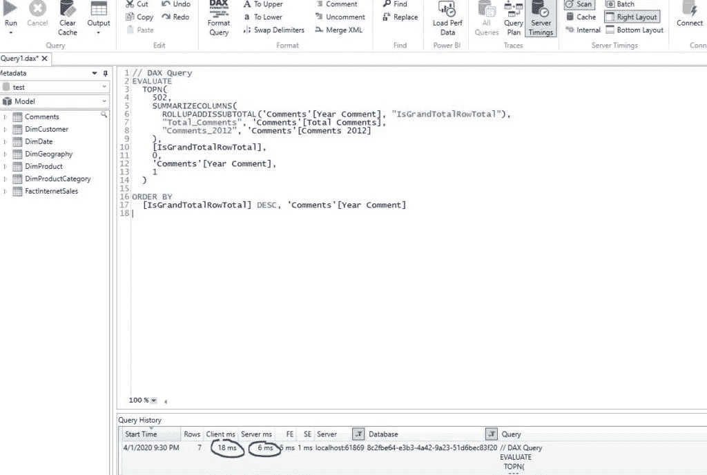
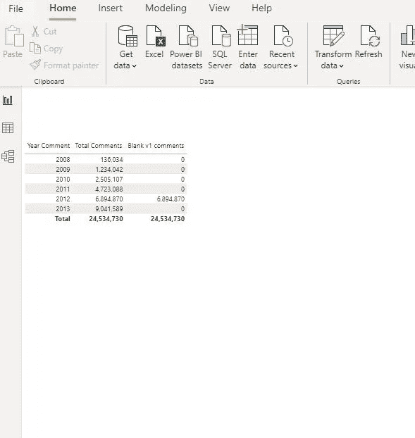
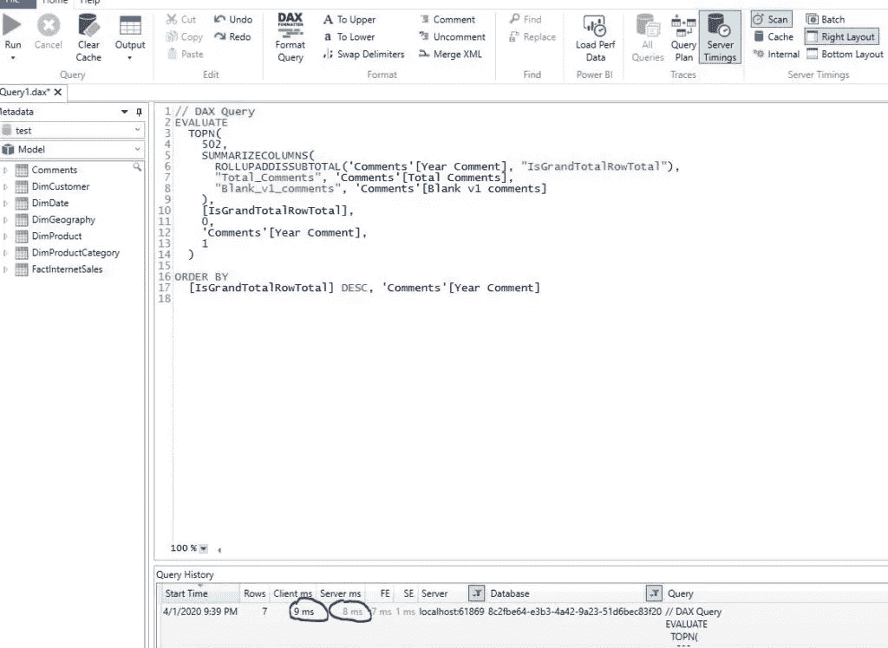
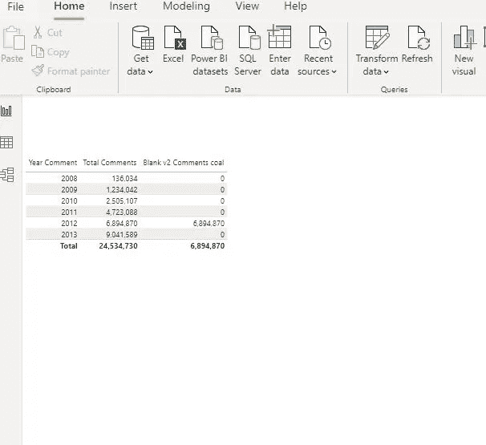
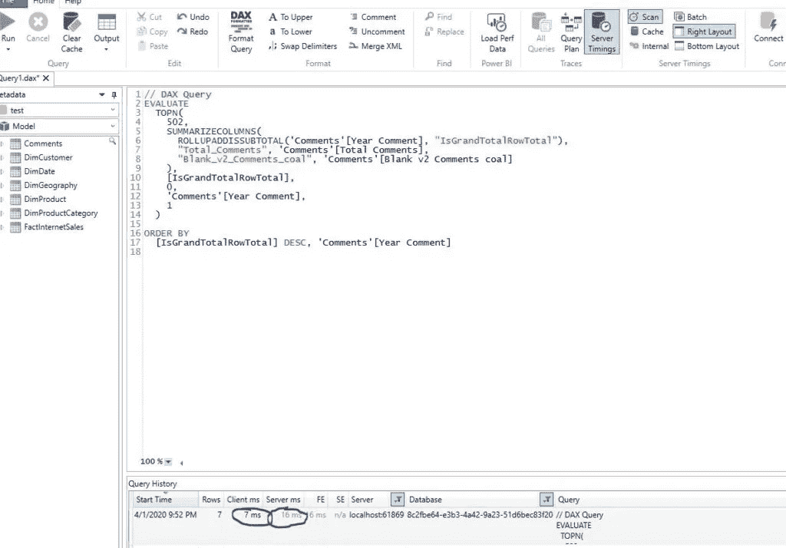
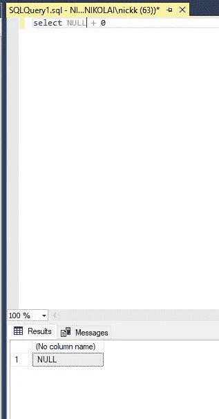
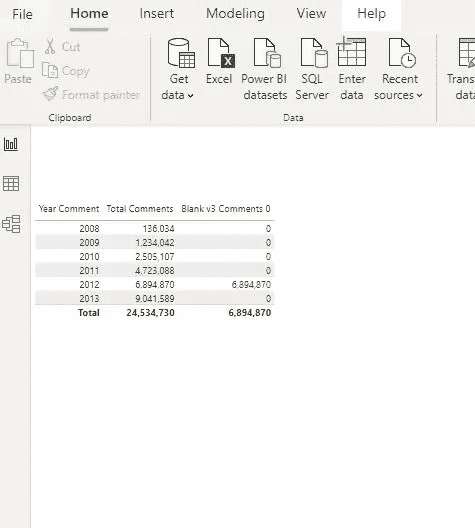
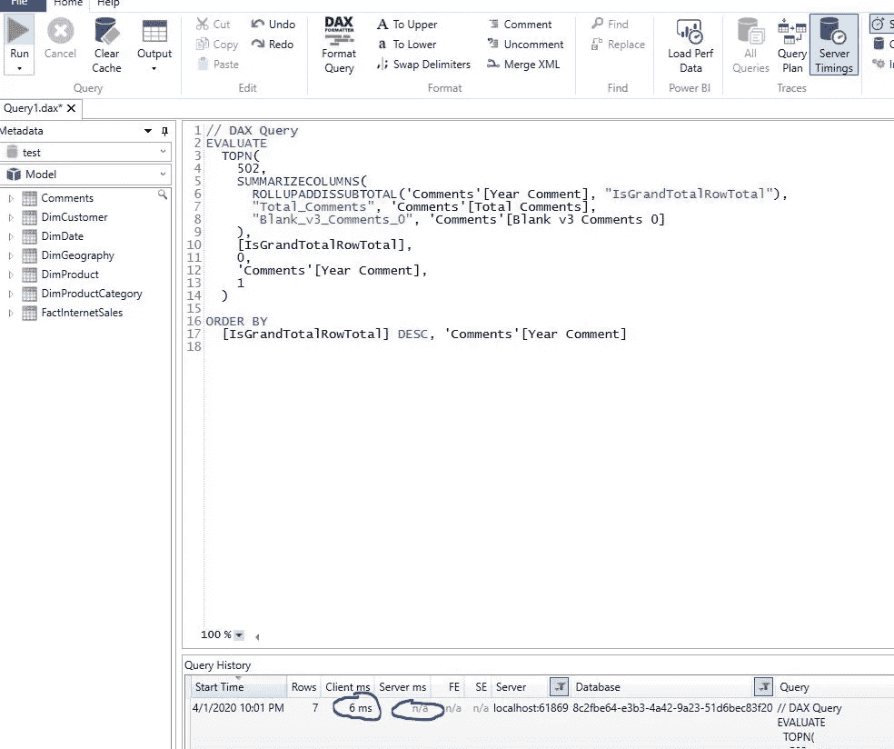

# 处理 Power BI 中的空白

> 原文：<https://towardsdatascience.com/handling-blank-in-power-bi-90eed948d042?source=collection_archive---------11----------------------->

## 如何应对 Power BI 报表中的空白值？检查这三种可能的解决方案


皮查拜在 Pexels.com 拍摄的照片

在创建报告时，我敢肯定，当您最终得到“(空白)”时，您会面临这样的情况，并且您不希望像这样显示给您的最终用户。当然，在某些情况下保留空白是有意义的，但最常见的情况是您想要显示其他内容而不是它(对于数字来说是 0，对于文本来说可能是‘N/A’或‘Unknown’)。

## 可能的解决方案

那么，在 Power BI 中有哪些处理空白的选项呢？我们直接在那里查吧…

我会用 Stack Overflow 2013 数据库。这个数据库包含了超过 2000 万条记录的表，所以如果要衡量性能，绝对比玩 Adventure Works 或者类似的数据库要好。

比方说，我想看看每一年有多少评论。首先，由于数据库中没有具体的年份值，我需要使用以下公式创建一个计算列 *Year Comment* :

```
Year Comment = YEAR(Comments[CreationDate])
```

下一步是创建一个衡量所有评论的标准。

```
Total Comments = COUNT(Comments[Id])
```



在这里，我们得到了每年的评论总数。现在，假设我们要专门计算 2012 年还剩多少评论。这可以用许多不同的方法来实现，但是我使用下面的公式:

```
Comments 2012 =
CALCULATE (
    COUNT ( Comments[Id] ),
    FILTER ( Comments, Comments[Year Comment] = 2012 )
)
```

让我暂停一下，给你介绍一下 [DAX 工作室](https://daxstudio.org/)。也许你们中的一些人对这个工具很熟悉，但是如果你经常写 DAX 并且每天都使用 Power BI，这个工具是必须的！我不会详细说明它提供了什么功能——我会诚实地说它很棒，也是最重要的——它是完全免费的！所以，马上去下载 DAX Studio 吧:)…

我将使用 DAX Studio 来测量我的视觉效果的[性能。让我们连接我们的。pbix 文件，并将我们新创建的度量添加到报告中。](/how-i-speed-up-my-power-bi-report-5x-155255415895)



我还打开了 Power BI 中 View 选项卡下的 Performance Analyzer，以便捕捉将在后台执行的查询。下面是 BI 生成的显示我们想要的内容的查询:

```
// DAX Query
EVALUATE
  TOPN(
    502,
    SUMMARIZECOLUMNS(
      ROLLUPADDISSUBTOTAL('Comments'[Year Comment], "IsGrandTotalRowTotal"),
      "Total_Comments", 'Comments'[Total Comments],
      "Comments_2012", 'Comments'[Comments 2012]
    ),
    [IsGrandTotalRowTotal],
    0,
    'Comments'[Year Comment],
    1
  )
ORDER BY
  [IsGrandTotalRowTotal] DESC, 'Comments'[Year Comment]
```

现在，让我停下来，试着解释一下背景中发生了什么。当您在 Power BI 中与可视化交互时，每次都会生成查询并将其发送到 Analysis Services (Tabular)引擎(Vertipaq)，该引擎[在后台](/vertipaq-brain-muscles-behind-power-bi-eecd6c8891e3)运行并执行“脏”工作。

在下图中，我们可以看到 Vertipaq 是如何处理这个查询的:



## 解决方案 1:使用 IF

现在，我们开始处理视觉中的空白值。第一种情况是最明显的，我想也是最常用的。解决空白的措施如下:

```
Blank v1 comments =
IF (
    ISBLANK (
        CALCULATE (
            COUNT ( Comments[Id] ),
            FILTER ( Comments, Comments[Year Comment] = 2012 )
        )
    ),
    0,
    [Total Comments]
)
```

并且，我们得到以下结果:



所以，我们在这里:我们显示的不是空白，而是零。让我们检查一下这个查询是如何执行的:



当然，对于简单的度量，差异不是很大，但是对于复杂的 DAX 和不同的过滤上下文，在数百万行的表上，差异可能很大。

## 解决方案 2: COALESCE()

最近 Power BI 推出了一个全新的功能:COALESCE()。对于那些来自 SQL 世界的人来说，这是一个众所周知的函数，但是让我为那些不熟悉它的人简单解释一下。基本上， *COALESCE* 将遍历作为参数传递的值，并返回第一个非空值(在 SQL 中不是 null)。

***聚结(列 1，列 2，列 3…列 N)***

因此，COALESCE 将检查列 1，如果值为空，它将检查列 2 的值。如果它也是空的，它将继续，直到找到第一个非空值。作为最后一个参数，您应该指定在所有检查的参数都返回空白时要返回的值，如下所示:

***COALESCE(column1，column2，column3…columnN，0)***

让我们使用 COALESCE 函数为我们的报告创建一个度量:

```
Blank v2 Comments coal =
COALESCE (
    CALCULATE (
        COUNT ( Comments[Id] ),
        FILTER ( Comments, Comments[Year Comment] = 2012 )
    ),
    0
)
```

结果完全相同:



让我们检查一下这种方法的性能:



## 解决方案#3 技巧用 0

这是我看到王九思用过的一个小技巧。对于那些不知道的人来说，Jeffrey Wang 是 DAX 最知名的名字之一。

有什么诀窍？在 DAX 中，空白+ 0 就是 0！是的，我知道，对于我们这些来自 SQL 环境的人来说，他们认为 blank 是 SQL 的空孪生兄弟，这是完全出乎意料的行为。尝试在 SQL Server Management Studio 中运行以下命令:

```
select NULL+0
```



正如您所想，结果是空的。在 SQL 中，NULL+something 总是 NULL…在 DAX 中，它不是:)

因此，让我们在报告中尝试这个解决方案:

```
Blank v3 Comments 0 =
CALCULATE (
    COUNT ( Comments[Id] ),
    FILTER ( Comments, Comments[Year Comment] = 2012 )
) + 0
```

结果还是完全一样:



最后，我们来看看后台发生了什么:



没那么差哈:)

## 结论

如您所见，在 DAX 中有多种处理空白值的方式。根据数据集的具体特征，您应该测试不同的可能性，并选择最适合您需求的一个。

感谢阅读！

[成为会员，阅读 Medium 上的每一个故事！](https://datamozart.medium.com/membership)