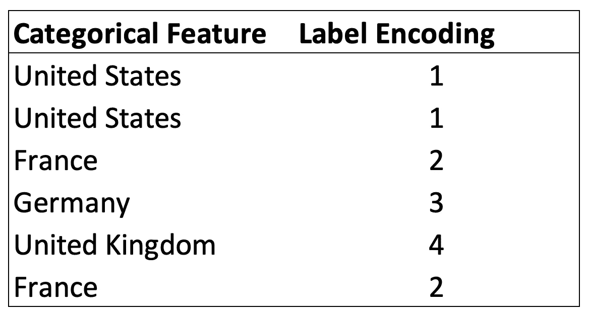
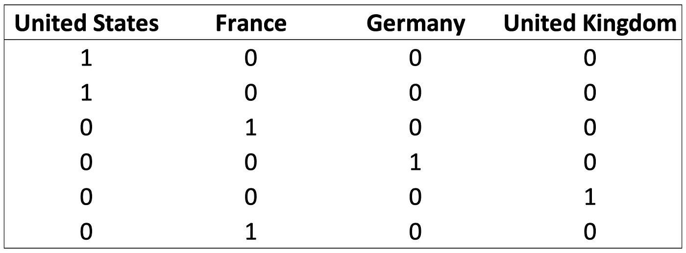
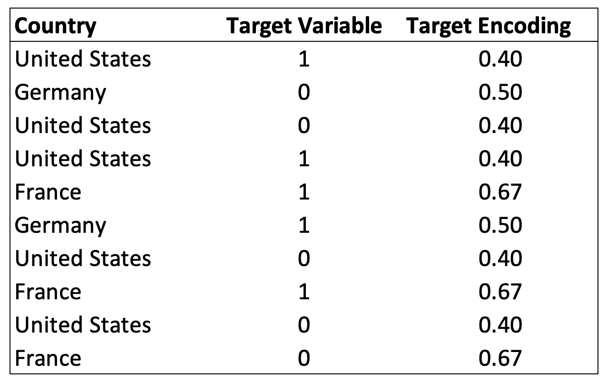

# 以正确的方式处理分类数据

> 原文：<https://towardsdatascience.com/handling-categorical-data-the-right-way-9d1279956fc6?source=collection_archive---------8----------------------->


来源: [Jelleke Vanooteghem](https://unsplash.com/@ilumire?utm_source=medium&utm_medium=referral)

## 最被低估的数据编码方式以及你做错了什么

分类数据只是聚合成组的信息，而不是数字格式，如*性别*、*性别*或*教育* *水平*。它们存在于几乎所有现实生活的数据集中，然而当前的算法仍然难以处理它们。

以 XGBoost 或大多数 SKlearn 模型为例。如果你试图用分类数据训练它们，你会立刻得到一个错误。

目前，许多资源宣传了各种各样的解决方案，这些解决方案起初看起来可能有效，但一旦仔细思考，就会发现它们大错特错。对于*非有序*分类数据来说尤其如此，这意味着这些类是无序的(可能是 Good=0，Better=1，Best=2)。**区分数据科学家应该使用的方法和那些只是让模型运行的方法需要一点清晰。**

# 不要做什么:标签编码

最简单和最常见的转换分类变量的解决方案之一是**标签编码**。它包括用相应的编号替换每个组，并在整个特征中保持这样的编号一致。



标签编码的例子

该解决方案使模型运行，并且是有抱负的数据科学家最常用的方法之一。然而，它的简单性带来了许多问题。

## 距离和顺序

数字维系关系。例如，四是二的两倍，当直接将类别转换为数字时，尽管原始类别之间不存在这些关系，但它们还是会被创建。看前面的例子，英国变成了法国的两倍，法国加美国等于德国。

嗯，这不完全正确…

这对于算法来说尤其是个问题，例如 K-Means，在运行模型时会计算距离度量。

# 解决方法

## 一键编码

**一键编码**是处理非有序分类数据的最常见、最正确的方法。它包括为每组分类特征创建一个附加特征，并标记属于(值=1)或不属于(值=0)该组的每个观察值。



独热编码的例子

这种方法能够正确地编码分类特征，尽管有一些小缺点。具体来说，大量二进制值的存在对于基于距离的算法(如聚类模型)来说并不理想。此外，大量额外生成的特征引入了维数灾难。这意味着由于数据集现在的高维数，数据集变得更加稀疏。换句话说，在机器学习问题中，每个特征组合至少需要几个样本。增加特征的数量意味着我们可能会遇到对每个特征组合没有足够观察值的情况。

## 目标编码

一种鲜为人知但非常有效的处理分类变量的方法是**目标编码**。它包括用目标变量中的平均响应替换分类特征中的每个组。



目标编码的示例

获得目标编码的过程相对简单，可以概括为:

1.  按类别对数据进行分组
2.  计算每组目标变量的平均值
3.  将平均值分配给属于该组的每个观察值

这可以通过几行代码实现:

```
encodings = data.groupby('Country')['Target Variable'].mean().reset_index()data = data.merge(encodings, how='left', on='Country')data.drop('Country', axis=1, inplace=True)
```

或者，我们也可以使用 *category_encoders* 库来使用 *TargetEncoder* 功能。

目标编码也是一种强大的解决方案，因为它避免了生成大量的要素，就像一键编码一样，保持了数据集的原始维度。

# 摘要

处理分类特征是数据科学家的一项常见任务，但是，人们通常并不确切知道正确处理它们的最佳实践是什么。

对于非顺序类别，标签编码，包括用一个相对随机的整数替换一个类别，应该不惜一切代价避免。

相反，一键编码和目标编码是更好的解决方案。一键编码可能是最常见的解决方案，在现实生活中表现良好。目标编码是一种鲜为人知但很有前景的技术，它也可以保持数据集的维度一致，从而提高性能。

*阅读更多类似的文章，请关注我的*[*Twitter*](https://twitter.com/jayzuccarelli)*，*[*LinkedIn*](https://www.linkedin.com/in/ezuccarelli)*或我的* [*网站*](https://eugeniozuccarelli.com/) *。*