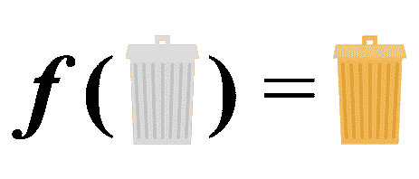
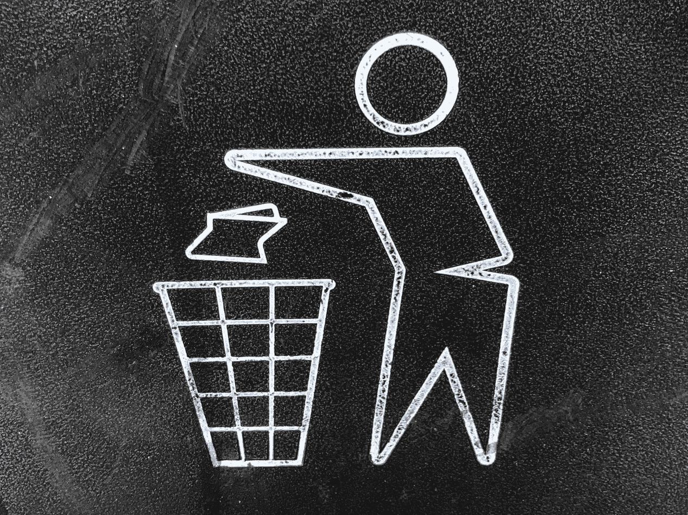

# 最小化新冠肺炎对数据科学影响的三大方法(第 1 部分)

> 原文：<https://towardsdatascience.com/handling-covid-19-impact-on-data-in-data-science-projects-87510c9006a7?source=collection_archive---------31----------------------->

## 减轻或解释数据中新冠肺炎效应的方法。

凯文拍摄的照片:Unsplash

在试图回答“ ***为什么*** ”关于新冠肺炎对数据科学的影响的问题后，有必要继续讨论“ ***如何处理*** ”的问题。本系列旨在利用行业数据科学领导者的意见，为“*”提供一些潜在的答案。*

> **不确定“为什么”是什么？你可能没看过这个系列的前奏。请在这里阅读***以了解新冠肺炎对数据科学方法可能产生的影响，然后再进一步。***

**到目前为止，在这个系列中，我们将回顾丢弃数据、替换数据和特征工程方法。在第一部分中，我们将了解删除数据和替换数据。**

**最后，我要特别感谢本系列的合著者 Renee Ernst，General Mills 的资深首席数据科学家，她凭借自己在食品行业的经验成为了宝贵的信息来源。**

# ****简介****

**快速回顾一下！**

**在过去的 2-3 个月里，数据集被新冠肺炎效应弄得乱七八糟。在许多情况下，流入的数据并不反映正常的行为或情况。与更典型的异常值不同，这些数据是一些数据集的相当大的一部分，因此，传统的异常值补救措施可能无法帮助解决由这些异常数据引起的问题。这种“不正常”的数据也可能会持续流入一段时间，直到我们回到正常状态。在这次讨论中，我们只关注如何确保我们的模型在我们回归常态后能够继续很好地预测，而不是试图预测新冠肺炎本身的影响或轨迹。**

****

**图片来自[坦布](https://medium.com/@temboo/make-smart-predictions-with-amazon-machine-learning-ad4fa464947)**

**对于预测模型，数据科学的假设“垃圾数据输入，垃圾数据输出”仍然非常重要。虽然我们试图讨论一些方法来建立稳健的模型，以最小化或考虑新冠肺炎的影响，但这些方法不能神奇地使你的预测模型准确，可能有其他方法在不同的情况下更好地工作。我们每个人都在一个独特的空间中工作，因此我们在处理这些数据时所做的基本假设需要有所不同。这些假设会因行业和使用情形而异，并且需要处理和更改数据，而在正常情况下，我们会尽力避免这种情况。我们需要坦率地说出我们的选择、做出这些选择的原因以及对我们模型的影响。**

**用谷歌首席数据科学家凯西·科兹尔科夫的话说，“[在你写的每一行都要多次乞求原谅。](https://twitter.com/quaesita/status/1247900815961907201)**

# ****丢弃数据****

**这个方法很简单，但是也是最假设的！想法是丢弃或替换对预测模型有不利影响的“异常”COVID 数据。这似乎是一个简单而诱人的解决方法，但是这些方法都有其局限性。为了使这些方法起作用，我们将对数据进行大量假设，包括对丢弃/替换数据的预测能力的假设。丢弃方法的最大问题之一是它在处理相对少量的数据时的影响，尤其是当它需要丢弃大量数据时。**

****

**[加里摄影:Unsplash](https://unsplash.com/photos/YzSZN3qvHeo)**

**随着与 COVID 的斗争愈演愈烈，它继续蔓延到我们生活的方方面面。不管怎样，它正在影响我们的日常生活。尽管这可能不是“常态”，但在未来，我们还不确定何时会达到新常态，或者新常态会是什么样子。我们在此次危机最严重时期收集的数据仍有可能为我们提供未来将如何受到影响的重要见解。假设这些数据与未来无关，从而完全忽略这些数据，这可能是幼稚的。然而，如果我们可以确信在新冠肺炎期间收集的数据不会以任何方式反映未来，并且我们有足够的数据在删除这些数据后仍然可以构建准确的模型，那么删除这些数据是一个合理而实用的解决方案。下降法可能有效的一个例子是预测(一旦事情恢复正常)期间的能源使用。给定时间内能源使用量的最佳预测指标之一是上一天或上一周同一时间的能源使用量。鉴于世界各地的许多企业和公共场所目前都处于关闭状态，如果不采取某种方式加以解决，最新数据将会失真，并将影响我们随后的预测。使用多变量建模仍有可能处理这些数据，这将在后面讨论，但另一种方法是丢弃最近的数据，并将新冠肺炎之前的数据视为最近的记录。**

# ****替换数据****

**当历史数据有限，但被替换的数据适用于所讨论的时期时，替换数据成为一种可行的方法，尽管是在某些假设下。**

**我们之前的能源预测示例可能是一个替换数据是更好选择的例子。假设由于历史数据有限，单独删除数据不是一种选择。我们可以用上一年同期的数据替换受影响的数据。这样做时，我们可以很容易地考虑到自去年以来能源使用的任何平均增加/减少，将一个因素应用到我们替换的数据，考虑到这种变化。替换方法是用这一时期(新冠肺炎撞击之前)的原始预测替换受新冠肺炎撞击的数据。如果去年的数据是陈旧的，这可能会有所帮助，如果我们在新冠肺炎之前对我们的模型的总体准确性非常有信心，这将是一个好方法。从上面的例子可以明显看出，被替换的数据需要在历史上是准确的。**

**另一种数据替换技术可能有用的情况是在预测历史数据有限的产品的销售时。例如，假设您预测每周的区域卫生纸销售量，但只有几年的数据。如果你想预测新冠肺炎危机(希望)过去后的未来销售，你需要一些方法来处理几个月的新冠肺炎数据。如果危机影响了 3-4 个月的销售，而您只有 3 年的数据，这已经影响了您 10%的数据，因此您可能不想丢弃它。相反，您可以用历史值替换数据，或者如果您的预测在过去非常准确，您可以用以前的预测数据替换它。当然，这是有风险的，但是只要用清晰的交流来详述这些风险，这可能是一个可行的解决方案。**

# ****关于作者****

**Usman Gohar 是一名数据科学家，明尼阿波利斯数据科学的共同组织者，也是一名技术演讲人。他非常热衷于最新的数据科学研究和机器学习。你可以在 [LinkedIn](https://www.linkedin.com/in/usman-gohar/) 、 [Twitter](https://twitter.com/UsmanGohar) 、[Medium](https://medium.com/@usman.gohar)follow on[Github](https://github.com/UsmanGohar)上与他联系。**

**Renee Ernst 是 General Mills 的高级首席数据科学家，担任一个数据科学家团队的技术经理，该团队构建用于情景规划和优化促销的模型。工作之外，她还积极参与数据科学社区，包括共同组织即将举行的[minne Analytics](http://minneanalytics.org/)Women in Analytics and Data Science conference 等活动。你可以在 [LinkedIn](https://www.linkedin.com/in/renee-ernst/) 和&Github 上找到 Renee。**