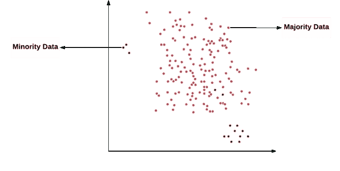
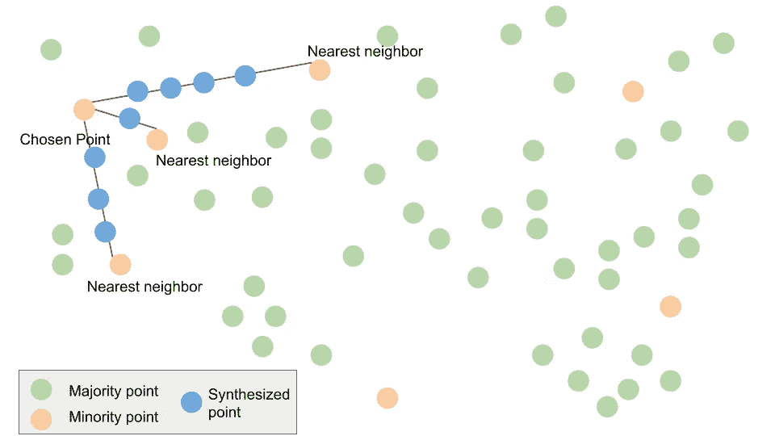
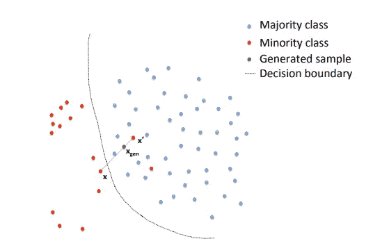
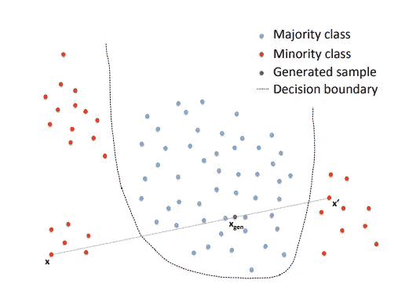
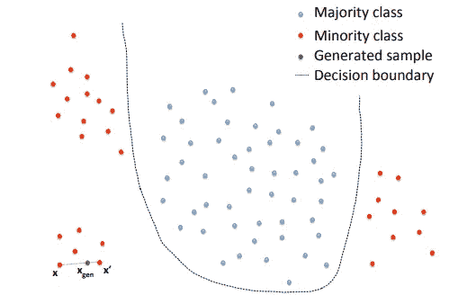
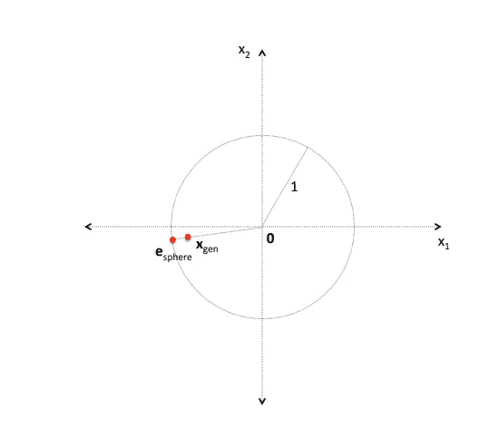
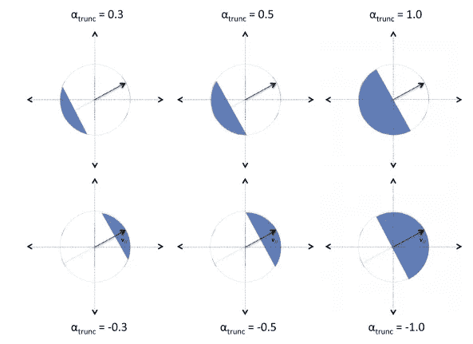
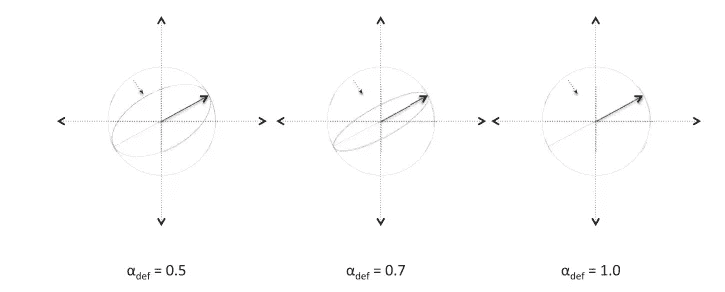
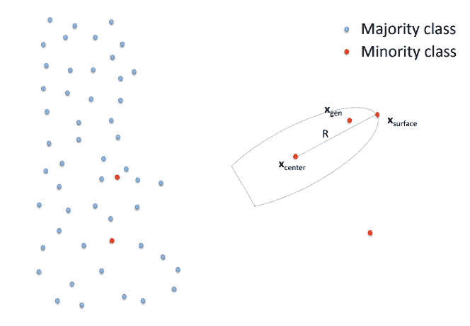

# 使用几何 SMOTE 处理不平衡数据

> 原文：<https://towardsdatascience.com/handling-imbalanced-data-using-geometric-smote-770b49d5c7b5?source=collection_archive---------47----------------------->

## SMOTE 变体的几何方法



图 1 .作者随机生成的数据

在上面的图中，很明显，红色的点占多数，绿色的点占少数。少数数据的存在在异常检测、攻击和入侵检测、医学领域[癌症预测]和网络物理环境的研究中至关重要。但是数据样本中少数民族的数量是至关重要的。比方说，如果只有 0.01%的有用少数数据，通常算法会将其视为噪声或异常，并试图通过忽略这一点来提高准确性。如上所述，在许多情况下，不考虑少数群体数据样本比因其代表性不足而删除或忽略它们更为关键。

> 当类别样本的数量大致相等时，通常的机器学习算法工作得最好，并且通常朝着提高准确度和最小化误差的方向调整[1]

因此，基于这种说法，数据不平衡必须得到处理，因为当数据接近平衡时，算法会工作得更好，技术世界有许多方法来解决这一常见现象。

## 处理不平衡数据

我们可以通过算法和框架来解决不平衡数据的琐碎机器学习问题，这些算法和框架大致分为两个主要领域；预处理和代价敏感学习。重采样和特征选择是预处理方法的主要方式。

## 数据重采样:

这种方法修改了数据样本的数量，从而解决了偏斜类别分布或不平衡数据的不利影响。

1.  过采样:过采样是添加少数类的更多副本。当您没有大量数据要处理时，过采样可能是一个不错的选择。但是过度的过采样可能会导致过度拟合。但是我们不会丢失有用的信息或特征。
2.  欠采样:欠采样是去除多数类的副本。当有大量数据时，可以设计欠采样。但是这里主要关注的是我们删除了有价值的信息。这可能导致对测试集的拟合不足和泛化能力差。
3.  混合:过采样和欠采样的适当混合。
4.  SMOTE:与过采样类似的技术，但这里我们合成新的少数数据样本。

# 重击

SMOTE 算法是由舒拉、鲍耶、霍尔和凯格尔迈耶在 2002 年提出的，作为随机过采样的替代方案。合成少数过采样技术(SMOTE)的思想是在相邻少数类实例之间进行插值。SMOTE 的任务是通过对数据进行随机重采样来克服过度拟合的问题，并继续协助泛化。SMOTE 能够通过在邻域中合成新的少数类样本来增加少数类实例的数量，从而帮助分类器提高泛化能力。

SMOTE 在少数实例之间生成新的少数样本。考虑两个少数点，算法沿着连接这些少数点的线生成新的少数样本。这是 SMOTE 算法的抽象视图。

```
k = nearest neighbours
n = no. of samples to be generated based on Imbalanced Ratio.
```

> SMOTE 算法(k，n):
> 
> **第一步:**设置少数类集合 **A.** 对于每个属于 A 的 x，找到 x 的 **k 个最近邻**(通过计算 **x** 与集合 **A)中每隔一个少数点的**欧氏距离**)**
> 
> ***A = {x1，x2，…XT }&x1 的 k 近邻= {x6，x7，…xk} &相似***
> 
> **第二步:**对于每一个属于 **A** 的 **x，从其 k 个最近邻中选择 **n 个**少数点，它们构成集合 **A1。****
> 
> ***x1 的 x1 = { x7，x4，…xn}***
> 
> **第三步:**为每个点 **p** 中的 **A** 生成一个新的样本
> 
> ***新点= p + rand(0，1) * |p-x1|***
> 
> 其中 rand(0，1)表示 0 和 1 之间的随机数



图 2 .作者对 SMOTE 功能的概述

SMOTE 仍然是一个有趣的工作，许多研究工作已经引入了 SMOTE 的变体，这些变体具有以它们自己的方式合成新的少数点的不同方法。SMOTE 的原始论文被引用超过 5000 次，开发 SMOTE 扩展的研究仍然是新鲜的。边界线-SMOTE(韩等，2005)，安全级-SMOTE (Bunkhumpornpat 等，2009)，DBM SMOTE(Bunkhumpornpat 等，2012)，ROSE (Menardi & Torelli，2014)，MWMOTE (Barua 等，2014)，(Abdi & Hashemi，2016)，Geometric SMOTE(Douzas 等，2017)就是相当多的例子。

我发现 Geometric SMOTE 很有趣，因为它利用几何来优雅地开发解决方案，识别和解决可能导致的潜在问题。虽然它被称为 SMOTE 的变体，但不是真正的扩展。它模仿合成新的少数样本的核心思想。几何 SMOTE 也是一种基于该原理和插值的算法。让我们进入几何 SMOTE 的症结。

# 几何 SMOTE

现有的 SMOTE 及其变体具有在合成少数样本时必须解决的各种问题，并且几何 SMOTE 已经确定了如下问题。

1.  噪声示例的生成

当合成新的少数样本时，在多数聚类空间中合成特定样本的可能性更高。这种数据被称为噪声点。它们只能作为噪声融入集群。



图 3 .从几何 SMOTE 纸上获取的噪声样本的生成

在上面的图 3 中，噪声样本是选择`x’`作为应用 SMOTE 的最近点的结果。


图 4 .来自几何 SMOTE 纸的噪声样本-2 的生成

由于点的选择，还有另一种最终产生噪声样本的可能性。在图 4 中。由于`x`已经是一个噪声点，并且所选择的点也是噪声点，所以所生成的样本最终也是一个噪声样本。



图 5 .来自几何 SMOTE 纸的噪声样本-3 的生成

在上面的图 5 中，同样通过选择随机选择的`x`和`x’`，生成的点落在多数簇内，并导致噪声样本的形成

2.属于相同子聚类的样本的生成导致过度拟合和不适当的表示。



图 6 .几乎相似样本的生成

这里，虽然不存在噪声样本的问题，但是生成属于一个少数子聚类的新样本会引入“聚类内不平衡”并导致原始数据的偏斜表示。并且高度密集的子群的新样本的生成将导致

## G-SMOTE 的主要目标

Smote 在确定潜在泄漏后，确定了其主要目标，以解决一些问题和解决问题的机制。

1.  G-SMOTE 想要定义一个安全区域来合成新点。这是为了确保没有合成点被生成为噪声样本。
2.  G-SMOTE 希望增加生成的少数类样本的多样性。这将防止少数样本的相同子类的生成导致群内偏斜。

## G-SMOTE 的参数

> **Smaj** :多数类样本集。
> 
> **Smin** :少数类样本集。
> 
> **N** :要生成的合成样本总数。
> 
> **k** :最近邻数。
> 
> **α_ trunc**:1≤**α_ trunc**≤1 的截断因子。
> 
> **α_ def**:0≤**α_ def**≤1 的变形因子。
> 
> **α_sel** :带有**α_ sel**∈n {少数，多数，组合}的邻居选择策略
> 
> S_gen:生成的合成示例集。(输出)

## 算法

关于完整的算法和解释，请参考 G-SMOTE 论文。在这里，我希望用例子来解释算法，并抽象出来。

> 1.对 **Smin** 元素进行混洗，并初始化空集 Sgen

```
**Smaj = {smaj1,smaj2,smaj3,.......}
Smin = {smin1,smin2,smin3,........} -> after being shuffled
Sgen = {}**
```

> 2.重复，直到 Sgen 中生成 **N** 个少数实例:

```
**N = 0** - Have to run the procedure till N number of samples are generated
```

> 2.1.设 **x_center ∈ Smin** 所选的 p 组件的少数类实例。

```
- A minority point from Smin is chosen as the center of a geometric region
 **x_center** = **smin1**- The order of choosing the minority point will be the order of shuffled data points and in case of **N > size of Smin**, continue to re-run from the beginning again.
```

> 2.2.如果 **α_sel = minority** :

```
In **G-SMOTE** algorithm they defined 3 neighbor selection strategies ; minority,majority and mixed.- Find the k nearest neighbors of x_center from the set of Smin
  **k_nearest_neighbors = {smin6,smin5......}**- randomly select **x_surface** from the **k_nearest_neighbors 
  x_surface = smin5**- Calculate a radius from the relation 
  **R ← d(x_center, x_surface)**
```

> 2.3.如果 **α_sel =多数**:

```
- choose the nearest majority neighbor (from Smaj) of x_center 
  **x_surface = smaj3**- Calculate a radius from the relation 
  **R ← d(x_center, x_surface)**
```

> 2.4.如果 **α_sel = mixed** :

```
- Find the k nearest neighbors of x_center from Smin. 
  **k_nearest_neighbors** = {smin6,smin5......}- randomly choose one from **k_nearest_neighbors 
  smin6**- Calculate the euclidean distance 
  **dmin ← d(x_center, smin6)**----------------------------------------------------------------- Find nearest majority neighbor of x_center from Smaj
  **xmaj= smaj3**- Calculate the euclidean distance 
  **dmaj ← d(x_center, xmaj)**----------------------------------------------------------------- Calculate a radius from the relation 
  **x_surface ← argmin (dmin, dmaj)**
  **R ← d(x_center, x_surface)**----------------------------------------------------------------
**Note: Since d ≤ R ≤ dmaj; where d is distance from x_center to the generated sample
=> G**eneration of noisy samples is avoided
```

> 2.5.生成一个合成样本 **x_gen ← hyperball(中心=0，半径=1)**



图 7。生成 e_sphere

```
**hyberball**:- function is meant for creating the e-sphere- **e_sphere** is generated on the surface of a unit hyper-sphere 
```

> 2.6.通过 **x_gen ← truncate(x_gen，x_center，x_surface，α_trunc)** 变换 1 合成样本。



图 8 .α_ trunc 的截断效应

```
**Truncation:**- defined with bit of complex mathematics. But intuitively tells us which side of the hyper-sphere to be truncated to secure a safe space to generate a minority sample. - When **α_trunc** > 0, the area that is opposite to the x_surface is truncated from the interior of the hyper-sphere.- When **α_trunc** < 0, the truncation occurs in the area that includes the x_surface point.- **α_trunc v**alue is generally -1 to 1\. If it is -1.0, it truncates the exact **semi**-hyper sphere on the same side of surface point and truncates the opposite side  of **semi**-hyper sphere if **α_trunc equals** 1.0
```

> 2.7.通过 **x_gen ← deform(xgen，xcenter，xsurface，α_def)变换 2 合成样本。**



图 9 .变形对α_def 的影响

```
**Deformation:**
- corresponds to the deformation of the hyper-sphere in to a hyper-spheroid- **α_def** relates the story of hyper-plane that to be chosen on which the new minority sample will be synthesized- **α_def** typically takes value 0 to 1 allowing the Deformation method to choose the proper plane to place generated sample.
```

> 2.8.通过 x_gen ← translate(xgen，xcenter，R)转换 3 合成样本。

```
**Translation:**- translation of the generated point by the x_center vector and the resealing by the value of the radius R- return (x_center + R * x_gen)
```



图 10 .少数样本的生成

2.9.将生成的样本 x_gen 添加到生成的样本 S_gen 的集合中

```
**S_gen {x_gen}
N = N+1**
```

感谢阅读 G-SMOTE 到这一步。该博客旨在对 SMOTE 及其变体中的问题、G-SMOTE 算法和主要目标进行概述。看到 G-SMOTE 算法的缺点也很有趣，让我们在一个单独的博客中讨论它们。

## 参考

[1] Johnson，J.M .，Khoshgoftaar，T.M .关于深度学习存在类不平衡的调查。 *J 大数据* **6、** 27 (2019)。[https://doi.org/10.1186/s40537-019-0192-5](https://doi.org/10.1186/s40537-019-0192-5)

[2] [N. V .舒拉](https://arxiv.org/search/cs?searchtype=author&query=Chawla%2C+N+V)， [K. W .鲍耶](https://arxiv.org/search/cs?searchtype=author&query=Bowyer%2C+K+W)， [L. O .霍尔](https://arxiv.org/search/cs?searchtype=author&query=Hall%2C+L+O)， [W. P .凯格尔迈耶](https://arxiv.org/search/cs?searchtype=author&query=Kegelmeyer%2C+W+P) (2011)。“SMOTE:合成少数过采样技术”

[3]圣乔治·杜萨斯和费尔南多·巴桑。(2017).几何 SMOTE:通过 SMOTE 的几何扩展实现不平衡学习的有效过采样。

[4] G. Douzas 和 F. Bacao，“几何 SMOTE 对 SMOTE 的一种几何增强的插入式替代”，*信息科学*，第 501 卷，第 118–135 页，2019 年。可用:10.1016/j.ins.2019.06.007

[5] G-SMOTE 实现—[https://github.com/AlgoWit/geometric-smote](https://github.com/AlgoWit/geometric-smote)