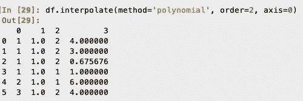

# 处理“缺失”数据？

> 原文：<https://towardsdatascience.com/handling-missing-data-12ac7c59eebc?source=collection_archive---------29----------------------->

## 所有数据集都有**个缺失值。**

这些可以是*难、未定义*或*空—* 的形式，也可能是别的什么？

但是我们该拿它们怎么办呢？我们应该删除这些行还是替换这些值？让我们看看如何以一种理智的方式摆脱这些缺失的价值观。

数据无处不在，但也有缺失值。[斯蒂芬·道森在 [Unsplash](https://unsplash.com/s/photos/data?utm_source=unsplash&utm_medium=referral&utm_content=creditCopyText) 上拍照]

替换数据集中缺失的值称为**数据输入**。

现在，一些数据科学的从业者可以说——对这些价值“不做任何事情”。但是不要这样做，大多数算法在遇到缺少值的数据时都会抛出错误。

让我们考虑一下熊猫的数据框架:

一个示例数据帧。[图片由作者提供]

那么，我们能做些什么来填补这些缺失的价值呢？

## 1.使用每列的“平均值”。

用每列的平均值填充 NaN 值。[图片由作者提供]

这是一个快速的解决方案，但是“均值”作为一个统计数据是不稳定的，并且它不能很好地与分类特征相适应。此外，如果数据是倾斜的，就不会考虑相关性。

这也会影响结果数据集的方差，因此要小心，如果训练 ML 算法时缺失数据用均值填充，这可能会导致较高的偏差。

## **2。使用每列中“最频繁”的值。**

现在让我们考虑一个新的数据框架，一个具有分类特征的数据框架。

具有分类特征 1 和 2 的示例数据框。[图片由作者提供]

我们可以用众数来替换丢失的值——或者每列中出现最频繁的值。这同样没有考虑到相关性，并且由于不希望地将更多标签分配给特定类别，可能会在数据中引入偏差。

如何使用模式填充分类特征？[图片由作者提供]

但是上述方法主要适用于小数据集，如果您有一个大数据集呢？

大数据是不是变得太大了？[[Giphy 的 GIF 图](https://media.giphy.com/media/xT0BKi1TLjmKiu1HGg/giphy.gif)

让我们来看一个多了几行和几列的数据帧。

更大的数据框架。[图片由作者提供]

## 3.在每列中使用“内插法”。

现在让我们使用上面显示的数据框架，我们可以沿着每一列使用插值来填充缺失的值。

*但是插值有什么用呢？*它启动适合您数据的功能。然后，该函数可用于推断缺失数据的值。

在[熊猫](https://pandas.pydata.org/pandas-docs/stable/reference/api/pandas.DataFrame.interpolate.html)中有不同的插值策略，如*线性*或*多项式*。请记住，如果您使用多项式策略，您将需要指定插值多项式的*阶*。

2 阶多项式插值后的结果。[图片由作者提供]

它在计算上比我们上面介绍的两种方法更昂贵，但是取决于用于插值的策略；它能给出更好的结果。

## **4。使用其他方法，如 K-最近邻法。**

上面显示的三种方法在 Pandas 的框架内工作。但是如果你可以访问其他像`scikit-learn` 这样的库，你也可以访问`KNNImputer`。让我们考虑将它与方法 3 中使用的数据帧一起使用。

[**KNNImputer**](https://scikit-learn.org/stable/modules/generated/sklearn.impute.KNNImputer.html)**的工作原理是每个新点如何与数据中的所有其他点相似。因此，通过检查数据集中的 k 个最近邻是否有缺失值，我们可以基于邻域或最近的“k 点”对它们进行估算。**

**总的来说，这种方法比上面提到的三种方法更加通用，因为它适用于所有类型的数据——连续数据、离散数据和分类数据。**

****

**结果使用邻居为 2 的 KNNImputer 后。[图片由作者提供]**

**如果您知道任何其他填充数据集中缺失值的常用方法，请在评论中注明。**

**我希望你觉得这篇文章有趣并且有用。**

**ℹ️ℹ️ℹ️ℹ️ℹ️ℹ️ℹ️ℹ️ℹ️ℹ️谢谢你！**