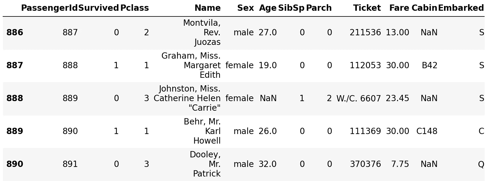
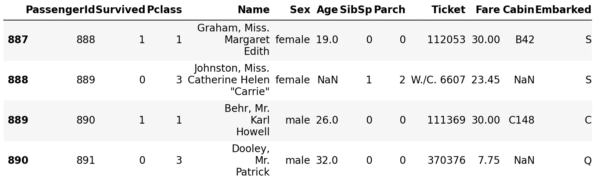
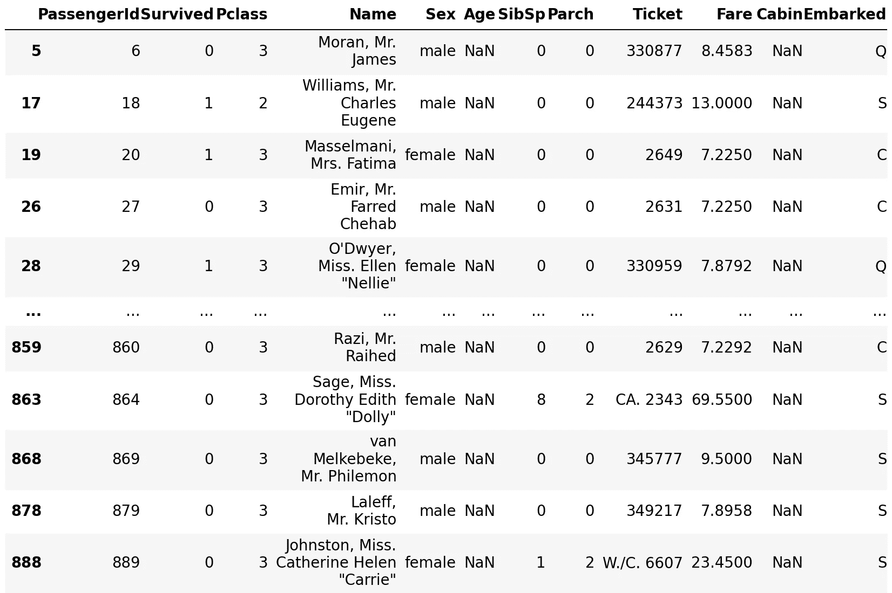
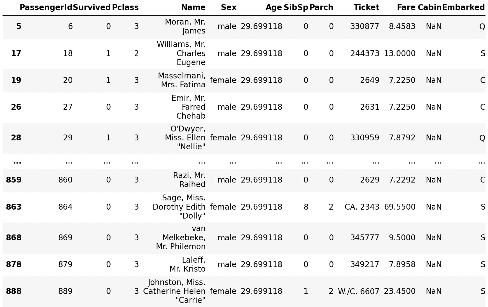
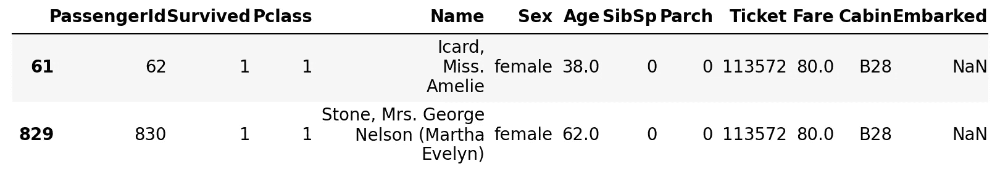
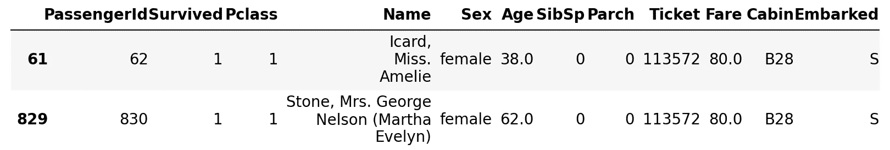
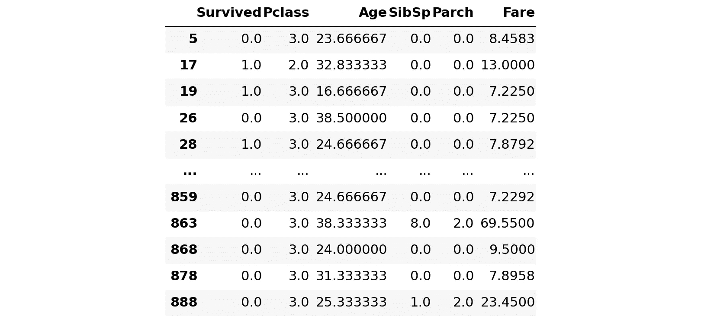

# 处理缺失数据

> 原文：<https://towardsdatascience.com/handling-missing-data-f998715fb73f?source=collection_archive---------51----------------------->

## [PyTrix 系列](/a-peek-into-missing-data-with-pandas-2fb9e5df8bd0)

## PyTrix #7:处理缺失数据的各种技术


照片由[埃米利亚诺·维托里奥西](https://unsplash.com/@emilianovittoriosi?utm_source=medium&utm_medium=referral)在 [Unsplash](https://unsplash.com?utm_source=medium&utm_medium=referral) 拍摄

在 PyTrix 的上一个系列([Pandas 的缺失数据一瞥](/a-peek-into-missing-data-with-pandas-2fb9e5df8bd0?source=your_stories_page---------------------------))中，我们提到了缺失数据和使用 Pandas 框架检测缺失值；这是那一集的摘录“当我们观察到数据中缺少值时，这是因为没有数据值存储在观察的变量中。缺失数据在实践中极为常见，会对从数据中得出的结论产生很大影响，因此数据科学家的大部分时间都花在了数据清理上。”

尽管我们探索了检测缺失数据的方法，但是我们并没有给出一个明确的解决方案来解决这个问题。在这篇文章中，我希望介绍一些我认为有用的策略，因为这是 PyTrix，当然我会分享一些有用的 Python 代码，我们可以用它们来完成这些任务。

> 注意:可以通过下面的链接访问完整的笔记本。此外，这篇文章是直接从 Jupyter 笔记本上创建的——要了解我是如何做到的 [**点击这里**](/publishing-to-medium-from-jupyter-notebooks-53978dd21fac) 。

[](https://github.com/kurtispykes/demo/blob/master/pytrix/pytrix_handling_missing_data.ipynb) [## kurtispykes/演示

### permalink dissolve GitHub 是超过 5000 万开发人员的家园，他们一起工作来托管和审查代码，管理…

github.com](https://github.com/kurtispykes/demo/blob/master/pytrix/pytrix_handling_missing_data.ipynb) 

我们将使用来自 Kaggle 的臭名昭著的泰坦尼克号数据集，点击[此处](https://www.kaggle.com/c/titanic/data?select=train.csv)即可访问。

```
import numpy as np
import pandas as pd# reading the data
df = pd.read_csv("../data/titanic_raw/train.csv")
df.tail()
```



图 1

我们可以在*图 1* 的年龄和客舱列中看到一些`NaN`值，但是通过这种方式查看我们的数据将很难看出我们有多少缺失的数据。更好的解决方案是使用`df.info()`,它将为我们提供每一列的非空计数和数据类型——参见[文档](https://pandas.pydata.org/pandas-docs/stable/reference/api/pandas.DataFrame.info.html)

```
# information on the columns
df.info()<class 'pandas.core.frame.DataFrame'>
RangeIndex: 891 entries, 0 to 890
Data columns (total 12 columns):
 #   Column       Non-Null Count  Dtype  
---  ------       --------------  -----  
 0   PassengerId  891 non-null    int64  
 1   Survived     891 non-null    int64  
 2   Pclass       891 non-null    int64  
 3   Name         891 non-null    object 
 4   Sex          891 non-null    object 
 5   Age          714 non-null    float64
 6   SibSp        891 non-null    int64  
 7   Parch        891 non-null    int64  
 8   Ticket       891 non-null    object 
 9   Fare         891 non-null    float64
 10  Cabin        204 non-null    object 
 11  Embarked     889 non-null    object 
dtypes: float64(2), int64(5), object(5)
memory usage: 83.7+ KB
```

所有列都有 891 个观察值，但我们在年龄列中只有 714/891 个非空观察值，在客舱列中有 204/891 个非空观察值，在上船列中有 889/891 个非空观察值。

在处理这些丢失的值之前，我必须指出，在理想情况下，我们应该对现有的数据进行深入分析，因为我们想首先了解数据丢失的原因。此外，在处理缺失值时，与领域专家交谈(如果你不是)也是一个重要的步骤，这样我们可以确保我们使用的任何技术都是合理的(从统计角度看)，并且我们仍然可以从我们的模型中获得准确的预测。

原因很简单，如果缺失数据降低了样本的代表性，并因此扭曲了关于人口的推断，那么对于我们处理这个问题来说，确保我们的模型能够准确代表人口是至关重要的。

> 由于我们的目的是探索处理缺失数据的各种技术，我们可以假设前面的需求已经实现。

## 删除

处理丢失数据的最简单方法是删除它们。也称为列表式删除，在这种方法中，如果一行缺少一个值，我们将从分析中删除整行。

```
df2 = df.copy() 

print("Before removing rows with missing values")
print(df2.shape)
print("After removing rows with missing values")
df2.dropna(inplace=True)
print(df2.shape)Before removing rows with missing values
(891, 12)
After removing rows with missing values
(183, 12)
```

从我们的数据中删除行可能会带来更多的伤害，而不是公正。在这个例子中，我们删除了 708 行(占观察值的 20.5%)，考虑到我们的样本大小，这是一个相当大的数据量。这是有问题的，因为减少数据量会降低我们分析的统计能力，因为这部分依赖于高样本量。

此外，如果缺失数据的原因不是随机的，如果我们决定进行列表式删除，我们将会在结果中产生偏差。非随机缺失数据的一个例子是当插入问题(例如，你挣多少？)在问卷中被问到。许多人可能不愿意分享这些信息，但回答其他问题却没有问题。这种偏见可能会发生，因为决定回答每个问题(包括干扰性问题)的人可能与不愿意回答干扰性问题的参与者有着非常不同的特征。

> **注意:**如果变量丢失了大部分数据，我们可以创建一个二进制标志变量来表示丢失(1)或不丢失(0)，并删除带有丢失值的初始列。

## 归罪

接下来的几项技术更侧重于插补，即使用替代值替换缺失数据的过程。尽管列表式删除因其简单性而成为处理缺失数据的最常见方式，但它也有缺陷。插补可以被视为避免这些陷阱的一种方法。

**热甲板**

这是从随机选择的相似记录中估算缺失值的地方。热卡插补的一种形式是最后一次观察结转(LOCF 插补)。LOCF 所做的是找到第一个缺失值，然后使用紧邻的前一个单元格的值来估算缺失值。这种方法符合这样一种信念，即最佳猜测是数据自上次测量以来没有发生变化。我们将用 Python 实现它。

```
# looking at the data before imputation
df_hot_deck = df.copy()
df[887:]
```



图 2

现在，我们将对该数据帧执行 LOCF，这将使用缺失值上方的单元格来估算所有缺失值

```
# looking at the data after imputation
df_hot_deck.fillna(method="ffill", inplace=True)
df_hot_deck[887:]
```


图 3

众所周知，使用这种方法估算数据会增加偏差的风险，并可能导致我们的数据得出错误的结论，因此通常不建议使用这种方法——我不太确定人们是否在实践中使用这种方法。

**统计方法**

从技术上讲，这可能不是用来描述这些技术的正确术语，但是我想要一个总括术语，它将捕捉我们可以使用统计来估算我们的数据的所有不同方式。常见的统计有均值、中值和众数。

```
# View all rows with a missing age
df3 = df.copy()
missing_age = df3[df3["Age"].isna()].index

df3[df3["Age"].isna()]
```



图 4

```
# imputing all rows with missing age with the mean age
df3["Age"].fillna(df3["Age"].mean(), inplace=True)
df3.loc[missing_age]
```



图 5

均值插补减弱了任何涉及插补特征的相关性-保证插补变量和任何其他测量变量之间没有关系，这意味着这对于单变量数据来说可能是一种非常好的方法，但对于多变量来说不是很好-我们可以对分类数据使用模式值。

```
# current value counts of the embarked column
df3["Embarked"].value_counts(dropna=False)S      644
C      168
Q       77
NaN      2
Name: Embarked, dtype: int64# view rows with missing values
missing_embarked = df3[df3["Embarked"].isna()].index
df3[df3["Embarked"].isna()]
```



图 6

```
# fill the rows with missing values and view them
df3["Embarked"].fillna(df["Embarked"].mode()[0], inplace=True)
df3.loc[missing_embarked]
```



图 7

**模型插补**

同样，这可能是我用来命名这种现象的不好的术语。处理缺失数据插补的一种流行方法是使用模型来预测缺失值。尽管 kNN 已经被证明是非常有效的(通常被称为最近邻插补)，但是有许多模型可供选择。

```
from sklearn.impute import KNNImputerX = df[["Survived", "Pclass", "Age", "SibSp", "Parch", "Fare"]].copy() 

knn_imputer = KNNImputer(n_neighbors=3)
filled_df = pd.DataFrame(data=knn_imputer.fit_transform(X),
                         columns=["Survived", "Pclass", "Age", "SibSp", "Parch", "Fare"])
filled_df.loc[missing_age]
```



图 8

`KNNImputer`的[文档](https://scikit-learn.org/stable/modules/generated/sklearn.impute.KNNImputer.html)声明“使用训练集中找到的 n_neighbors 最近邻的平均值估算每个样本缺失值。如果两个样本都不缺少的特征是接近的，则这两个样本是接近的。”。因此，我移除了所有对象数据类型，因为这将在此算法的中引发错误。

> **注意**:也有其他算法内置了处理缺失值的方法，比如 XGBoost

如果您想与我联系，请在 LinkedIn 上留下回复或与我联系。

[](https://www.linkedin.com/in/kurtispykes/?originalSubdomain=uk) [## Kurtis Pykes -人工智能作家-走向数据科学| LinkedIn

### 在世界上最大的职业社区 LinkedIn 上查看 Kurtis Pykes 的个人资料。Kurtis 有一个工作列在他们的…

www.linkedin.com](https://www.linkedin.com/in/kurtispykes/?originalSubdomain=uk)