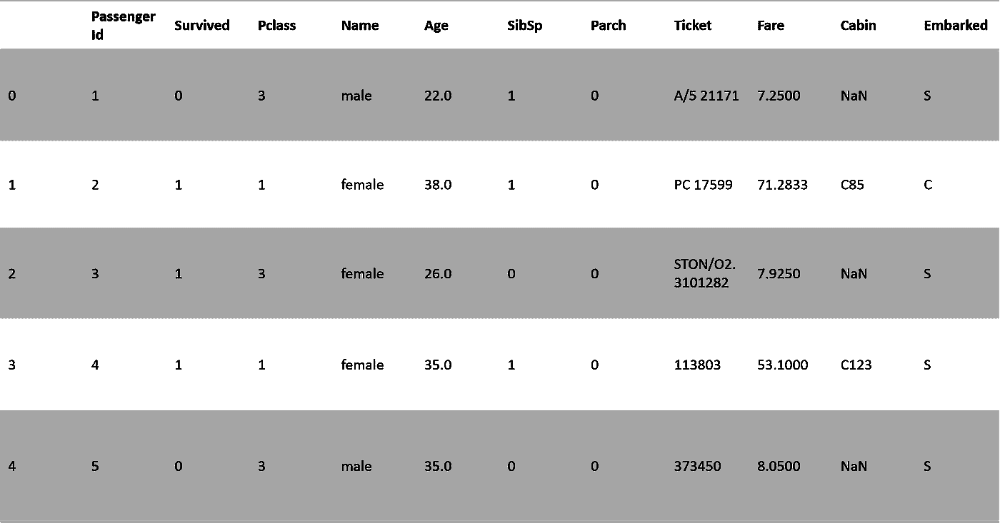
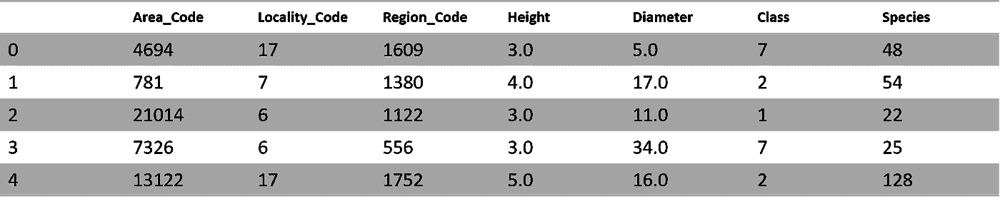
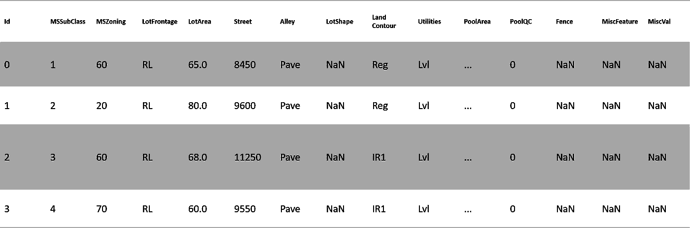

# 处理缺失值专用 pythonic 指南

> 原文：<https://towardsdatascience.com/handling-missing-values-the-exclusive-pythonic-guide-9aa883835655?source=collection_archive---------38----------------------->

## [入门](https://towardsdatascience.com/tagged/getting-started)

## 处理缺失值的 3 种最佳方法


[Ehimetalor Akhere Unuabona](https://unsplash.com/@theeastlondonphotographer?utm_source=unsplash&utm_medium=referral&utm_content=creditCopyText) 在 [Unsplash](https://unsplash.com/s/photos/missing?utm_source=unsplash&utm_medium=referral&utm_content=creditCopyText) 上拍摄的照片

对于大多数数据科学项目来说，处理缺失值是探索性数据分析(EDA)的关键步骤，无论是开发机器学习模型还是商业分析。包括 scikit-learn 在内的大多数库都不会使用带有缺失值的数据来构建模型。由于数据量巨大，找到获得最佳估算值结果的技巧是成为独角兽数据科学家的巨大优势。在本文中，我们将回顾 3 个最成功的开源短 python 代码行，它们可以组合起来处理缺失值。

在这篇文章中，我们将分析样本 flowers、titanic 和 house prices Kaggle 数据集，您可以在这里找到。


[詹姆斯·巴尔](https://unsplash.com/@jamesoliverbarr?utm_source=unsplash&utm_medium=referral&utm_content=creditCopyText)在 [Unsplash](https://unsplash.com/s/photos/male-model-abs-nature?utm_source=unsplash&utm_medium=referral&utm_content=creditCopyText) 上的照片

# **简介**

有许多处理丢失值的场景，丢失的数字在 python 中通常表示为 **nan** ，这是“不是数字”的缩写。传统的方法是检测缺少值的单元格，并使用以下命令计算它们在每一列中的数量:

```
missing_val_count_by_column = (data.isnull().sum())print(missing_val_count_by_column[missing_val_count_by_column > 0
```

大多数 Kaggle 比赛中都有 3 种主要方法，让我们来回顾一下:

## **1。** **效率较低:删除缺少值的列**

删除缺少值的列的一种方法是在训练/测试数据帧中删除相同的列，如下所示:

从原始数据帧:

```
data_without_missing_values = original_data.dropna(axis=1)
```

通过训练，测试数据帧:

```
cols_with_missing = [col for col in original_data.columnsif original_data[col].isnull().any()]reduced_original_data = original_data.drop(cols_with_missing, axis=1)reduced_test_data = test_data.drop(cols_with_missing, axis=1)
```

删除丢失的值后，您的模型将无法访问该列，从而导致重要数据的丢失。但是，当列中的大多数值都丢失时，这种策略可能是合适的。

## 一个更好的选择:插补

比删除数据集列更好的选择是用数据分布平均值填充缺失值，如下所示:

```
from sklearn.impute import SimpleImputermy_imputer = SimpleImputer()data_with_imputed_values = my_imputer.fit_transform(original_data)
```

该选项通常集成在 scikit-learn 管道中，使用比平均值更复杂的统计指标。管道是简化模型验证和部署的关键策略。

## **3)最佳选择**

最后一种策略是系统地随机填充缺失值。如果您需要获得最佳结果，您需要考虑您的列统计指标。下面是它可能的样子:

#制作副本以避免更改原始数据(输入时)

```
new_data = original_data.copy()
```

#制作新栏，说明将估算的内容

```
cols_with_missing = (col for col in new_data.columnsif new_data[col].isnull().any())for col in cols_with_missing:new_data[col + ‘_was_missing’] = new_data[col].isnull()
```

#插补

```
my_imputer = SimpleImputer()new_data = pd.DataFrame(my_imputer.fit_transform(new_data))new_data.columns = original_data.columns
```

在大多数情况下，这种方法会大大改善你的结果。


[泽内普](https://unsplash.com/@zeynep_e?utm_source=unsplash&utm_medium=referral&utm_content=creditCopyText)在 [Unsplash](https://unsplash.com/s/photos/missing?utm_source=unsplash&utm_medium=referral&utm_content=creditCopyText) 上的照片

# **案例分析**

现在让我们用最著名的 Kaggle 数据集来练习。我们将回顾泰坦尼克号，花卉，价格住房卡格尔竞争数据集的例子。

为了掌握缺失值处理，我建议您使用本[**笔记本**](https://jovian.ml/yeonathan/top-3-methods-for-handling-missing-values-2020) 遵循每个步骤，并对您的数据集重复相同的步骤。


照片由[руслангамзалиев](https://unsplash.com/@gambler_94?utm_source=unsplash&utm_medium=referral&utm_content=creditCopyText)在 [Unsplash](https://unsplash.com/s/photos/titanic?utm_source=unsplash&utm_medium=referral&utm_content=creditCopyText) 上拍摄

## 1.泰坦尼克

```
data = pd.read_csv(‘../input/titanicdataset-traincsv/train.csv’)
```



泰坦尼克号数据集(891 行× 12 列) **(** 图片由作者提供)

```
from sklearn.ensemble import RandomForestRegressorfrom sklearn.metrics import mean_absolute_errorfrom sklearn.model_selection import train_test_splittitanic_target = data.Survivedtitanic_predictors = data.drop(‘Survived’, axis=1)
```

为了保持例子简单，我们将只使用数字预测器。

```
titanic_numeric_predictors = titanic_predictors.select_dtypes(exclude=[‘object’])X = titanic_numeric_predictors.select_dtypes(exclude=[‘object’])y = titanic_target
```

*#在训练和测试数据集中划分数据。*

```
X_train, X_test, y_train, y_test = train_test_split(X,y,test_size=0.2)
```

**方法一**

```
cols_with_missing = [col for col in X_train.columnsif X_train[col].isnull().any()]reduced_X_train = X_train.drop(cols_with_missing, axis=1)reduced_X_test = X_test.drop(cols_with_missing, axis=1)print(“Mean Absolute Error from dropping columns with Missing Values:”)print(score_dataset(reduced_X_train, reduced_X_test, y_train, y_test))
```

**删除缺失值列的平均绝对误差:0.391340782122905**

**方法二**

```
my_imputer = SimpleImputer()imputed_X_train = my_imputer.fit_transform(X_train)imputed_X_test = my_imputer.transform(X_test)print(“Mean Absolute Error from Imputation:”)print(score_dataset(imputed_X_train, imputed_X_test, y_train, y_test))
```

**插补的平均绝对误差:0.394525139664804**

**方法三**

```
imputed_X_train_plus = X_train.copy()imputed_X_test_plus = X_test.copy()cols_with_missing = (col for col in X_train.columnsif X_train[col].isnull().any())for col in cols_with_missing:imputed_X_train_plus[col + ‘_was_missing’] = imputed_X_train_plus[col].isnull()imputed_X_test_plus[col + ‘_was_missing’] = imputed_X_test_plus[col].isnull()
```

*#插补*

```
my_imputer = SimpleImputer()imputed_X_train_plus = my_imputer.fit_transform(imputed_X_train_plus)imputed_X_test_plus = my_imputer.transform(imputed_X_test_plus)print(“Mean Absolute Error from Imputation while Track What Was Imputed:”)print(score_dataset(imputed_X_train_plus, imputed_X_test_plus, y_train, y_test))
```

**追踪插补内容时插补的平均绝对误差:0.382178770945**

**= >最好的方法是:方法 1**


瑟奎拉在 [Unsplash](https://unsplash.com/@shotbycerqueira?utm_source=unsplash&utm_medium=referral&utm_content=creditCopyText) 上拍摄的[照片](https://unsplash.com/@shotbycerqueira?utm_source=unsplash&utm_medium=referral&utm_content=creditCopyText)

## 2.花

```
data = pd.read_csv(‘../input/flower-type-prediction-machine-hack/Train.csv’)
```



花卉数据集(12666 行× 7 列) **(** 图片由作者提供)

```
from sklearn.ensemble import RandomForestRegressorfrom sklearn.metrics import mean_absolute_errorfrom sklearn.model_selection import train_test_splitflower_target = data.Classflower_predictors = data.drop(‘Class’, axis=1)
```

为了保持例子简单，我们将只使用数字预测器。

```
flower_numeric_predictors = flower_predictors.select_dtypes(exclude=[‘object’])X = flower_numeric_predictors.select_dtypes(exclude=[‘object’])y = flower_target
```

*#在训练和测试数据集中划分数据。*

```
X_train, X_test, y_train, y_test = train_test_split(X,y,test_size=0.2)
```

**方法 1**

```
cols_with_missing = [col for col in X_train.columnsif X_train[col].isnull().any()]reduced_X_train = X_train.drop(cols_with_missing, axis=1)reduced_X_test = X_test.drop(cols_with_missing, axis=1)print(“Mean Absolute Error from dropping columns with Missing Values:”)print(score_dataset(reduced_X_train, reduced_X_test, y_train, y_test))
```

**删除缺失值列的平均绝对误差:1.316111627552926**

**方法二**

```
my_imputer = SimpleImputer()imputed_X_train = my_imputer.fit_transform(X_train)imputed_X_test = my_imputer.transform(X_test)print(“Mean Absolute Error from Imputation:”)print(score_dataset(imputed_X_train, imputed_X_test, y_train, y_test))
```

**插补的平均绝对误差:1.337274481525667**

**方法三**

```
imputed_X_train_plus = X_train.copy()imputed_X_test_plus = X_test.copy()cols_with_missing = (col for col in X_train.columnsif X_train[col].isnull().any())for col in cols_with_missing:imputed_X_train_plus[col + ‘_was_missing’] = imputed_X_train_plus[col].isnull()imputed_X_test_plus[col + ‘_was_missing’] = imputed_X_test_plus[col].isnull()
```

*#插补*

```
my_imputer = SimpleImputer()imputed_X_train_plus = my_imputer.fit_transform(imputed_X_train_plus)imputed_X_test_plus = my_imputer.transform(imputed_X_test_plus)print(“Mean Absolute Error from Imputation while Track What Was Imputed:”)print(score_dataset(imputed_X_train_plus, imputed_X_test_plus, y_train, y_test))
```

**追踪插补内容时插补的平均绝对误差:1.392727466344**

**= >最好的方法是:方法 1**


巴黎歌剧院由阿莱西娅·科考尼在 Unsplash 演出

## 3.房价

```
data = pd.read_csv(‘../input/house-prices-advanced-regression-techniques/train.csv’)
```



住房数据集(1460 行× 81 列) **(** 图片由作者提供)

```
from sklearn.ensemble import RandomForestRegressorfrom sklearn.metrics import mean_absolute_errorfrom sklearn.model_selection import train_test_splithouse_target = data.SalePricehouse_predictors = data.drop(‘SalePrice’, axis=1)
```

为了保持例子简单，我们将只使用数字预测器。

```
house_numeric_predictors = house_predictors.select_dtypes(exclude=[‘object’])X = house_numeric_predictors.select_dtypes(exclude=[‘object’])y = house_target
```

*#划分训练和测试数据集中的数据。*

```
X_train, X_test, y_train, y_test = train_test_split(X,y,test_size=0.2)
```

**方法 1**

```
cols_with_missing = [col for col in X_train.columnsif X_train[col].isnull().any()]reduced_X_train = X_train.drop(cols_with_missing, axis=1)reduced_X_test = X_test.drop(cols_with_missing, axis=1)print(“Mean Absolute Error from dropping columns with Missing Values:”)print(score_dataset(reduced_X_train, reduced_X_test, y_train, y_test))
```

删除有缺失值的列后的平均绝对误差:36860 . 48686863686

**方法二**

```
my_imputer = SimpleImputer()imputed_X_train = my_imputer.fit_transform(X_train)imputed_X_test = my_imputer.transform(X_test)print(“Mean Absolute Error from Imputation:”)print(score_dataset(imputed_X_train, imputed_X_test, y_train, y_test))
```

**插补的平均绝对误差:18960 . 686868686867**

**方法 3**

```
imputed_X_train_plus = X_train.copy()imputed_X_test_plus = X_test.copy()cols_with_missing = (col for col in X_train.columnsif X_train[col].isnull().any())for col in cols_with_missing:imputed_X_train_plus[col + ‘_was_missing’] = imputed_X_train_plus[col].isnull()imputed_X_test_plus[col + ‘_was_missing’] = imputed_X_test_plus[col].isnull()
```

*#插补*

```
my_imputer = SimpleImputer()imputed_X_train_plus = my_imputer.fit_transform(imputed_X_train_plus)imputed_X_test_plus = my_imputer.transform(imputed_X_test_plus)print(“Mean Absolute Error from Imputation while Track What Was Imputed:”)print(score_dataset(imputed_X_train_plus, imputed_X_test_plus, y_train, y_test))
```

**追踪插补内容时，插补的平均绝对误差:18941**

**= >最好的方法是:方法 1**


巴黎喷泉由[熊伟·平托](https://unsplash.com/@vdapinto?utm_source=unsplash&utm_medium=referral&utm_content=creditCopyText)在 [Unsplash](https://unsplash.com/s/photos/paris-hotel?utm_source=unsplash&utm_medium=referral&utm_content=creditCopyText) 上完成

# **结论**

如果你有空闲时间，我建议你读读这篇文章:

[](https://medium.com/@smeshram258/kaggle-5-day-data-cleaning-challenge-for-beginners-day-1-handling-missing-values-ee48b01e69cb) [## Kaggle 初学者 5 天数据清理挑战:第 1 天-处理缺失值

### 最大的数据科学平台 Kaggle 刚刚为数据初学者发起了为期 5 天的数据清理挑战…

medium.com](https://medium.com/@smeshram258/kaggle-5-day-data-cleaning-challenge-for-beginners-day-1-handling-missing-values-ee48b01e69cb) 

## **总结**

参考此[链接](https://www.kaggle.com/philboaz/top-3-methods-for-handling-missing-values-2020)，使用这些方法对这些数据集进行完整的缺失数据分析。

这个简单的概述提醒了在数据科学中使用 python 处理缺失值时使用多种方法的重要性。这篇文章涵盖了 3 个基本的 Python 处理缺失值，以创建一个完整的探索工作流，以及有用的文档。


歌剧《巴黎》由[莱拉·格布哈德](https://unsplash.com/@lailagebhard?utm_source=unsplash&utm_medium=referral&utm_content=creditCopyText)在 [Unsplash](https://unsplash.com/@lailagebhard?utm_source=unsplash&utm_medium=referral&utm_content=creditCopyText) 上演

## **希望你喜欢，继续探索！！！**